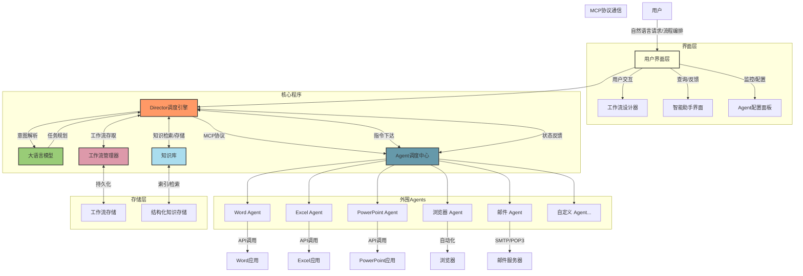

# Lorn.OpenAgenticAI

## 项目概述
Lorn.OpenAgenticAI是一款面向企业和个人的桌面端智能体AI应用，通过整合大语言模型能力与桌面软件操作，打造全新一代的办公自动化解决方案。本项目旨在消除传统自动化工具的技术门槛，让用户通过自然语言或简单的可视化编排即可实现复杂的办公流程自动化。

## 产品价值

- **提升效率**：将重复性、繁琐的办公任务自动化，释放人力资源
- **降低门槛**：无需编程知识，通过自然语言或拖拽式界面即可创建自动化流程
- **灵活扩展**：插件化架构支持快速接入新的桌面应用
- **智能协作**：大模型赋能的上下文理解，使自动化流程更加智能和上下文感知

## 核心功能

### Director核心调度引擎

Director作为系统的中枢神经，负责协调大语言模型与各类桌面应用之间的交互。它提供两种主要的工作模式：

1. **提示词驱动模式（智能助手模式）**
   - 用户通过自然语言描述任务需求
   - 系统自动解析任务意图，规划执行路径
   - 智能调度相关Agents执行具体操作
   - 适合非技术用户和临时性任务

2. **流程编排模式（专业工作流模式）**
   - 提供可视化流程设计界面，类似流程图的拖拽体验
   - 精确控制各Agents的调用顺序、参数和条件分支
   - 支持保存、编辑和共享工作流模板
   - 适合固定流程和批量处理场景

### 外围Agents生态

Agents是封装了特定桌面软件操作能力的功能模块，通过标准化的MCP协议与Director进行通信：

- **文档处理Agents**：Word文档编辑、PDF解析与生成
- **数据处理Agents**：Excel数据分析、数据库操作
- **演示制作Agents**：PowerPoint幻灯片创建与美化
- **网络交互Agents**：浏览器自动化、网页信息提取
- **通信协作Agents**：邮件收发、即时通讯工具交互

每个Agent都专注于特定领域的操作，可独立迭代升级，形成丰富的插件生态。

## 技术架构

### MCP协议工作机制

MCP(Model-Command-Protocol)是本项目设计的Agent通信标准协议，定义了以下核心交互流程：

1. **注册阶段**：Agent启动时向Director注册自身能力描述
2. **调用阶段**：Director基于任务需求，通过标准化指令调用Agent
3. **执行阶段**：Agent执行具体操作，实时反馈执行状态
4. **返回阶段**：Agent将执行结果返回Director，完成闭环

### 核心组件功能扩展

#### 工作流管理器
- **模板管理**：存储和管理用户创建的工作流模板
- **版本控制**：支持工作流的版本管理与回滚
- **导入导出**：允许工作流在不同系统间迁移
- **调度执行**：根据预设条件或定时触发工作流执行

#### 知识库
- **上下文存储**：保存用户历史交互和执行结果
- **参考资料**：存储业务规则、文档模板和常用数据
- **学习优化**：基于历史执行记录优化任务执行路径
- **个性化定制**：根据用户偏好和使用习惯调整系统行为

## 用户场景

### 场景一：自动报表生成
用户可以简单地说："请从邮箱中下载最新的销售数据，整理成月度报表，并制作一份演示幻灯片发送给销售团队"。系统将自动调用邮件Agent获取附件、Excel Agent处理数据、PowerPoint Agent制作幻灯片，最后通过邮件Agent发送结果。

### 场景二：网络数据采集分析
用户通过流程编排模式，设计一个定期从特定网站采集数据、进行分析并生成可视化报告的工作流，系统会按照预设流程自动完成全部工作。

## 开发路线图

- **Phase 1**: 核心框架搭建，实现Director基础功能与MCP协议定义
- **Phase 2**: 开发首批关键Agents（Word, Excel, PowerPoint, 浏览器）
- **Phase 3**: 完善流程编排界面，提升用户体验
- **Phase 4**: 扩展Agent生态，开放Agent开发框架

## 参与贡献

我们欢迎各类贡献，特别是以下方面：
- Agent插件开发
- 核心架构优化
- 用户体验改进
- 文档翻译与完善

请参考[贡献指南](CONTRIBUTING.md)了解详情。

## 关于作者

[**产品经理独孤虾 | AI智能体与大模型应用专家**](参考资料/作者简历.md)

产品经理独孤虾拥有20年智能系统架构经验，专注于大模型与AI智能体技术的商业化应用。他曾主导多个亿级DAU平台的AI化升级，构建了基于深度学习的多目标优化算法体系，为企业带来显著的商业价值提升。

在AI领域，他出版了多部专著，包括《Deepseek应用高级教程》(清华大学出版社)、《DeepSeek+Office职场办公效率提升手册》(人民邮电出版社)和《智能营销—大模型如何为运营与产品经理赋能》(清华大学出版社)，系统性地探讨了大模型在商业环境中的落地应用。

他还开设了《智能营销—大模型如何为运营与产品经理赋能》和《Power BI结合业务数据分析实战课》等在线课程，帮助2000多名学员掌握AI应用技能。作为开源项目的倡导者，他创建了Lorn.OpenAgenticAI桌面级"智能体工作流引擎"，致力于推动AI民主化，让复杂的智能自动化能力惠及更多企业和个人用户。

📧 联系方式：lornshrimp.pm@outlook.com
💻 更多开源项目请访问作者GitHub
{width=200px}