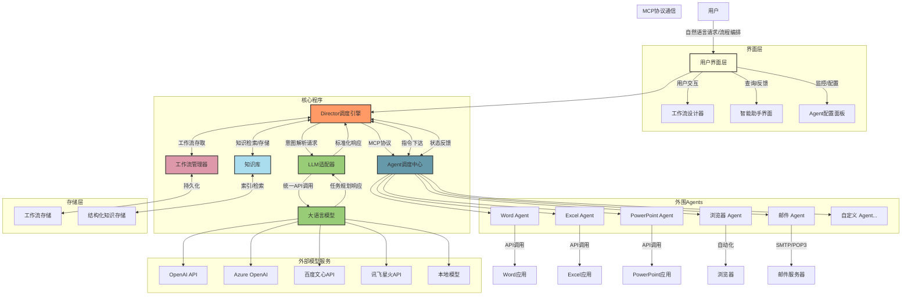
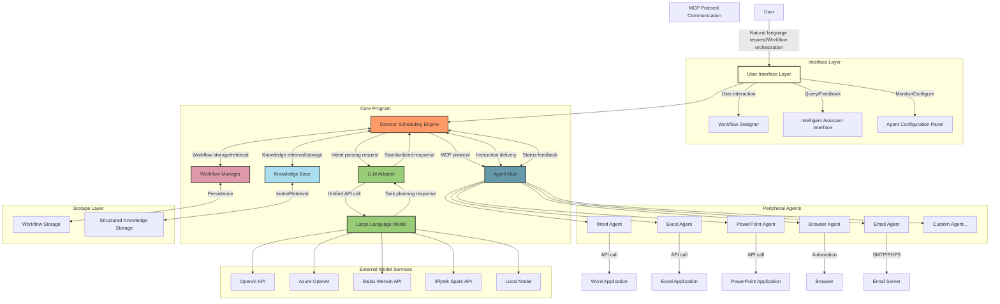

# Lorn.OpenAgenticAI

## 项目概述
Lorn.OpenAgenticAI是一款面向企业和个人的桌面端智能体AI应用，通过整合大语言模型能力与桌面软件操作，打造全新一代的办公自动化解决方案。本项目旨在消除传统自动化工具的技术门槛，让用户通过自然语言或简单的可视化编排即可实现复杂的办公流程自动化。

## Project Overview
Lorn.OpenAgenticAI is a desktop AI agent application for enterprises and individuals, integrating large language model capabilities with desktop software operations to create a new generation of office automation solutions. This project aims to eliminate the technical barriers of traditional automation tools, allowing users to achieve complex office process automation through natural language or simple visual orchestration.

## 产品价值

- **提升效率**：将重复性、繁琐的办公任务自动化，释放人力资源
- **降低门槛**：无需编程知识，通过自然语言或拖拽式界面即可创建自动化流程
- **灵活扩展**：插件化架构支持快速接入新的桌面应用
- **智能协作**：大模型赋能的上下文理解，使自动化流程更加智能和上下文感知

## Product Value

- **Efficiency Enhancement**: Automate repetitive and tedious office tasks to free up human resources
- **Lower Barriers**: Create automated workflows through natural language or drag-and-drop interfaces without programming knowledge
- **Flexible Extension**: Plugin architecture supports rapid integration of new desktop applications
- **Intelligent Collaboration**: Large model-enabled contextual understanding makes automation workflows smarter and more context-aware

## 核心功能

### Director核心调度引擎

Director作为系统的中枢神经，负责协调大语言模型与各类桌面应用之间的交互。它提供两种主要的工作模式：

1. **提示词驱动模式（智能助手模式）**
   - 用户通过自然语言描述任务需求
   - 系统自动解析任务意图，规划执行路径
   - 智能调度相关Agents执行具体操作
   - 适合非技术用户和临时性任务

2. **流程编排模式（专业工作流模式）**
   - 提供可视化流程设计界面，类似流程图的拖拽体验
   - 精确控制各Agents的调用顺序、参数和条件分支
   - 支持保存、编辑和共享工作流模板
   - 适合固定流程和批量处理场景

## Core Functions

### Director Core Scheduling Engine

Director serves as the central nervous system, coordinating interactions between large language models and various desktop applications. It offers two primary working modes:

1. **Prompt-Driven Mode (Intelligent Assistant Mode)**
   - Users describe task requirements through natural language
   - The system automatically parses task intentions and plans execution paths
   - Intelligently schedules relevant Agents to perform specific operations
   - Suitable for non-technical users and temporary tasks

2. **Workflow Orchestration Mode (Professional Workflow Mode)**
   - Provides a visual process design interface with a flowchart-like drag-and-drop experience
   - Precisely controls the calling sequence, parameters, and conditional branches of various Agents
   - Supports saving, editing, and sharing workflow templates
   - Ideal for fixed processes and batch processing scenarios

### 外围Agents生态

Agents是封装了特定桌面软件操作能力的功能模块，通过标准化的MCP协议与Director进行通信：

- **文档处理Agents**：Word文档编辑、PDF解析与生成
- **数据处理Agents**：Excel数据分析、数据库操作
- **演示制作Agents**：PowerPoint幻灯片创建与美化
- **网络交互Agents**：浏览器自动化、网页信息提取
- **通信协作Agents**：邮件收发、即时通讯工具交互

每个Agent都专注于特定领域的操作，可独立迭代升级，形成丰富的插件生态。

### Peripheral Agents Ecosystem

Agents are functional modules that encapsulate the operational capabilities of specific desktop software and communicate with Director through the standardized MCP protocol:

- **Document Processing Agents**: Word document editing, PDF parsing and generation
- **Data Processing Agents**: Excel data analysis, database operations
- **Presentation Creation Agents**: PowerPoint slide creation and enhancement
- **Web Interaction Agents**: Browser automation, webpage information extraction
- **Communication Agents**: Email sending/receiving, instant messaging tool interaction

Each Agent focuses on operations in a specific domain, can be independently iterated and upgraded, forming a rich plugin ecosystem.

## 技术架构

## Technical Architecture

### MCP协议工作机制

MCP(Model-Command-Protocol)是本项目设计的Agent通信标准协议，定义了以下核心交互流程：

1. **注册阶段**：Agent启动时向Director注册自身能力描述
2. **调用阶段**：Director基于任务需求，通过标准化指令调用Agent
3. **执行阶段**：Agent执行具体操作，实时反馈执行状态
4. **返回阶段**：Agent将执行结果返回Director，完成闭环

### MCP Protocol Working Mechanism

MCP (Model-Command-Protocol) is the standard communication protocol designed for this project, defining the following core interaction processes:

1. **Registration Phase**: Agents register their capability descriptions with Director upon startup
2. **Invocation Phase**: Director calls Agents through standardized instructions based on task requirements
3. **Execution Phase**: Agents perform specific operations and provide real-time execution status feedback
4. **Return Phase**: Agents return execution results to Director, completing the feedback loop

### 核心组件功能扩展

#### 工作流管理器
- **模板管理**：存储和管理用户创建的工作流模板
- **版本控制**：支持工作流的版本管理与回滚
- **导入导出**：允许工作流在不同系统间迁移
- **调度执行**：根据预设条件或定时触发工作流执行

#### 知识库
- **上下文存储**：保存用户历史交互和执行结果
- **参考资料**：存储业务规则、文档模板和常用数据
- **学习优化**：基于历史执行记录优化任务执行路径
- **个性化定制**：根据用户偏好和使用习惯调整系统行为

### Core Component Function Extensions

#### Workflow Manager
- **Template Management**: Store and manage user-created workflow templates
- **Version Control**: Support workflow version management and rollback
- **Import/Export**: Allow workflows to migrate between different systems
- **Scheduled Execution**: Trigger workflow execution based on preset conditions or timing

#### Knowledge Base
- **Context Storage**: Save user historical interactions and execution results
- **Reference Materials**: Store business rules, document templates, and commonly used data
- **Learning Optimization**: Optimize task execution paths based on historical execution records
- **Personalized Customization**: Adjust system behavior according to user preferences and habits

## 用户场景

### 场景一：自动报表生成
用户可以简单地说："请从邮箱中下载最新的销售数据，整理成月度报表，并制作一份演示幻灯片发送给销售团队"。系统将自动调用邮件Agent获取附件、Excel Agent处理数据、PowerPoint Agent制作幻灯片，最后通过邮件Agent发送结果。

### 场景二：网络数据采集分析
用户通过流程编排模式，设计一个定期从特定网站采集数据、进行分析并生成可视化报告的工作流，系统会按照预设流程自动完成全部工作。

## User Scenarios

### Scenario One: Automated Report Generation
Users can simply say: "Please download the latest sales data from my mailbox, organize it into a monthly report, and create a presentation slide to send to the sales team." The system will automatically call the Email Agent to retrieve attachments, Excel Agent to process data, PowerPoint Agent to create slides, and finally the Email Agent to send the results.

### Scenario Two: Web Data Collection and Analysis
Using the workflow orchestration mode, users can design a workflow that regularly collects data from specific websites, performs analysis, and generates visual reports. The system will automatically complete all work according to the preset process.

## 开发路线图

- **Phase 1**: 核心框架搭建，实现Director基础功能与MCP协议定义
- **Phase 2**: 开发首批关键Agents（Word, Excel, PowerPoint, 浏览器）
- **Phase 3**: 完善流程编排界面，提升用户体验
- **Phase 4**: 扩展Agent生态，开放Agent开发框架

## Development Roadmap

- **Phase 1**: Core framework construction, implementing Director basic functions and MCP protocol definition
- **Phase 2**: Development of the first batch of key Agents (Word, Excel, PowerPoint, Browser)
- **Phase 3**: Improvement of workflow orchestration interface and user experience
- **Phase 4**: Expansion of Agent ecosystem and opening of Agent development framework

## 参与贡献

我们欢迎各类贡献，特别是以下方面：
- Agent插件开发
- 核心架构优化
- 用户体验改进
- 文档翻译与完善

请参考[贡献指南](CONTRIBUTING.md)了解详情。

## Contributions

We welcome all types of contributions, especially in the following areas:
- Agent plugin development
- Core architecture optimization
- User experience improvement
- Documentation translation and enhancement

Please refer to [Contribution Guidelines](CONTRIBUTING.md) for details.

## 关于作者

[**产品经理独孤虾 | AI智能体与大模型应用专家**](Author/作者简历.md)

产品经理独孤虾拥有20年智能系统架构经验，专注于大模型与AI智能体技术的商业化应用。他曾主导多个亿级DAU平台的AI化升级，构建了基于深度学习的多目标优化算法体系，为企业带来显著的商业价值提升。

在AI领域，他出版了多部专著，包括《Deepseek应用高级教程》(清华大学出版社)、《DeepSeek+Office职场办公效率提升手册》(人民邮电出版社)和《智能营销—大模型如何为运营与产品经理赋能》(清华大学出版社)，系统性地探讨了大模型在商业环境中的落地应用。

他还开设了《智能营销—大模型如何为运营与产品经理赋能》和《Power BI结合业务数据分析实战课》等在线课程，帮助2000多名学员掌握AI应用技能。作为开源项目的倡导者，他创建了Lorn.OpenAgenticAI桌面级"智能体工作流引擎"，致力于推动AI民主化，让复杂的智能自动化能力惠及更多企业和个人用户。

## About the Author

[**Product Manager LornShrimp | AI Agent and Large Model Application Expert**](Author/作者简历.md)

Product Manager LornShrimp has 20 years of experience in intelligent system architecture, focusing on the commercial application of large models and AI agent technology. He has led the AI upgrade of multiple platforms with hundreds of millions of DAU, built multi-objective optimization algorithm systems based on deep learning, and brought significant commercial value enhancement to enterprises.

In the AI field, he has published multiple monographs, including "Deepseek Advanced Application Tutorial" (Tsinghua University Press), "DeepSeek+Office Workplace Efficiency Improvement Manual" (Posts & Telecom Press), and "Intelligent Marketing—How Large Models Empower Operations and Product Managers" (Tsinghua University Press), systematically exploring the application of large models in business environments.

He has also launched online courses such as "Intelligent Marketing—How Large Models Empower Operations and Product Managers" and "Power BI Combined with Business Data Analysis Practical Course", helping more than 2,000 students master AI application skills. As an advocate of open-source projects, he created Lorn.OpenAgenticAI, a desktop-level "Agent Workflow Engine", committed to promoting AI democratization and making complex intelligent automation capabilities benefit more enterprises and individual users.

📧 联系方式：lornshrimp.pm@outlook.com
💻 更多开源项目请访问作者GitHub
{width=200px}

📧 Contact: lornshrimp.pm@outlook.com
💻 For more open-source projects, please visit the author's GitHub
{width=200px}