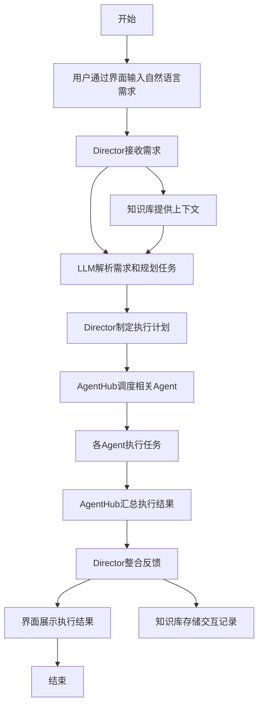
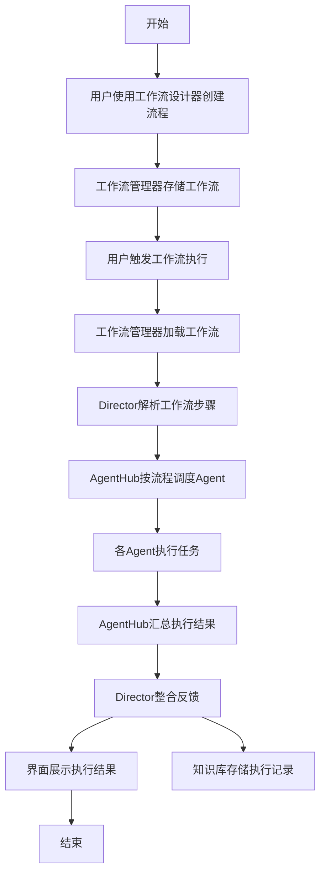
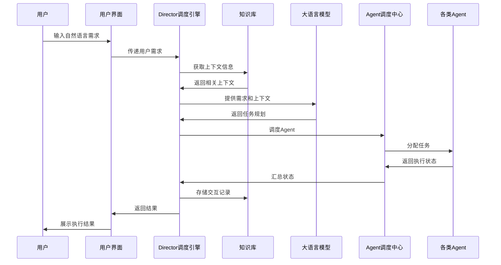
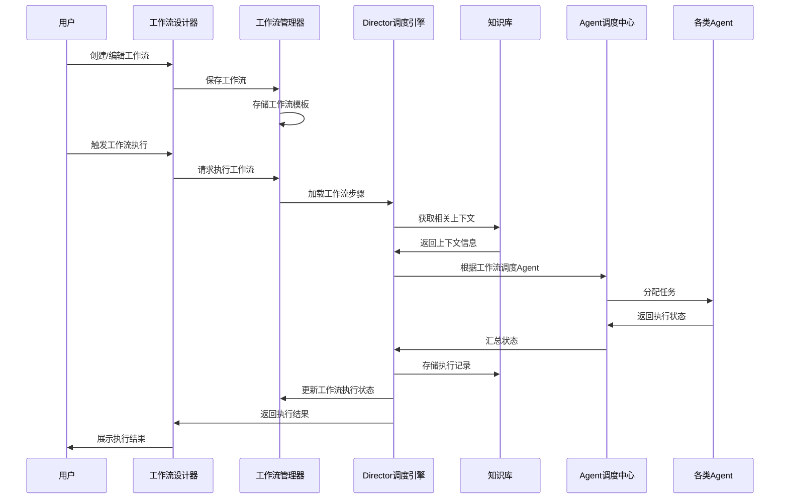

# 业务流程图及交互序列图

## 业务流程图

### 提示词驱动模式（智能助手模式）

### 流程编排模式（专业工作流模式）

## 交互序列图

### 提示词驱动模式

### 流程编排模式

## 核心组件交互步骤

### 界面层与核心程序的交互
1. 用户通过界面层输入需求或触发工作流
2. 界面层将请求传递给Director调度引擎
3. Director完成任务处理后，将结果返回界面层
4. 界面层向用户展示执行结果和状态

### Director与知识库的交互
1. Director接收到请求后，从知识库获取相关上下文
2. 任务执行完成后，Director将交互记录存入知识库
3. 知识库根据新增记录更新个性化配置和优化建议

### Director与工作流管理器的交互
1. 用户通过工作流设计器创建/编辑工作流，由工作流管理器存储
2. 工作流触发执行时，工作流管理器将工作流步骤传递给Director
3. Director根据工作流步骤调度Agent执行任务
4. 执行完成后，Director将状态反馈给工作流管理器更新工作流执行历史

### 知识库与大语言模型的协作
1. Director从知识库获取上下文后，将其与用户需求一并传递给大语言模型
2. 大语言模型结合上下文信息，生成更准确的任务规划
3. 任务规划返回给Director进行进一步处理
