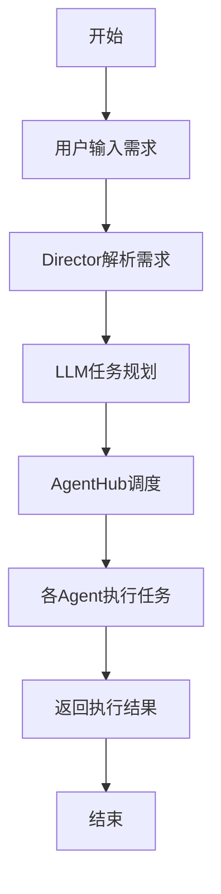
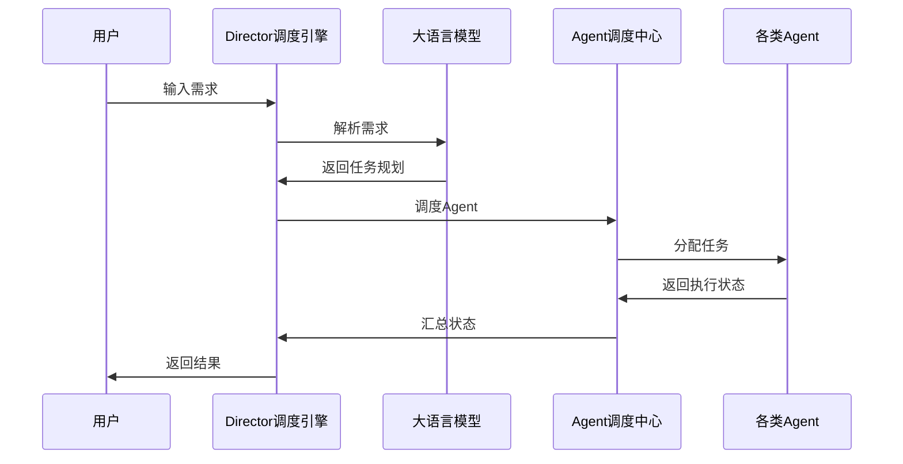

# 业务流程图及交互序列图

## 业务流程图

## 交互序列图

## 各模块交互步骤

### 用户输入需求
1. 用户通过自然语言或可视化界面输入需求。
2. 输入的需求被传递给Director调度引擎。

### Director解析需求
1. Director接收到用户需求后，调用大语言模型（LLM）进行解析。
2. LLM根据需求生成任务规划，并返回给Director。

### LLM任务规划
1. LLM根据用户需求，生成详细的任务规划。
2. 任务规划包括各个步骤的执行顺序和所需的Agent。

### AgentHub调度
1. Director根据任务规划，调用AgentHub进行任务调度。
2. AgentHub根据任务类型，选择合适的Agent执行任务。

### 各Agent执行任务
1. 各Agent接收到任务后，开始执行具体操作。
2. 执行过程中，Agent会实时反馈执行状态给AgentHub。

### 返回执行结果
1. AgentHub汇总各Agent的执行状态，并返回给Director。
2. Director将最终结果返回给用户。
