# 核心程序公共业务对象设计

## 概述

本文档详细描述Lorn.OpenAgenticAI系统中核心程序各组件间传输的公共业务对象，这些对象作为系统的"通用语言"，承载着组件间的信息交互。重点关注Director调度引擎、LLM适配器和Agent调度中心之间的数据流转，明确各业务对象的结构、职责和生命周期。

本次设计优化引入了接口和抽象类的概念，以提高系统的可扩展性、可测试性和模块化程度。

## 业务对象关系图

```mermaid
classDiagram
    IDirector <|.. DirectorImpl
    ILLMAdapter <|.. AbstractLLMAdapter
    AbstractLLMAdapter <|-- OpenAIAdapter
    AbstractLLMAdapter <|-- BaiduAdapter
    AbstractLLMAdapter <|-- LocalLLMAdapter
    
    IAgentHub <|.. AgentHubImpl
    
    IDirector o-- UserRequest
    IDirector o-- ExecutionPlan
    IDirector o-- TaskResult
    
    ILLMAdapter o-- LLMRequest
    ILLMAdapter o-- LLMResponse
    ILLMAdapter o-- ModelCapability
    
    IAgentHub o-- AgentRequest
    IAgentHub o-- AgentResponse
    IAgentHub o-- AgentCapability
    
    UserRequest --> LLMRequest
    LLMResponse --> ExecutionPlan
    ExecutionPlan --> AgentRequest
    AgentResponse --> TaskResult
    
    ExecutionPlan o-- ExecutionStep
    ExecutionStep o-- ExecutionContext
    ExecutionContext o-- ContextItem
    
    Error --> ErrorRecord
    ErrorRecord o-- ErrorType
    ErrorRecord o-- RecoveryStrategy
    
    TaskResult o-- Error
    
    class IDirector{
        <<interface>>
        +ProcessRequest(UserRequest) Task~TaskResult~
        +GeneratePlan(LLMResponse) Task~ExecutionPlan~
        +ExecutePlan(ExecutionPlan) Task~TaskResult~
        +GenerateResult(AgentResponse[]) Task~TaskResult~
    }

    class DirectorImpl{
        +ProcessRequest(UserRequest) Task~TaskResult~
        +GeneratePlan(LLMResponse) Task~ExecutionPlan~
        +ExecutePlan(ExecutionPlan) Task~TaskResult~
        +GenerateResult(AgentResponse[]) Task~TaskResult~
    }
    
    class ILLMAdapter{
        <<interface>>
        +ProcessIntent(LLMRequest) Task~LLMResponse~
        +GenerateTaskPlan(IntentInfo) Task~LLMResponse~
        +GetAvailableModels() List~ModelCapability~
        +SwitchModel(modelId) bool
    }

    class AbstractLLMAdapter{
        <<abstract>>
        #ValidateRequest(LLMRequest) bool
        #StandardizeResponse(object) LLMResponse
        #HandleRequestFailure(Exception) LLMResponse
        +GetAvailableModels() List~ModelCapability~
        +SwitchModel(modelId) bool
    }

    class OpenAIAdapter{
        +ProcessIntent(LLMRequest) Task~LLMResponse~
        +GenerateTaskPlan(IntentInfo) Task~LLMResponse~
        #BuildAPIRequest(LLMRequest) OpenAIRequest
    }

    class BaiduAdapter{
        +ProcessIntent(LLMRequest) Task~LLMResponse~
        +GenerateTaskPlan(IntentInfo) Task~LLMResponse~
        #BuildAPIRequest(LLMRequest) BaiduRequest
    }
    
    class IAgentHub{
        <<interface>>
        +DispatchRequest(AgentRequest) Task~AgentResponse~
        +CollectResponses() Task~List~AgentResponse~~
        +GetAvailableAgents() List~AgentCapability~
        +RegisterAgent(AgentInfo) bool
    }

    class AgentHubImpl{
        +DispatchRequest(AgentRequest) Task~AgentResponse~
        +CollectResponses() Task~List~AgentResponse~~
        +GetAvailableAgents() List~AgentCapability~
        +RegisterAgent(AgentInfo) bool
    }
    
    class UserRequest{
        +String requestId
        +String userInput
        +RequestType type
        +RequestContext context
    }
    
    class LLMRequest{
        +String requestId
        +String prompt
        +List~Message~ messages
        +LLMParameters parameters
        +IntentContext context
    }
    
    class LLMResponse{
        +String responseId
        +String requestId
        +IntentInfo intent
        +List~ExecutionStep~ suggestedSteps
        +List~String~ reasonings
        +Float confidence
    }
    
    class ExecutionPlan{
        +String planId
        +String requestId
        +List~ExecutionStep~ steps
        +Map~String, List~String~~ stepDependencies
        +Map~String, Object~ expectedOutputs
        +PlanStatus status
    }
    
    class ExecutionStep{
        +String stepId
        +String description
        +AgentCapability requiredCapability
        +Map~String, Object~ parameters
        +List~String~ dependsOnSteps
        +ExecutionContext context
        +StepStatus status
    }
    
    class AgentRequest{
        +String requestId
        +String stepId
        +String agentId
        +String actionName
        +Map~String, Object~ parameters
        +RequestPriority priority
    }
    
    class AgentResponse{
        +String responseId
        +String requestId
        +String stepId
        +Boolean isSuccessful
        +Map~String, Object~ outputData
        +String errorMessage
        +ResponseMetrics metrics
    }
    
    class TaskResult{
        +String resultId
        +String requestId
        +Boolean isSuccessful
        +Map~String, Object~ outputs
        +List~String~ messages
        +List~Error~ errors
        +ExecutionMetrics metrics
    }
    
    class ModelCapability{
        +String modelId
        +String name
        +String provider
        +List~String~ supportedFeatures
        +ModelPerformanceMetrics metrics
        +ModelCost costInfo
    }
    
    class AgentCapability{
        +String capabilityId
        +String name
        +String description
        +List~ActionDefinition~ actions
        +List~String~ requiredPermissions
    }
    
    class ExecutionContext{
        +String contextId
        +String taskId
        +Map~String, ContextItem~ items
        +DateTime createdTime
        +DateTime lastUpdatedTime
        +addContextItem(String key, Object value)
        +getContextItem(String key)
        +updateContextItem(String key, Object value)
        +removeContextItem(String key)
    }
    
    class ContextItem{
        +String key
        +Object value
        +String valueType
        +String source
        +DateTime timestamp
        +Map~String, Object~ metadata
    }
    
    class Error{
        +String errorId
        +ErrorType errorType
        +String message
        +String sourceComponent
        +DateTime timestamp
        +String stackTrace
        +SeverityLevel severity
    }
    
    class ErrorRecord{
        +String errorId
        +String relatedTaskId
        +String relatedStepId
        +ErrorType type
        +String message
        +String stackTrace
        +DateTime timestamp
        +RecoveryStrategy recoveryStrategy
        +Boolean isResolved
    }
    
    class ErrorType{
        <<enumeration>>
        INTENT_PARSING_ERROR
        PLANNING_ERROR
        AGENT_EXECUTION_ERROR
        RESOURCE_ERROR
        PERMISSION_ERROR
        TIMEOUT_ERROR
    }
    
    class RecoveryStrategy{
        <<enumeration>>
        RETRY
        ALTERNATIVE
        CLARIFY
        SKIP
        ABORT
    }
```

## 接口与实现设计

### 1. 核心接口设计

#### 1.1 IDirector 接口

**定义**: Director调度引擎的核心接口，定义与其他组件交互的标准协议。

**目的**:
- 提供清晰的职责边界和功能契约
- 支持不同实现策略（如基于规则的调度、基于机器学习的调度等）
- 便于单元测试和模块替换

**主要方法**:
- `ProcessRequest(UserRequest)`: 处理用户请求
- `GeneratePlan(LLMResponse)`: 基于LLM响应生成执行计划
- `ExecutePlan(ExecutionPlan)`: 执行给定计划
- `GenerateResult(AgentResponse[])`: 汇总Agent响应生成最终结果

#### 1.2 ILLMAdapter 接口

**定义**: 大语言模型适配器的统一接口，屏蔽不同模型API的差异。

**目的**:
- 使系统能够无缝切换不同的大语言模型服务
- 标准化模型调用参数和响应格式
- 便于扩展支持新的模型服务提供商

**主要方法**:
- `ProcessIntent(LLMRequest)`: 处理意图解析请求
- `GenerateTaskPlan(IntentInfo)`: 生成任务执行计划
- `GetAvailableModels()`: 获取可用模型列表
- `SwitchModel(modelId)`: 切换当前使用的模型

#### 1.3 AbstractLLMAdapter 抽象类

**定义**: LLM适配器的抽象基类，实现通用功能，留下特定API调用由子类实现。

**目的**:
- 减少代码重复，集中实现共同逻辑
- 简化具体适配器的开发工作
- 确保所有适配器行为一致

**实现方法**:
- 共通方法如模型获取、切换功能
- 提供请求验证、响应标准化等辅助方法
- 错误处理和恢复逻辑

**派生类**:
- `OpenAIAdapter`: OpenAI API适配器实现
- `BaiduAdapter`: 百度文心API适配器实现
- `LocalLLMAdapter`: 本地模型适配器实现

#### 1.4 IAgentHub 接口

**定义**: Agent调度中心的接口，负责Agent的注册、发现和调用。

**目的**:
- 统一Agent调用协议
- 支持运行时Agent发现和能力查询
- 便于扩展不同的Agent管理策略

**主要方法**:
- `DispatchRequest(AgentRequest)`: 分发请求到特定Agent
- `CollectResponses()`: 收集Agent响应
- `GetAvailableAgents()`: 获取系统中可用的Agent列表
- `RegisterAgent(AgentInfo)`: 注册新的Agent

## 接口设计优势

### 依赖倒置原则
通过引入接口，系统组件依赖于抽象而非具体实现，降低了模块间耦合度，有利于独立开发和单元测试。

### 扩展性设计
- **LLM适配器**：可以轻松添加新的模型API支持，如讯飞星火、本地模型等，无需修改核心代码
- **Director实现**：可以提供不同的调度策略实现，以适应不同场景需求
- **AgentHub实现**：可以实现不同的Agent发现和注册机制，如进程内、进程间或远程调用

### 可测试性提升
- 可以使用Mock对象替代真实组件进行单元测试
- 便于模拟各类边界场景和异常情况
- 支持端到端测试和组件级测试分离

## 设计权衡

### 接口粒度
本设计中，接口粒度保持在模块级别，避免过度设计。每个主要组件都有对应接口，但内部对象如UserRequest、ExecutionPlan等保持为具体类，以避免接口爆炸。

### 抽象类选择
仅在有大量共享代码逻辑的场景（如LLMAdapter）使用抽象类，其他情况优先使用接口以保持灵活性。这种平衡有助于减少代码重复的同时，不过度限制实现灵活性。

### 性能考量
接口调用会引入轻微的性能开销，但在现代JIT编译环境下这种开销极小，而带来的架构灵活性和可维护性远超这一开销。

## 框架扩展路径

### 插件架构支持
基于上述接口，可以进一步发展为插件架构，支持：
- 动态加载不同的LLM适配器
- 运行时发现和注册Agent
- 自定义Director调度策略

### 多租户与隔离设计
接口设计也为未来可能的多租户场景奠定基础：
- 可以为不同用户提供独立的Director实例
- 支持模型资源和Agent访问权限隔离
- 便于实现用户级别的配置和偏好设置

### 分布式部署潜力
尽管当前系统设计为客户端应用，但接口设计也保留了未来迁移至分布式架构的可能性：
- 接口可以映射为远程调用协议
- 组件可以部署在不同进程或计算节点
- 支持混合云部署模式

## 1. 用户请求相关对象

### 1.1 用户请求 (UserRequest)

**定义**：用户通过界面提交的原始请求信息，是整个任务执行流程的起点。

**关键属性**：
- `requestId`: 请求唯一标识
- `userInput`: 用户输入的自然语言内容或工作流标识
- `type`: 请求类型（自然语言/工作流执行）
- `context`: 请求上下文信息

**生命周期**：
1. 用户界面层创建请求对象
2. Director接收请求并进行初步处理
3. 转换为LLM请求或直接加载工作流定义
4. 完成任务后，与结果关联存入历史记录

**使用场景**：
- 用户输入自然语言指令："请从邮箱下载最新销售数据，生成月度报表"
- 用户选择执行特定已保存的工作流
- 系统定时触发的自动化任务

### 1.2 请求上下文 (RequestContext)

**定义**：与用户请求相关的环境和历史信息，提供任务处理的背景数据。

**关键属性**：
- `userId`: 用户标识
- `sessionId`: 会话标识
- `timestamp`: 请求时间戳
- `preferences`: 用户偏好设置
- `recentActivities`: 最近活动历史
- `environmentInfo`: 环境信息（设备、操作系统等）

**使用目的**：
- 提供个性化处理的依据
- 记录用户操作连续性
- 辅助问题诊断和行为分析

## 2. LLM交互相关对象

### 2.1 LLM请求 (LLMRequest)

**定义**：从Director发送到LLM适配器的请求，包含需要LLM处理的内容和参数。

**关键属性**：
- `requestId`: 请求唯一标识，与原始用户请求关联
- `prompt`: 主提示词内容
- `messages`: 消息历史列表（对话式接口）
- `parameters`: LLM调用参数（温度、最大令牌数等）
- `context`: 意图上下文信息

**数据流向**：
- 由Director基于UserRequest创建
- 发送给LLM适配器处理
- 适配器根据目标模型转换为特定格式

**设计考量**：
- 模型无关性：设计为通用格式，不依赖特定模型接口
- 上下文管理：包含必要的历史信息，但避免冗余
- 参数标准化：统一参数命名和取值范围

### 2.2 LLM响应 (LLMResponse)

**定义**：从LLM适配器返回给Director的响应，包含意图解析结果和任务规划建议。

**关键属性**：
- `responseId`: 响应唯一标识
- `requestId`: 对应请求标识
- `intent`: 解析出的意图信息
- `suggestedSteps`: 建议的执行步骤列表
- `reasonings`: 推理过程说明
- `confidence`: 置信度评分

**数据转换**：
- LLM适配器将模型特定的输出标准化为此对象
- Director基于此响应生成正式执行计划

### 2.3 意图信息 (IntentInfo)

**定义**：对用户请求意图的结构化表示，包含主要目标和相关参数。

**关键属性**：
- `primaryIntent`: 主要意图类型
- `secondaryIntents`: 次要意图列表
- `extractedParameters`: 从请求中提取的参数
- `confidenceScore`: 意图识别置信度
- `possibleAmbiguities`: 潜在歧义点

**用途**：
- 引导任务规划过程
- 为Agent选择提供依据
- 支持请求澄清和确认

### 2.4 模型能力 (ModelCapability)

**定义**：描述特定LLM模型功能特性和性能指标的对象。

**关键属性**：
- `modelId`: 模型标识
- `name`: 模型名称
- `provider`: 提供商（OpenAI/百度/讯飞等）
- `supportedFeatures`: 支持的特性列表（函数调用/多模态等）
- `metrics`: 性能指标（响应时间/准确率等）
- `costInfo`: 成本信息（按token计费标准）

**应用场景**：
- 模型选择决策
- 特性可用性检查
- 成本控制和优化

## 3. 执行计划相关对象

### 3.1 执行计划 (ExecutionPlan)

**定义**：任务的详细执行步骤集合，由Director基于LLM响应创建。

**关键属性**：
- `planId`: 计划唯一标识
- `requestId`: 关联的请求标识
- `steps`: 执行步骤列表
- `stepDependencies`: 步骤间依赖关系映射
- `expectedOutputs`: 预期输出定义
- `status`: 计划状态

**生命周期**：
1. Director基于LLM响应创建初始计划
2. 可能经过优化和验证阶段
3. 提交给执行协调器执行
4. 执行过程中状态不断更新
5. 完成后与结果关联存档

**执行控制**：
- 支持暂停/继续操作
- 允许动态调整步骤参数
- 提供执行进度跟踪

### 3.2 执行步骤 (ExecutionStep)

**定义**：执行计划中的单个原子操作，通常映射到一次Agent调用。

**关键属性**：
- `stepId`: 步骤唯一标识
- `description`: 步骤描述
- `requiredCapability`: 所需Agent能力
- `parameters`: 操作参数集合
- `dependsOnSteps`: 依赖的前置步骤列表
- `context`: 执行上下文
- `status`: 步骤状态

**状态迁移**：
- Pending → Ready → Executing → Completed/Failed
- 支持重试和跳过机制

### 3.3 执行上下文 (ExecutionContext)

**定义**：执行步骤的上下文信息，包含任务相关的动态数据。

**关键属性**：
- `contextId`: 上下文唯一标识
- `taskId`: 关联的任务标识
- `items`: 上下文项集合
- `createdTime`: 创建时间
- `lastUpdatedTime`: 最后更新时间

**操作方法**：
- `addContextItem(key, value)`: 添加上下文项
- `getContextItem(key)`: 获取上下文项
- `updateContextItem(key, value)`: 更新上下文项
- `removeContextItem(key)`: 移除上下文项

### 3.4 上下文项 (ContextItem)

**定义**：执行上下文中的单个数据项。

**关键属性**：
- `key`: 数据项键
- `value`: 数据项值
- `valueType`: 数据类型
- `source`: 数据来源
- `timestamp`: 数据时间戳
- `metadata`: 元数据集合

### 3.5 计划状态 (PlanStatus)

**定义**：描述执行计划当前状态的枚举。

**状态值**：
- `NotStarted`: 尚未开始执行
- `Executing`: 正在执行
- `Paused`: 已暂停
- `Completed`: 已完成全部步骤
- `Failed`: 执行失败
- `Cancelled`: 已取消

## 4. Agent交互相关对象

### 4.1 Agent请求 (AgentRequest)

**定义**：从Director通过AgentHub发送给特定Agent的请求。

**关键属性**：
- `requestId`: 请求唯一标识
- `stepId`: 关联的执行步骤ID
- `agentId`: 目标Agent标识
- `actionName`: 请求执行的动作名称
- `parameters`: 操作参数
- `priority`: 优先级

**MCP协议映射**：
- 遵循MCP(Model-Command-Protocol)规范
- 通过标准化接口传递
- 支持同步和异步调用模式

### 4.2 Agent响应 (AgentResponse)

**定义**：Agent执行操作后返回的结果。

**关键属性**：
- `responseId`: 响应唯一标识
- `requestId`: 对应请求标识
- `stepId`: 关联的执行步骤ID
- `isSuccessful`: 是否成功执行
- `outputData`: 输出数据集合
- `errorMessage`: 错误信息（如有）
- `metrics`: 执行指标（耗时/资源使用等）

**响应处理**：
- AgentHub收集响应并传递给Director
- Director根据响应更新执行状态
- 输出可能作为后续步骤的输入

### 4.3 Agent能力 (AgentCapability)

**定义**：描述Agent提供的功能能力，用于能力发现和匹配。

**关键属性**：
- `capabilityId`: 能力唯一标识
- `name`: 能力名称
- `description`: 能力描述
- `actions`: 支持的操作定义列表
- `requiredPermissions`: 所需权限列表

**应用场景**：
- Agent注册时声明能力
- 执行计划中匹配合适Agent
- 向用户展示可用功能

### 4.4 动作定义 (ActionDefinition)

**定义**：Agent能力中支持的具体操作定义。

**关键属性**：
- `actionId`: 动作唯一标识
- `name`: 动作名称
- `description`: 动作描述
- `parameters`: 参数定义列表
- `returnType`: 返回数据类型
- `exampleUsage`: 使用示例

**设计原则**：
- 接口一致性：遵循统一的参数和返回值约定
- 自描述性：提供充分信息用于自动生成调用代码
- 版本管理：支持能力版本演进

## 5. 任务结果相关对象

### 5.1 任务结果 (TaskResult)

**定义**：整个任务执行的最终结果，汇总了所有步骤的输出。

**关键属性**：
- `resultId`: 结果唯一标识
- `requestId`: 关联的请求标识
- `isSuccessful`: 整体是否成功
- `outputs`: 输出数据集合
- `messages`: 结果消息列表
- `errors`: 错误信息列表
- `metrics`: 执行指标统计

**结果处理**：
- 返回给用户界面展示
- 存储到知识库作为历史记录
- 可能用于训练优化系统

### 5.2 步骤执行结果 (StepExecutionResult)

**定义**：单个执行步骤的结果信息。

**关键属性**：
- `stepId`: 对应步骤标识
- `isSuccessful`: 是否成功执行
- `outputData`: 输出数据
- `errorMessage`: 错误信息
- `executionTime`: 执行耗时
- `resourceUsage`: 资源使用情况

**数据流向**：
- 由AgentResponse转换而来
- 存储到执行步骤对象中
- 可能作为后续步骤的输入

### 5.3 执行指标 (ExecutionMetrics)

**定义**：任务执行的性能和资源使用指标。

**关键属性**：
- `totalExecutionTime`: 总执行时间
- `llmProcessingTime`: LLM处理耗时
- `agentExecutionTime`: Agent执行耗时
- `tokenUsage`: 令牌使用量
- `stepExecutionTimes`: 各步骤执行时间统计
- `resourceUtilization`: 资源利用率统计

**用途**：
- 性能监控和优化
- 成本计算
- 系统健康状态评估

## 6. 错误处理相关对象

### 6.1 错误信息 (Error)

**定义**：描述执行过程中发生的错误。

**关键属性**：
- `errorId`: 错误唯一标识
- `errorType`: 错误类型
- `message`: 错误消息
- `sourceComponent`: 错误来源组件
- `timestamp`: 发生时间
- `stackTrace`: 调用堆栈（调试模式）
- `severity`: 严重程度

**错误分类**：
- `IntentParsingError`: 意图解析错误
- `PlanningError`: 计划生成错误
- `AgentExecutionError`: Agent执行错误
- `ResourceError`: 资源不可用错误
- `PermissionError`: 权限不足错误
- `TimeoutError`: 超时错误

### 6.2 错误记录 (ErrorRecord)

**定义**：对错误信息的结构化记录，包含恢复策略和解决状态。

**关键属性**：
- `errorId`: 错误唯一标识
- `relatedTaskId`: 关联的任务标识
- `relatedStepId`: 关联的步骤标识
- `type`: 错误类型
- `message`: 错误消息
- `stackTrace`: 调用堆栈
- `timestamp`: 发生时间
- `recoveryStrategy`: 恢复策略
- `isResolved`: 是否已解决

### 6.3 恢复策略 (RecoveryStrategy)

**定义**：针对特定错误的处理策略。

**策略选项**：
- `Retry`: 重试操作（可能带参数调整）
- `Alternative`: 使用替代方案
- `Clarify`: 请求用户澄清
- `Skip`: 跳过当前步骤
- `Abort`: 终止整个任务

## 7. 业务对象序列化与存储

### 7.1 序列化格式

所有业务对象需支持以下序列化格式：
- **JSON**: 用于组件间通信和配置存储
- **二进制格式**: 用于高效存储和传输
- **可读文本**: 用于日志和调试

### 7.2 存储层映射

**实时数据**:
- 活动请求和计划: 内存缓存 + 定期快照
- 执行状态: 带TTL的缓存系统

**持久化数据**:
- 历史记录: 结构化数据库
- 配置和模板: 文档型存储
- 日志和指标: 时序数据库

## 8. 版本演进与向后兼容

### 8.1 版本标记

所有业务对象包含版本信息：
- `schemaVersion`: 架构版本
- `compatibilityInfo`: 兼容性信息

### 8.2 兼容性处理

- **字段添加**: 新版本增加的非必须字段，旧版本可忽略
- **字段重命名**: 保留旧字段名称一定时期，同时添加新字段
- **结构变更**: 提供转换器，在对象间进行映射

## 9. 安全性设计

### 9.1 数据敏感性标记

对象属性支持敏感度标记：
- `Sensitive`: 包含敏感信息，需加密存储和传输
- `Personal`: 包含个人信息，需特殊处理
- `Public`: 可公开信息

### 9.2 访问控制

- **对象级权限**: 定义不同角色可访问的对象类型
- **字段级权限**: 控制特定字段的可见性
- **操作审计**: 记录所有对关键业务对象的操作

## 10. 业务对象扩展点

### 10.1 元数据扩展

所有核心业务对象支持通用元数据字段：
- `metadata`: 自定义元数据字典
- `tags`: 标签列表
- `customAttributes`: 扩展属性集合

### 10.2 插件扩展机制

支持通过插件添加自定义业务对象：
- 标准接口遵循
- 注册到类型系统
- 与核心对象建立关联