# Director调度引擎业务对象设计

本文档描述了Director调度引擎中使用的核心业务对象，从产品设计角度阐述这些对象的角色、属性和关系。

## 1. 业务对象概览图

```mermaid
classDiagram
    Task <|-- UserTask
    Task <|-- SystemTask
    Task o-- TaskStatus
    Task o-- TaskPriority
    UserTask o-- IntentInfo
    UserTask o-- UserContext
    WorkflowDefinition o-- WorkflowNode
    WorkflowDefinition o-- WorkflowConnection
    WorkflowExecution o-- WorkflowDefinition
    WorkflowExecution o-- ExecutionStatus
    WorkflowExecution o-- Task
    AgentCapability o-- CapabilityAction
    AgentCapability o-- ParameterDefinition
    AgentInstance o-- AgentCapability
    AgentInstance o-- AgentStatus
    ExecutionPlan o-- ExecutionStep
    ExecutionStep o-- AgentCapability
    ExecutionContext o-- ContextItem
    ErrorRecord o-- ErrorType
    ErrorRecord o-- RecoveryStrategy
    
    class Task {
        +String taskId
        +String name
        +String description
        +TaskStatus status
        +TaskPriority priority
        +DateTime createdTime
        +DateTime lastUpdatedTime
        +List~String~ tags
        +initiateTask()
        +updateStatus()
        +cancel()
    }
    
    class UserTask {
        +String userId
        +String originalPrompt
        +IntentInfo parsedIntent
        +UserContext context
    }
    
    class SystemTask {
        +String source
        +Boolean isRecurring
        +DateTime scheduledTime
    }
    
    class TaskStatus {
        <<enumeration>>
        PENDING
        PLANNING
        EXECUTING
        WAITING_USER_INPUT
        PAUSED
        COMPLETED
        FAILED
        CANCELLED
    }
    
    class TaskPriority {
        <<enumeration>>
        LOW
        NORMAL
        HIGH
        CRITICAL
    }
    
    class IntentInfo {
        +String primaryIntent
        +List~String~ secondaryIntents
        +Map~String, Object~ extractedParameters
        +Float confidenceScore
        +analyzeIntent()
        +extractParameters()
    }
    
    class UserContext {
        +String userId
        +Map~String, Object~ preferences
        +List~Object~ recentActivities
        +List~Object~ savedContexts
        +DateTime lastActiveTime
        +updateContext()
        +retrieveRelevantContext()
    }
    
    class WorkflowDefinition {
        +String workflowId
        +String name
        +String description
        +String creatorId
        +DateTime createdTime
        +DateTime lastModifiedTime
        +List~WorkflowNode~ nodes
        +List~WorkflowConnection~ connections
        +Map~String, Object~ metadata
        +validateWorkflow()
        +exportWorkflow()
        +importWorkflow()
    }
    
    class WorkflowNode {
        +String nodeId
        +String type
        +String label
        +Map~String, Object~ configuration
        +Position position
        +validateConfiguration()
    }
    
    class WorkflowConnection {
        +String connectionId
        +String sourceNodeId
        +String targetNodeId
        +String condition
        +evaluateCondition()
    }
    
    class WorkflowExecution {
        +String executionId
        +String workflowId
        +WorkflowDefinition workflowDefinition
        +ExecutionStatus status
        +DateTime startTime
        +DateTime endTime
        +Map~String, Object~ executionVariables
        +List~Task~ generatedTasks
        +startExecution()
        +pauseExecution()
        +resumeExecution()
        +cancelExecution()
    }
    
    class ExecutionStatus {
        <<enumeration>>
        NOT_STARTED
        RUNNING
        WAITING
        PAUSED
        COMPLETED
        FAILED
        CANCELLED
    }
    
    class AgentCapability {
        +String capabilityId
        +String name
        +String description
        +String category
        +List~CapabilityAction~ actions
        +List~ParameterDefinition~ parameters
        +List~String~ requiredPermissions
        +validateParameters()
        +describeCapability()
    }
    
    class CapabilityAction {
        +String actionId
        +String name
        +String description
        +List~ParameterDefinition~ parameters
        +String returnType
        +invokeAction()
        +validateActionParameters()
    }
    
    class ParameterDefinition {
        +String parameterId
        +String name
        +String description
        +String type
        +Boolean isRequired
        +Object defaultValue
        +String validationRules
        +validateValue()
    }
    
    class AgentInstance {
        +String agentId
        +String name
        +String version
        +AgentStatus status
        +DateTime registrationTime
        +DateTime lastHeartbeat
        +List~AgentCapability~ capabilities
        +Map~String, Object~ configuration
        +registerAgent()
        +updateStatus()
        +configureAgent()
    }
    
    class AgentStatus {
        <<enumeration>>
        OFFLINE
        ONLINE
        BUSY
        ERROR
        MAINTENANCE
    }
    
    class ExecutionPlan {
        +String planId
        +String taskId
        +List~ExecutionStep~ steps
        +DateTime createdTime
        +generatePlan()
        +optimizePlan()
        +validatePlan()
    }
    
    class ExecutionStep {
        +String stepId
        +String description
        +AgentCapability requiredCapability
        +Map~String, Object~ parameters
        +List~String~ dependsOnSteps
        +Boolean isCompleted
        +executeStep()
        +markComplete()
    }
    
    class ExecutionContext {
        +String contextId
        +String taskId
        +List~ContextItem~ items
        +DateTime createdTime
        +DateTime lastUpdatedTime
        +addContextItem()
        +getContextItem()
        +updateContextItem()
        +clearExpiredItems()
    }
    
    class ContextItem {
        +String itemId
        +String key
        +Object value
        +String source
        +DateTime createdTime
        +DateTime expiryTime
        +serializeValue()
        +deserializeValue()
    }
    
    class ErrorRecord {
        +String errorId
        +String taskId
        +String stepId
        +ErrorType type
        +String message
        +String stackTrace
        +DateTime occurredTime
        +RecoveryStrategy recoveryStrategy
        +logError()
        +applyRecoveryStrategy()
    }
    
    class ErrorType {
        <<enumeration>>
        AGENT_UNAVAILABLE
        PARAMETER_INVALID
        PERMISSION_DENIED
        TIMEOUT
        EXECUTION_EXCEPTION
        RESOURCE_UNAVAILABLE
        INTERNAL_ERROR
    }
    
    class RecoveryStrategy {
        <<enumeration>>
        RETRY
        SKIP_STEP
        USE_ALTERNATIVE
        PAUSE_AND_NOTIFY
        ABORT_TASK
    }
```

## 2. 核心业务对象详述

### 2.1 任务（Task）

任务是Director调度引擎的核心业务对象，代表用户请求执行的一项工作或系统自动触发的操作。

#### 2.1.1 用户任务（UserTask）

**定义**：由用户通过自然语言或界面操作直接触发的任务。

**关键属性**：
- `originalPrompt`: 用户的原始自然语言输入
- `parsedIntent`: 经过意图解析后的结构化意图信息
- `context`: 用户相关的上下文信息

**生命周期**：
1. 用户输入请求创建任务
2. 意图解析器分析请求并填充意图信息
3. 任务规划器基于意图生成执行计划
4. 执行协调器按计划调度执行
5. 结果反馈给用户并记录完成状态

#### 2.1.2 系统任务（SystemTask）

**定义**：由系统自动触发的任务，如定时作业或事件响应。

**关键属性**：
- `source`: 触发来源
- `isRecurring`: 是否为周期性任务
- `scheduledTime`: 计划执行时间

**使用场景**：
- 定时生成报表
- 监控特定条件并自动执行操作
- 系统维护和资源清理

### 2.2 工作流（Workflow）

#### 2.2.1 工作流定义（WorkflowDefinition）

**定义**：预定义的任务执行路径，包含一系列节点和它们之间的连接关系。

**关键属性**：
- `nodes`: 工作流中的节点集合
- `connections`: 节点间的连接关系
- `metadata`: 工作流相关元数据

**设计考量**：
- 支持版本控制，方便历史追溯和回滚
- 提供导入导出功能，促进工作流共享
- 包含元数据支持分类、标记和检索

#### 2.2.2 工作流节点（WorkflowNode）

**定义**：工作流中的单个执行单元，可能是一个操作、判断或等待点。

**节点类型**：
- 任务节点：执行特定Agent操作
- 条件节点：基于条件进行流程分支
- 输入节点：等待用户输入后继续
- 循环节点：重复执行特定操作
- 子流程节点：嵌套执行另一工作流

#### 2.2.3 工作流执行（WorkflowExecution）

**定义**：工作流定义的运行时实例，包含执行状态和上下文变量。

**关键属性**：
- `workflowDefinition`: 关联的工作流定义
- `status`: 当前执行状态
- `executionVariables`: 执行过程中的变量集合
- `generatedTasks`: 执行过程中生成的任务列表

**控制操作**：
- `startExecution()`: 开始执行工作流
- `pauseExecution()`: 暂停执行
- `resumeExecution()`: 恢复执行
- `cancelExecution()`: 取消执行

### 2.3 Agent相关对象

#### 2.3.1 Agent能力（AgentCapability）

**定义**：Agent提供的功能能力描述，包括其可执行的操作和所需参数。

**关键属性**：
- `actions`: 该能力支持的具体操作集合
- `parameters`: 调用该能力所需的参数定义
- `requiredPermissions`: 使用该能力所需的权限

**设计意图**：
- 实现能力的标准化描述，便于Director进行能力发现和匹配
- 支持自动生成能力说明文档
- 提供参数验证逻辑，确保调用正确性

#### 2.3.2 Agent实例（AgentInstance）

**定义**：已注册到系统的具体Agent实例，提供一组特定能力。

**关键属性**：
- `status`: Agent当前状态
- `capabilities`: Agent提供的能力列表
- `configuration`: Agent配置信息

**生命周期管理**：
- `registerAgent()`: Agent向系统注册
- `updateStatus()`: 更新Agent状态
- `configureAgent()`: 配置Agent参数

### 2.4 执行相关对象

#### 2.4.1 执行计划（ExecutionPlan）

**定义**：为完成特定任务生成的详细执行步骤集合。

**关键属性**：
- `taskId`: 关联的任务ID
- `steps`: 执行步骤列表

**核心功能**：
- `generatePlan()`: 根据任务生成执行计划
- `optimizePlan()`: 优化执行路径
- `validatePlan()`: 验证计划可行性

#### 2.4.2 执行步骤（ExecutionStep）

**定义**：执行计划中的单个原子操作。

**关键属性**：
- `requiredCapability`: 执行该步骤所需的Agent能力
- `parameters`: 操作参数
- `dependsOnSteps`: 依赖的前置步骤

#### 2.4.3 执行上下文（ExecutionContext）

**定义**：任务执行过程中的上下文信息集合。

**关键属性**：
- `items`: 上下文项集合
- `taskId`: 关联的任务ID

**数据管理**：
- `addContextItem()`: 添加上下文项
- `getContextItem()`: 获取上下文项
- `clearExpiredItems()`: 清理过期项

### 2.5 错误处理对象

#### 2.5.1 错误记录（ErrorRecord）

**定义**：执行过程中发生的错误信息记录。

**关键属性**：
- `type`: 错误类型
- `message`: 错误消息
- `recoveryStrategy`: 恢复策略

**处理逻辑**：
- `logError()`: 记录错误详情
- `applyRecoveryStrategy()`: 应用恢复策略

## 3. 业务对象关系与协作

### 3.1 任务执行流程中的对象协作

1. **任务创建阶段**
   - 用户通过界面创建`UserTask`
   - 意图解析器分析请求填充`IntentInfo`
   - 系统加载相关`UserContext`

2. **规划阶段**
   - 任务规划器分析任务创建`ExecutionPlan`
   - 计划包含多个`ExecutionStep`
   - 系统检查所需的`AgentCapability`可用性

3. **执行阶段**
   - 执行协调器按计划调度`AgentInstance`
   - 创建并维护`ExecutionContext`
   - 监控执行状态并记录进度

4. **异常处理**
   - 发生错误时创建`ErrorRecord`
   - 错误处理器根据`ErrorType`选择`RecoveryStrategy`
   - 根据恢复策略调整执行流程

### 3.2 工作流相关对象协作

1. **工作流设计阶段**
   - 用户通过设计器创建`WorkflowDefinition`
   - 添加`WorkflowNode`并定义`WorkflowConnection`
   - 系统验证工作流结构合法性

2. **工作流执行阶段**
   - 创建`WorkflowExecution`实例
   - 按节点顺序生成`Task`并执行
   - 维护`executionVariables`存储中间结果

## 4. 数据持久化与存储设计

### 4.1 存储考量

各业务对象的持久化策略需考虑：
- 访问频率
- 数据量大小
- 关联关系复杂度
- 查询模式

### 4.2 主要存储分类

1. **任务与执行数据**
   - 高频访问，需要快速检索
   - 建议使用高性能数据库存储
   - 支持状态变更历史追踪

2. **工作流定义**
   - 版本化存储
   - 支持导入导出
   - 考虑使用文档型数据库

3. **执行上下文**
   - 临时性与持久性结合
   - 分层存储(热数据/冷数据)
   - 考虑缓存机制提升性能

4. **Agent注册信息**
   - 需支持动态更新
   - 分布式环境下的一致性考量
   - 状态变更通知机制

## 5. 业务对象扩展性设计

### 5.1 扩展机制

1. **参数扩展**
   - 所有对象支持`metadata`或类似机制存储额外信息
   - 动态属性支持，无需修改核心模型

2. **类型扩展**
   - 插件化支持新任务类型
   - 可扩展的工作流节点类型
   - 自定义Agent能力描述

### 5.2 向后兼容策略

1. **版本标记**
   - 所有业务对象包含版本信息
   - 支持版本间自动迁移

2. **接口稳定性**
   - 核心接口设计保持稳定
   - 使用适配器模式处理版本差异

## 6. 安全性考量

### 6.1 权限控制
- 任务执行权限验证
- Agent能力访问控制
- 工作流执行授权

### 6.2 数据安全
- 敏感信息处理机制
- 执行上下文隔离
- Agent间数据传递安全

## 7. 未来演进方向

### 7.1 更细粒度的任务类型划分
- 根据领域特性定义专门化任务类型
- 支持不同任务类型的特定处理流程

### 7.2 增强上下文管理能力
- 更智能的上下文关联分析
- 支持多模态上下文项
- 上下文压缩与优先级排序

### 7.3 工作流增强功能
- 支持动态生成工作流
- 基于历史执行记录优化工作流
- AI辅助的工作流修复与改进建议