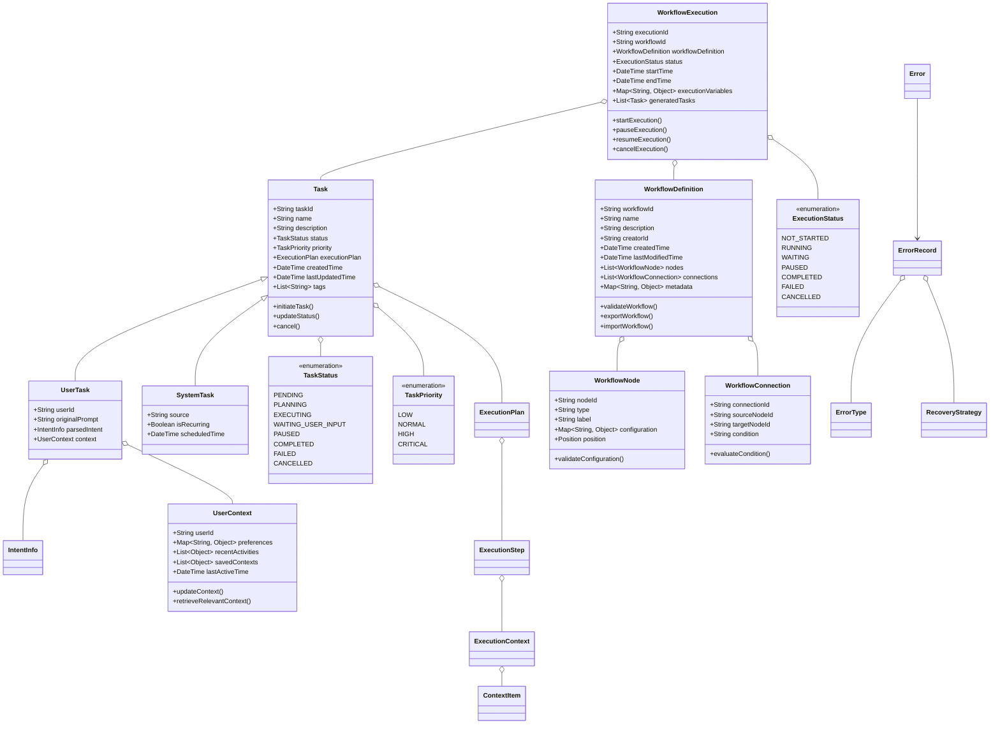

# Director调度引擎业务对象设计

本文档描述了Director调度引擎中使用的核心业务对象，从产品设计角度阐述这些对象的角色、属性和关系。本文档重点关注Director内部特有的对象，公共业务对象详见[../CoreBusinessObjects.md](../CoreBusinessObjects.md)。

## 1. 业务对象概览图

## 2. Director特有业务对象详述

### 2.1 任务（Task）

任务是Director调度引擎的核心业务对象，代表用户请求执行的一项工作或系统自动触发的操作。公共业务对象`UserRequest`到达Director后被转换为内部任务对象。

**关键属性**：
- `taskId`: 任务唯一标识
- `name`: 任务名称
- `description`: 任务描述
- `status`: 任务状态
- `priority`: 任务优先级
- `executionPlan`: 任务的执行计划
- `createdTime`: 创建时间
- `lastUpdatedTime`: 最后更新时间
- `tags`: 标签列表

**主要方法**：
- `initiateTask()`: 初始化任务
- `updateStatus()`: 更新任务状态
- `cancel()`: 取消任务

#### 2.1.1 用户任务（UserTask）

**定义**：由用户通过自然语言或界面操作直接触发的任务。

**关键属性**：
- `userId`: 用户标识
- `originalPrompt`: 用户的原始自然语言输入
- `parsedIntent`: 经过意图解析后的结构化意图信息（详见CoreBusinessObjects.md中的IntentInfo）
- `context`: 用户相关的上下文信息

**生命周期**：
1. 用户输入请求创建任务
2. 意图解析器分析请求并填充意图信息
3. 任务规划器基于意图生成执行计划
4. 执行协调器按计划调度执行
5. 结果反馈给用户并记录完成状态

#### 2.1.2 系统任务（SystemTask）

**定义**：由系统自动触发的任务，如定时作业或事件响应。

**关键属性**：
- `source`: 触发来源
- `isRecurring`: 是否为周期性任务
- `scheduledTime`: 计划执行时间

**使用场景**：
- 定时生成报表
- 监控特定条件并自动执行操作
- 系统维护和资源清理

### 2.2 用户上下文（UserContext）

**定义**：与特定用户相关的上下文信息，用于个性化任务处理和历史追踪。

**关键属性**：
- `userId`: 用户标识
- `preferences`: 用户偏好设置
- `recentActivities`: 最近活动历史
- `savedContexts`: 已保存的上下文集合
- `lastActiveTime`: 最后活动时间

**主要方法**：
- `updateContext()`: 更新用户上下文
- `retrieveRelevantContext()`: 获取与当前任务相关的上下文

**与RequestContext的区别**：
- `RequestContext`（在CoreBusinessObjects.md中）针对单次请求的上下文
- `UserContext`维护用户长期的偏好和历史信息
- 两者结合使用可提供更全面的个性化体验

### 2.3 工作流（Workflow）

#### 2.3.1 工作流定义（WorkflowDefinition）

**定义**：预定义的任务执行路径，包含一系列节点和它们之间的连接关系。

**关键属性**：
- `workflowId`: 工作流唯一标识
- `name`: 工作流名称
- `description`: 工作流描述
- `creatorId`: 创建者标识
- `createdTime`: 创建时间
- `lastModifiedTime`: 最后修改时间
- `nodes`: 工作流中的节点集合
- `connections`: 节点间的连接关系
- `metadata`: 工作流相关元数据

**主要方法**：
- `validateWorkflow()`: 验证工作流的有效性
- `exportWorkflow()`: 导出工作流定义
- `importWorkflow()`: 导入工作流定义

**设计考量**：
- 支持版本控制，方便历史追溯和回滚
- 提供导入导出功能，促进工作流共享
- 包含元数据支持分类、标记和检索

#### 2.3.2 工作流节点（WorkflowNode）

**定义**：工作流中的单个执行单元，可能是一个操作、判断或等待点。

**关键属性**：
- `nodeId`: 节点唯一标识
- `type`: 节点类型
- `label`: 节点标签
- `configuration`: 节点配置
- `position`: 节点在设计器中的位置

**节点类型**：
- 任务节点：执行特定Agent操作
- 条件节点：基于条件进行流程分支
- 输入节点：等待用户输入后继续
- 循环节点：重复执行特定操作
- 子流程节点：嵌套执行另一工作流

**主要方法**：
- `validateConfiguration()`: 验证节点配置的有效性

#### 2.3.3 工作流连接（WorkflowConnection）

**定义**：定义工作流中节点之间的关系和流转条件。

**关键属性**：
- `connectionId`: 连接唯一标识
- `sourceNodeId`: 源节点标识
- `targetNodeId`: 目标节点标识
- `condition`: 流转条件表达式

**主要方法**：
- `evaluateCondition()`: 评估流转条件是否满足

#### 2.3.4 工作流执行（WorkflowExecution）

**定义**：工作流定义的运行时实例，包含执行状态和上下文变量。

**关键属性**：
- `executionId`: 执行唯一标识
- `workflowId`: 关联的工作流标识
- `workflowDefinition`: 关联的工作流定义
- `status`: 当前执行状态
- `startTime`: 开始执行时间
- `endTime`: 结束执行时间
- `executionVariables`: 执行过程中的变量集合
- `generatedTasks`: 执行过程中生成的任务列表

**控制操作**：
- `startExecution()`: 开始执行工作流
- `pauseExecution()`: 暂停执行
- `resumeExecution()`: 恢复执行
- `cancelExecution()`: 取消执行

**与ExecutionPlan的关系**：
- `WorkflowExecution`是预定义工作流的执行实例
- `ExecutionPlan`是针对单个任务的动态生成执行计划
- 工作流执行过程可能生成多个具体的执行计划

## 3. 公共业务对象使用

以下业务对象在CoreBusinessObjects.md中已详细定义，Director调度引擎引用这些对象：

- **ExecutionPlan**: 由Director基于LLM响应结果创建，包含完成任务所需的执行步骤序列
- **ExecutionStep**: 执行计划中的单个原子操作
- **ExecutionContext**: 任务执行环境信息
- **ContextItem**: 执行上下文中的单个数据项
- **IntentInfo**: 结构化的用户意图表示
- **AgentCapability**: Agent提供的功能描述
- **Error**: 错误信息
- **ErrorRecord**: 错误记录
- **ErrorType**: 错误类型
- **RecoveryStrategy**: 错误恢复策略

## 4. 业务对象关系与协作

### 4.1 任务执行流程中的对象协作

1. **任务创建阶段**
   - 用户通过界面提交`UserRequest`，Director创建`UserTask`
   - 意图解析器分析请求填充`IntentInfo`
   - 系统加载相关`UserContext`

2. **规划阶段**
   - 任务规划器分析任务，通过LLM适配器获取LLMResponse
   - Director基于LLMResponse创建`ExecutionPlan`并关联到`Task`
   - 系统检查所需的`AgentCapability`可用性

3. **执行阶段**
   - 执行协调器按计划调度`AgentRequest`
   - 创建并维护`ExecutionContext`
   - 监控执行状态并记录进度

4. **异常处理**
   - 发生错误时创建`Error`和相应的`ErrorRecord`
   - 错误处理器根据`ErrorType`选择`RecoveryStrategy`
   - 根据恢复策略调整执行流程

### 4.2 工作流相关对象协作

1. **工作流设计阶段**
   - 用户通过设计器创建`WorkflowDefinition`
   - 添加`WorkflowNode`并定义`WorkflowConnection`
   - 系统验证工作流结构合法性

2. **工作流执行阶段**
   - 创建`WorkflowExecution`实例
   - 按节点顺序生成`Task`并执行
   - 维护`executionVariables`存储中间结果

3. **工作流与任务转化**
   - 工作流节点转换为具体`Task`
   - 每个`Task`生成自己的`ExecutionPlan`
   - 任务完成后更新工作流执行状态

## 5. 数据持久化与存储设计

### 5.1 存储考量

各业务对象的持久化策略需考虑：
- 访问频率
- 数据量大小
- 关联关系复杂度
- 查询模式

### 5.2 主要存储分类

1. **任务与执行数据**
   - 高频访问，需要快速检索
   - 建议使用高性能数据库存储
   - 支持状态变更历史追踪

2. **工作流定义**
   - 版本化存储
   - 支持导入导出
   - 考虑使用文档型数据库

3. **用户上下文**
   - 需要高安全性
   - 支持增量更新
   - 按用户隔离存储

## 6. 业务对象扩展性设计

Director内部业务对象遵循与CoreBusinessObjects相同的扩展原则：
- 所有对象支持元数据扩展
- 版本化设计确保向后兼容
- 提供插件扩展点支持自定义需求

## 7. 未来演进方向

### 7.1 更细粒度的任务类型划分
- 根据领域特性定义专门化任务类型
- 支持不同任务类型的特定处理流程

### 7.2 增强工作流能力
- 支持动态生成工作流
- 基于历史执行记录优化工作流
- AI辅助的工作流修复与改进建议

### 7.3 多维度任务优先级
- 引入更丰富的优先级计算模型
- 支持基于资源利用率的动态优先级调整
- 考虑用户偏好和系统负载的平衡