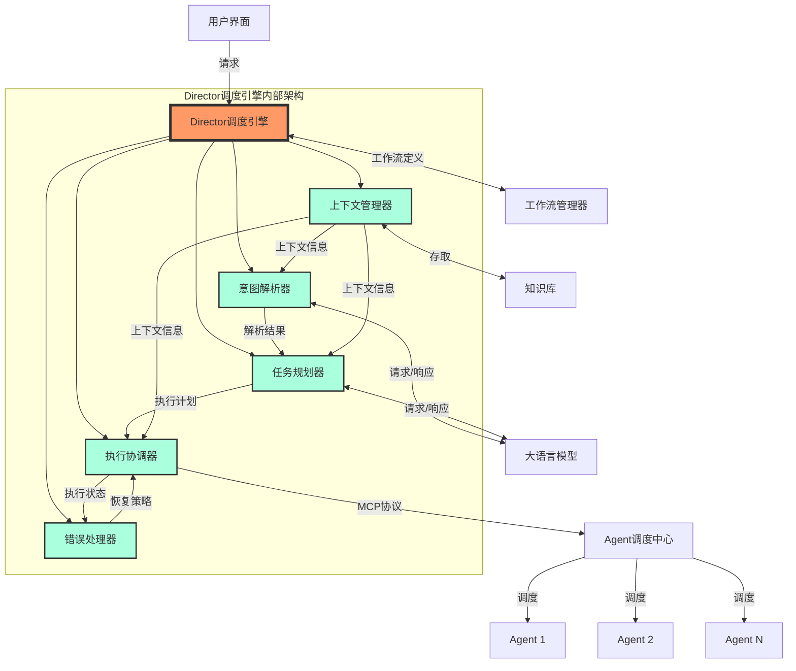
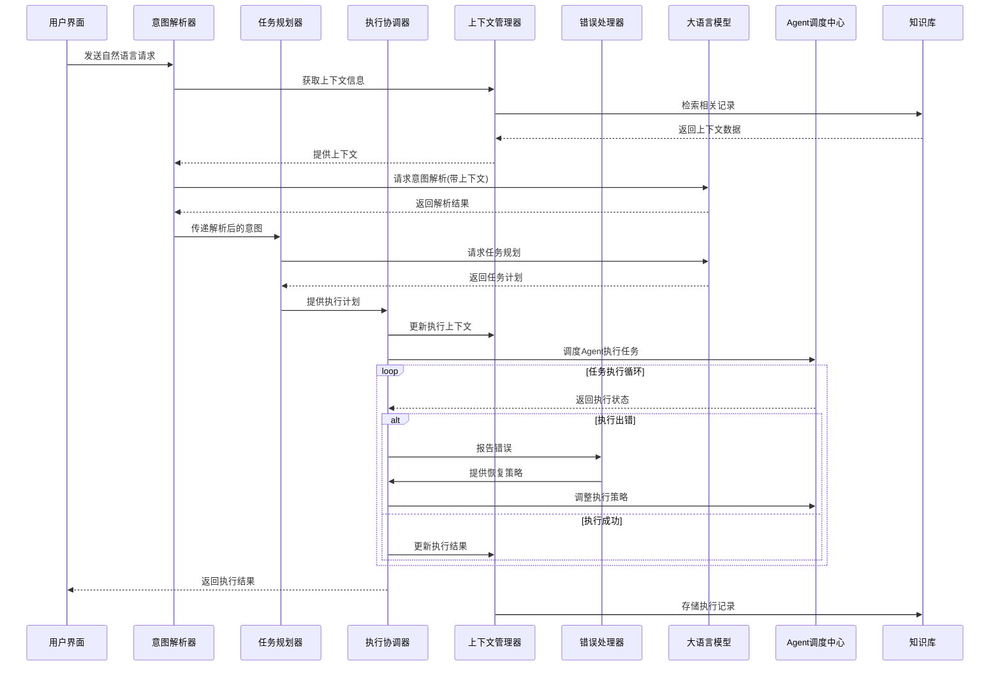
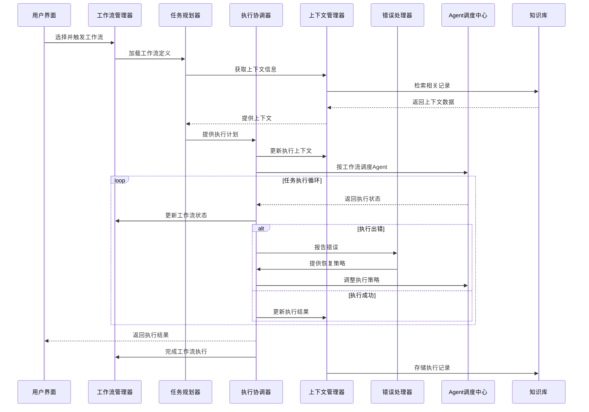

# Director调度引擎设计文档

## 1. 模块概述

Director调度引擎是Lorn.OpenAgenticAI的核心大脑，作为系统的中枢神经，负责协调大语言模型与各类桌面应用之间的交互。它接收用户的自然语言请求或预定义的工作流，进行任务分析与规划，并协调各类Agent完成复杂的自动化任务。

### 1.1 核心价值
- **智能协调**：将大语言模型的理解能力与具体桌面操作Agent结合
- **上下文管理**：维护任务执行的上下文信息，确保多步骤任务的连贯性
- **任务规划**：将复杂任务分解为可执行的原子操作
- **错误处理**：提供健壮的异常处理和恢复机制

### 1.2 使用场景
- **智能助手模式**：用户通过自然语言描述需求，Director自动规划并执行
- **工作流执行**：根据预定义工作流模板，按序调度相关Agent执行
- **多Agent协作**：协调多个Agent共同完成复杂任务，如数据采集、处理、可视化和报告生成

## 2. 模块内部架构图

## 3. 子模块功能及边界说明

### 3.1 意图解析器（Intent Parser）

#### 功能
- 接收用户的自然语言请求
- 调用大语言模型解析用户意图
- 提取任务关键信息（操作类型、参数、约束条件等）
- 将意图解析结果传递给任务规划器

#### 边界
- 不直接执行任何操作
- 专注于理解用户意图，不负责任务执行规划
- 依赖大语言模型进行自然语言处理

### 3.2 任务规划器（Task Planner）

#### 功能
- 根据意图解析结果设计任务执行路径
- 将复杂任务分解为原子操作序列
- 为每个操作分配合适的Agent
- 制定任务间的依赖关系和执行顺序
- 生成可执行的任务计划

#### 边界
- 不直接与Agent交互
- 仅负责任务分解和规划
- 与大语言模型协作优化执行路径

### 3.3 执行协调器（Execution Orchestrator）

#### 功能
- 根据任务计划协调Agent的执行
- 通过MCP协议与Agent调度中心通信
- 监控任务执行进度和状态
- 处理执行过程中的反馈调整
- 管理任务的暂停、继续和终止

#### 边界
- 不直接解析用户意图
- 不直接与各Agent通信，通过Agent调度中心转发
- 专注于任务执行的协调，不负责具体业务逻辑

### 3.4 上下文管理器（Context Manager）

#### 功能
- 维护任务执行的上下文信息
- 记录执行历史和中间状态
- 提供上下文信息给其他模块使用
- 与知识库交互，存储和检索相关信息
- 管理会话状态和用户偏好

#### 边界
- 不直接参与任务执行和规划
- 专注于信息的存储和检索
- 依赖知识库进行持久化存储

### 3.5 错误处理器（Error Handler）

#### 功能
- 捕获任务执行过程中的异常和错误
- 分析错误原因并确定处理策略
- 执行恢复流程或提供替代方案
- 向用户反馈错误信息
- 记录错误日志供后续分析

#### 边界
- 不直接执行业务逻辑
- 专注于异常处理和恢复
- 与执行协调器紧密配合

## 4. 主要交互流程图

### 4.1 提示词驱动模式（智能助手模式）交互流程

### 4.2 流程编排模式（专业工作流模式）交互流程

## 5. 核心技术挑战与解决方案

### 5.1 多模态意图理解
- **挑战**：用户请求可能包含文本、图像、语音等多种形式
- **解决方案**：
  - 集成多模态大语言模型
  - 建立统一的意图表示模型
  - 使用示例学习提升理解准确性

### 5.2 复杂任务规划
- **挑战**：将高层次任务准确分解为可执行原子操作
- **解决方案**：
  - 采用层次化任务规划算法
  - 建立任务模板库
  - 引入大模型进行规划优化

### 5.3 鲁棒性错误处理
- **挑战**：在各类错误情况下保证系统稳定性
- **解决方案**：
  - 实现多级故障恢复机制
  - 设计错误分类和处理决策树
  - 支持手动干预和回滚机制

### 5.4 上下文连贯性
- **挑战**：在长任务序列中保持上下文一致
- **解决方案**：
  - 设计分层上下文存储结构
  - 实现上下文冲突检测和解决机制
  - 优化上下文压缩和检索算法

## 6. 接口规范

### 6.1 与用户界面层接口
- 接收用户请求（自然语言/工作流触发）
- 返回任务执行状态和结果
- 提供执行进度实时更新

### 6.2 与大语言模型接口
- 发送带上下文的意图解析请求
- 接收解析结果和任务规划建议
- 支持流式响应和中间反馈

### 6.3 与Agent调度中心接口
- 基于MCP协议的标准化指令传递
- 接收Agent执行状态和结果
- 支持任务取消和优先级调整

### 6.4 与知识库接口
- 上下文信息存取
- 历史执行记录查询
- 用户偏好和配置管理

### 6.5 与工作流管理器接口
- 加载工作流定义
- 更新工作流执行状态
- 工作流执行控制（暂停/继续/终止）

## 7. 性能与可扩展性考量

### 7.1 性能指标
- 意图解析响应时间：<1秒
- 任务规划生成时间：<2秒
- 单Agent调度延迟：<200ms
- 最大并发任务数：50+

### 7.2 可扩展性设计
- 模块化架构，支持组件独立升级
- 插件式LLM集成，支持多种模型后端
- 分布式任务执行支持
- 异步消息队列通信机制

## 8. 安全与隐私

### 8.1 安全机制
- 细粒度Agent权限控制
- 操作审计日志
- 敏感操作确认机制

### 8.2 隐私保护
- 本地知识库加密存储
- 用户数据匿名化处理
- 透明的数据使用策略

## 9. 未来演进方向

### 9.1 短期计划
- 完善错误恢复策略库
- 优化多Agent协同算法
- 增强上下文理解能力

### 9.2 中长期规划
- 支持自定义任务规划逻辑
- 引入强化学习优化执行路径
- 开发跨设备任务协同机制
- 支持更复杂的工作流编排特性