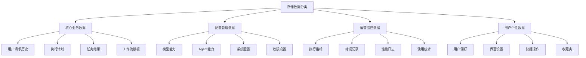
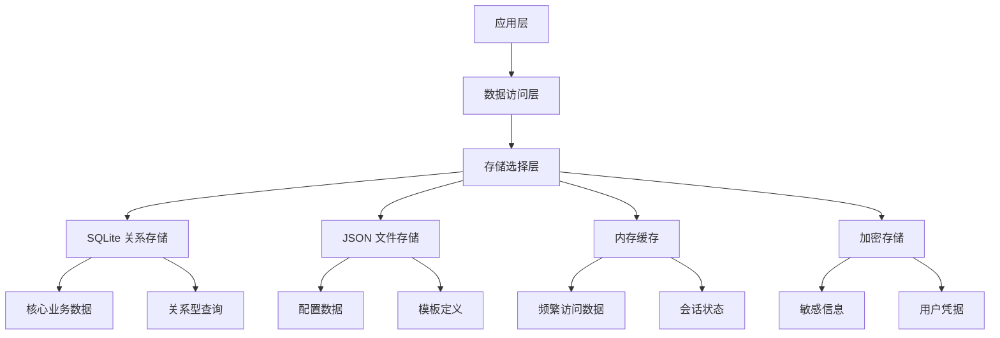
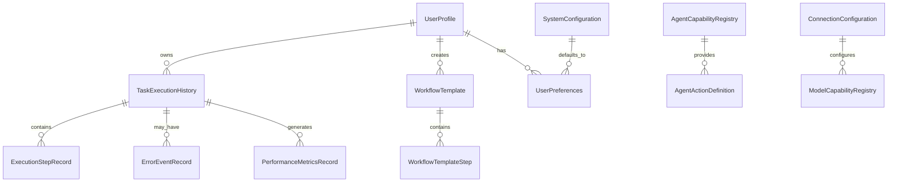
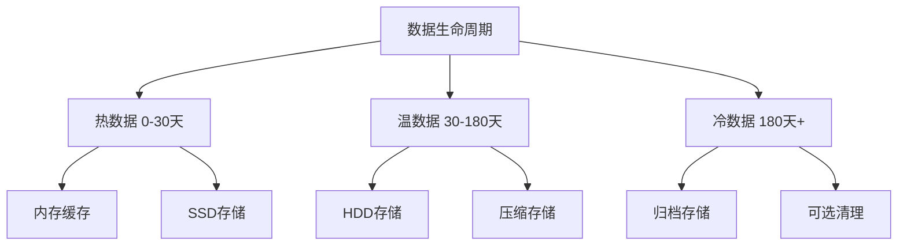
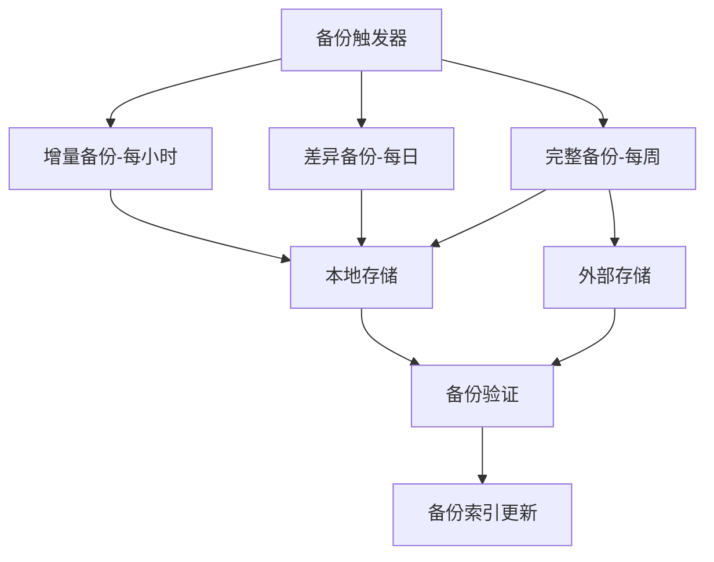
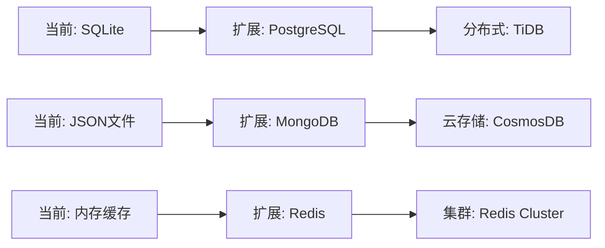

# 持久化存储业务对象数据结构设计

## 概述

本文档详细描述Lorn.OpenAgenticAI系统中需要持久化存储的业务对象数据结构设计，明确存储需求、数据模型、存储策略和性能优化方案。设计遵循数据治理最佳实践，确保数据的完整性、一致性、安全性和可扩展性。

作为客户端智能体平台，系统需要在本地存储用户数据、工作流模板、执行历史和系统配置，同时支持数据导入导出、备份恢复和跨设备同步功能。

## 存储需求分析

### 业务驱动的存储需求

#### 用户体验需求
- **历史查询**：用户需要查看任务执行历史和结果
- **工作流管理**：保存、编辑和复用自定义工作流
- **个性化设置**：记住用户偏好和配置
- **离线工作**：支持断网情况下的基本功能
- **快速启动**：系统启动时快速加载必要配置

#### 系统运营需求
- **性能分析**：收集执行指标用于系统优化
- **问题诊断**：保存错误日志用于故障排查
- **能力管理**：维护Agent和模型能力信息
- **审计合规**：记录用户操作用于安全审计

#### 数据治理需求
- **数据一致性**：确保关联数据的完整性
- **版本管理**：支持数据结构演进和迁移
- **备份恢复**：定期备份和灾难恢复
- **隐私保护**：敏感数据加密和权限控制

### 存储特征分析



### 数据生命周期管理

#### 数据生成阶段
- **实时生成**：任务执行过程中产生的日志和指标
- **用户创建**：用户主动创建的工作流和配置
- **系统初始化**：安装时创建的默认配置和能力信息

#### 数据使用阶段
- **频繁访问**：当前任务相关数据，需要高性能存储
- **定期访问**：历史记录和模板，需要可靠存储
- **偶发访问**：错误日志和详细指标，需要可查询存储

#### 数据归档阶段
- **热数据**：最近30天的执行记录，保持在快速存储
- **温数据**：30-180天的历史数据，可迁移至较慢存储
- **冷数据**：180天以上的数据，压缩存储或清理

## 持久化业务对象数据模型

### 1. 用户管理相关对象

#### 1.1 用户档案 (UserProfile)

**存储目的**：维护用户基本信息和系统配置。

**数据结构**：
```
UserProfile {
    userId: String (Primary Key)
    username: String
    email: String (Optional)
    createdTime: DateTime
    lastLoginTime: DateTime
    isActive: Boolean
    profileVersion: Integer
    preferences: UserPreferences (JSON)
    securitySettings: SecuritySettings (JSON)
    metadata: Map<String, Object>
}
```

**存储特征**：
- 读多写少，用户登录时加载
- 数据量小，单条记录KB级别
- 需要支持快速查询和更新

#### 1.2 用户偏好设置 (UserPreferences)

**存储目的**：保存用户个性化设置和操作习惯。

**数据结构**：
```
UserPreferences {
    userId: String (Foreign Key)
    preferenceCategory: String
    preferenceKey: String
    preferenceValue: String
    valueType: String (String/Number/Boolean/JSON)
    lastUpdatedTime: DateTime
    isSystemDefault: Boolean
    description: String (Optional)
}
```

**常见偏好类别**：
- UI设置：主题、语言、布局偏好
- 执行偏好：默认模型、超时设置、重试策略
- 通知偏好：提醒方式、频率设置
- 安全偏好：认证方式、会话超时

### 2. 任务执行相关对象

#### 2.1 任务执行历史 (TaskExecutionHistory)

**存储目的**：记录用户任务执行的完整历史，支持查询和分析。

**数据结构**：
```
TaskExecutionHistory {
    executionId: String (Primary Key)
    userId: String (Foreign Key)
    requestId: String
    userInput: Text
    requestType: String
    executionStatus: String
    startTime: DateTime
    endTime: DateTime
    totalExecutionTime: Long (milliseconds)
    isSuccessful: Boolean
    resultSummary: Text
    errorCount: Integer
    llmProvider: String
    llmModel: String
    tokenUsage: Integer
    estimatedCost: Decimal
    tags: String[] (JSON Array)
    metadata: Map<String, Object> (JSON)
}
```

**索引策略**：
- 主索引：executionId
- 查询索引：userId + startTime (DESC)
- 过滤索引：userId + executionStatus
- 搜索索引：userInput (Full-text search)

#### 2.2 执行步骤记录 (ExecutionStepRecord)

**存储目的**：记录任务执行的详细步骤，用于问题诊断和流程优化。

**数据结构**：
```
ExecutionStepRecord {
    stepRecordId: String (Primary Key)
    executionId: String (Foreign Key)
    stepId: String
    stepOrder: Integer
    stepDescription: Text
    agentId: String
    actionName: String
    parameters: Text (JSON)
    stepStatus: String
    startTime: DateTime
    endTime: DateTime
    executionTime: Long (milliseconds)
    isSuccessful: Boolean
    outputData: Text (JSON)
    errorMessage: Text (Optional)
    retryCount: Integer
    resourceUsage: Text (JSON)
}
```

#### 2.3 工作流模板 (WorkflowTemplate)

**存储目的**：保存用户创建的可复用工作流定义。

**数据结构**：
```
WorkflowTemplate {
    templateId: String (Primary Key)
    userId: String (Foreign Key)
    templateName: String
    description: Text
    category: String
    isPublic: Boolean
    isSystemTemplate: Boolean
    templateVersion: String
    createdTime: DateTime
    lastModifiedTime: DateTime
    usageCount: Integer
    rating: Float (0-5)
    templateDefinition: Text (JSON)
    requiredCapabilities: String[] (JSON Array)
    estimatedExecutionTime: Long (milliseconds)
    tags: String[] (JSON Array)
    iconUrl: String (Optional)
    thumbnailData: Blob (Optional)
}
```

**关联对象**：
```
WorkflowTemplateStep {
    stepId: String (Primary Key)
    templateId: String (Foreign Key)
    stepOrder: Integer
    stepType: String
    stepName: String
    stepDescription: Text
    requiredCapability: String
    parameters: Text (JSON)
    dependsOnSteps: String[] (JSON Array)
    isOptional: Boolean
    timeoutSeconds: Integer
}
```

### 3. 能力管理相关对象

#### 3.1 模型能力注册表 (ModelCapabilityRegistry)

**存储目的**：维护系统支持的大语言模型信息和能力特征。

**数据结构**：
```
ModelCapabilityRegistry {
    modelId: String (Primary Key)
    modelName: String
    provider: String
    version: String
    isActive: Boolean
    supportedFeatures: String[] (JSON Array)
    maxTokens: Integer
    costPerInputToken: Decimal
    costPerOutputToken: Decimal
    averageResponseTime: Long (milliseconds)
    reliabilityScore: Float (0-1)
    lastUpdatedTime: DateTime
    configurationOptions: Text (JSON)
    usageRestrictions: Text (JSON)
    documentationUrl: String (Optional)
}
```

#### 3.2 Agent能力注册表 (AgentCapabilityRegistry)

**存储目的**：管理系统中可用的Agent及其提供的功能能力。

**数据结构**：
```
AgentCapabilityRegistry {
    agentId: String (Primary Key)
    agentName: String
    agentType: String
    version: String
    isActive: Boolean
    isSystemAgent: Boolean
    description: Text
    supportedApplications: String[] (JSON Array)
    requiredPermissions: String[] (JSON Array)
    installationPath: String
    configurationFile: String
    lastHealthCheck: DateTime
    healthStatus: String
    performanceMetrics: Text (JSON)
    registrationTime: DateTime
    lastUpdatedTime: DateTime
}
```

**关联对象**：
```
AgentActionDefinition {
    actionId: String (Primary Key)
    agentId: String (Foreign Key)
    actionName: String
    actionDescription: Text
    inputParameters: Text (JSON Schema)
    outputFormat: Text (JSON Schema)
    estimatedExecutionTime: Long (milliseconds)
    reliabilityScore: Float (0-1)
    usageCount: Integer
    lastUsedTime: DateTime
    exampleUsage: Text (JSON)
    documentationUrl: String (Optional)
}
```

### 4. 监控分析相关对象

#### 4.1 性能指标记录 (PerformanceMetricsRecord)

**存储目的**：收集系统性能数据，支持性能分析和优化。

**数据结构**：
```
PerformanceMetricsRecord {
    metricId: String (Primary Key)
    userId: String (Foreign Key)
    executionId: String (Foreign Key)
    metricTimestamp: DateTime
    metricType: String
    metricName: String
    metricValue: Double
    metricUnit: String
    tags: Map<String, String> (JSON)
    context: Map<String, Object> (JSON)
    aggregationPeriod: String (Optional)
}
```

**指标类型**：
- 执行性能：任务总时长、步骤执行时间、队列等待时间
- 资源使用：CPU使用率、内存占用、磁盘I/O
- 业务指标：任务成功率、用户活跃度、模型使用频率

#### 4.2 错误事件记录 (ErrorEventRecord)

**存储目的**：记录系统运行中的错误事件，支持问题诊断和系统改进。

**数据结构**：
```
ErrorEventRecord {
    errorEventId: String (Primary Key)
    userId: String (Foreign Key, Optional)
    executionId: String (Foreign Key, Optional)
    stepId: String (Optional)
    errorType: String
    errorCode: String
    errorMessage: Text
    stackTrace: Text
    sourceComponent: String
    severity: String
    timestamp: DateTime
    environment: Text (JSON)
    userAgent: String (Optional)
    isResolved: Boolean
    resolutionTime: DateTime (Optional)
    resolutionNotes: Text (Optional)
    recurrenceCount: Integer
    firstOccurrence: DateTime
    lastOccurrence: DateTime
}
```

### 5. 配置管理相关对象

#### 5.1 系统配置 (SystemConfiguration)

**存储目的**：管理系统级别的配置参数和设置。

**数据结构**：
```
SystemConfiguration {
    configId: String (Primary Key)
    configCategory: String
    configKey: String
    configValue: Text
    valueType: String
    description: Text
    isReadOnly: Boolean
    isSecure: Boolean (需要加密存储)
    defaultValue: Text
    validationRule: Text (JSON Schema/Regex)
    lastModifiedTime: DateTime
    modifiedBy: String
    effectiveScope: String (Global/User/Session)
    requiresRestart: Boolean
}
```

**配置类别**：
- 系统设置：日志级别、缓存配置、超时设置
- 集成配置：API密钥、连接字符串、认证信息
- 业务规则：默认重试次数、并发限制、资源配额
- 安全策略：密码规则、会话管理、权限配置

#### 5.2 连接配置 (ConnectionConfiguration)

**存储目的**：管理外部服务连接配置，如LLM API、数据库连接等。

**数据结构**：
```
ConnectionConfiguration {
    connectionId: String (Primary Key)
    connectionName: String
    connectionType: String
    provider: String
    endpoint: String
    apiKey: String (Encrypted)
    additionalParameters: Text (JSON, Encrypted)
    isActive: Boolean
    isDefault: Boolean
    createdTime: DateTime
    lastTestedTime: DateTime
    connectionStatus: String
    maxRetryAttempts: Integer
    timeoutSeconds: Integer
    usageQuota: Text (JSON)
    currentUsage: Text (JSON)
    lastResetTime: DateTime
}
```

## 存储架构设计

### 分层存储策略



### 存储技术选择

#### 主存储：SQLite 数据库
**适用场景**：核心业务数据，需要事务性和关系查询
- 用户档案和偏好设置
- 任务执行历史和步骤记录
- 性能指标和错误记录
- Agent和模型能力注册

**优势**：
- 无需额外安装，内嵌式部署
- 支持完整SQL功能和事务
- 高性能本地查询
- 数据完整性保障

#### 辅助存储：JSON 文件
**适用场景**：结构灵活的配置和模板数据
- 工作流模板定义
- 系统配置文件
- 用户自定义设置
- 导入导出数据

**优势**：
- 人类可读，便于调试
- 结构灵活，易于扩展
- 便于版本控制和备份
- 支持热更新

#### 缓存层：内存存储
**适用场景**：频繁访问的热数据
- 当前会话状态
- 最近使用的模板
- 活跃Agent信息
- 性能统计缓存

**策略**：
- LRU淘汰策略
- 定期持久化
- 启动时预加载
- 内存使用限制

#### 安全存储：加密存储
**适用场景**：敏感信息和用户凭据
- API密钥和认证令牌
- 用户密码和个人信息
- 商业敏感的工作流
- 审计日志

**加密方案**：
- AES-256对称加密
- 基于用户密码的密钥派生
- 分层密钥管理
- 数据脱敏技术

### 数据库架构设计

#### 表结构设计原则
1. **规范化设计**：避免数据冗余，确保数据一致性
2. **性能优化**：合理设计索引，支持常见查询模式
3. **扩展性考虑**：预留扩展字段，支持向后兼容
4. **安全设计**：敏感字段加密，访问权限控制

#### 核心表关系



#### 索引策略设计

**主键索引**：所有表都有唯一主键，使用UUID或自增ID
**外键索引**：所有外键字段建立索引，支持关联查询
**查询索引**：基于常见查询模式建立复合索引
**全文索引**：对文本搜索字段建立全文索引

```sql
-- 任务历史查询索引
CREATE INDEX idx_task_history_user_time ON TaskExecutionHistory(userId, startTime DESC);
CREATE INDEX idx_task_history_status ON TaskExecutionHistory(userId, executionStatus);

-- 步骤记录查询索引  
CREATE INDEX idx_step_record_execution ON ExecutionStepRecord(executionId, stepOrder);
CREATE INDEX idx_step_record_agent ON ExecutionStepRecord(agentId, startTime DESC);

-- 性能指标时序索引
CREATE INDEX idx_metrics_time_series ON PerformanceMetricsRecord(metricType, metricTimestamp DESC);
CREATE INDEX idx_metrics_execution ON PerformanceMetricsRecord(executionId, metricType);

-- 工作流模板搜索索引
CREATE INDEX idx_template_user_category ON WorkflowTemplate(userId, category, lastModifiedTime DESC);
CREATE INDEX idx_template_public ON WorkflowTemplate(isPublic, category, rating DESC);
```

## 数据迁移和版本管理

### 版本控制策略

#### 数据库版本管理
```
DatabaseVersion {
    versionId: Integer (Primary Key)
    majorVersion: Integer
    minorVersion: Integer
    patchVersion: Integer
    migrationScript: String
    appliedTime: DateTime
    isRollbackable: Boolean
    description: Text
}
```

#### 迁移脚本管理
- **增量迁移**：每个版本提供向前迁移脚本
- **回滚支持**：关键更新提供回滚脚本
- **数据验证**：迁移后进行数据完整性检查
- **备份策略**：迁移前自动创建数据备份

### 兼容性设计

#### 向后兼容原则
1. **字段添加**：新增字段使用默认值，不影响现有功能
2. **字段重命名**：保持旧字段一定时期，逐步迁移
3. **结构调整**：提供数据转换工具，平滑升级
4. **API兼容**：保持数据访问接口稳定

#### 版本升级流程
1. **兼容性检查**：验证当前数据版本与目标版本兼容性
2. **数据备份**：创建完整数据备份
3. **迁移执行**：按序执行迁移脚本
4. **数据验证**：检查迁移结果完整性
5. **功能测试**：验证业务功能正常
6. **版本标记**：更新数据库版本信息

## 性能优化策略

### 查询性能优化

#### 分页查询设计
```sql
-- 基于游标的分页，适用于大数据集
SELECT * FROM TaskExecutionHistory 
WHERE userId = ? AND startTime < ?
ORDER BY startTime DESC 
LIMIT 20;

-- 基于偏移的分页，适用于小数据集
SELECT * FROM WorkflowTemplate 
WHERE userId = ?
ORDER BY lastModifiedTime DESC 
LIMIT 20 OFFSET ?;
```

#### 聚合查询优化
```sql
-- 预计算常用统计指标
CREATE VIEW UserExecutionStats AS
SELECT 
    userId,
    COUNT(*) as totalExecutions,
    SUM(CASE WHEN isSuccessful = 1 THEN 1 ELSE 0 END) as successfulExecutions,
    AVG(totalExecutionTime) as avgExecutionTime,
    MAX(startTime) as lastExecutionTime
FROM TaskExecutionHistory 
GROUP BY userId;
```

### 存储空间优化

#### 数据压缩策略
- **文本压缩**：大文本字段使用压缩存储
- **JSON优化**：移除冗余字段，使用简化键名
- **归档压缩**：历史数据定期压缩存储
- **磁盘清理**：自动清理过期临时数据

#### 数据分层存储


### 并发性能优化

#### 数据库连接管理
- **连接池**：维护数据库连接池，避免频繁建立连接
- **读写分离**：读密集操作使用只读连接
- **事务优化**：最小化事务范围，避免长事务
- **锁策略**：使用适当的锁级别，减少锁冲突

#### 缓存策略
```
缓存层级:
L1: 应用内存缓存 (最热数据)
L2: 进程共享缓存 (热数据)
L3: 磁盘缓存 (温数据)
```

## 数据安全设计

### 访问控制

#### 权限模型
```
Permission {
    permissionId: String
    resourceType: String
    resourceId: String (Optional)
    action: String (READ/WRITE/DELETE/EXECUTE)
    userId: String
    grantedTime: DateTime
    expiryTime: DateTime (Optional)
    grantedBy: String
}
```

#### 数据分级
- **公开数据**：系统默认配置、公共模板
- **用户数据**：个人设置、私有工作流
- **敏感数据**：API密钥、认证信息
- **审计数据**：操作日志、错误记录

### 加密保护

#### 字段级加密
```sql
-- 敏感字段加密存储示例
CREATE TABLE ConnectionConfiguration (
    connectionId TEXT PRIMARY KEY,
    connectionName TEXT NOT NULL,
    endpoint TEXT NOT NULL,
    apiKey TEXT, -- 加密存储
    additionalParameters TEXT, -- 加密存储
    -- 其他字段...
);
```

#### 密钥管理
- **主密钥**：由用户密码或系统密钥派生
- **数据密钥**：用于加密具体数据字段
- **密钥轮换**：定期更新加密密钥
- **密钥分离**：密钥与数据分离存储

### 审计日志

#### 操作审计
```
AuditLog {
    auditId: String (Primary Key)
    userId: String
    operation: String
    resourceType: String
    resourceId: String
    oldValue: Text (Optional)
    newValue: Text (Optional)
    timestamp: DateTime
    ipAddress: String
    userAgent: String
    sessionId: String
    isSuccessful: Boolean
    errorMessage: Text (Optional)
}
```

#### 访问审计
- 记录所有数据访问操作
- 跟踪敏感数据查询
- 监控异常访问模式
- 定期生成审计报告

## 备份与恢复策略

### 备份策略

#### 自动备份机制


#### 备份数据格式
```
Backup {
    backupId: String
    backupType: String (FULL/INCREMENTAL/DIFFERENTIAL)
    startTime: DateTime
    endTime: DateTime
    dataSize: Long
    compressionRatio: Float
    checksumSHA256: String
    backupPath: String
    isEncrypted: Boolean
    retentionPolicy: String
    metadata: Text (JSON)
}
```

### 恢复策略

#### 恢复场景
1. **数据损坏恢复**：从最近备份恢复损坏数据
2. **误操作恢复**：恢复意外删除或修改的数据
3. **系统迁移**：在新系统上恢复完整数据
4. **灾难恢复**：在硬件故障后恢复服务

#### 恢复流程
1. **损坏检测**：自动检测数据完整性问题
2. **备份选择**：选择合适的备份点进行恢复
3. **数据验证**：验证备份文件完整性
4. **恢复执行**：执行数据恢复操作
5. **一致性检查**：检查恢复后数据一致性
6. **服务恢复**：重新启动相关服务

### 数据同步

#### 跨设备同步
```
SyncRecord {
    syncId: String
    userId: String
    deviceId: String
    syncType: String
    lastSyncTime: DateTime
    syncStatus: String
    conflictResolution: String
    dataChanges: Text (JSON)
    errorMessage: Text (Optional)
}
```

#### 冲突解决策略
- **时间戳优先**：最新修改时间的数据优先
- **用户选择**：提示用户手动解决冲突
- **智能合并**：自动合并非冲突字段
- **版本保留**：保留所有版本供用户选择

## 监控与运维

### 存储监控指标

#### 性能指标
- **查询响应时间**：各类查询的平均响应时间
- **吞吐量**：每秒处理的读写操作数
- **连接数**：活跃数据库连接数量
- **缓存命中率**：缓存系统的命中率统计

#### 资源指标
- **存储空间使用**：数据库文件大小和增长率
- **内存使用**：缓存占用内存大小
- **CPU使用**：数据库操作的CPU占用率
- **磁盘I/O**：读写操作的磁盘I/O统计

### 运维自动化

#### 自动化任务
```
MaintenanceTask {
    taskId: String
    taskName: String
    taskType: String
    schedule: String (Cron表达式)
    isEnabled: Boolean
    lastExecutionTime: DateTime
    nextExecutionTime: DateTime
    executionStatus: String
    executionDuration: Long
    taskParameters: Text (JSON)
    notificationSettings: Text (JSON)
}
```

#### 维护任务类型
- **数据清理**：清理过期日志和临时数据
- **索引重建**：定期重建数据库索引
- **统计更新**：更新查询优化器统计信息
- **备份验证**：验证备份文件完整性
- **性能分析**：生成性能报告和建议

### 告警机制

#### 告警规则
```
AlertRule {
    ruleId: String
    ruleName: String
    metricName: String
    condition: String
    threshold: Double
    severity: String
    isEnabled: Boolean
    notificationChannels: String[] (JSON Array)
    cooldownPeriod: Long
    lastTriggeredTime: DateTime
}
```

#### 告警场景
- **存储空间不足**：可用空间低于阈值
- **查询性能下降**：响应时间超过阈值
- **备份失败**：备份任务执行失败
- **数据一致性问题**：检测到数据完整性错误

## 扩展性设计

### 水平扩展能力

#### 数据分片策略
虽然当前为单机部署，但预留分片扩展能力：
- **用户分片**：按用户ID分片数据
- **时间分片**：按时间范围分片历史数据
- **功能分片**：按业务模块分离数据存储

#### 服务化架构准备
- **数据访问层**：抽象数据访问接口
- **服务接口**：为各存储服务定义标准接口
- **配置管理**：支持多存储后端配置
- **负载均衡**：预留负载均衡和路由能力

### 技术栈演进

#### 存储技术演进路径


#### 迁移兼容性
- **数据格式兼容**：设计通用数据格式标准
- **接口兼容**：保持数据访问接口稳定
- **迁移工具**：提供自动化迁移工具
- **测试覆盖**：确保迁移过程数据完整性

## 总结

本持久化存储设计文档从产品角度全面考虑了Lorn.OpenAgenticAI系统的数据存储需求，设计了完整的数据模型和存储架构。设计重点关注：

1. **用户体验**：快速数据访问、可靠的数据持久化、便捷的数据管理
2. **系统性能**：优化的查询性能、高效的存储利用、合理的缓存策略
3. **数据安全**：加密保护、访问控制、审计跟踪
4. **运维友好**：自动化备份、监控告警、故障恢复
5. **扩展能力**：版本演进、技术升级、架构扩展

该设计为系统的稳定运行和未来发展提供了坚实的数据基础，确保用户数据的安全可靠，同时支持系统功能的持续演进和性能优化。
