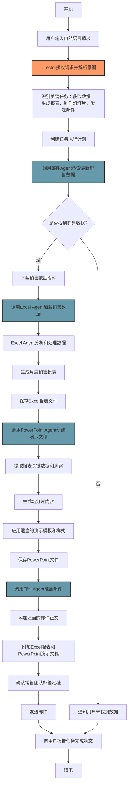
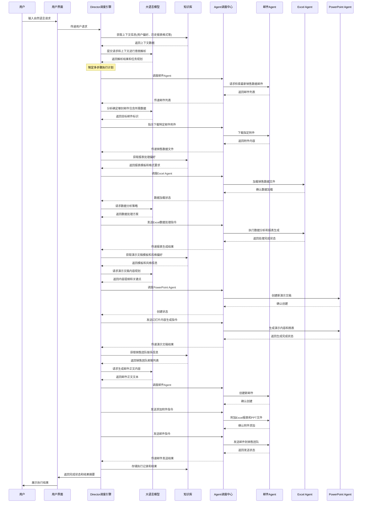

# 自动报表生成场景分析

本文档详细分析了用户通过自然语言请求生成销售报表并制作演示幻灯片的场景，展示了 Lorn.OpenAgenticAI 系统如何协调多个 Agent 完成复杂的自动化任务。

## 用户场景描述

用户通过自然语言指令："请从邮箱中下载最新的销售数据，整理成月度报表，并制作一份演示幻灯片发送给销售团队"，触发系统执行一系列操作，完成从数据获取、处理到最终输出的完整流程。

## 业务流程图

## 交互序列图

## 关键技术点分析

### 1. 多意图解析与任务分解

系统需要从用户的单一自然语言指令中提取多个关键任务：
- 邮件数据检索与下载
- 数据处理与报表生成
- 演示文稿制作
- 邮件发送

Director调度引擎通过LLM将这个高层次需求分解为一系列可执行的原子操作，并制定执行计划。

### 2. 上下文管理与信息传递

在整个执行流程中，系统需要管理和传递多种上下文信息：
- 用户偏好（报表格式、演示风格）
- 中间结果（销售数据文件、生成的报表）
- 业务信息（销售团队联系方式）

知识库在这个过程中扮演关键角色，提供必要的上下文支持。

### 3. Agent协同工作

该场景涉及三种不同Agent的协同工作：
- 邮件Agent：负责数据获取和最终结果发送
- Excel Agent：负责数据处理和报表生成
- PowerPoint Agent：负责演示文稿制作

AgentHub负责协调这些Agent的顺序调用和数据传递，确保工作流程顺利执行。

### 4. 错误处理与恢复机制

在实际执行过程中，可能出现多种错误情况，如：
- 未找到符合条件的销售数据邮件
- 销售数据格式异常导致处理失败
- 邮件发送权限不足或网络问题

系统需要针对这些情况设计合理的错误处理和恢复策略，确保任务稳定执行。

## 优化方向与扩展功能

### 1. 个性化增强
- 记录用户对报表风格和内容的偏好
- 基于历史执行记录，自动调整数据分析重点
- 学习用户对演示文稿的反馈，优化未来生成方案

### 2. 流程记忆与复用
- 将成功执行的流程保存为工作流模板
- 允许用户微调保存的模板参数
- 支持定时触发此类报表生成任务

### 3. 交互优化
- 在关键节点提供预览和确认选项
- 添加进度展示，让用户了解执行状态
- 提供中途干预机制，允许用户调整执行方向

## 结论

自动报表生成场景展示了Lorn.OpenAgenticAI系统在处理多步骤、跨应用任务时的强大能力。通过Director调度引擎的智能协调，系统能够理解用户高级意图，并将其转化为精确的执行计划，大幅降低了用户的操作成本和技术门槛。

这种能力对企业用户特别有价值，可以显著提升数据处理和报告生成的效率，同时保持高度的灵活性和定制化能力。随着系统的不断学习和优化，这类任务的执行效果将持续提升，为用户创造更大的价值。