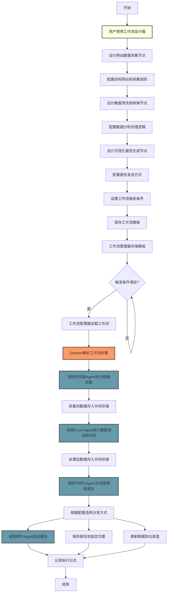
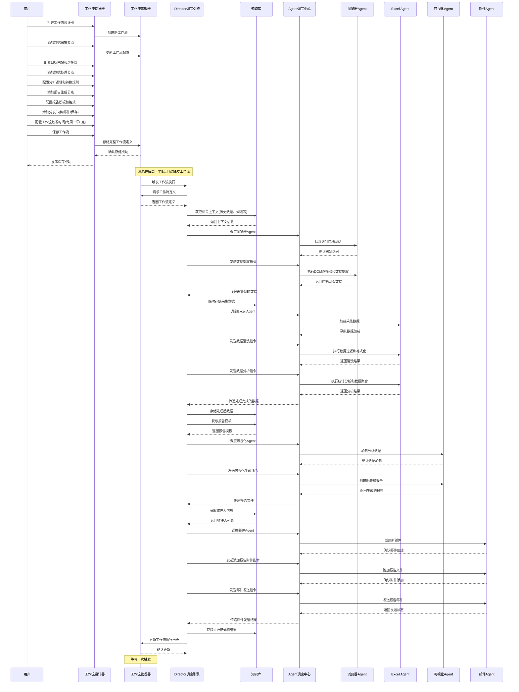

# 网络数据采集分析场景

本文档详细分析了用户通过工作流编排模式设计和执行网络数据采集分析任务的场景，展示了 Lorn.OpenAgenticAI 系统如何支持复杂的定期自动化数据处理工作流。

## 用户场景描述

用户通过流程编排模式，设计一个定期从特定网站采集数据、进行分析并生成可视化报告的工作流。该工作流设计完成后，系统会按照预设流程自动完成全部工作，无需用户干预。

## 业务流程图

## 交互序列图

## 关键技术点分析

### 1. 可视化工作流设计

工作流设计器是该场景的核心入口，它需要提供：
- 直观的拖拽式节点添加与连接
- 各类节点的详细配置界面
- 工作流验证与调试功能
- 条件分支与循环控制设计

这种可视化设计极大降低了非技术用户创建复杂自动化流程的门槛。

### 2. 网络数据采集技术

浏览器Agent是实现网络数据采集的关键组件，它需要支持：
- 动态页面内容加载与渲染
- 精确的DOM选择器支持
- 应对反爬策略的能力
- 表单交互与数据提交
- Cookie和会话管理

### 3. 定时调度与状态维护

工作流管理器需要实现可靠的定时触发机制：
- 精确的定时调度（支持cron表达式）
- 执行状态监控与记录
- 异常中断恢复能力
- 并发执行控制

### 4. 数据转换与分析

Excel Agent在数据处理阶段扮演关键角色：
- 多源数据格式统一与转换
- 数据清洗与异常值处理
- 统计分析与数据挖掘
- 结果集生成与中间数据传递

### 5. 报告自动生成

可视化Agent需要根据分析结果智能生成报告：
- 数据可视化图表生成
- 智能洞察提取与文本生成
- 报告样式与格式控制
- 多格式导出支持（PDF、PPT等）

## 与提示词驱动模式的区别

网络数据采集分析场景采用了工作流编排模式，与智能助手模式（提示词驱动）有以下明显区别：

### 1. 设计与执行分离
- **工作流编排模式**：先设计保存工作流，后续自动或手动触发执行
- **智能助手模式**：用户提出需求，系统立即解析并执行

### 2. 精确性与可控性
- **工作流编排模式**：用户可精确控制每个执行步骤和参数
- **智能助手模式**：系统自动推断执行步骤，用户控制较少

### 3. 复用性与自动化程度
- **工作流编排模式**：高度复用，可定时自动执行无需干预
- **智能助手模式**：每次需要用户触发，适合个性化临时任务

### 4. 适用场景
- **工作流编排模式**：适合固定流程、重复性高、需要定期执行的任务
- **智能助手模式**：适合临时性、多变的任务，无需前期设计

## 优化方向与扩展功能

### 1. 工作流版本管理
- 支持工作流定义的版本控制
- 提供回滚机制和历史版本比对
- 工作流模板共享与导入导出

### 2. 异常处理增强
- 可视化配置异常处理策略
- 智能重试机制和备选路径
- 异常通知与人工干预接口

### 3. 数据源扩展
- 支持更多类型的数据源（API、数据库等）
- 添加数据源连接器管理器
- 支持数据源身份验证配置

### 4. 分析能力强化
- 集成机器学习模型用于数据预测
- 支持复杂的数据关联分析
- 添加异常检测和趋势分析工具

### 5. 动态工作流
- 支持条件判断动态调整执行路径
- 基于数据内容的分支选择
- 参数化工作流模板

## 结论

网络数据采集分析场景展示了Lorn.OpenAgenticAI系统在处理重复性、结构化任务时的强大能力。通过可视化的工作流编排界面，非技术用户也能设计复杂的自动化数据处理流程，极大提高了数据分析工作的效率。

工作流编排模式与提示词驱动模式相互补充，共同构成了系统的两大核心使用方式，适应不同场景和用户需求。随着系统的持续开发和优化，工作流功能将进一步增强，支持更复杂的业务场景和更高级的自动化需求。