```mermaid
classDiagram
    class IMCPConfigurationRepository {
        <<Interface>>
        +GetByUserIdAsync(Guid userId, CancellationToken cancellationToken) Task~IReadOnlyList~MCPConfiguration~~
        +GetByProtocolTypeAsync(MCPProtocolType protocolType, CancellationToken cancellationToken) Task~IReadOnlyList~MCPConfiguration~~
        +SearchConfigurationsAsync(MCPSearchCriteria criteria, CancellationToken cancellationToken) Task~PagedResult~MCPConfiguration~~
        +TestConfigurationAsync(Guid configurationId, CancellationToken cancellationToken) Task~ConnectionTestResult~
        +GetConfigurationUsageStatisticsAsync(Guid configurationId, DateTime from, DateTime to, CancellationToken cancellationToken) Task~MCPUsageStatistics~
        +BulkTestConfigurationsAsync(List~Guid~ configurationIds, CancellationToken cancellationToken) Task~List~ConnectionTestResult~~
        +GetActiveConfigurationsAsync(Guid userId, CancellationToken cancellationToken) Task~IReadOnlyList~MCPConfiguration~~
        +UpdateConfigurationHealthStatusAsync(Guid configurationId, HealthStatus status, CancellationToken cancellationToken) Task~void~
        +GetConfigurationDependenciesAsync(Guid configurationId, CancellationToken cancellationToken) Task~IReadOnlyList~MCPConfiguration~~
        +ValidateConfigurationAsync(MCPConfiguration configuration, CancellationToken cancellationToken) Task~ValidationResult~
    }
    
    class IConfigurationTemplateRepository {
        <<Interface>>
        +GetByProtocolTypeAsync(MCPProtocolType protocolType, CancellationToken cancellationToken) Task~IReadOnlyList~ConfigurationTemplate~~
        +GetPopularTemplatesAsync(int count, CancellationToken cancellationToken) Task~IReadOnlyList~ConfigurationTemplate~~
        +CreateConfigurationFromTemplateAsync(Guid templateId, Dictionary~string, object~ parameters, Guid userId, CancellationToken cancellationToken) Task~MCPConfiguration~
        +ValidateTemplateParametersAsync(Guid templateId, Dictionary~string, object~ parameters, CancellationToken cancellationToken) Task~ValidationResult~
        +GetTemplateUsageStatisticsAsync(Guid templateId, CancellationToken cancellationToken) Task~TemplateUsageStatistics~
        +SearchTemplatesAsync(TemplateSearchCriteria criteria, CancellationToken cancellationToken) Task~PagedResult~ConfigurationTemplate~~
        +GetTemplateCategoriesAsync(CancellationToken cancellationToken) Task~IReadOnlyList~string~~
        +UpdateTemplatePopularityAsync(Guid templateId, CancellationToken cancellationToken) Task~void~
        +GetTemplateVersionHistoryAsync(Guid templateId, CancellationToken cancellationToken) Task~IReadOnlyList~TemplateVersion~~
        +CloneTemplateAsync(Guid templateId, string newName, Guid userId, CancellationToken cancellationToken) Task~ConfigurationTemplate~
    }
```

# 数据访问层综合技术设计

## 文档信息

- **文档版本**: v3.0
- **更新日期**: 2025年7月21日
- **作者**: 技术专家
- **文档类型**: 数据访问层综合技术设计
- **整合状态**: 已完成所有相关内容的整合，包括数据库无关架构设计、项目依赖关系、EF Core配置策略等

## 概述

本文档描述Lorn.OpenAgenticAI系统中数据访问层的完整技术实现设计，整合了数据库无关架构、项目依赖关系、仓储模式实现、查询优化策略和事务管理机制。基于领域驱动设计(DDD)原则和数据库无关架构理念，提供清晰的数据访问边界和高效的数据操作接口。

## 数据库无关架构设计

### 架构分层图

```mermaid
graph TB
    subgraph "应用层 (Application Layer)"
        APP[应用服务<br/>Application Services]
    end
    
    subgraph "领域层 (Domain Layer)"
        DOMAIN[领域模型<br/>Domain Models<br/>🚫 无技术依赖]
    end
    
    subgraph "共享层 (Shared Layer)"
        CONTRACTS[共享契约<br/>Shared Contracts<br/>🚫 无技术依赖]
    end
    
    subgraph "基础设施层 (Infrastructure Layer)"
        DATA_ABSTRACT[数据抽象层<br/>Infrastructure.Data<br/>📦 EF Core 抽象]
        DATA_REPO[仓储层<br/>Infrastructure.Data.Repositorie<br/>📦 仓储实现]
        DATA_SPEC[规约层<br/>Infrastructure.Data.Specifications<br/>🚫 纯LINQ]
        DATA_SQLITE[SQLite实现<br/>Infrastructure.Data.Sqlite<br/>📦 SQLite特定]
    end
    
    subgraph "数据存储层 (Data Storage Layer)"
        SQLITE[(SQLite 数据库)]
        JSON_FILE[JSON配置文件]
        MEMORY_CACHE[内存缓存]
    end
    
    %% 依赖关系 - 符合数据库无关原则
    APP --> DOMAIN
    APP --> CONTRACTS
    APP --> DATA_REPO
    
    DATA_ABSTRACT --> DOMAIN
    DATA_ABSTRACT --> CONTRACTS
    
    DATA_SQLITE --> DATA_ABSTRACT
    DATA_SQLITE --> DOMAIN
    DATA_SQLITE --> SQLITE
    
    DATA_REPO --> DATA_ABSTRACT
    DATA_REPO --> DOMAIN
    DATA_REPO --> DATA_SPEC
    
    DATA_SPEC --> DOMAIN
    
    %% 注入关系（运行时通过DI容器配置）
    APP -.-> DATA_SQLITE
    DATA_REPO -.-> DATA_SQLITE
    
    %% 其他存储类型
    DATA_ABSTRACT --> JSON_FILE
    DATA_ABSTRACT --> MEMORY_CACHE
    
    %% 样式
    style DOMAIN fill:#e1f5fe,stroke:#01579b,stroke-width:3px
    style CONTRACTS fill:#e8f5e8,stroke:#1b5e20,stroke-width:2px
    style DATA_ABSTRACT fill:#f3e5f5,stroke:#4a148c,stroke-width:3px
    style DATA_SQLITE fill:#fff3e0,stroke:#e65100,stroke-width:3px
    style DATA_REPO fill:#fff3e0,stroke:#e65100,stroke-width:3px
    style DATA_SPEC fill:#f3e5f5,stroke:#4a148c,stroke-width:2px
```



### 核心设计原则

#### 1. 数据库无关性 (Database Agnostic)

**目标**: 业务逻辑不依赖特定数据库技术

**实现方式**:
- `Infrastructure.Data` 项目只引用 EF Core 抽象包
- 具体数据库实现独立在专门项目中
- 通过依赖注入切换数据库提供程序

**关键设计要点**:
- ✅ **应用层**仅依赖抽象接口和仓储层
- ✅ **仓储层**依赖抽象DbContext，不依赖具体数据库实现
- ✅ **具体数据库实现**通过依赖注入在运行时配置
- ❌ **应用层绝不直接引用**具体数据库实现项目

#### 2. 依赖倒置原则 (Dependency Inversion)

```mermaid
graph TB
    subgraph "高层模块 (High-level Modules)"
        BUSINESS[业务逻辑]
    end
    
    subgraph "抽象层 (Abstraction Layer)"
        INTERFACE[IRepository 接口]
        DBCONTEXT[抽象 DbContext]
    end
    
    subgraph "低层模块 (Low-level Modules)"
        REPO_IMPL[仓储实现]
        SQLITE_IMPL[SQLite实现]
    end
    
    BUSINESS --> INTERFACE
    BUSINESS --> DBCONTEXT
    REPO_IMPL .-> INTERFACE
    SQLITE_IMPL .-> DBCONTEXT
    
    style BUSINESS fill:#e1f5fe,stroke:#01579b,stroke-width:2px
    style INTERFACE fill:#f3e5f5,stroke:#4a148c,stroke-width:2px
    style DBCONTEXT fill:#f3e5f5,stroke:#4a148c,stroke-width:2px
    style REPO_IMPL fill:#fff3e0,stroke:#e65100,stroke-width:2px
    style SQLITE_IMPL fill:#fff3e0,stroke:#e65100,stroke-width:2px
```



### 项目依赖关系

#### 项目依赖关系详细图

```mermaid
graph TB
    subgraph "Domain Layer (领域层)"
        DOMAIN[Lorn.OpenAgenticAI.Domain.Models<br/>📦 业务实体、值对象、枚举<br/>🚫 不引用EF Core]
    end
    
    subgraph "Shared Layer (共享层)"
        CONTRACTS[Lorn.OpenAgenticAI.Shared.Contracts<br/>📦 DTO、接口定义<br/>🚫 不引用EF Core]
    end
    
    subgraph "Infrastructure Layer (基础设施层)"
        DATA[Lorn.OpenAgenticAI.Infrastructure.Data<br/>📦 EF Core抽象上下文、配置<br/>✅ 引用EF Core抽象]
        SQLITE[Lorn.OpenAgenticAI.Infrastructure.Data.Sqlite<br/>📦 SQLite具体实现<br/>✅ 引用EF Core SQLite]
        REPO[Lorn.OpenAgenticAI.Infrastructure.Data.Repositorie<br/>📦 仓储实现<br/>✅ 引用EF Core]
        SPEC[Lorn.OpenAgenticAI.Infrastructure.Data.Specifications<br/>📦 查询规约<br/>🚫 不引用EF Core]
    end
    
    %% 项目引用关系
    DATA --> DOMAIN
    DATA --> CONTRACTS
    SQLITE --> DATA
    SQLITE --> DOMAIN
    REPO --> DATA
    REPO --> DOMAIN
    REPO --> SPEC
    SPEC --> DOMAIN
    
    %% 样式设置
    style DOMAIN fill:#e1f5fe,stroke:#01579b,stroke-width:2px
    style CONTRACTS fill:#e8f5e8,stroke:#1b5e20,stroke-width:2px
    style DATA fill:#f3e5f5,stroke:#4a148c,stroke-width:2px
    style SQLITE fill:#fff3e0,stroke:#e65100,stroke-width:3px
    style REPO fill:#fff3e0,stroke:#e65100,stroke-width:3px
    style SPEC fill:#f3e5f5,stroke:#4a148c,stroke-width:2px
```



#### Entity Framework Core 引用详情

| 项目                                                      | 是否需要EF Core | 引用的EF Core包                                                                                                             | 说明                           |
| --------------------------------------------------------- | --------------- | --------------------------------------------------------------------------------------------------------------------------- | ------------------------------ |
| **Lorn.OpenAgenticAI.Domain.Models**                      | ❌ **不需要**    | 无                                                                                                                          | 纯领域模型，不依赖任何ORM框架  |
| **Lorn.OpenAgenticAI.Shared.Contracts**                   | ❌ **不需要**    | 无                                                                                                                          | 纯DTO和接口定义                |
| **Lorn.OpenAgenticAI.Infrastructure.Data**                | ✅ **需要**      | `Microsoft.EntityFrameworkCore`<br/>`Microsoft.EntityFrameworkCore.Abstractions`                                            | EF Core抽象接口和通用功能      |
| **Lorn.OpenAgenticAI.Infrastructure.Data.Sqlite**         | ✅ **需要**      | `Microsoft.EntityFrameworkCore.Sqlite`<br/>`Microsoft.EntityFrameworkCore.Tools`<br/>`Microsoft.EntityFrameworkCore.Design` | SQLite具体实现和工具           |
| **Lorn.OpenAgenticAI.Infrastructure.Data.Repositorie**    | ✅ **需要**      | `Microsoft.EntityFrameworkCore`                                                                                             | 仓储实现需要使用DbContext      |
| **Lorn.OpenAgenticAI.Infrastructure.Data.Specifications** | ❌ **不需要**    | 无                                                                                                                          | 纯查询规约模式，使用LINQ表达式 |

### 技术实现策略

#### 1. EF Core 配置分层

**通用配置 (Infrastructure.Data)**

```csharp
public abstract class OpenAgenticAIDbContext : DbContext
{
    // 通用DbSets定义
    public DbSet<UserProfile> UserProfiles { get; set; }
    public DbSet<TaskExecutionHistory> TaskExecutionHistories { get; set; }
    public DbSet<WorkflowTemplate> WorkflowTemplates { get; set; }
    public DbSet<ModelProvider> ModelProviders { get; set; }
    public DbSet<Model> Models { get; set; }
    public DbSet<MCPConfiguration> MCPConfigurations { get; set; }
    
    // 通用配置方法
    protected override void OnModelCreating(ModelBuilder modelBuilder)
    {
        // 应用通用配置
        ApplyCommonConfigurations(modelBuilder);
    }
}
```

**SQLite特定配置 (Infrastructure.Data.Sqlite)**

```csharp
public class SqliteOpenAgenticAIDbContext : OpenAgenticAIDbContext
{
    public SqliteOpenAgenticAIDbContext(DbContextOptions<SqliteOpenAgenticAIDbContext> options)
        : base(options) { }

    protected override void OnModelCreating(ModelBuilder modelBuilder)
    {
        base.OnModelCreating(modelBuilder);
        ApplySqliteConfigurations(modelBuilder);
    }
    
    private void ApplySqliteConfigurations(ModelBuilder modelBuilder)
    {
        // SQLite特定配置
        modelBuilder.Entity<UserProfile>()
            .Property(e => e.Metadata)
            .HasConversion(
                v => JsonSerializer.Serialize(v, JsonSerializerOptions.Default),
                v => JsonSerializer.Deserialize<Dictionary<string, object>>(v, JsonSerializerOptions.Default));
    }
}
```

#### 2. 服务注册模式

**SQLite服务注册**

```csharp
public static class SqliteServiceCollectionExtensions
{
    public static IServiceCollection AddSqliteDatabase(
        this IServiceCollection services, 
        string connectionString)
    {
        services.AddDbContext<OpenAgenticAIDbContext, SqliteOpenAgenticAIDbContext>(options =>
            options.UseSqlite(connectionString, sqliteOptions =>
            {
                sqliteOptions.MigrationsAssembly("Lorn.OpenAgenticAI.Infrastructure.Data.Sqlite");
                sqliteOptions.CommandTimeout(30);
            }));
            
        return services;
    }
    
    public static IServiceCollection AddSqliteDatabase(
        this IServiceCollection services, 
        IConfiguration configuration)
    {
        var connectionString = configuration.GetConnectionString("DefaultConnection");
        return services.AddSqliteDatabase(connectionString);
    }
}
```

**应用启动配置示例**

```csharp
// Program.cs - 应用程序入口点
public class Program
{
    public static void Main(string[] args)
    {
        var builder = WebApplication.CreateBuilder(args);
        
        // 1. 注册抽象数据访问层
        builder.Services.AddScoped<IRepository<UserProfile>, Repository<UserProfile>>();
        builder.Services.AddScoped<IUnitOfWork, UnitOfWork>();
        
        // 2. 根据配置选择具体数据库实现
        var databaseProvider = builder.Configuration.GetValue<string>("Database:Provider");
        
        switch (databaseProvider?.ToLower())
        {
            case "sqlite":
                builder.Services.AddSqliteDatabase(builder.Configuration);
                break;
            case "postgresql":
                builder.Services.AddPostgreSqlDatabase(builder.Configuration);
                break;
            default:
                builder.Services.AddSqliteDatabase(":memory:"); // 默认内存数据库用于测试
                break;
        }
        
        var app = builder.Build();
        app.Run();
    }
}

// 业务服务只依赖抽象接口
public class UserService : IUserService
{
    private readonly IUserRepository _userRepository;
    private readonly IUnitOfWork _unitOfWork;
    
    public UserService(IUserRepository userRepository, IUnitOfWork unitOfWork)
    {
        _userRepository = userRepository;
        _unitOfWork = unitOfWork;
    }
    
    public async Task<UserProfile> CreateUserAsync(CreateUserRequest request)
    {
        // 业务逻辑不依赖具体数据库实现
        var user = new UserProfile(request.Username, request.Email);
        await _userRepository.AddAsync(user);
        await _unitOfWork.SaveChangesAsync();
        return user;
    }
}
```

#### 3. 数据库扩展性设计

**未来PostgreSQL支持示例**

```csharp
public static class PostgreSqlServiceCollectionExtensions
{
    public static IServiceCollection AddPostgreSqlDatabase(
        this IServiceCollection services, 
        IConfiguration configuration)
    {
        var connectionString = configuration.GetConnectionString("PostgreSqlConnection");
        
        services.AddDbContext<OpenAgenticAIDbContext, PostgreSqlOpenAgenticAIDbContext>(options =>
            options.UseNpgsql(connectionString, npgsqlOptions =>
            {
                npgsqlOptions.MigrationsAssembly("Lorn.OpenAgenticAI.Infrastructure.Data.PostgreSQL");
                npgsqlOptions.EnableRetryOnFailure(3);
            }));
            
        return services;
    }
}
```

#### 4. 架构验证清单

**✅ 数据库无关架构检查点**：

1. 应用层是否只依赖抽象接口？
2. 具体数据库实现是否通过DI容器注册？
3. 领域模型是否保持技术无关？
4. 是否可以轻松切换到其他数据库？
5. 业务逻辑是否与数据库技术解耦？

**❌ 错误的依赖关系**（违反架构原则）：

1. 应用层 → SQLite实现（违反依赖倒置）
2. 领域层 → EF Core（违反纯净领域）
3. 共享层 → 具体实现（违反抽象分离）

## 数据访问层架构设计

### 整体架构图

```mermaid
graph TB
    subgraph "接口层 (Domain.Contracts)"
        IREPO["IRepository<T>"]
        IUOW["IUnitOfWork"]
        ISPEC["ISpecification<T>"]
        IQUERYSERVICE["IQueryService"]
    end
    
    subgraph "实现层 (Infrastructure.Data)"
        REPO_BASE["RepositoryBase<T>"]
        UOW["UnitOfWork"]
        QUERY_SERVICE["QueryService"]
        DB_CONTEXT["OpenAgenticAIDbContext"]
    end
    
    subgraph "专门仓储"
        USER_REPO["UserProfileRepository"]
        TASK_REPO["TaskExecutionRepository"]
        AGENT_REPO["AgentCapabilityRepository"]
        LLM_REPO["ModelProviderRepository"]
        MCP_REPO["MCPConfigurationRepository"]
    end
    
    subgraph "查询规约"
        USER_SPECS["UserSpecifications"]
        TASK_SPECS["TaskSpecifications"]
        AGENT_SPECS["AgentSpecifications"]
        LLM_SPECS["LLMSpecifications"]
        MCP_SPECS["MCPSpecifications"]
    end
    
    %% 实现关系
    REPO_BASE -->|实现| IREPO
    UOW -->|实现| IUOW
    QUERY_SERVICE -->|实现| IQUERYSERVICE
    
    %% 数据库依赖关系
    REPO_BASE --> DB_CONTEXT
    UOW --> DB_CONTEXT
    
    %% 继承关系
    USER_REPO -->|继承| REPO_BASE
    TASK_REPO -->|继承| REPO_BASE
    AGENT_REPO -->|继承| REPO_BASE
    LLM_REPO -->|继承| REPO_BASE
    MCP_REPO -->|继承| REPO_BASE
    
    %% 规约使用关系
    USER_REPO --> USER_SPECS
    TASK_REPO --> TASK_SPECS
    AGENT_REPO --> AGENT_SPECS
    LLM_REPO --> LLM_SPECS
    MCP_REPO --> MCP_SPECS
```



## 专门仓储接口设计

### 1. 用户管理仓储接口

**项目位置**: `Lorn.OpenAgenticAI.Domain.Contracts/Repositories/IUserProfileRepository.cs`


### 2. LLM管理仓储接口

**项目位置**: `Lorn.OpenAgenticAI.Domain.Contracts/Repositories/IModelProviderRepository.cs`



```mermaid
classDiagram
    class IModelProviderRepository {
        <<Interface>>
        +GetByProviderTypeAsync(ProviderType providerType, CancellationToken cancellationToken) Task~IReadOnlyList~ModelProvider~~
        +GetActiveProvidersAsync(CancellationToken cancellationToken) Task~IReadOnlyList~ModelProvider~~
        +UpdateProviderStatusAsync(Guid providerId, ServiceStatus status, CancellationToken cancellationToken) Task~void~
        +GetProviderUsageStatisticsAsync(Guid providerId, DateTime from, DateTime to, CancellationToken cancellationToken) Task~ProviderUsageStatistics~
        +TestProviderConnectionAsync(Guid providerId, CancellationToken cancellationToken) Task~ConnectionTestResult~
        +SearchProvidersAsync(ProviderSearchCriteria criteria, CancellationToken cancellationToken) Task~PagedResult~ModelProvider~~
        +BulkUpdateProviderConfigurationAsync(List~Guid~ providerIds, ApiConfiguration configuration, CancellationToken cancellationToken) Task~void~
        +GetRecommendedProvidersAsync(ModelRequirement requirement, CancellationToken cancellationToken) Task~IReadOnlyList~ModelProvider~~
        +AnalyzeProviderPerformanceAsync(Guid providerId, CancellationToken cancellationToken) Task~ProviderPerformanceAnalysis~
        +GetProviderConfigurationHistoryAsync(Guid providerId, CancellationToken cancellationToken) Task~IReadOnlyList~ConfigurationHistory~~
    }
    
    class IModelRepository {
        <<Interface>>
        +GetByProviderIdAsync(Guid providerId, CancellationToken cancellationToken) Task~IReadOnlyList~Model~~
        +GetModelsByCapabilityAsync(ModelCapability capability, CancellationToken cancellationToken) Task~IReadOnlyList~Model~~
        +GetRecommendedModelsAsync(ModelRequirement requirement, CancellationToken cancellationToken) Task~IReadOnlyList~Model~~
        +SearchModelsAsync(ModelSearchCriteria criteria, CancellationToken cancellationToken) Task~PagedResult~Model~~
        +UpdateModelPerformanceMetricsAsync(Guid modelId, PerformanceMetrics metrics, CancellationToken cancellationToken) Task~void~
        +GetModelUsageStatisticsAsync(Guid modelId, DateTime from, DateTime to, CancellationToken cancellationToken) Task~ModelUsageStatistics~
        +AnalyzeModelPerformanceAsync(Guid modelId, CancellationToken cancellationToken) Task~ModelPerformanceAnalysis~
        +GetModelsByPriceRangeAsync(decimal minPrice, decimal maxPrice, CancellationToken cancellationToken) Task~IReadOnlyList~Model~~
        +GetModelComparisonDataAsync(List~Guid~ modelIds, CancellationToken cancellationToken) Task~ModelComparisonResult~
        +BulkUpdateModelStatusAsync(List~Guid~ modelIds, bool isActive, CancellationToken cancellationToken) Task~void~
    }
```

### 3. MCP配置仓储接口

**项目位置**: `Lorn.OpenAgenticAI.Domain.Contracts/Repositories/IMCPConfigurationRepository.cs`



## 仓储实现设计

### 基础仓储实现

**项目位置**: `Lorn.OpenAgenticAI.Infrastructure.Data.Repositorie/RepositoryBase.cs`

```csharp
public abstract class RepositoryBase<T> : IRepository<T> where T : class, IAggregateRoot
{
    protected readonly OpenAgenticAIDbContext _context;
    protected readonly ILogger<RepositoryBase<T>> _logger;
    protected readonly DbSet<T> _dbSet;

    protected RepositoryBase(OpenAgenticAIDbContext context, ILogger<RepositoryBase<T>> logger)
    {
        _context = context;
        _logger = logger;
        _dbSet = context.Set<T>();
    }

    public virtual async Task<T> GetByIdAsync(object id, CancellationToken cancellationToken = default)
    {
        return await _dbSet.FindAsync(new object[] { id }, cancellationToken);
    }

    public virtual async Task<IReadOnlyList<T>> FindAsync(ISpecification<T> specification, CancellationToken cancellationToken = default)
    {
        return await ApplySpecification(specification).ToListAsync(cancellationToken);
    }

    protected virtual IQueryable<T> ApplySpecification(ISpecification<T> specification)
    {
        return SpecificationEvaluator.GetQuery(_dbSet.AsQueryable(), specification);
    }
}
```

### 缓存仓储实现

**项目位置**: `Lorn.OpenAgenticAI.Infrastructure.Data.Repositorie/CachedRepositoryBase.cs`

```csharp
public abstract class CachedRepositoryBase<T> : RepositoryBase<T> where T : class, IAggregateRoot
{
    protected readonly IMemoryCache _cache;
    protected readonly TimeSpan _cacheExpiration = TimeSpan.FromMinutes(30);
    
    protected CachedRepositoryBase(
        OpenAgenticAIDbContext context, 
        ILogger<CachedRepositoryBase<T>> logger,
        IMemoryCache cache) : base(context, logger)
    {
        _cache = cache;
    }

    public override async Task<T> GetByIdAsync(object id, CancellationToken cancellationToken = default)
    {
        var cacheKey = $"{typeof(T).Name}_{id}";
        
        if (_cache.TryGetValue(cacheKey, out T cachedEntity))
        {
            return cachedEntity;
        }

        var entity = await base.GetByIdAsync(id, cancellationToken);
        
        if (entity != null)
        {
            _cache.Set(cacheKey, entity, _cacheExpiration);
        }

        return entity;
    }
}
```

## 查询规约实现

### 规约基类

**项目位置**: `Lorn.OpenAgenticAI.Infrastructure.Data.Specifications/BaseSpecification.cs`

```csharp
public abstract class BaseSpecification<T> : ISpecification<T>
{
    public Expression<Func<T, bool>> Criteria { get; private set; }
    public List<Expression<Func<T, object>>> Includes { get; } = new();
    public List<string> IncludeStrings { get; } = new();
    public Expression<Func<T, object>> OrderBy { get; private set; }
    public Expression<Func<T, object>> OrderByDescending { get; private set; }
    public List<Expression<Func<T, object>>> ThenBy { get; } = new();
    public List<Expression<Func<T, object>>> ThenByDescending { get; } = new();
    public int Take { get; private set; }
    public int Skip { get; private set; }
    public bool IsPagingEnabled { get; private set; }

    protected BaseSpecification(Expression<Func<T, bool>> criteria = null)
    {
        Criteria = criteria;
    }

    protected virtual void AddInclude(Expression<Func<T, object>> includeExpression)
    {
        Includes.Add(includeExpression);
    }

    protected virtual void ApplyPaging(int skip, int take)
    {
        Skip = skip;
        Take = take;
        IsPagingEnabled = true;
    }
}
```

### LLM专用规约

**项目位置**: `Lorn.OpenAgenticAI.Infrastructure.Data.Specifications/LLM/ModelSpecifications.cs`

```csharp
public class ModelsByCapabilitySpecification : BaseSpecification<Model>
{
    public ModelsByCapabilitySpecification(ModelCapability capability) 
        : base(m => m.SupportedCapabilities.Contains(capability))
    {
        AddInclude(m => m.Provider);
        AddInclude(m => m.PricingInfo);
        ApplyOrderBy(m => m.Name);
    }
}

public class RecommendedModelsSpecification : BaseSpecification<Model>
{
    public RecommendedModelsSpecification(ModelRequirement requirement) 
        : base(BuildCriteria(requirement))
    {
        AddInclude(m => m.Provider);
        AddInclude(m => m.PricingInfo);
        
        if (requirement.SortBy == "cost")
            ApplyOrderBy(m => m.PricingInfo.InputTokenPrice);
        else if (requirement.SortBy == "performance")
            ApplyOrderByDescending(m => m.PerformanceScore);
    }

    private static Expression<Func<Model, bool>> BuildCriteria(ModelRequirement requirement)
    {
        var predicate = PredicateBuilder.New<Model>(true);
        
        if (requirement.MaxCostPerToken.HasValue)
            predicate = predicate.And(m => m.PricingInfo.InputTokenPrice <= requirement.MaxCostPerToken);
            
        if (requirement.RequiredCapabilities?.Any() == true)
            predicate = predicate.And(m => requirement.RequiredCapabilities.All(c => m.SupportedCapabilities.Contains(c)));
            
        return predicate;
    }
}
```

## 性能优化策略

### 查询优化

1. **索引策略**：
   - 用户表：`(Username, Email)` 复合索引
   - 任务执行表：`(UserId, ExecutionTime)` 复合索引
   - LLM配置表：`(UserId, ProviderType, IsActive)` 复合索引

2. **批量操作优化**：
   ```csharp
   public async Task BulkUpdateModelsAsync(List<Model> models, CancellationToken cancellationToken)
   {
       using var transaction = await _context.Database.BeginTransactionAsync(cancellationToken);
       try
       {
           await _context.BulkUpdateAsync(models, cancellationToken);
           await transaction.CommitAsync(cancellationToken);
       }
       catch
       {
           await transaction.RollbackAsync(cancellationToken);
           throw;
       }
   }
   ```

3. **分页查询优化**：
   ```csharp
   public async Task<PagedResult<T>> GetPagedAsync<T>(
       ISpecification<T> specification,
       int pageNumber,
       int pageSize,
       CancellationToken cancellationToken)
   {
       var query = ApplySpecification(specification);
       var totalCount = await query.CountAsync(cancellationToken);
       var items = await query
           .Skip((pageNumber - 1) * pageSize)
           .Take(pageSize)
           .ToListAsync(cancellationToken);
           
       return new PagedResult<T>(items, totalCount, pageNumber, pageSize);
   }
   ```

### 缓存策略

1. **多级缓存**：
   - L1：内存缓存（频繁访问的小数据）
   - L2：分布式缓存（用户会话数据）
   - L3：数据库结果缓存（查询结果缓存）

2. **缓存失效策略**：
   ```csharp
   public async Task InvalidateCacheAsync<T>(object id)
   {
       var cacheKey = $"{typeof(T).Name}_{id}";
       _cache.Remove(cacheKey);
       
       // 同时清除相关的列表缓存
       var listCachePattern = $"{typeof(T).Name}_List_*";
       await _distributedCache.RemoveByPatternAsync(listCachePattern);
   }
   ```

## 部署和监控

### 连接池配置

```csharp
services.AddDbContext<OpenAgenticAIDbContext>(options =>
{
    options.UseSqlite(connectionString, sqliteOptions =>
    {
        sqliteOptions.CommandTimeout(30);
    });
    
    // 连接池配置
    options.EnableServiceProviderCaching();
    options.EnableSensitiveDataLogging(false);
    options.LogTo(Console.WriteLine, LogLevel.Warning);
});
```

### 健康检查

```csharp
public class DatabaseHealthCheck : IHealthCheck
{
    private readonly OpenAgenticAIDbContext _context;
    
    public async Task<HealthCheckResult> CheckHealthAsync(HealthCheckContext context, CancellationToken cancellationToken)
    {
        try
        {
            await _context.Database.CanConnectAsync(cancellationToken);
            
            // 执行简单查询验证数据库状态
            var userCount = await _context.UserProfiles.CountAsync(cancellationToken);
            
            return HealthCheckResult.Healthy($"Database is healthy. Users: {userCount}");
        }
        catch (Exception ex)
        {
            return HealthCheckResult.Unhealthy("Database is unhealthy", ex);
        }
    }
}
```

## 总结

本数据访问层综合技术设计整合了以下关键技术方案：

### 架构优势

1. **数据库无关性**：通过抽象层设计，支持多种数据库切换
2. **清晰的分层**：接口、实现、专门化仓储的层次化组织
3. **高性能**：缓存策略、批量操作、查询优化
4. **可扩展性**：规约模式、泛型设计、插件化架构
5. **可测试性**：依赖注入、接口抽象、Mock友好

### 关键技术特性

- **异步优先**：所有数据库操作支持异步和取消令牌
- **强类型安全**：泛型约束、表达式树、编译时检查
- **灵活查询**：规约模式支持复杂查询逻辑组合
- **事务管理**：工作单元模式确保数据一致性
- **性能监控**：健康检查、指标收集、日志记录

### 实现指导

1. **项目创建**：按照依赖关系图创建对应的项目和引用
2. **接口优先**：先定义接口契约，再实现具体功能
3. **渐进式开发**：从基础仓储开始，逐步添加专门化功能
4. **测试驱动**：为每个仓储和规约编写单元测试
5. **性能调优**：根据实际使用情况调整缓存和查询策略

这种设计为Lorn.OpenAgenticAI项目提供了坚实的数据访问基础，支持高并发、高性能的智能体平台需求。

## 核心接口设计

### 1. 基础仓储接口

**项目位置**: `Lorn.OpenAgenticAI.Domain.Contracts/Repositories/IRepository.cs`


**接口设计要点**：

1. **泛型约束**: `T`类型约束为实体基类，确保类型安全
2. **异步操作**: 所有数据库操作都支持异步，提升性能
3. **取消令牌**: 支持操作取消，增强用户体验
4. **规约模式**: 通过`ISpecification<T>`实现复杂查询逻辑
5. **分页支持**: 内置分页查询能力，处理大数据集

### 2. 工作单元接口

**项目位置**: `Lorn.OpenAgenticAI.Domain.Contracts/UnitOfWork/IUnitOfWork.cs`


### 3. 查询规约接口

**项目位置**: `Lorn.OpenAgenticAI.Domain.Contracts/Specifications/ISpecification.cs`


## 专门仓储接口设计

### 1. 用户管理仓储接口

**项目位置**: `Lorn.OpenAgenticAI.Domain.Contracts/Repositories/IUserProfileRepository.cs`


**输入输出定义**：

- **输入参数**：
  - `username/email`: 用户标识字符串，支持精确匹配
  - `userId`: 用户唯一标识符(Guid)
  - `preferences`: 用户偏好设置字典
  - `searchTerm`: 模糊搜索关键词
  - `pageNumber/pageSize`: 分页参数
  
- **输出类型**：
  - `UserProfile`: 完整用户档案实体
  - `PagedResult<UserProfile>`: 分页用户列表
  - `UserStatistics`: 用户统计信息
  - `IReadOnlyList<T>`: 只读集合，防止意外修改

### 2. 任务执行仓储接口

**项目位置**: `Lorn.OpenAgenticAI.Domain.Contracts/Repositories/ITaskExecutionHistoryRepository.cs`


### 3. Agent能力仓储接口

**项目位置**: `Lorn.OpenAgenticAI.Domain.Contracts/Repositories/IAgentCapabilityRepository.cs`


### 4. LLM管理仓储接口

**项目位置**: `Lorn.OpenAgenticAI.Domain.Contracts/Repositories/IModelProviderRepository.cs`


### 5. LLM用户配置仓储接口

**项目位置**: `Lorn.OpenAgenticAI.OpenAgenticAI.Domain.Contracts/Repositories/IProviderUserConfigurationRepository.cs`


### 6. MCP配置仓储接口

**项目位置**: `Lorn.OpenAgenticAI.Domain.Contracts/Repositories/IMCPConfigurationRepository.cs`


## 查询服务接口设计

### 复杂查询服务接口

**项目位置**: `Lorn.OpenAgenticAI.Domain.Contracts/Services/IQueryService.cs`


## 仓储实现设计

### 1. 基础仓储实现

**项目位置**: `Lorn.OpenAgenticAI.Infrastructure.Data/Repositories/RepositoryBase.cs`


### 2. 专门仓储实现

**项目位置**: `Lorn.OpenAgenticAI.OpenAgenticAI.Infrastructure.Data/Repositories/TaskExecutionHistoryRepository.cs`


### 3. LLM管理仓储实现

**项目位置**: `Lorn.OpenAgenticAI.OpenAgenticAI.Infrastructure.Data/Repositories/LLM/`


### 4. MCP配置仓储实现

**项目位置**: `Lorn.OpenAgenticAI.Infrastructure.Data/Repositories/MCP/`

```mermaid
classDiagram
    class MCPConfigurationRepository {
        <<Repository>>
        +GetByUserIdAsync(Guid userId, CancellationToken cancellationToken) Task~IReadOnlyList~MCPConfiguration~~
        +GetByProtocolTypeAsync(MCPProtocolType protocolType, CancellationToken cancellationToken) Task~IReadOnlyList~MCPConfiguration~~
        +SearchConfigurationsAsync(MCPSearchCriteria criteria, CancellationToken cancellationToken) Task~PagedResult~MCPConfiguration~~
        +TestConfigurationAsync(Guid configurationId, CancellationToken cancellationToken) Task~ConnectionTestResult~
        +GetConfigurationUsageStatisticsAsync(Guid configurationId, DateTime from, DateTime to, CancellationToken cancellationToken) Task~MCPUsageStatistics~
        +BulkTestConfigurationsAsync(List~Guid~ configurationIds, CancellationToken cancellationToken) Task~List~ConnectionTestResult~~
        -BuildConfigurationSearchQuery(MCPSearchCriteria criteria) IQueryable~MCPConfiguration~
        -ExecuteConnectionTest(MCPConfiguration configuration) Task~ConnectionTestResult~
        -AnalyzeConfigurationUsage(Guid configurationId, DateTime from, DateTime to) Task~MCPUsageStatistics~
        -ValidateConfiguration(MCPConfiguration configuration) Task~ValidationResult~
        -LoadAdapterConfiguration(MCPConfiguration configuration) Task~void~
    }
    
    class ConfigurationTemplateRepository {
        <<Repository>>
        +GetByProtocolTypeAsync(MCPProtocolType protocolType, CancellationToken cancellationToken) Task~IReadOnlyList~ConfigurationTemplate~~
        +GetPopularTemplatesAsync(int count, CancellationToken cancellationToken) Task~IReadOnlyList~ConfigurationTemplate~~
        +CreateConfigurationFromTemplateAsync(Guid templateId, Dictionary~string, object~ parameters, Guid userId, CancellationToken cancellationToken) Task~MCPConfiguration~
        +ValidateTemplateParametersAsync(Guid templateId, Dictionary~string, object~ parameters, CancellationToken cancellationToken) Task~ValidationResult~
        +GetTemplateUsageStatisticsAsync(Guid templateId, CancellationToken cancellationToken) Task~TemplateUsageStatistics~
        -BuildTemplateQuery(string searchTerm, string category) IQueryable~ConfigurationTemplate~
        -ApplyTemplateParameters(ConfigurationTemplate template, Dictionary~string, object~ parameters) MCPConfiguration
        -ValidateParameterConstraints(ConfigurationTemplate template, Dictionary~string, object~ parameters) ValidationResult
        -CalculateTemplateStatistics(Guid templateId) Task~TemplateUsageStatistics~
    }
    
    MCPConfigurationRepository --|> RepositoryBase : extends
    ConfigurationTemplateRepository --|> CachedRepositoryBase : extends
    
    MCPConfigurationRepository ..|> IMCPConfigurationRepository : implements
    ConfigurationTemplateRepository ..|> IConfigurationTemplateRepository : implements
```

## 技术实现要点

### 1. LLM仓储实现指导

**输入输出参数详细定义**：

1. **ModelProviderRepository**：
   - `GetProviderUsageStatisticsAsync`: 输入时间范围和提供商ID，输出详细的使用统计信息，包括请求数、成功率、成本分析等
   - `UpdateProviderStatusAsync`: 实现提供商状态的原子性更新，确保状态变更的一致性
   - `ValidateProviderConfiguration`: 验证API配置的有效性，包括连接测试和权限验证

2. **ModelRepository**：
   - `GetRecommendedModelsAsync`: 根据任务类型、预算、性能要求等条件，计算推荐分数并返回排序后的模型列表
   - `SearchModelsAsync`: 支持多维度搜索，包括能力、价格范围、上下文长度等复合条件
   - `AnalyzeModelPerformance`: 生成模型使用报告，包括平均响应时间、质量评分、成本效益分析

### 2. MCP仓储实现指导

**功能职责和实现要求**：

1. **MCPConfigurationRepository**：
   - `TestConfigurationAsync`: 实现各种协议类型的连接测试，返回详细的测试结果和诊断信息
   - `BulkTestConfigurationsAsync`: 支持批量测试配置，提高运维效率
   - `SearchConfigurationsAsync`: 实现复合条件搜索，支持标签、协议类型、提供商等维度

2. **ConfigurationTemplateRepository**：
   - `CreateConfigurationFromTemplateAsync`: 基于模板生成新配置，自动验证参数并应用默认值
   - `ValidateTemplateParametersAsync`: 验证用户提供的参数是否符合模板约束
   - `CalculateTemplateStatistics`: 统计模板使用情况，支持热门模板推荐

### 3. 性能优化策略

**缓存和查询优化**：

- LLM相关仓储使用`CachedRepositoryBase`，缓存常用的提供商和模型信息
- MCP配置仓储针对经常查询的活跃配置进行缓存
- 使用适当的索引策略优化搜索和统计查询性能
- 实现懒加载和预加载策略，平衡内存使用和查询效率
