# 数据访问层技术设计

## 文档信息

- **文档版本**: v1.0
- **创建日期**: 2025年7月3日
- **作者**: 技术专家
- **文档类型**: 数据访问层技术设计
- **依赖文档**:
  - docs_TecDesign/TechnicalArchitecture.md
  - docs_TecDesign/PersistentDataStructureDesign.md

## 概述

本文档描述Lorn.OpenAgenticAI系统中数据访问层的技术实现设计，重点关注数据访问接口、仓储模式实现、查询优化策略和事务管理机制。基于领域驱动设计(DDD)原则，提供清晰的数据访问边界和高效的数据操作接口。

## 技术架构定位

### 在整体架构中的位置

### 项目结构定位

本设计文档主要指导以下项目中的实现：

- **Lorn.OpenAgenticAI.Domain.Contracts**: 数据访问接口定义
- **Lorn.OpenAgenticAI.Infrastructure.Data**: 数据访问层实现
- **Lorn.OpenAgenticAI.Infrastructure.Data.Repositories**: 仓储模式实现
- **Lorn.OpenAgenticAI.Infrastructure.Data.Specifications**: 查询规约实现
- **Lorn.OpenAgenticAI.Shared.Contracts**: 数据传输对象和查询模型

## 数据访问层架构设计

### 整体架构图

## 核心接口设计

### 1. 基础仓储接口

**项目位置**: `Lorn.OpenAgenticAI.Domain.Contracts/Repositories/IRepository.cs`

**接口设计要点**：

1. **泛型约束**: `T`类型约束为实体基类，确保类型安全
2. **异步操作**: 所有数据库操作都支持异步，提升性能
3. **取消令牌**: 支持操作取消，增强用户体验
4. **规约模式**: 通过`ISpecification<T>`实现复杂查询逻辑
5. **分页支持**: 内置分页查询能力，处理大数据集

### 2. 工作单元接口

**项目位置**: `Lorn.OpenAgenticAI.Domain.Contracts/UnitOfWork/IUnitOfWork.cs`

### 3. 查询规约接口

**项目位置**: `Lorn.OpenAgenticAI.Domain.Contracts/Specifications/ISpecification.cs`

## 专门仓储接口设计

### 1. 用户管理仓储接口

**项目位置**: `Lorn.OpenAgenticAI.Domain.Contracts/Repositories/IUserProfileRepository.cs`

**输入输出定义**：

- **输入参数**：
  - `username/email`: 用户标识字符串，支持精确匹配
  - `userId`: 用户唯一标识符(Guid)
  - `preferences`: 用户偏好设置字典
  - `searchTerm`: 模糊搜索关键词
  - `pageNumber/pageSize`: 分页参数
  
- **输出类型**：
  - `UserProfile`: 完整用户档案实体
  - `PagedResult<UserProfile>`: 分页用户列表
  - `UserStatistics`: 用户统计信息
  - `IReadOnlyList<T>`: 只读集合，防止意外修改

### 2. 任务执行仓储接口

**项目位置**: `Lorn.OpenAgenticAI.Domain.Contracts/Repositories/ITaskExecutionHistoryRepository.cs`

### 3. Agent能力仓储接口

**项目位置**: `Lorn.OpenAgenticAI.Domain.Contracts/Repositories/IAgentCapabilityRepository.cs`

### 4. LLM管理仓储接口

**项目位置**: `Lorn.OpenAgenticAI.Domain.Contracts/Repositories/IModelProviderRepository.cs`

### 5. LLM用户配置仓储接口

**项目位置**: `Lorn.OpenAgenticAI.OpenAgenticAI.Domain.Contracts/Repositories/IProviderUserConfigurationRepository.cs`

```mermaid
classDiagram
    class IProviderUserConfigurationRepository {
        <<Interface>>
        +GetByUserIdAsync(Guid userId, CancellationToken cancellationToken) Task~IReadOnlyList~ProviderUserConfiguration~~
        +GetByUserAndProviderAsync(Guid userId, Guid providerId, CancellationToken cancellationToken) Task~ProviderUserConfiguration~
        +GetActiveConfigurationsAsync(Guid userId, CancellationToken cancellationToken) Task~IReadOnlyList~ProviderUserConfiguration~~
        +GetConfigurationsByPriorityAsync(Guid userId, CancellationToken cancellationToken) Task~IReadOnlyList~ProviderUserConfiguration~~
        +UpdateUsageQuotaAsync(Guid configurationId, UsageQuota quota, CancellationToken cancellationToken) Task~void~
        +RecordUsageAsync(Guid configurationId, int tokenUsage, decimal cost, CancellationToken cancellationToken) Task~void~
        +GetUsageStatisticsAsync(Guid configurationId, DateTime from, DateTime to, CancellationToken cancellationToken) Task~ConfigurationUsageStatistics~
        +ValidateApiConfigurationAsync(Guid configurationId, CancellationToken cancellationToken) Task~ValidationResult~
        +GetConfigurationsNearQuotaLimitAsync(double thresholdPercentage, CancellationToken cancellationToken) Task~IReadOnlyList~ProviderUserConfiguration~~
        +BulkUpdateQuotasAsync(List~QuotaUpdate~ updates, CancellationToken cancellationToken) Task~void~
    }
    
    class IModelUserConfigurationRepository {
        <<Interface>>
        +GetByUserIdAsync(Guid userId, CancellationToken cancellationToken) Task~IReadOnlyList~ModelUserConfiguration~~
        +GetByUserAndModelAsync(Guid userId, Guid modelId, CancellationToken cancellationToken) Task~ModelUserConfiguration~
        +GetActiveConfigurationsAsync(Guid userId, CancellationToken cancellationToken) Task~IReadOnlyList~ModelUserConfiguration~~
        +GetConfigurationsByPriorityAsync(Guid userId, CancellationToken cancellationToken) Task~IReadOnlyList~ModelUserConfiguration~~
        +GetFallbackModelsAsync(Guid userId, Guid primaryModelId, CancellationToken cancellationToken) Task~IReadOnlyList~ModelUserConfiguration~~
        +UpdateModelParametersAsync(Guid configurationId, ModelParameters parameters, CancellationToken cancellationToken) Task~void~
        +RecordModelUsageAsync(Guid configurationId, ModelUsageRecord usage, CancellationToken cancellationToken) Task~void~
        +GetOptimalModelForTaskAsync(Guid userId, TaskOptimizationCriteria criteria, CancellationToken cancellationToken) Task~ModelUserConfiguration~
        +GetModelPerformanceComparisonAsync(Guid userId, List~Guid~ modelIds, CancellationToken cancellationToken) Task~ModelPerformanceComparison~
        +UpdateQualitySettingsAsync(Guid configurationId, QualitySettings settings, CancellationToken cancellationToken) Task~void~
    }
    
    class ConfigurationUsageStatistics {
        <<DTO>>
        +Guid ConfigurationId
        +int TotalRequests
        +long TotalTokensUsed
        +decimal TotalCost
        +double AverageResponseTime
        +int QuotaUtilizationPercentage
        +List~DailyUsage~ DailyBreakdown
        +Dictionary~string, object~ UsagePatterns
    }
    
    class ModelUsageRecord {
        <<DTO>>
        +int InputTokens
        +int OutputTokens
        +double ResponseTimeMs
        +double QualityScore
        +bool IsSuccessful
        +string ErrorType
        +Dictionary~string, object~ Metadata
    }
    
    class TaskOptimizationCriteria {
        <<DTO>>
        +string TaskType
        +int EstimatedTokens
        +PerformancePriority Priority
        +decimal MaxCost
        +int MaxResponseTimeMs
        +List~ModelCapability~ RequiredCapabilities
    }
    
    class ModelPerformanceComparison {
        <<DTO>>
        +List~ModelPerformanceMetrics~ ModelMetrics
        +ModelPerformanceMetrics BestOverall
        +ModelPerformanceMetrics BestForCost
        +ModelPerformanceMetrics BestForSpeed
        +ModelPerformanceMetrics BestForQuality
        +string RecommendedModelId
        +string RecommendationReason
    }
    
    IProviderUserConfigurationRepository --> ConfigurationUsageStatistics : returns
    IModelUserConfigurationRepository --> ModelUsageRecord : uses
    IModelUserConfigurationRepository --> TaskOptimizationCriteria : uses
    IModelUserConfigurationRepository --> ModelPerformanceComparison : returns
```

### 6. MCP配置仓储接口

**项目位置**: `Lorn.OpenAgenticAI.Domain.Contracts/Repositories/IMCPConfigurationRepository.cs`

## 查询服务接口设计

### 复杂查询服务接口

**项目位置**: `Lorn.OpenAgenticAI.Domain.Contracts/Services/IQueryService.cs`

## 仓储实现设计

### 1. 基础仓储实现

**项目位置**: `Lorn.OpenAgenticAI.Infrastructure.Data/Repositories/RepositoryBase.cs`

### 2. 专门仓储实现

**项目位置**: `Lorn.OpenAgenticAI.OpenAgenticAI.Infrastructure.Data/Repositories/TaskExecutionHistoryRepository.cs`

### 3. LLM管理仓储实现

**项目位置**: `Lorn.OpenAgenticAI.OpenAgenticAI.Infrastructure.Data/Repositories/LLM/`

### 4. MCP配置仓储实现

**项目位置**: `Lorn.OpenAgenticAI.Infrastructure.Data/Repositories/MCP/`

## 技术实现要点

### 1. LLM仓储实现指导

**输入输出参数详细定义**：

1. **ModelProviderRepository**：
   - `GetProviderUsageStatisticsAsync`: 输入时间范围和提供商ID，输出详细的使用统计信息，包括请求数、成功率、成本分析等
   - `UpdateProviderStatusAsync`: 实现提供商状态的原子性更新，确保状态变更的一致性
   - `ValidateProviderConfiguration`: 验证API配置的有效性，包括连接测试和权限验证

2. **ModelRepository**：
   - `GetRecommendedModelsAsync`: 根据任务类型、预算、性能要求等条件，计算推荐分数并返回排序后的模型列表
   - `SearchModelsAsync`: 支持多维度搜索，包括能力、价格范围、上下文长度等复合条件
   - `AnalyzeModelPerformance`: 生成模型使用报告，包括平均响应时间、质量评分、成本效益分析

### 2. MCP仓储实现指导

**功能职责和实现要求**：

1. **MCPConfigurationRepository**：
   - `TestConfigurationAsync`: 实现各种协议类型的连接测试，返回详细的测试结果和诊断信息
   - `BulkTestConfigurationsAsync`: 支持批量测试配置，提高运维效率
   - `SearchConfigurationsAsync`: 实现复合条件搜索，支持标签、协议类型、提供商等维度

2. **ConfigurationTemplateRepository**：
   - `CreateConfigurationFromTemplateAsync`: 基于模板生成新配置，自动验证参数并应用默认值
   - `ValidateTemplateParametersAsync`: 验证用户提供的参数是否符合模板约束
   - `CalculateTemplateStatistics`: 统计模板使用情况，支持热门模板推荐

### 3. 性能优化策略

**缓存和查询优化**：

- LLM相关仓储使用`CachedRepositoryBase`，缓存常用的提供商和模型信息
- MCP配置仓储针对经常查询的活跃配置进行缓存
- 使用适当的索引策略优化搜索和统计查询性能
- 实现懒加载和预加载策略，平衡内存使用和查询效率
