# Director调度引擎技术设计文档

## 文档信息

- **文档版本**: v1.0
- **创建日期**: 2025年7月3日
- **作者**: 技术专家
- **文档类型**: Director调度引擎技术设计
- **相关文档**: TechnicalArchitecture.md, BusinessProcessFlow.md, WorkflowEngineDesign.md

## 1. Director调度引擎概述

### 1.1 设计目标

Director调度引擎是Lorn.OpenAgenticAI平台的核心中枢，承担着系统"大脑"的职责，主要目标包括：

- **智能任务解析**: 将自然语言需求转换为可执行的任务计划
- **Agent编排调度**: 智能选择和调度合适的Agent执行任务
- **执行状态管控**: 实时监控任务执行状态，处理异常情况
- **上下文管理**: 维护任务执行的上下文信息和历史记录
- **多模式支持**: 同时支持提示词驱动模式和工作流编排模式

### 1.2 核心职责

Director调度引擎在系统中承担以下核心职责：

**任务智能化处理**:

- 自然语言意图识别和理解
- 任务分解和执行计划生成
- 上下文信息提取和关联

**Agent生态协调**:

- Agent能力发现和匹配
- Agent生命周期管理
- Agent负载均衡和故障转移

**执行过程管控**:

- 任务执行状态实时监控
- 异常情况处理和恢复
- 执行结果汇总和反馈

**知识积累优化**:

- 执行历史记录和分析
- 用户行为模式学习
- 系统性能持续优化

### 1.3 架构定位

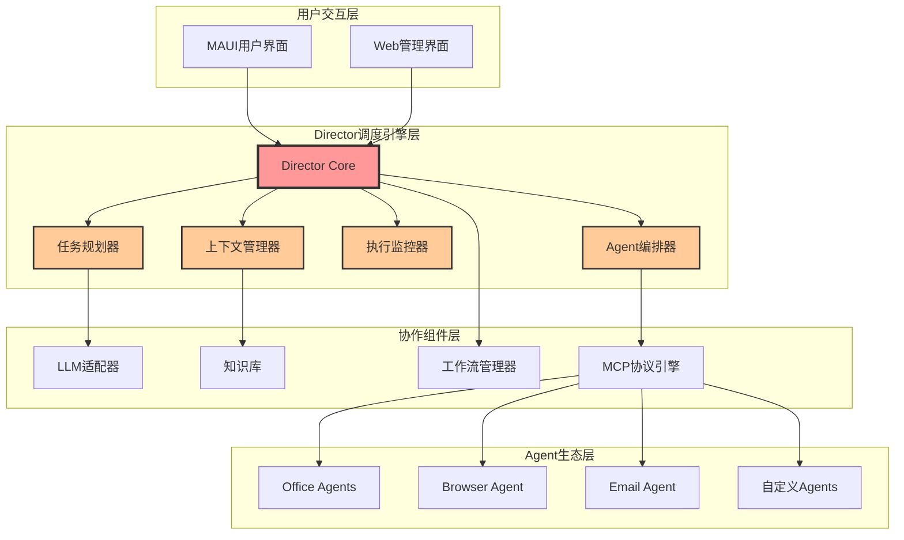

## 2. 系统架构设计

### 2.1 总体架构

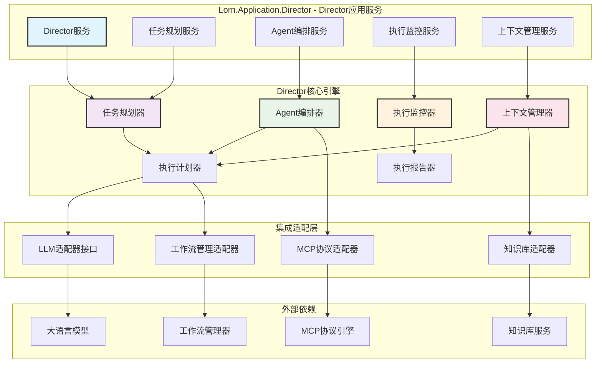

### 2.2 核心组件设计

#### 2.2.1 任务规划器 (Task Planner)

**组件职责**:

- 自然语言意图理解和解析
- 任务分解和执行步骤生成
- Agent能力匹配和选择策略
- 执行计划优化和调整

**核心接口设计**:

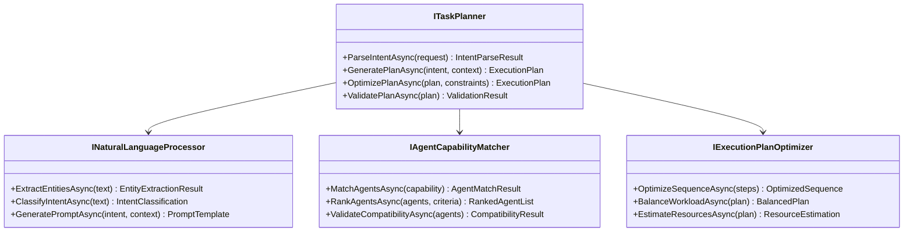

**实现位置**: `src/2.Application/Lorn.Application.Director/Planning/`

#### 2.2.2 Agent编排器 (Agent Orchestrator)

**组件职责**:

- Agent生命周期管理
- 任务分发和负载均衡
- Agent间协调和同步
- 故障检测和恢复处理

**核心接口设计**:

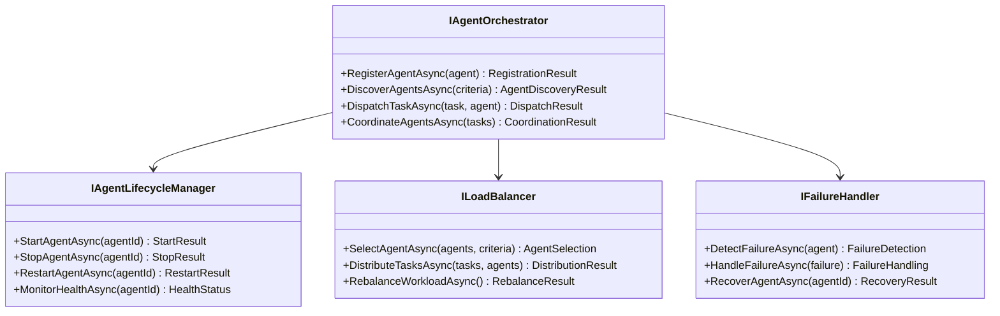

**实现位置**: `src/2.Application/Lorn.Application.Director/Orchestration/`

#### 2.2.3 执行监控器 (Execution Monitor)

**组件职责**:

- 实时监控任务执行状态
- 性能指标收集和分析
- 异常检测和报警机制
- 执行结果验证和汇总

**核心接口设计**:

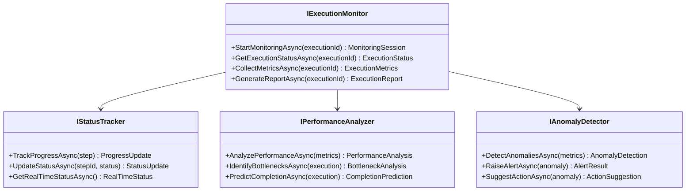

**实现位置**: `src/2.Application/Lorn.Application.Director/Monitoring/`

#### 2.2.4 上下文管理器 (Context Manager)

**组件职责**:

- 任务执行上下文维护
- 历史记录存储和检索
- 用户偏好和习惯学习
- 知识图谱构建和维护

**核心接口设计**:

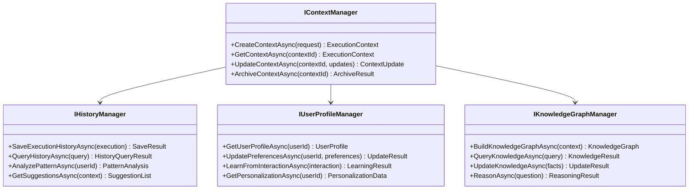

**实现位置**: `src/2.Application/Lorn.Application.Director/Context/`

## 3. 核心算法设计

### 3.1 智能任务规划算法

#### 3.1.1 意图理解算法

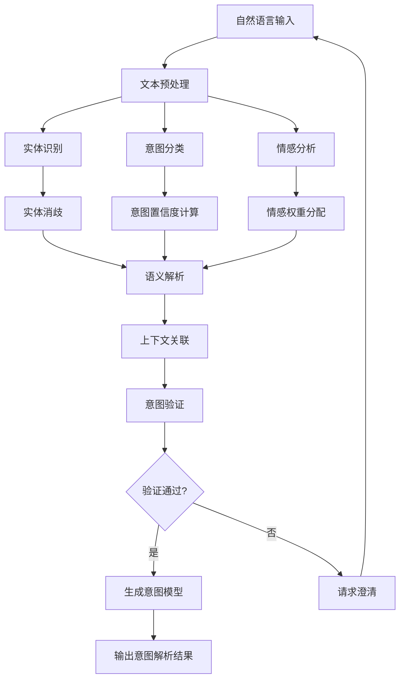

**算法实现要点**:

- 使用预训练的NLP模型进行实体识别
- 基于规则和机器学习的混合意图分类
- 上下文感知的意图消歧机制
- 多轮对话的意图继承和更新

#### 3.1.2 任务分解算法

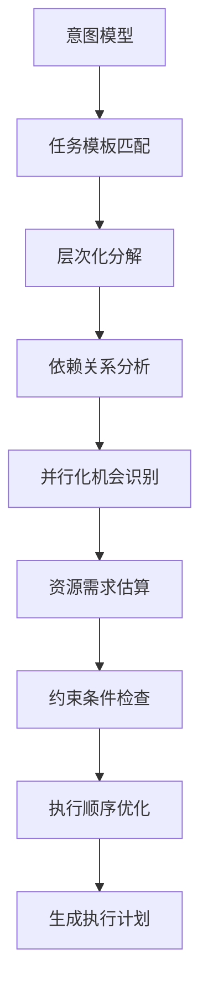

**算法核心逻辑**:

1. **模板匹配**: 基于历史成功案例匹配最佳实践模板
2. **递归分解**: 将复杂任务递归分解为原子操作
3. **依赖图构建**: 构建任务间的依赖关系图
4. **并行优化**: 识别可并行执行的任务分支
5. **资源评估**: 估算所需的Agent资源和执行时间

### 3.2 Agent编排调度算法

#### 3.2.1 Agent选择算法

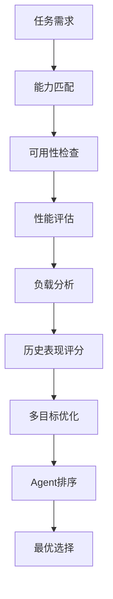

**选择策略**:

- **能力匹配度**: Agent功能与任务需求的匹配程度
- **当前负载**: Agent当前的工作负载情况
- **历史表现**: Agent在类似任务上的历史成功率
- **响应时间**: Agent的平均响应时间
- **可靠性指标**: Agent的稳定性和可用性

#### 3.2.2 负载均衡算法

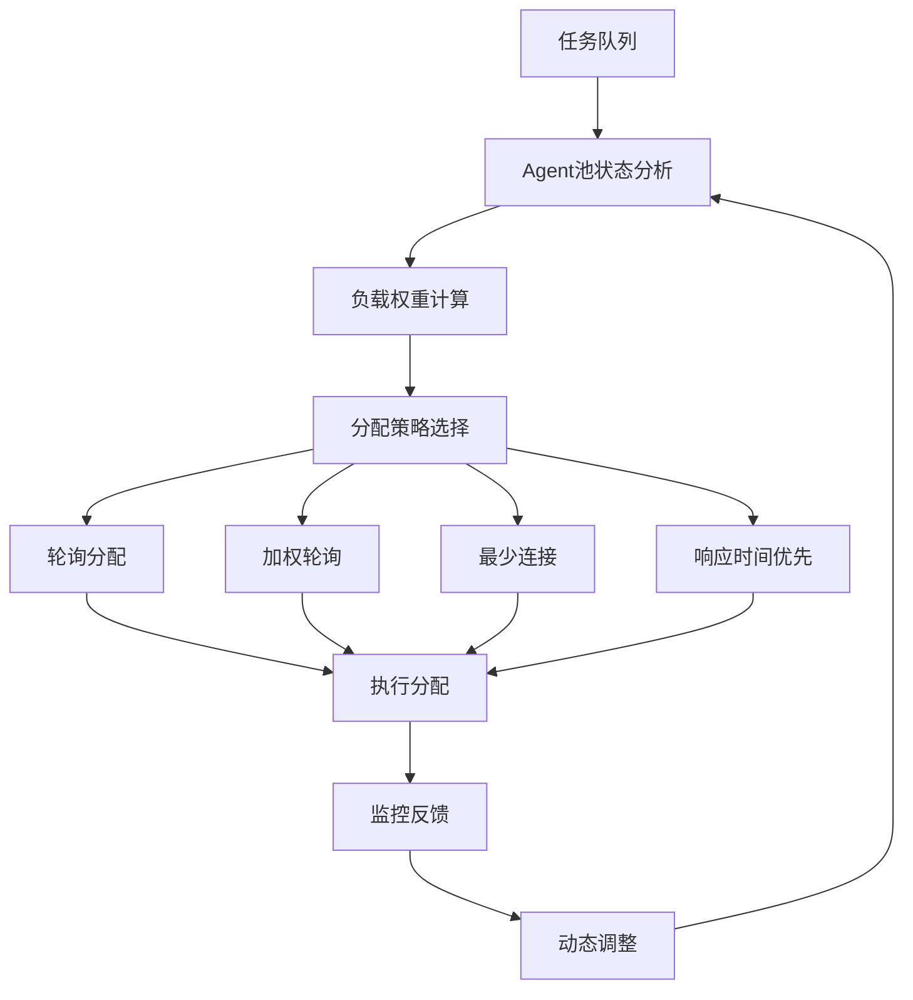

**负载均衡策略**:

- **轮询分配**: 简单轮询，适用于同质Agent
- **加权轮询**: 基于Agent能力的加权分配
- **最少连接**: 优先分配给空闲Agent
- **响应时间优先**: 基于历史响应时间的智能分配

### 3.3 执行监控算法

#### 3.3.1 异常检测算法

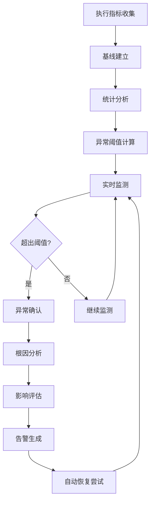

**异常检测指标**:

- **执行时间异常**: 任务执行时间显著偏离预期
- **错误率异常**: Agent执行错误率突然升高
- **资源消耗异常**: CPU、内存使用率异常
- **响应延迟异常**: Agent响应时间异常增长

#### 3.3.2 性能预测算法

基于历史执行数据和当前系统状态，预测任务完成时间和资源需求：

- **时间序列分析**: 基于历史执行时间进行趋势预测
- **机器学习模型**: 使用回归模型预测执行时间
- **资源建模**: 建立任务复杂度与资源需求的映射关系
- **实时调整**: 根据实际执行情况动态调整预测模型

## 4. 数据模型设计

### 4.1 核心实体模型

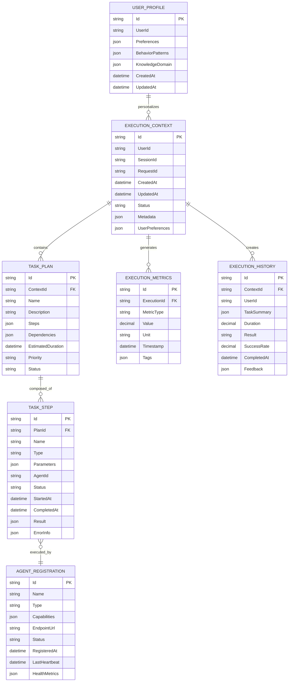

### 4.2 状态管理模型

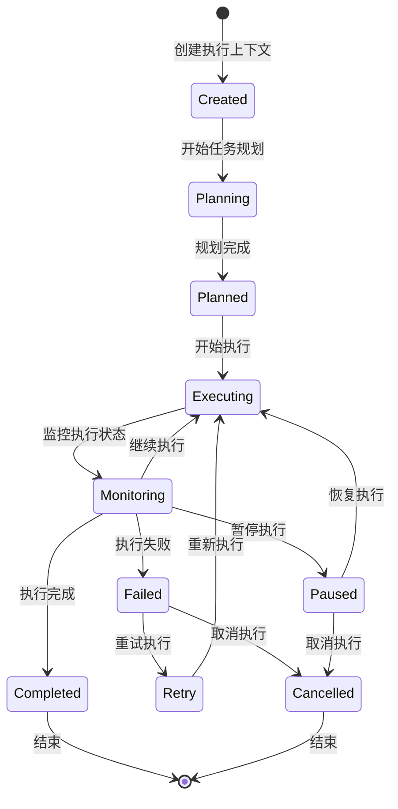

## 5. 接口设计

### 5.1 Director核心服务接口

#### 5.1.1 Director主服务接口

```csharp
namespace Lorn.Application.Director.Interfaces
{
    /// <summary>
    /// Director调度引擎核心服务接口
    /// </summary>
    public interface IDirectorService
    {
        /// <summary>
        /// 处理自然语言任务请求
        /// </summary>
        Task<ExecutionResult> ProcessNaturalLanguageTaskAsync(NaturalLanguageTaskRequest request);
        
        /// <summary>
        /// 执行工作流任务
        /// </summary>
        Task<ExecutionResult> ExecuteWorkflowTaskAsync(WorkflowTaskRequest request);
        
        /// <summary>
        /// 获取执行状态
        /// </summary>
        Task<ExecutionStatus> GetExecutionStatusAsync(string executionId);
        
        /// <summary>
        /// 暂停任务执行
        /// </summary>
        Task<bool> PauseExecutionAsync(string executionId);
        
        /// <summary>
        /// 恢复任务执行
        /// </summary>
        Task<bool> ResumeExecutionAsync(string executionId);
        
        /// <summary>
        /// 取消任务执行
        /// </summary>
        Task<bool> CancelExecutionAsync(string executionId);
        
        /// <summary>
        /// 获取执行历史
        /// </summary>
        Task<PagedResult<ExecutionHistory>> GetExecutionHistoryAsync(string userId, int page, int size);
    }
}
```

#### 5.1.2 任务规划服务接口

```csharp
namespace Lorn.Application.Director.Interfaces
{
    /// <summary>
    /// 任务规划服务接口
    /// </summary>
    public interface ITaskPlanningService
    {
        /// <summary>
        /// 解析自然语言意图
        /// </summary>
        Task<IntentParseResult> ParseIntentAsync(string naturalLanguageInput, ExecutionContext context);
        
        /// <summary>
        /// 生成执行计划
        /// </summary>
        Task<TaskPlan> GenerateExecutionPlanAsync(IntentParseResult intent, ExecutionContext context);
        
        /// <summary>
        /// 优化执行计划
        /// </summary>
        Task<TaskPlan> OptimizePlanAsync(TaskPlan plan, OptimizationCriteria criteria);
        
        /// <summary>
        /// 验证执行计划
        /// </summary>
        Task<ValidationResult> ValidatePlanAsync(TaskPlan plan);
        
        /// <summary>
        /// 获取计划建议
        /// </summary>
        Task<PlanSuggestion[]> GetPlanSuggestionsAsync(string partialInput, ExecutionContext context);
    }
}
```

#### 5.1.3 Agent编排服务接口

```csharp
namespace Lorn.Application.Director.Interfaces
{
    /// <summary>
    /// Agent编排服务接口
    /// </summary>
    public interface IAgentOrchestrationService
    {
        /// <summary>
        /// 发现可用Agent
        /// </summary>
        Task<AgentDiscoveryResult> DiscoverAvailableAgentsAsync(AgentCriteria criteria);
        
        /// <summary>
        /// 选择最优Agent
        /// </summary>
        Task<AgentSelection> SelectOptimalAgentAsync(TaskStep step, AgentCandidates candidates);
        
        /// <summary>
        /// 分发任务到Agent
        /// </summary>
        Task<TaskDispatchResult> DispatchTaskAsync(TaskStep step, Agent agent);
        
        /// <summary>
        /// 协调多Agent执行
        /// </summary>
        Task<CoordinationResult> CoordinateAgentExecutionAsync(TaskPlan plan);
        
        /// <summary>
        /// 处理Agent故障
        /// </summary>
        Task<FailoverResult> HandleAgentFailureAsync(string agentId, TaskStep currentStep);
        
        /// <summary>
        /// 获取Agent性能指标
        /// </summary>
        Task<AgentPerformanceMetrics> GetAgentPerformanceAsync(string agentId, TimeSpan period);
    }
}
```

### 5.2 监控和上下文管理接口

#### 5.2.1 执行监控服务接口

```csharp
namespace Lorn.Application.Director.Interfaces
{
    /// <summary>
    /// 执行监控服务接口
    /// </summary>
    public interface IExecutionMonitoringService
    {
        /// <summary>
        /// 开始监控执行
        /// </summary>
        Task<MonitoringSession> StartMonitoringAsync(string executionId);
        
        /// <summary>
        /// 获取实时执行状态
        /// </summary>
        Task<RealTimeExecutionStatus> GetRealTimeStatusAsync(string executionId);
        
        /// <summary>
        /// 收集执行指标
        /// </summary>
        Task<ExecutionMetrics> CollectExecutionMetricsAsync(string executionId);
        
        /// <summary>
        /// 检测执行异常
        /// </summary>
        Task<AnomalyDetectionResult> DetectAnomaliesAsync(string executionId);
        
        /// <summary>
        /// 生成执行报告
        /// </summary>
        Task<ExecutionReport> GenerateExecutionReportAsync(string executionId);
        
        /// <summary>
        /// 预测执行完成时间
        /// </summary>
        Task<CompletionPrediction> PredictCompletionTimeAsync(string executionId);
    }
}
```

#### 5.2.2 上下文管理服务接口

```csharp
namespace Lorn.Application.Director.Interfaces
{
    /// <summary>
    /// 上下文管理服务接口
    /// </summary>
    public interface IContextManagementService
    {
        /// <summary>
        /// 创建执行上下文
        /// </summary>
        Task<ExecutionContext> CreateExecutionContextAsync(CreateContextRequest request);
        
        /// <summary>
        /// 获取执行上下文
        /// </summary>
        Task<ExecutionContext> GetExecutionContextAsync(string contextId);
        
        /// <summary>
        /// 更新执行上下文
        /// </summary>
        Task<ExecutionContext> UpdateExecutionContextAsync(string contextId, ContextUpdate update);
        
        /// <summary>
        /// 获取用户历史偏好
        /// </summary>
        Task<UserPreferences> GetUserPreferencesAsync(string userId);
        
        /// <summary>
        /// 学习用户行为模式
        /// </summary>
        Task<LearningResult> LearnFromUserInteractionAsync(UserInteraction interaction);
        
        /// <summary>
        /// 获取个性化建议
        /// </summary>
        Task<PersonalizationSuggestion[]> GetPersonalizationSuggestionsAsync(string userId, string context);
    }
}
```

## 6. 执行流程设计

### 6.1 自然语言任务处理流程

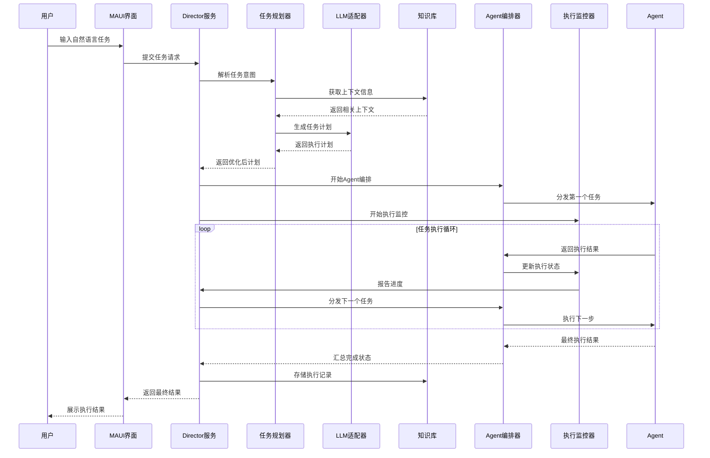

### 6.2 工作流任务处理流程

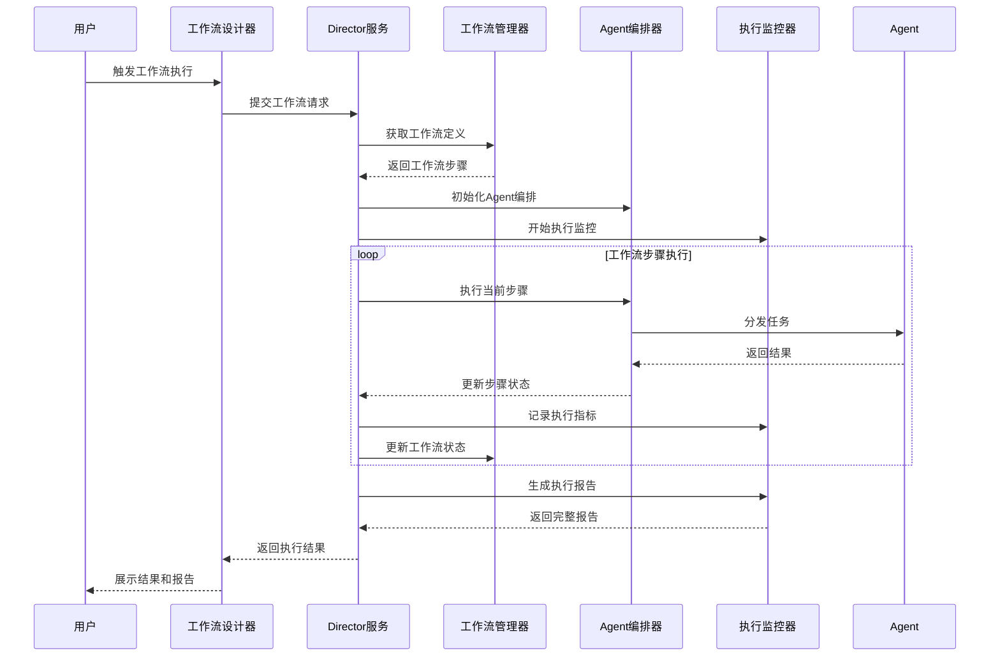

### 6.3 异常处理流程

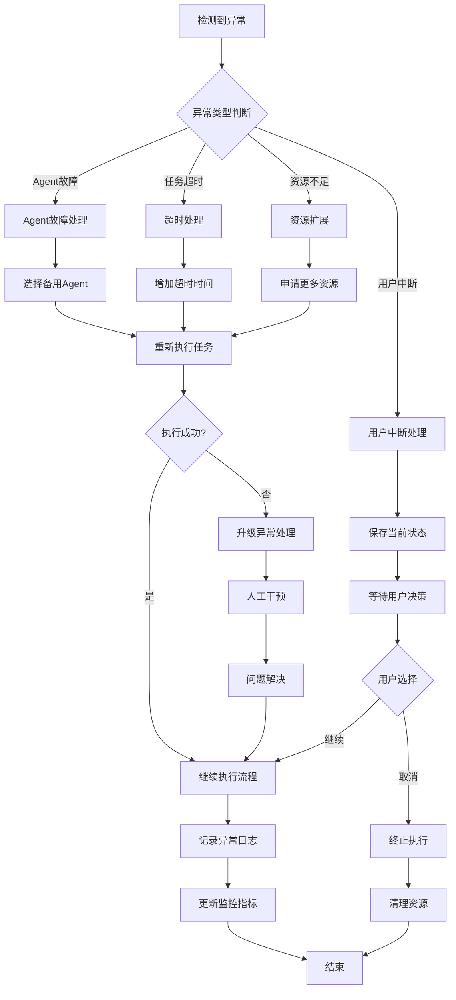

## 7. 性能优化设计

### 7.1 缓存策略

**多级缓存架构**:

- **L1缓存 (内存)**: 热点数据和频繁访问的计划模板
- **L2缓存 (Redis)**: 用户上下文和Agent状态信息
- **L3缓存 (数据库)**: 历史执行记录和统计数据

**缓存策略**:

- **任务计划缓存**: 缓存相似任务的执行计划模板
- **Agent能力缓存**: 缓存Agent能力描述和性能指标
- **用户偏好缓存**: 缓存用户个性化配置和行为模式
- **执行结果缓存**: 缓存可复用的执行结果

### 7.2 异步处理优化

**并发执行模型**:

- **任务级并发**: 支持多个独立任务同时执行
- **步骤级并发**: 任务内的并行步骤同时执行
- **Agent级并发**: 单个Agent处理多个轻量级任务

**异步通信优化**:

- **消息队列**: 使用消息队列解耦组件间通信
- **事件驱动**: 基于事件的异步状态更新机制
- **流式处理**: 支持大数据量的流式处理模式

### 7.3 资源管理优化

**动态资源分配**:

- **Agent池管理**: 动态调整Agent池大小
- **负载预测**: 基于历史数据预测资源需求
- **弹性扩缩**: 根据负载自动扩缩Agent实例

**内存优化**:

- **对象池**: 重用频繁创建的对象
- **延迟加载**: 按需加载大型数据对象
- **垃圾回收**: 优化.NET垃圾回收策略

## 8. 安全设计

### 8.1 访问控制

**身份认证**:

- **用户身份验证**: 集成企业身份系统
- **Agent身份验证**: 基于证书的Agent认证
- **会话管理**: 安全的会话令牌管理

**权限控制**:

- **细粒度权限**: 基于资源和操作的权限控制
- **角色管理**: 灵活的角色权限分配
- **动态授权**: 基于上下文的动态权限判断

### 8.2 数据保护

**敏感数据处理**:

- **数据加密**: 静态数据和传输数据加密
- **脱敏处理**: 日志和监控数据脱敏
- **访问审计**: 完整的数据访问审计日志

**隐私保护**:

- **数据最小化**: 只收集必要的用户数据
- **数据retention**: 合理的数据保留期限
- **用户控制**: 用户可控制个人数据使用

### 8.3 执行安全

**Agent沙箱**:

- **进程隔离**: Agent运行在隔离的进程环境
- **资源限制**: 限制Agent的系统资源使用
- **网络隔离**: 控制Agent的网络访问权限

**恶意行为防护**:

- **行为监控**: 监控Agent的异常行为
- **白名单机制**: 基于白名单的操作限制
- **实时阻断**: 检测到恶意行为时实时阻断

## 9. 监控和诊断

### 9.1 监控指标体系

**执行监控指标**:

- **任务成功率**: 任务执行成功的百分比
- **平均执行时间**: 任务执行的平均耗时
- **Agent利用率**: Agent资源的使用效率
- **并发执行数**: 同时执行的任务数量

**性能监控指标**:

- **响应时间**: API调用的响应时间分布
- **吞吐量**: 单位时间处理的任务数量
- **错误率**: 系统错误发生的频率
- **资源消耗**: CPU、内存、网络等资源使用情况

**业务监控指标**:

- **用户满意度**: 基于用户反馈的满意度评分
- **功能使用率**: 各功能模块的使用频率
- **问题解决率**: 问题自动解决的成功率

### 9.2 诊断工具

**执行追踪**:

- **分布式追踪**: 跨组件的请求追踪
- **执行时间线**: 详细的执行步骤时间线
- **依赖关系图**: 任务和Agent的依赖关系可视化

**性能分析**:

- **瓶颈识别**: 自动识别系统性能瓶颈
- **热点分析**: 分析系统的性能热点
- **容量规划**: 基于历史数据进行容量规划

## 10. 部署指导

### 10.1 项目结构

**应用层项目 (Lorn.Application.Director)**:

- 位置: `src/2.Application/Lorn.Application.Director/`
- 类型: Class Library (.NET 9)
- 依赖: Lorn.Domain.Core, Lorn.Domain.MCP, Lorn.Domain.LLM
- 职责: Director调度引擎的业务逻辑实现

**项目目录结构**:

```text
Lorn.Application.Director/
├── Interfaces/                 # 服务接口定义
│   ├── IDirectorService.cs
│   ├── ITaskPlanningService.cs
│   ├── IAgentOrchestrationService.cs
│   ├── IExecutionMonitoringService.cs
│   └── IContextManagementService.cs
├── Services/                   # 服务实现
│   ├── DirectorService.cs
│   ├── TaskPlanningService.cs
│   ├── AgentOrchestrationService.cs
│   ├── ExecutionMonitoringService.cs
│   └── ContextManagementService.cs
├── Planning/                   # 任务规划相关
│   ├── TaskPlanner.cs
│   ├── IntentParser.cs
│   ├── PlanOptimizer.cs
│   └── CapabilityMatcher.cs
├── Orchestration/             # Agent编排相关
│   ├── AgentOrchestrator.cs
│   ├── LoadBalancer.cs
│   ├── FailureHandler.cs
│   └── LifecycleManager.cs
├── Monitoring/                # 执行监控相关
│   ├── ExecutionMonitor.cs
│   ├── PerformanceAnalyzer.cs
│   ├── AnomalyDetector.cs
│   └── MetricsCollector.cs
├── Context/                   # 上下文管理相关
│   ├── ContextManager.cs
│   ├── HistoryManager.cs
│   ├── UserProfileManager.cs
│   └── KnowledgeGraphManager.cs
├── Models/                    # 数据模型
│   ├── Requests/
│   ├── Results/
│   ├── Entities/
│   └── DTOs/
└── Extensions/                # 扩展方法
    └── ServiceCollectionExtensions.cs
```

### 10.2 配置要求

**NuGet包依赖**:

```xml
<!-- Microsoft Semantic Kernel -->
<PackageReference Include="Microsoft.SemanticKernel" Version="1.x" />
<PackageReference Include="Microsoft.SemanticKernel.Agents" Version="1.x" />

<!-- 依赖注入和配置 -->
<PackageReference Include="Microsoft.Extensions.DependencyInjection" Version="9.0" />
<PackageReference Include="Microsoft.Extensions.Configuration" Version="9.0" />
<PackageReference Include="Microsoft.Extensions.Logging" Version="9.0" />

<!-- HTTP和通信 -->
<PackageReference Include="Microsoft.Extensions.Http" Version="9.0" />
<PackageReference Include="System.Text.Json" Version="9.0" />

<!-- 缓存和性能 -->
<PackageReference Include="Microsoft.Extensions.Caching.Memory" Version="9.0" />
<PackageReference Include="Microsoft.Extensions.Caching.StackExchangeRedis" Version="9.0" />

<!-- 监控和诊断 -->
<PackageReference Include="System.Diagnostics.DiagnosticSource" Version="9.0" />
<PackageReference Include="Microsoft.Extensions.Diagnostics.HealthChecks" Version="9.0" />
```

**配置文件示例**:

```json
{
  "Director": {
    "MaxConcurrentExecutions": 10,
    "DefaultTimeout": "00:30:00",
    "EnablePerformanceMonitoring": true,
    "EnableAnomalyDetection": true
  },
  "TaskPlanning": {
    "EnableIntelligentCaching": true,
    "PlanOptimizationEnabled": true,
    "MaxPlanningTime": "00:02:00",
    "UseHistoricalOptimization": true
  },
  "AgentOrchestration": {
    "LoadBalancingStrategy": "WeightedRoundRobin",
    "HealthCheckInterval": "00:00:30",
    "FailoverTimeout": "00:01:00",
    "MaxRetryAttempts": 3
  },
  "ExecutionMonitoring": {
    "MetricsCollectionInterval": "00:00:10",
    "AnomalyDetectionThreshold": 2.0,
    "PerformanceReportingEnabled": true,
    "RealTimeMonitoringEnabled": true
  },
  "ContextManagement": {
    "EnableUserLearning": true,
    "ContextRetentionPeriod": "30.00:00:00",
    "EnableKnowledgeGraph": true,
    "PersonalizationLevel": "High"
  }
}
```

### 10.3 启动配置

**依赖注入配置**:

- 位置: `src/2.Application/Lorn.Application.Director/Extensions/ServiceCollectionExtensions.cs`
- 注册Semantic Kernel服务和Director核心组件
- 配置缓存和健康检查
- 设置性能监控和诊断

**初始化流程**:

1. 注册Semantic Kernel服务
2. 配置LLM适配器连接
3. 初始化Agent发现和注册
4. 启动执行监控服务
5. 加载用户配置和历史数据
6. 开始健康检查和性能监控

这个技术设计文档为开发团队提供了Director调度引擎的完整实现指导，包括架构设计、算法实现、接口定义、数据模型等各个方面的详细说明。开发人员可以按照这个设计在指定的项目位置实现相应的功能模块。
