# LLM适配器技术设计文档

## 文档信息

- **文档版本**: v1.0
- **创建日期**: 2025年7月4日
- **更新日期**: 2025年7月4日
- **作者**: 技术专家
- **文档类型**: 详细技术设计

## 1. 概述

### 1.1 设计目标

LLM适配器作为Lorn.OpenAgenticAI系统的核心组件，位于`3.Domain/Lorn.OpenAgenticAI.Domain.LLM/`项目中，基于Microsoft.SemanticKernel框架构建，负责业务层面的LLM服务管理和调度。其主要设计目标包括：

- **SemanticKernel集成**: 基于Microsoft.SemanticKernel构建，复用其成熟的LLM抽象层
- **业务逻辑封装**: 在SemanticKernel基础上添加业务特定的模型管理和调度逻辑
- **智能调度**: 实现模型选择、负载均衡和故障转移等高级功能
- **性能优化**: 请求缓存、指标监控和异步处理
- **配置管理**: 统一的模型配置、API密钥管理和权限控制
- **可扩展性**: 支持自定义模型提供商和业务规则扩展

### 1.2 技术架构位置

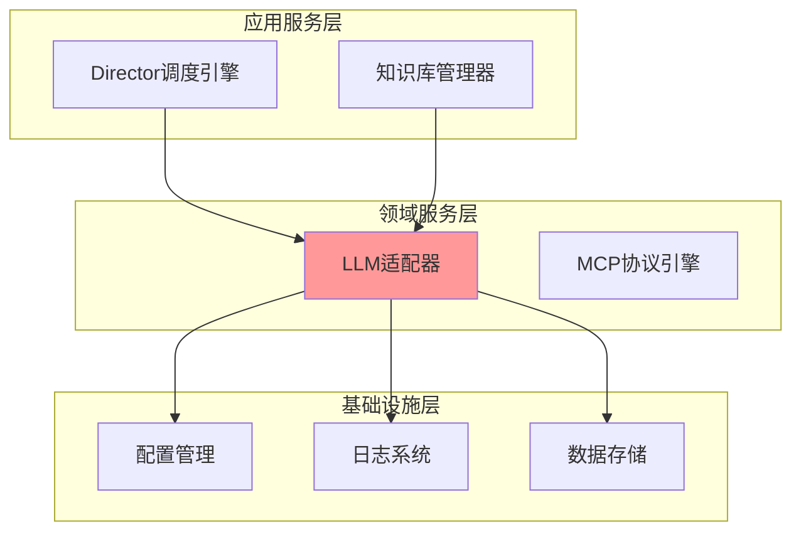

### 1.3 核心职责

- **Kernel管理**: 管理SemanticKernel实例的生命周期和配置
- **服务协调**: 协调多个IChatCompletionService实例进行智能调度
- **业务逻辑**: 实现业务特定的模型选择、缓存和监控逻辑
- **配置管理**: 统一管理不同LLM提供商的配置和密钥
- **性能监控**: 监控模型调用性能、成本和可用性
- **扩展支持**: 支持自定义模型提供商和业务规则

## 2. 系统架构设计

### 2.1 整体架构图

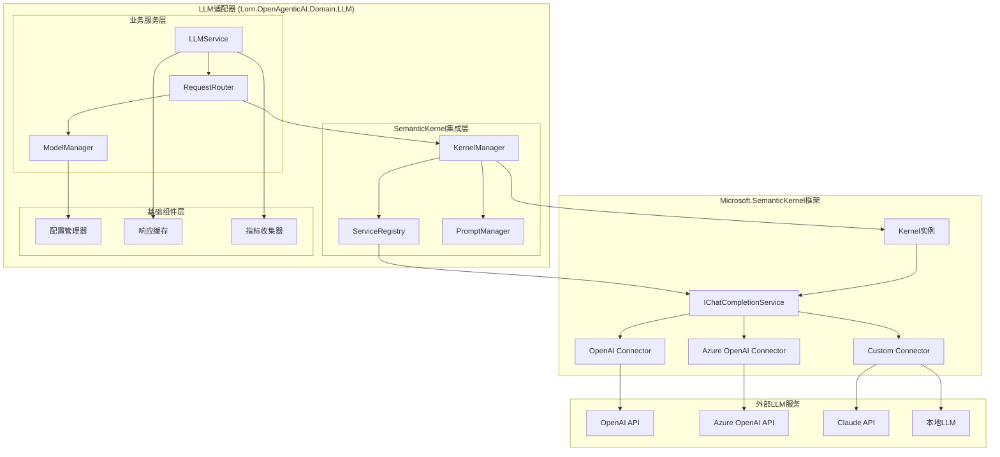

### 2.2 分层设计

#### 2.2.1 业务服务层

在SemanticKernel基础上实现业务特定的LLM服务逻辑，包括智能调度、缓存管理和监控。

#### 2.2.2 SemanticKernel集成层

封装SemanticKernel的核心组件，提供统一的Kernel管理、服务注册和Prompt管理功能。

#### 2.2.3 基础组件层

提供通用的基础设施服务，如配置管理、缓存、监控等，支撑上层业务逻辑。

#### 2.2.4 Microsoft.SemanticKernel框架层

直接使用SemanticKernel提供的成熟LLM抽象和连接器，无需重复实现。

### 2.3 数据流设计

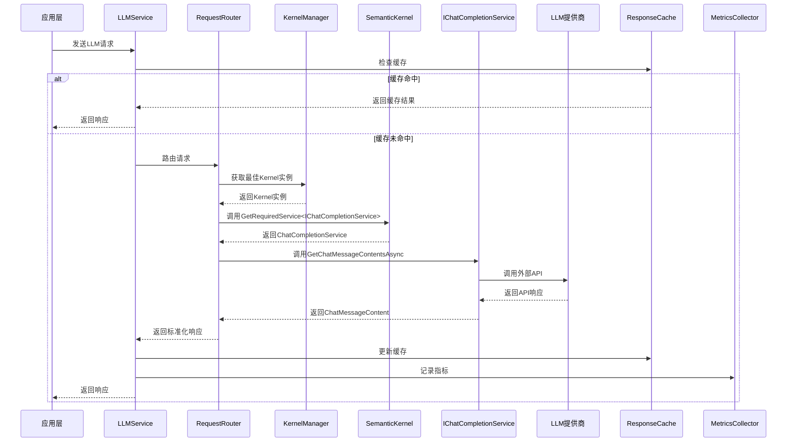

## 3. 核心组件详细设计

### 3.1 基于SemanticKernel的核心接口类图

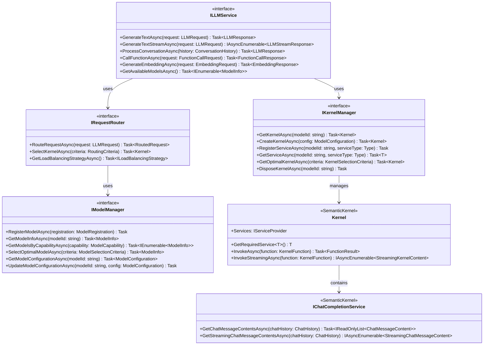

**接口职责说明**：

#### 3.1.1 ILLMService (位置: Lorn.OpenAgenticAI.Shared.Contracts/)

- **核心职责**: 提供统一的LLM服务接口，封装SemanticKernel复杂性
- **主要方法**: 基于SemanticKernel的文本生成、流式响应、对话处理、函数调用
- **设计要点**: 复用SemanticKernel的ChatHistory和ChatMessageContent等成熟抽象

#### 3.1.2 IKernelManager (位置: Lorn.OpenAgenticAI.Shared.Contracts/)

- **核心职责**: 管理SemanticKernel实例的生命周期和服务注册
- **主要功能**: Kernel创建、服务注册、智能选择、资源管理
- **设计要点**: 封装SemanticKernel的复杂初始化逻辑，提供简单易用的管理接口

#### 3.1.3 IModelManager (位置: Lorn.OpenAgenticAI.Shared.Contracts/)

- **核心职责**: 管理模型元数据和配置，配合SemanticKernel进行模型管理
- **主要功能**: 模型注册、发现、选择、配置管理
- **设计要点**: 专注于业务层面的模型管理，技术层面交给SemanticKernel

### 3.2 基于SemanticKernel的核心数据模型类图

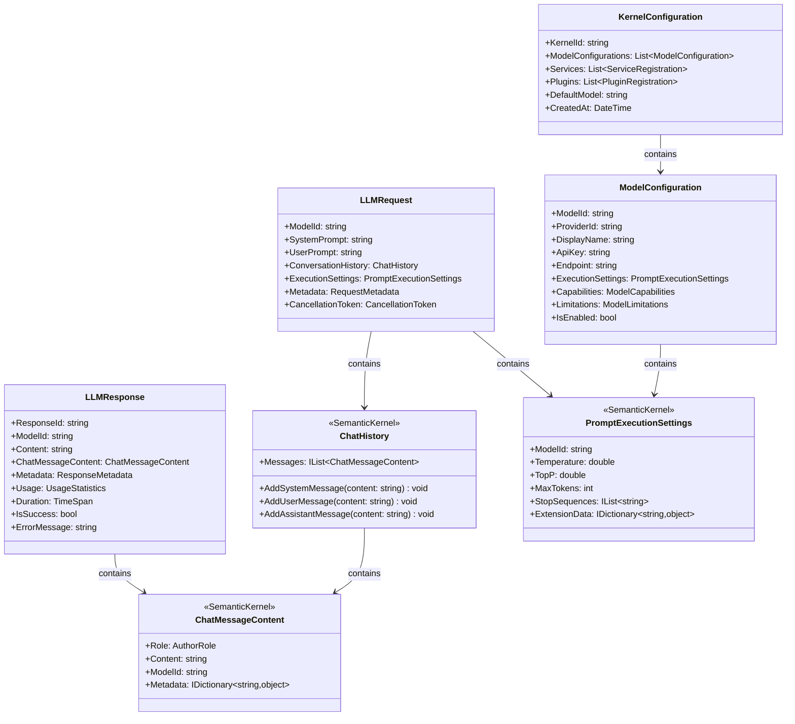

**数据模型设计说明**：

#### 3.2.1 请求响应模型 (位置: Lorn.OpenAgenticAI.Shared.Models/LLM/)

**LLMRequest**:

- **设计目标**: 在SemanticKernel ChatHistory基础上添加业务元数据
- **关键属性**: 复用ChatHistory对象、集成PromptExecutionSettings
- **扩展性**: 通过Metadata提供业务特定信息，无需修改SemanticKernel核心结构

**LLMResponse**:

- **设计目标**: 封装SemanticKernel的ChatMessageContent，添加业务统计信息
- **核心信息**: 保留原始ChatMessageContent、添加使用统计和性能指标
- **错误处理**: 统一的错误处理机制，兼容SemanticKernel异常体系

#### 3.2.2 配置管理模型 (位置: Lorn.OpenAgenticAI.Shared.Models/LLM/)

**ModelConfiguration**:

- **设计目标**: 管理SemanticKernel服务注册所需的配置信息
- **核心配置**: 集成PromptExecutionSettings、API密钥、终端地址
- **业务扩展**: ModelCapabilities和ModelLimitations提供业务层面的模型描述

**KernelConfiguration**:

- **设计目标**: 管理完整的Kernel实例配置，支持多模型和多服务
- **配置内容**: 模型配置集合、服务注册列表、插件配置
- **生命周期**: 支持配置版本管理和动态更新

### 3.3 基于SemanticKernel的服务管理层组件图

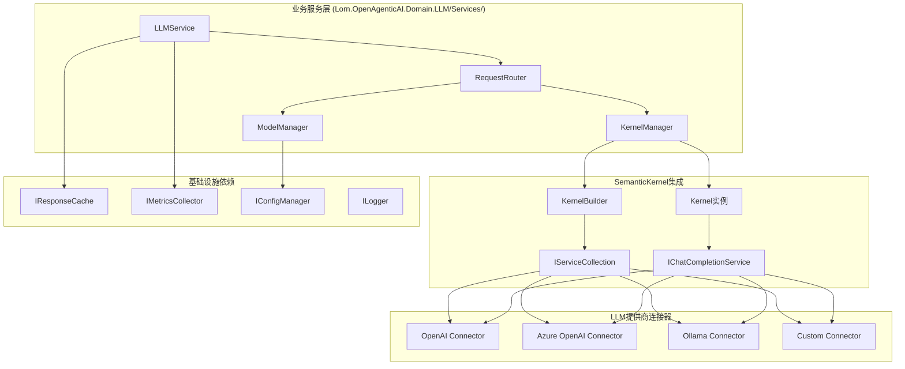

#### 3.3.1 LLMService 基于SemanticKernel的业务流程图

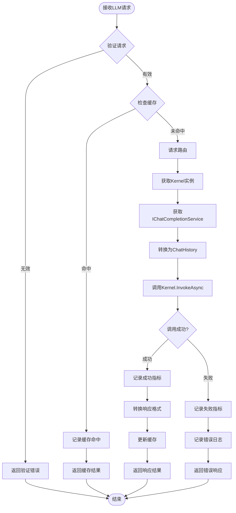

**LLMService设计说明** (位置: Lorn.OpenAgenticAI.Domain.LLM/Services/LLMService.cs):

- **核心职责**: 基于SemanticKernel提供统一的LLM服务接口
- **处理流程**: 请求验证 → 缓存检查 → 路由到Kernel → 调用IChatCompletionService → 响应处理
- **关键特性**:
  - 利用SemanticKernel的ChatHistory和ChatMessageContent进行标准化处理
  - 集成SemanticKernel的异常处理机制
  - 保持业务层面的缓存和监控功能

#### 3.3.2 KernelManager 生命周期管理图

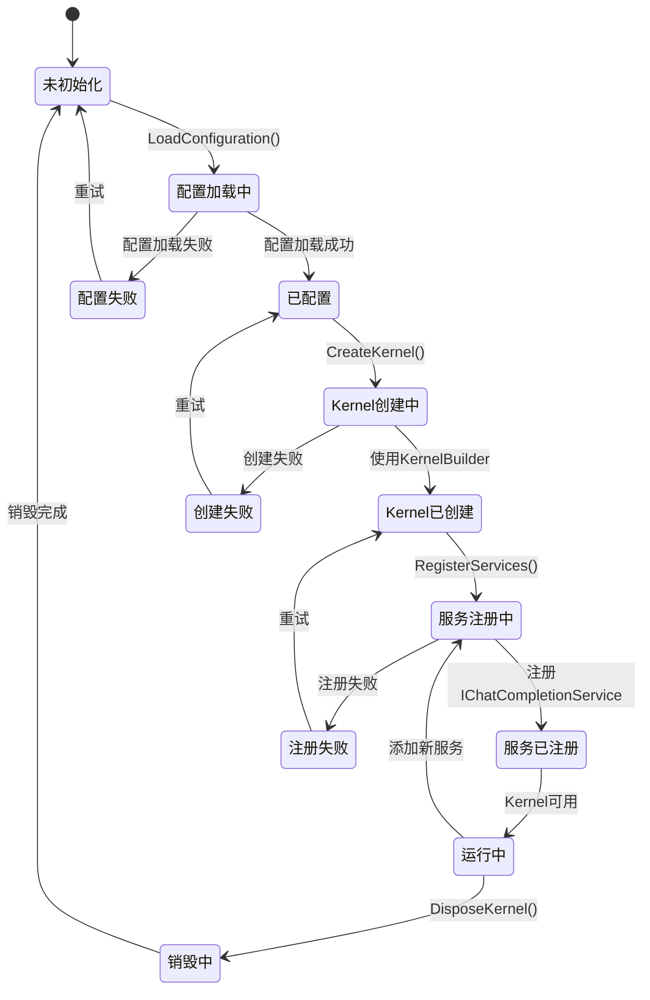

**KernelManager设计说明** (位置: Lorn.OpenAgenticAI.Domain.LLM/Services/KernelManager.cs):

- **核心职责**: 管理SemanticKernel实例的完整生命周期
- **状态管理**: 配置加载 → Kernel创建 → 服务注册 → 运行 → 销毁的完整状态机
- **关键特性**:
  - 基于SemanticKernel的KernelBuilder进行标准化构建
  - 动态服务注册，支持IChatCompletionService、ITextEmbeddingGenerationService等
  - 智能Kernel选择和负载均衡
  - 完整的资源管理和清理机制

#### 3.3.3 RequestRouter 基于SemanticKernel的路由策略图

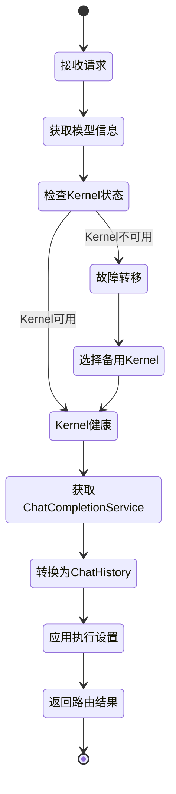

**RequestRouter设计说明** (位置: Lorn.OpenAgenticAI.Domain.LLM/Services/RequestRouter.cs):

- **核心职责**: 智能路由请求到最优的Kernel实例和ChatCompletionService
- **路由策略**: Kernel健康检查 → 服务获取 → 请求转换 → 执行设置应用
- **关键特性**:
  - 基于SemanticKernel的服务发现机制
  - 利用Kernel的内置服务管理
  - 智能的ChatHistory构建和PromptExecutionSettings应用
  - 故障转移到备用Kernel实例

### 3.4 基于SemanticKernel连接器的设计

#### 3.4.1 连接器集成关系图

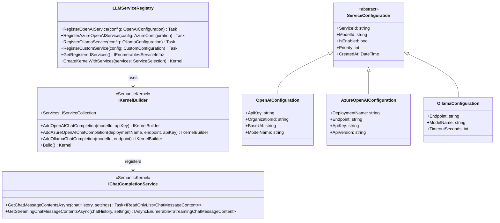

#### 3.4.2 连接器配置和使用时序图

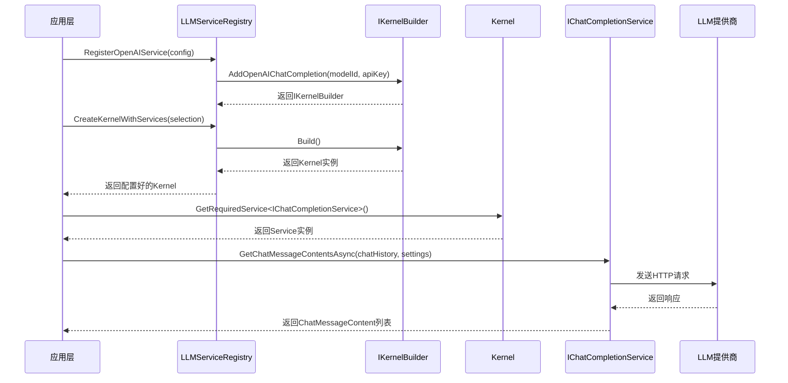

**基于SemanticKernel连接器的设计说明**：

#### 3.4.3 LLMServiceRegistry (位置: Lorn.OpenAgenticAI.Domain.LLM/Services/LLMServiceRegistry.cs)

- **职责**: 封装SemanticKernel的服务注册复杂性，提供业务友好的注册接口
- **特殊处理**:
  - 统一的配置验证和错误处理
  - 支持多个同类型服务的注册（如多个OpenAI配置）
  - 服务优先级和负载均衡策略

#### 3.4.4 配置管理 (位置: Lorn.OpenAgenticAI.Domain.LLM/Configuration/)

- **OpenAIConfiguration**: 封装OpenAI API的配置参数
- **AzureOpenAIConfiguration**: 封装Azure OpenAI服务的配置参数  
- **OllamaConfiguration**: 封装本地Ollama服务的配置参数
- **CustomConfiguration**: 支持自定义LLM提供商的配置扩展

**简化设计的优势**:

1. **减少重复工作**: 无需重复实现HTTP客户端、连接管理等基础功能
2. **提高稳定性**: 基于Microsoft维护的成熟框架，减少Bug和安全风险
3. **更好的兼容性**: 自动跟进LLM提供商的API变化和新功能
4. **统一的抽象**: 使用SemanticKernel标准的ChatHistory、ChatMessageContent等抽象
5. **专注业务逻辑**: 将精力集中在业务特定的功能如路由、缓存、监控等

### 3.5 基础组件层设计

#### 3.5.1 基础组件架构图

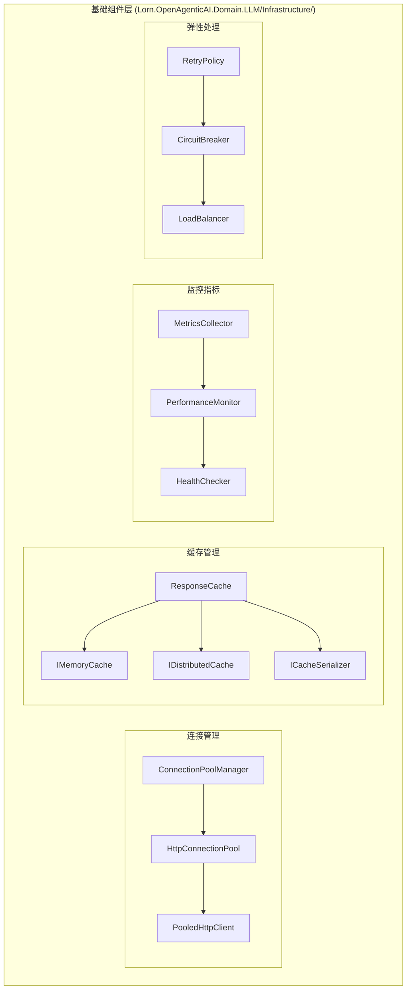

#### 3.5.2 连接池状态图

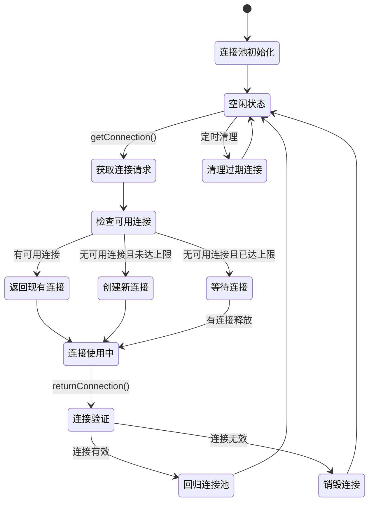

**连接池管理设计说明** (位置: Lorn.OpenAgenticAI.Domain.LLM/Infrastructure/ConnectionPoolManager.cs):

- **设计目标**: 高效管理HTTP连接，避免连接创建开销
- **核心特性**:
  - 支持多提供商的连接池隔离
  - 智能连接复用和生命周期管理
  - 连接健康检查和自动清理
  - 并发安全的连接分配机制

#### 3.5.3 缓存策略流程图

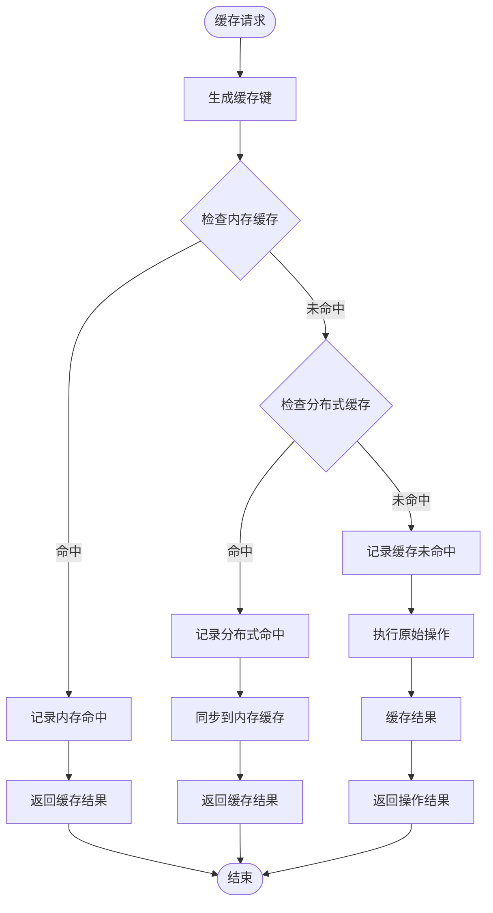

**响应缓存设计说明** (位置: Lorn.OpenAgenticAI.Domain.LLM/Infrastructure/ResponseCache.cs):

- **设计目标**: 提供多级缓存策略，最大化响应性能
- **缓存策略**:
  - L1缓存: 内存缓存，响应最快但容量有限
  - L2缓存: 分布式缓存，支持集群共享
  - 智能失效: 基于内容和时间的智能失效策略

#### 3.5.4 指标收集器组件图

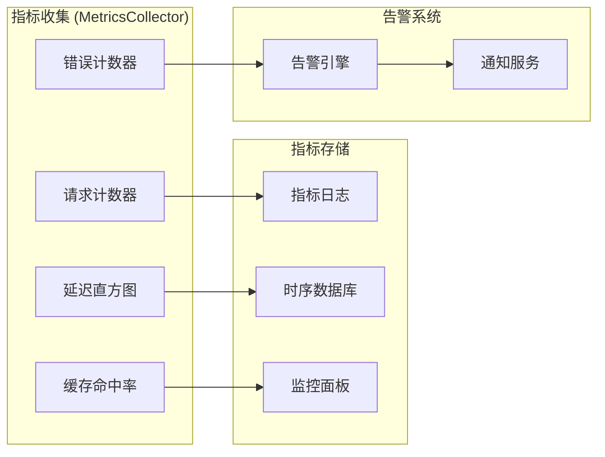

**指标收集器设计说明** (位置: Lorn.OpenAgenticAI.Domain.LLM/Infrastructure/MetricsCollector.cs):

- **设计目标**: 全面收集系统运行指标，支持性能监控和问题诊断
- **关键指标**:
  - 请求量指标: QPS、成功率、错误率
  - 性能指标: 响应时间、吞吐量、资源使用率
  - 业务指标: 成本统计、模型使用分布、用户行为

#### 3.5.5 熔断器状态转换图

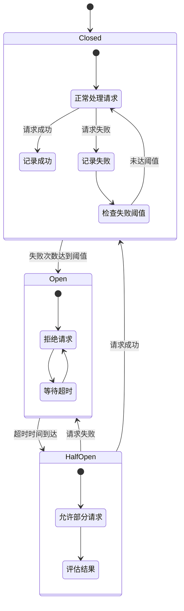

**熔断器设计说明** (位置: Lorn.OpenAgenticAI.Domain.LLM/Resilience/CircuitBreaker.cs):

- **设计目标**: 防止级联故障，提供快速失败机制
- **状态管理**: 关闭 → 开启 → 半开启的标准熔断器状态机
- **配置参数**: 失败阈值、超时时间、半开启测试频率

## 4. 配置管理设计

### 4.1 配置文件结构设计

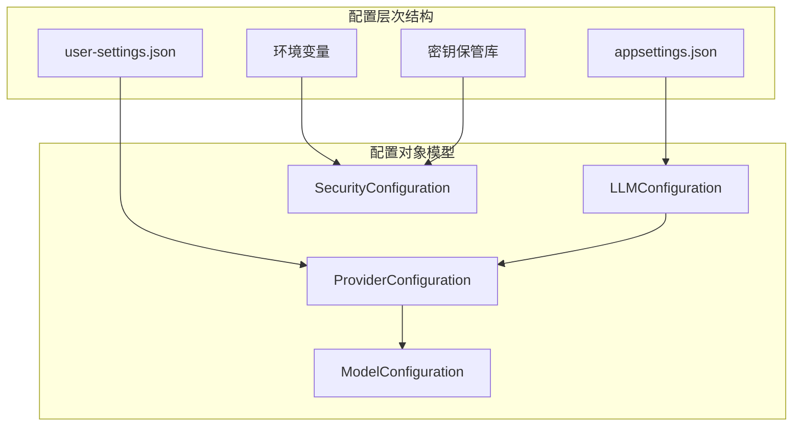

### 4.2 配置优先级策略

**配置加载优先级**（从高到低）：

1. **环境变量**: 用于敏感信息如API密钥
2. **用户配置文件**: 用户个性化设置
3. **应用配置文件**: 系统默认配置
4. **代码默认值**: 最终兜底配置

### 4.3 配置类层次结构

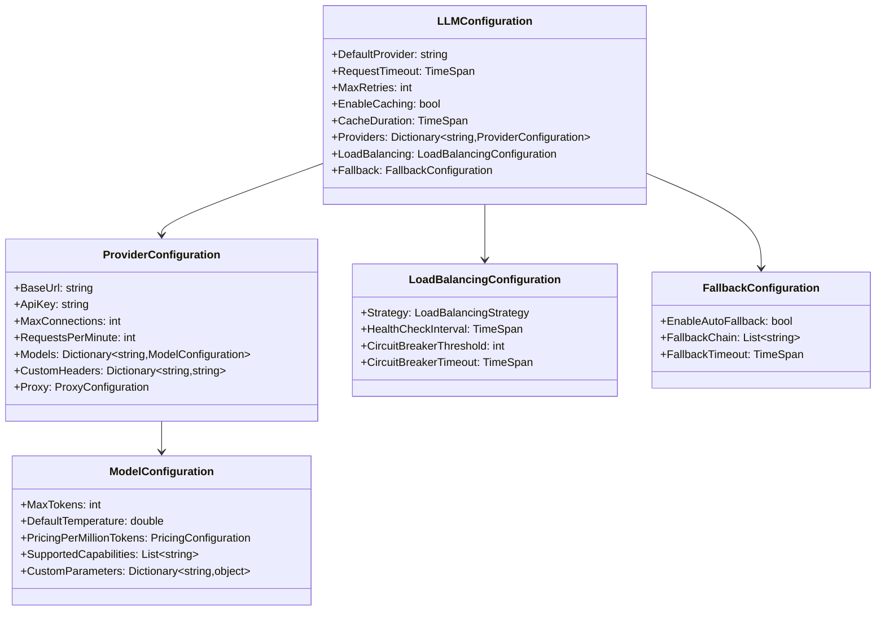

### 4.4 配置验证流程

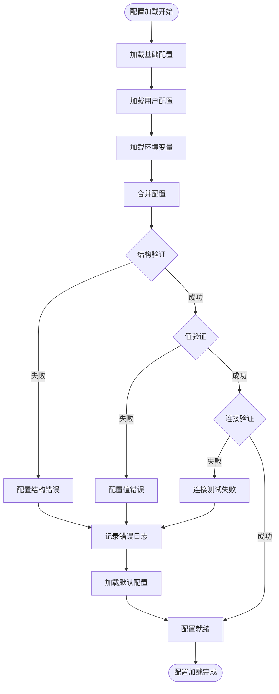

**配置验证规则**：

- **结构验证**: 必填字段、数据类型、枚举值检查
- **值验证**: 数值范围、URL格式、超时时间合理性
- **连接验证**: API密钥有效性、网络连通性测试
- **依赖验证**: 模型与提供商对应关系、能力匹配检查

## 4. 简化设计总结

### 4.1 基于SemanticKernel的设计优势

通过采用Microsoft.SemanticKernel作为底层LLM框架，我们的LLM适配器设计得到了显著简化：

#### 4.1.1 技术优势

- **成熟稳定**: SemanticKernel是Microsoft官方维护的成熟AI框架
- **持续更新**: 自动跟进最新的LLM API变化和新功能支持
- **深度集成**: 与.NET生态系统完美集成，遵循.NET最佳实践
- **标准化抽象**: 提供统一的ChatHistory、ChatMessageContent等标准抽象

#### 4.1.2 开发效率提升

- **减少重复工作**: 无需重复实现HTTP客户端、连接管理、协议适配等基础功能
- **专注业务逻辑**: 将开发精力集中在业务特定功能（路由、缓存、监控等）
- **降低维护成本**: 减少自研代码量，降低长期维护负担
- **提高代码质量**: 基于经过大规模验证的开源框架

#### 4.1.3 功能覆盖

SemanticKernel已支持的LLM提供商：
- **OpenAI**: GPT-3.5、GPT-4、GPT-4o等全系列模型
- **Azure OpenAI**: 企业级OpenAI服务
- **Ollama**: 本地开源LLM部署方案
- **其他**: HuggingFace、Google AI等多种提供商

### 4.2 简化后的架构对比

#### 4.2.1 原设计复杂度

原始设计包含大量自研组件：
- 自研的提供商适配器层（OpenAIAdapter、ClaudeAdapter等）
- 自研的HTTP客户端管理和连接池
- 自研的请求响应格式转换
- 自研的流式响应处理
- 自研的错误处理和重试机制

#### 4.2.2 简化后的设计

基于SemanticKernel的简化设计：
- **利用现有**: 直接使用SemanticKernel的连接器
- **业务封装**: 在业务层面封装模型管理、路由、缓存等逻辑
- **配置管理**: 统一管理不同LLM提供商的配置
- **监控增强**: 专注于业务监控和性能优化

### 4.3 保留的核心价值

虽然底层实现简化了，但我们仍然保留了系统的核心业务价值：

#### 4.3.1 智能调度

- **模型选择**: 根据任务特性选择最适合的模型
- **负载均衡**: 在多个模型实例间分发请求
- **故障转移**: 自动切换到备用模型
- **成本优化**: 基于成本和性能的智能路由

#### 4.3.2 性能优化

- **多级缓存**: 内存缓存 + 分布式缓存
- **异步处理**: 全异步调用链，提升并发能力
- **连接复用**: 基于SemanticKernel的连接管理
- **流式响应**: 支持大模型的流式输出

#### 4.3.3 企业级特性

- **配置管理**: 集中化的模型配置和密钥管理
- **监控告警**: 完整的性能监控和健康检查
- **安全控制**: API密钥安全存储和权限控制
- **审计日志**: 完整的操作审计和追踪

### 4.4 后续实施计划

#### 4.4.1 第一阶段：核心框架

1. **搭建基础框架**: 基于SemanticKernel搭建核心LLM服务框架
2. **实现基础服务**: LLMService、KernelManager、ModelManager等核心服务
3. **配置管理**: 实现统一的模型配置和服务注册机制
4. **基础测试**: 单元测试和集成测试，验证核心功能

#### 4.4.2 第二阶段：业务增强

1. **智能路由**: 实现RequestRouter的智能调度逻辑
2. **缓存系统**: 实现多级缓存和智能失效策略
3. **监控系统**: 实现指标收集、性能监控和健康检查
4. **错误处理**: 完善异常处理和故障恢复机制

#### 4.4.3 第三阶段：企业级特性

1. **高级路由**: 基于成本、延迟、质量的智能路由算法
2. **扩展支持**: 支持自定义模型提供商和业务规则
3. **管理界面**: Web管理界面，支持可视化配置和监控
4. **部署优化**: 容器化部署和集群管理支持

### 4.5 技术风险评估

#### 4.5.1 依赖风险

- **框架依赖**: 对SemanticKernel的依赖，需关注版本兼容性
- **缓解措施**: 定期更新、版本锁定、渐进升级策略

#### 4.5.2 兼容性风险

- **API变化**: LLM提供商API可能发生变化
- **缓解措施**: SemanticKernel团队维护适配器，降低直接影响

#### 4.5.3 性能风险

- **抽象开销**: 多层抽象可能带来性能开销
- **缓解措施**: 性能测试验证、必要时进行针对性优化

## 5. 结论

基于Microsoft.SemanticKernel的LLM适配器设计方案显著简化了系统复杂度，提高了开发效率，同时保持了企业级应用所需的核心功能。这种设计充分体现了"站在巨人肩膀上"的工程智慧，让我们能够专注于业务价值的实现，而不是重复造轮子。

通过这种简化设计，我们可以：
1. **快速启动**: 基于成熟框架快速搭建原型
2. **稳定可靠**: 基于经过验证的开源项目
3. **持续演进**: 跟随SemanticKernel的发展持续改进
4. **专注创新**: 将精力集中在业务特色功能的开发上

---

*本设计文档将根据SemanticKernel框架的演进和项目实际需求持续更新。*
