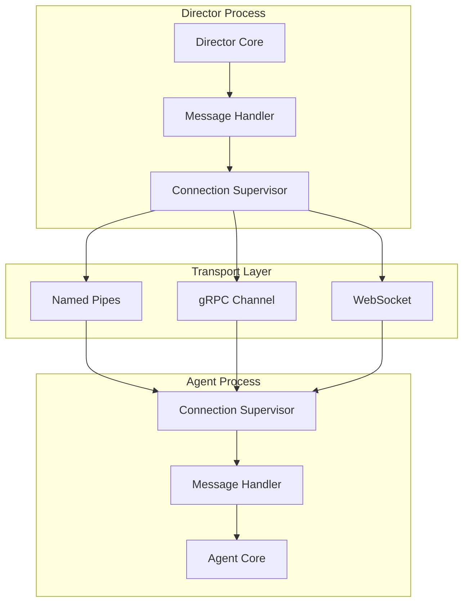
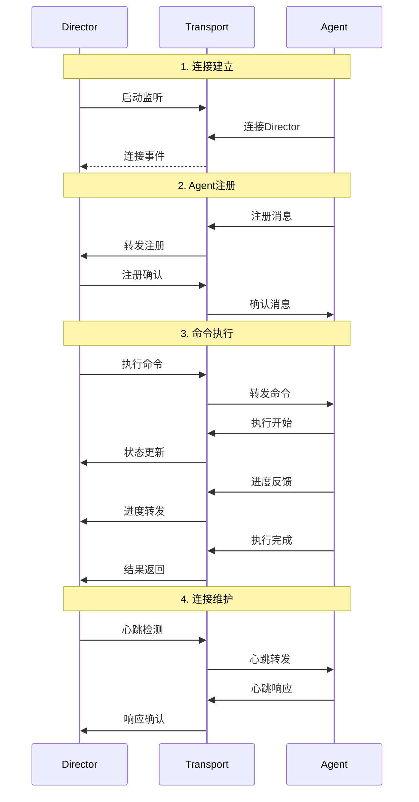

# MCP协议技术设计文档

## 文档信息

- **文档版本**: v1.0
- **创建日期**: 2025年6月30日
- **作者**: 技术专家
- **文档类型**: 协议设计文档

## 1. 协议概述

### 1.1 设计目标

MCP (Model-Command-Protocol) 是专为 Lorn.OpenAgenticAI 项目设计的Agent通信协议，旨在实现以下目标：

- **标准化通信**: 为Director与Agent之间提供统一的通信接口
- **高性能**: 基于本地进程间通信，确保低延迟和高吞吐量
- **可扩展性**: 支持协议版本升级和新功能扩展
- **可靠性**: 提供消息确认、重试和错误处理机制
- **安全性**: 实现身份验证和权限控制

### 1.2 协议特性

- **异步通信**: 支持异步消息传递和回调机制
- **双向通信**: Director和Agent可以相互发送消息
- **流式处理**: 支持长时间运行任务的进度反馈
- **负载均衡**: 支持多实例Agent的负载分配
- **故障恢复**: 自动重连和状态恢复机制

## 2. 协议架构

### 2.1 通信模型



### 2.2 消息流程



## 3. 消息格式定义

### 3.1 基础消息结构

```csharp
// 消息基类
public abstract class MCPMessage
{
    /// <summary>
    /// 消息唯一标识符
    /// </summary>
    public string MessageId { get; set; } = Guid.NewGuid().ToString();
    
    /// <summary>
    /// 消息类型
    /// </summary>
    public abstract string MessageType { get; }
    
    /// <summary>
    /// 消息版本
    /// </summary>
    public string Version { get; set; } = "1.0";
    
    /// <summary>
    /// 消息时间戳
    /// </summary>
    public DateTime Timestamp { get; set; } = DateTime.UtcNow;
    
    /// <summary>
    /// 发送方标识
    /// </summary>
    public string SenderId { get; set; }
    
    /// <summary>
    /// 接收方标识
    /// </summary>
    public string ReceiverId { get; set; }
    
    /// <summary>
    /// 关联的会话ID
    /// </summary>
    public string SessionId { get; set; }
    
    /// <summary>
    /// 消息优先级
    /// </summary>
    public MessagePriority Priority { get; set; } = MessagePriority.Normal;
    
    /// <summary>
    /// 消息元数据
    /// </summary>
    public Dictionary<string, object> Metadata { get; set; } = new();
}

public enum MessagePriority
{
    Low = 0,
    Normal = 1,
    High = 2,
    Critical = 3
}
```

### 3.2 Agent注册消息

```csharp
// Agent注册请求
public class AgentRegistrationRequest : MCPMessage
{
    public override string MessageType => "AgentRegistrationRequest";
    
    /// <summary>
    /// Agent描述符
    /// </summary>
    public AgentDescriptor Descriptor { get; set; }
    
    /// <summary>
    /// 认证信息
    /// </summary>
    public AgentAuthInfo AuthInfo { get; set; }
}

// Agent描述符
public class AgentDescriptor
{
    /// <summary>
    /// Agent唯一标识
    /// </summary>
    public string AgentId { get; set; }
    
    /// <summary>
    /// Agent名称
    /// </summary>
    public string Name { get; set; }
    
    /// <summary>
    /// Agent版本
    /// </summary>
    public string Version { get; set; }
    
    /// <summary>
    /// Agent描述
    /// </summary>
    public string Description { get; set; }
    
    /// <summary>
    /// Agent类型
    /// </summary>
    public AgentType Type { get; set; }
    
    /// <summary>
    /// Agent能力列表
    /// </summary>
    public List<AgentCapability> Capabilities { get; set; } = new();
    
    /// <summary>
    /// Agent配置
    /// </summary>
    public AgentConfiguration Configuration { get; set; }
    
    /// <summary>
    /// 支持的协议版本
    /// </summary>
    public List<string> SupportedVersions { get; set; } = new();
}

public enum AgentType
{
    Application,    // 应用程序Agent (Word, Excel等)
    Browser,        // 浏览器Agent
    System,         // 系统Agent
    Custom,         // 自定义Agent
    Service         // 服务Agent
}

// Agent能力定义
public class AgentCapability
{
    /// <summary>
    /// 能力名称
    /// </summary>
    public string Name { get; set; }
    
    /// <summary>
    /// 能力描述
    /// </summary>
    public string Description { get; set; }
    
    /// <summary>
    /// 输入参数定义
    /// </summary>
    public List<ParameterDescriptor> InputParameters { get; set; } = new();
    
    /// <summary>
    /// 输出参数定义
    /// </summary>
    public List<ParameterDescriptor> OutputParameters { get; set; } = new();
    
    /// <summary>
    /// 能力分类
    /// </summary>
    public string Category { get; set; }
    
    /// <summary>
    /// 执行超时时间（秒）
    /// </summary>
    public int TimeoutSeconds { get; set; } = 60;
    
    /// <summary>
    /// 是否支持异步执行
    /// </summary>
    public bool SupportsAsync { get; set; } = true;
    
    /// <summary>
    /// 是否支持进度反馈
    /// </summary>
    public bool SupportsProgress { get; set; } = false;
}

// 参数描述符
public class ParameterDescriptor
{
    /// <summary>
    /// 参数名称
    /// </summary>
    public string Name { get; set; }
    
    /// <summary>
    /// 参数类型
    /// </summary>
    public string Type { get; set; }
    
    /// <summary>
    /// 参数描述
    /// </summary>
    public string Description { get; set; }
    
    /// <summary>
    /// 是否必需
    /// </summary>
    public bool Required { get; set; } = false;
    
    /// <summary>
    /// 默认值
    /// </summary>
    public object DefaultValue { get; set; }
    
    /// <summary>
    /// 值约束
    /// </summary>
    public ParameterConstraints Constraints { get; set; }
}

// 参数约束
public class ParameterConstraints
{
    /// <summary>
    /// 最小值
    /// </summary>
    public object MinValue { get; set; }
    
    /// <summary>
    /// 最大值
    /// </summary>
    public object MaxValue { get; set; }
    
    /// <summary>
    /// 允许的值列表
    /// </summary>
    public List<object> AllowedValues { get; set; }
    
    /// <summary>
    /// 正则表达式模式
    /// </summary>
    public string Pattern { get; set; }
}

// Agent注册响应
public class AgentRegistrationResponse : MCPMessage
{
    public override string MessageType => "AgentRegistrationResponse";
    
    /// <summary>
    /// 注册结果
    /// </summary>
    public RegistrationResult Result { get; set; }
    
    /// <summary>
    /// 错误信息
    /// </summary>
    public string ErrorMessage { get; set; }
    
    /// <summary>
    /// 分配的会话ID
    /// </summary>
    public string AssignedSessionId { get; set; }
    
    /// <summary>
    /// 服务器配置
    /// </summary>
    public ServerConfiguration ServerConfig { get; set; }
}

public enum RegistrationResult
{
    Success,
    Failed,
    Rejected,
    Duplicate
}
```

### 3.3 命令执行消息

```csharp
// 命令执行请求
public class CommandExecutionRequest : MCPMessage
{
    public override string MessageType => "CommandExecutionRequest";
    
    /// <summary>
    /// 目标Agent ID
    /// </summary>
    public string TargetAgentId { get; set; }
    
    /// <summary>
    /// 命令名称
    /// </summary>
    public string CommandName { get; set; }
    
    /// <summary>
    /// 命令参数
    /// </summary>
    public Dictionary<string, object> Parameters { get; set; } = new();
    
    /// <summary>
    /// 执行选项
    /// </summary>
    public ExecutionOptions Options { get; set; }
    
    /// <summary>
    /// 上下文信息
    /// </summary>
    public ExecutionContext Context { get; set; }
}

// 执行选项
public class ExecutionOptions
{
    /// <summary>
    /// 超时时间（秒）
    /// </summary>
    public int TimeoutSeconds { get; set; } = 60;
    
    /// <summary>
    /// 是否异步执行
    /// </summary>
    public bool Async { get; set; } = true;
    
    /// <summary>
    /// 是否需要进度反馈
    /// </summary>
    public bool ReportProgress { get; set; } = false;
    
    /// <summary>
    /// 重试次数
    /// </summary>
    public int RetryCount { get; set; } = 0;
    
    /// <summary>
    /// 重试间隔（秒）
    /// </summary>
    public int RetryIntervalSeconds { get; set; } = 5;
}

// 执行上下文
public class ExecutionContext
{
    /// <summary>
    /// 工作流ID
    /// </summary>
    public string WorkflowId { get; set; }
    
    /// <summary>
    /// 步骤ID
    /// </summary>
    public string StepId { get; set; }
    
    /// <summary>
    /// 用户ID
    /// </summary>
    public string UserId { get; set; }
    
    /// <summary>
    /// 执行环境
    /// </summary>
    public Dictionary<string, object> Environment { get; set; } = new();
    
    /// <summary>
    /// 共享数据
    /// </summary>
    public Dictionary<string, object> SharedData { get; set; } = new();
}

// 命令执行响应
public class CommandExecutionResponse : MCPMessage
{
    public override string MessageType => "CommandExecutionResponse";
    
    /// <summary>
    /// 执行ID
    /// </summary>
    public string ExecutionId { get; set; }
    
    /// <summary>
    /// 执行状态
    /// </summary>
    public ExecutionStatus Status { get; set; }
    
    /// <summary>
    /// 错误信息
    /// </summary>
    public string ErrorMessage { get; set; }
    
    /// <summary>
    /// 估计完成时间
    /// </summary>
    public DateTime? EstimatedCompletion { get; set; }
}

public enum ExecutionStatus
{
    Accepted,       // 已接受
    Running,        // 执行中
    Completed,      // 已完成
    Failed,         // 失败
    Cancelled,      // 已取消
    Timeout         // 超时
}
```

### 3.4 进度反馈消息

```csharp
// 进度反馈消息
public class ProgressFeedbackMessage : MCPMessage
{
    public override string MessageType => "ProgressFeedback";
    
    /// <summary>
    /// 执行ID
    /// </summary>
    public string ExecutionId { get; set; }
    
    /// <summary>
    /// 进度百分比 (0-100)
    /// </summary>
    public int ProgressPercentage { get; set; }
    
    /// <summary>
    /// 当前步骤描述
    /// </summary>
    public string CurrentStep { get; set; }
    
    /// <summary>
    /// 详细信息
    /// </summary>
    public string Details { get; set; }
    
    /// <summary>
    /// 中间结果
    /// </summary>
    public Dictionary<string, object> IntermediateResults { get; set; } = new();
    
    /// <summary>
    /// 剩余时间估计（秒）
    /// </summary>
    public int? EstimatedRemainingSeconds { get; set; }
}

// 执行结果消息
public class ExecutionResultMessage : MCPMessage
{
    public override string MessageType => "ExecutionResult";
    
    /// <summary>
    /// 执行ID
    /// </summary>
    public string ExecutionId { get; set; }
    
    /// <summary>
    /// 最终状态
    /// </summary>
    public ExecutionStatus FinalStatus { get; set; }
    
    /// <summary>
    /// 执行结果
    /// </summary>
    public Dictionary<string, object> Results { get; set; } = new();
    
    /// <summary>
    /// 错误信息
    /// </summary>
    public string ErrorMessage { get; set; }
    
    /// <summary>
    /// 异常堆栈
    /// </summary>
    public string StackTrace { get; set; }
    
    /// <summary>
    /// 执行统计
    /// </summary>
    public ExecutionStatistics Statistics { get; set; }
    
    /// <summary>
    /// 执行日志
    /// </summary>
    public List<string> ExecutionLogs { get; set; } = new();
}

// 执行统计
public class ExecutionStatistics
{
    /// <summary>
    /// 开始时间
    /// </summary>
    public DateTime StartTime { get; set; }
    
    /// <summary>
    /// 结束时间
    /// </summary>
    public DateTime EndTime { get; set; }
    
    /// <summary>
    /// 执行时长（毫秒）
    /// </summary>
    public long DurationMilliseconds { get; set; }
    
    /// <summary>
    /// 内存使用峰值（MB）
    /// </summary>
    public int PeakMemoryUsageMB { get; set; }
    
    /// <summary>
    /// 重试次数
    /// </summary>
    public int RetryCount { get; set; }
}
```

### 3.5 心跳和连接管理

```csharp
// 心跳消息
public class HeartbeatMessage : MCPMessage
{
    public override string MessageType => "Heartbeat";
    
    /// <summary>
    /// Agent状态
    /// </summary>
    public AgentStatus Status { get; set; }
    
    /// <summary>
    /// 系统信息
    /// </summary>
    public SystemInfo SystemInfo { get; set; }
    
    /// <summary>
    /// 当前执行的任务数
    /// </summary>
    public int ActiveTaskCount { get; set; }
}

public enum AgentStatus
{
    Idle,           // 空闲
    Busy,           // 繁忙
    Maintenance,    // 维护中
    Error           // 错误状态
}

// 系统信息
public class SystemInfo
{
    /// <summary>
    /// CPU使用率
    /// </summary>
    public float CpuUsagePercent { get; set; }
    
    /// <summary>
    /// 内存使用率
    /// </summary>
    public float MemoryUsagePercent { get; set; }
    
    /// <summary>
    /// 可用内存（MB）
    /// </summary>
    public int AvailableMemoryMB { get; set; }
    
    /// <summary>
    /// 运行时长（秒）
    /// </summary>
    public long UptimeSeconds { get; set; }
}

// 心跳响应
public class HeartbeatResponse : MCPMessage
{
    public override string MessageType => "HeartbeatResponse";
    
    /// <summary>
    /// 服务器时间
    /// </summary>
    public DateTime ServerTime { get; set; }
    
    /// <summary>
    /// 下次心跳间隔（秒）
    /// </summary>
    public int NextHeartbeatIntervalSeconds { get; set; } = 30;
    
    /// <summary>
    /// 配置更新
    /// </summary>
    public Dictionary<string, object> ConfigUpdates { get; set; } = new();
}

// 连接关闭消息
public class DisconnectionMessage : MCPMessage
{
    public override string MessageType => "Disconnection";
    
    /// <summary>
    /// 断开原因
    /// </summary>
    public DisconnectionReason Reason { get; set; }
    
    /// <summary>
    /// 详细信息
    /// </summary>
    public string Details { get; set; }
    
    /// <summary>
    /// 是否计划重连
    /// </summary>
    public bool WillReconnect { get; set; } = true;
    
    /// <summary>
    /// 重连延迟（秒）
    /// </summary>
    public int ReconnectDelaySeconds { get; set; } = 5;
}

public enum DisconnectionReason
{
    Normal,         // 正常关闭
    Error,          // 错误关闭
    Timeout,        // 超时
    Maintenance     // 维护
}
```

## 4. 传输层实现

### 4.1 Named Pipes实现

```csharp
public class NamedPipeMCPTransport : IMCPTransport
{
    private readonly string _pipeName;
    private readonly bool _isServer;
    private NamedPipeServerStream _pipeServer;
    private NamedPipeClientStream _pipeClient;
    private StreamReader _reader;
    private StreamWriter _writer;
    private readonly CancellationTokenSource _cancellationTokenSource;
    private readonly ILogger<NamedPipeMCPTransport> _logger;
    
    public event EventHandler<MCPMessage> MessageReceived;
    public event EventHandler<Exception> ErrorOccurred;
    public event EventHandler<string> ConnectionStateChanged;
    
    public NamedPipeMCPTransport(string pipeName, bool isServer, ILogger<NamedPipeMCPTransport> logger)
    {
        _pipeName = pipeName;
        _isServer = isServer;
        _logger = logger;
        _cancellationTokenSource = new CancellationTokenSource();
    }
    
    public async Task<bool> ConnectAsync(string endpoint, CancellationToken cancellationToken = default)
    {
        try
        {
            using var timeoutCts = CancellationTokenSource.CreateLinkedTokenSource(cancellationToken);
            timeoutCts.CancelAfter(TimeSpan.FromSeconds(30));
            
            if (_isServer)
            {
                await StartServerAsync(timeoutCts.Token);
            }
            else
            {
                await ConnectClientAsync(endpoint, timeoutCts.Token);
            }
            
            StartMessageProcessing(_cancellationTokenSource.Token);
            ConnectionStateChanged?.Invoke(this, "Connected");
            
            return true;
        }
        catch (Exception ex)
        {
            _logger.LogError(ex, "Failed to connect to Named Pipe {PipeName}", _pipeName);
            ErrorOccurred?.Invoke(this, ex);
            return false;
        }
    }
    
    private async Task StartServerAsync(CancellationToken cancellationToken)
    {
        _pipeServer = new NamedPipeServerStream(
            _pipeName,
            PipeDirection.InOut,
            maxNumberOfServerInstances: 10,
            PipeTransmissionMode.Byte,
            PipeOptions.Asynchronous);
        
        await _pipeServer.WaitForConnectionAsync(cancellationToken);
        
        _reader = new StreamReader(_pipeServer, Encoding.UTF8);
        _writer = new StreamWriter(_pipeServer, Encoding.UTF8) { AutoFlush = true };
        
        _logger.LogInformation("Named Pipe server started on {PipeName}", _pipeName);
    }
    
    private async Task ConnectClientAsync(string serverName, CancellationToken cancellationToken)
    {
        _pipeClient = new NamedPipeClientStream(
            serverName,
            _pipeName,
            PipeDirection.InOut,
            PipeOptions.Asynchronous);
        
        await _pipeClient.ConnectAsync(cancellationToken);
        
        _reader = new StreamReader(_pipeClient, Encoding.UTF8);
        _writer = new StreamWriter(_pipeClient, Encoding.UTF8) { AutoFlush = true };
        
        _logger.LogInformation("Connected to Named Pipe server {ServerName}\\{PipeName}", serverName, _pipeName);
    }
    
    public async Task SendMessageAsync<T>(T message, CancellationToken cancellationToken = default) where T : MCPMessage
    {
        try
        {
            var json = JsonSerializer.Serialize(message, new JsonSerializerOptions
            {
                PropertyNamingPolicy = JsonNamingPolicy.CamelCase,
                WriteIndented = false
            });
            
            await _writer.WriteLineAsync(json);
            
            _logger.LogDebug("Sent message: {MessageType} - {MessageId}", message.MessageType, message.MessageId);
        }
        catch (Exception ex)
        {
            _logger.LogError(ex, "Failed to send message {MessageType}", message.MessageType);
            ErrorOccurred?.Invoke(this, ex);
            throw;
        }
    }
    
    public async IAsyncEnumerable<MCPMessage> ReceiveMessagesAsync([EnumeratorCancellation] CancellationToken cancellationToken = default)
    {
        while (!cancellationToken.IsCancellationRequested)
        {
            try
            {
                var line = await _reader.ReadLineAsync();
                if (string.IsNullOrEmpty(line))
                {
                    await Task.Delay(100, cancellationToken);
                    continue;
                }
                
                var message = DeserializeMessage(line);
                if (message != null)
                {
                    _logger.LogDebug("Received message: {MessageType} - {MessageId}", message.MessageType, message.MessageId);
                    yield return message;
                }
            }
            catch (Exception ex) when (!cancellationToken.IsCancellationRequested)
            {
                _logger.LogError(ex, "Error receiving message");
                ErrorOccurred?.Invoke(this, ex);
                await Task.Delay(1000, cancellationToken);
            }
        }
    }
    
    private void StartMessageProcessing(CancellationToken cancellationToken)
    {
        _ = Task.Run(async () =>
        {
            await foreach (var message in ReceiveMessagesAsync(cancellationToken))
            {
                MessageReceived?.Invoke(this, message);
            }
        }, cancellationToken);
    }
    
    private MCPMessage DeserializeMessage(string json)
    {
        try
        {
            using var document = JsonDocument.Parse(json);
            var root = document.RootElement;
            
            if (!root.TryGetProperty("messageType", out var messageTypeElement))
            {
                _logger.LogWarning("Message missing messageType property");
                return null;
            }
            
            var messageType = messageTypeElement.GetString();
            
            return messageType switch
            {
                "AgentRegistrationRequest" => JsonSerializer.Deserialize<AgentRegistrationRequest>(json),
                "AgentRegistrationResponse" => JsonSerializer.Deserialize<AgentRegistrationResponse>(json),
                "CommandExecutionRequest" => JsonSerializer.Deserialize<CommandExecutionRequest>(json),
                "CommandExecutionResponse" => JsonSerializer.Deserialize<CommandExecutionResponse>(json),
                "ProgressFeedback" => JsonSerializer.Deserialize<ProgressFeedbackMessage>(json),
                "ExecutionResult" => JsonSerializer.Deserialize<ExecutionResultMessage>(json),
                "Heartbeat" => JsonSerializer.Deserialize<HeartbeatMessage>(json),
                "HeartbeatResponse" => JsonSerializer.Deserialize<HeartbeatResponse>(json),
                "Disconnection" => JsonSerializer.Deserialize<DisconnectionMessage>(json),
                _ => throw new NotSupportedException($"Unknown message type: {messageType}")
            };
        }
        catch (Exception ex)
        {
            _logger.LogError(ex, "Failed to deserialize message: {Json}", json);
            return null;
        }
    }
    
    public async Task DisconnectAsync()
    {
        try
        {
            _cancellationTokenSource.Cancel();
            
            _reader?.Dispose();
            _writer?.Dispose();
            _pipeServer?.Dispose();
            _pipeClient?.Dispose();
            
            ConnectionStateChanged?.Invoke(this, "Disconnected");
            _logger.LogInformation("Disconnected from Named Pipe {PipeName}", _pipeName);
        }
        catch (Exception ex)
        {
            _logger.LogError(ex, "Error during disconnection");
        }
    }
}
```

### 4.2 gRPC实现

```csharp
// gRPC服务定义
syntax = "proto3";

package lorn.openagenticai.mcp;

service MCPService {
    rpc SendMessage(MCPMessageRequest) returns (MCPMessageResponse);
    rpc ReceiveMessages(ReceiveMessagesRequest) returns (stream MCPMessageResponse);
    rpc RegisterAgent(AgentRegistrationRequest) returns (AgentRegistrationResponse);
    rpc ExecuteCommand(CommandExecutionRequest) returns (CommandExecutionResponse);
    rpc StreamProgress(ProgressStreamRequest) returns (stream ProgressFeedbackMessage);
}

message MCPMessageRequest {
    string message_id = 1;
    string message_type = 2;
    string version = 3;
    int64 timestamp = 4;
    string sender_id = 5;
    string receiver_id = 6;
    string session_id = 7;
    int32 priority = 8;
    string payload = 9; // JSON serialized message content
}

message MCPMessageResponse {
    bool success = 1;
    string error_message = 2;
    string response_payload = 3;
}

// gRPC传输实现
public class GrpcMCPTransport : IMCPTransport
{
    private readonly GrpcChannel _channel;
    private readonly MCPService.MCPServiceClient _client;
    private readonly ILogger<GrpcMCPTransport> _logger;
    private readonly CancellationTokenSource _cancellationTokenSource;
    
    public event EventHandler<MCPMessage> MessageReceived;
    public event EventHandler<Exception> ErrorOccurred;
    public event EventHandler<string> ConnectionStateChanged;
    
    public GrpcMCPTransport(string endpoint, ILogger<GrpcMCPTransport> logger)
    {
        _channel = GrpcChannel.ForAddress(endpoint);
        _client = new MCPService.MCPServiceClient(_channel);
        _logger = logger;
        _cancellationTokenSource = new CancellationTokenSource();
    }
    
    public async Task<bool> ConnectAsync(string endpoint, CancellationToken cancellationToken = default)
    {
        try
        {
            // 测试连接
            await _client.ReceiveMessagesAsync(new ReceiveMessagesRequest
            {
                ClientId = Environment.MachineName
            }, cancellationToken: cancellationToken);
            
            StartMessageReceiving(_cancellationTokenSource.Token);
            ConnectionStateChanged?.Invoke(this, "Connected");
            
            return true;
        }
        catch (Exception ex)
        {
            _logger.LogError(ex, "Failed to connect to gRPC endpoint {Endpoint}", endpoint);
            ErrorOccurred?.Invoke(this, ex);
            return false;
        }
    }
    
    public async Task SendMessageAsync<T>(T message, CancellationToken cancellationToken = default) where T : MCPMessage
    {
        try
        {
            var request = new MCPMessageRequest
            {
                MessageId = message.MessageId,
                MessageType = message.MessageType,
                Version = message.Version,
                Timestamp = message.Timestamp.ToBinary(),
                SenderId = message.SenderId,
                ReceiverId = message.ReceiverId,
                SessionId = message.SessionId,
                Priority = (int)message.Priority,
                Payload = JsonSerializer.Serialize(message)
            };
            
            var response = await _client.SendMessageAsync(request, cancellationToken: cancellationToken);
            
            if (!response.Success)
            {
                throw new InvalidOperationException($"Failed to send message: {response.ErrorMessage}");
            }
            
            _logger.LogDebug("Sent gRPC message: {MessageType} - {MessageId}", message.MessageType, message.MessageId);
        }
        catch (Exception ex)
        {
            _logger.LogError(ex, "Failed to send gRPC message {MessageType}", message.MessageType);
            ErrorOccurred?.Invoke(this, ex);
            throw;
        }
    }
    
    private void StartMessageReceiving(CancellationToken cancellationToken)
    {
        _ = Task.Run(async () =>
        {
            try
            {
                using var call = _client.ReceiveMessages(new ReceiveMessagesRequest
                {
                    ClientId = Environment.MachineName
                }, cancellationToken: cancellationToken);
                
                await foreach (var response in call.ResponseStream.ReadAllAsync(cancellationToken))
                {
                    if (!string.IsNullOrEmpty(response.ResponsePayload))
                    {
                        var message = DeserializeMessage(response.ResponsePayload);
                        if (message != null)
                        {
                            MessageReceived?.Invoke(this, message);
                        }
                    }
                }
            }
            catch (Exception ex) when (!cancellationToken.IsCancellationRequested)
            {
                _logger.LogError(ex, "Error in gRPC message receiving");
                ErrorOccurred?.Invoke(this, ex);
            }
        }, cancellationToken);
    }
    
    public async Task DisconnectAsync()
    {
        try
        {
            _cancellationTokenSource.Cancel();
            await _channel.ShutdownAsync();
            
            ConnectionStateChanged?.Invoke(this, "Disconnected");
            _logger.LogInformation("Disconnected from gRPC endpoint");
        }
        catch (Exception ex)
        {
            _logger.LogError(ex, "Error during gRPC disconnection");
        }
    }
}
```

## 5. 错误处理和重试机制

### 5.1 错误类型定义

```csharp
public class MCPException : Exception
{
    public string ErrorCode { get; }
    public string AgentId { get; }
    public string MessageId { get; }
    
    public MCPException(string errorCode, string message, string agentId = null, string messageId = null)
        : base(message)
    {
        ErrorCode = errorCode;
        AgentId = agentId;
        MessageId = messageId;
    }
}

public static class MCPErrorCodes
{
    public const string CONNECTION_FAILED = "MCP_CONNECTION_FAILED";
    public const string AGENT_NOT_FOUND = "MCP_AGENT_NOT_FOUND";
    public const string COMMAND_NOT_SUPPORTED = "MCP_COMMAND_NOT_SUPPORTED";
    public const string EXECUTION_TIMEOUT = "MCP_EXECUTION_TIMEOUT";
    public const string EXECUTION_FAILED = "MCP_EXECUTION_FAILED";
    public const string INVALID_MESSAGE = "MCP_INVALID_MESSAGE";
    public const string AUTHENTICATION_FAILED = "MCP_AUTHENTICATION_FAILED";
    public const string AUTHORIZATION_FAILED = "MCP_AUTHORIZATION_FAILED";
    public const string RESOURCE_EXHAUSTED = "MCP_RESOURCE_EXHAUSTED";
    public const string AGENT_BUSY = "MCP_AGENT_BUSY";
}
```

### 5.2 重试策略

```csharp
public class MCPRetryPolicy
{
    private readonly ILogger<MCPRetryPolicy> _logger;
    
    public async Task<T> ExecuteWithRetryAsync<T>(
        Func<Task<T>> operation,
        int maxRetries = 3,
        TimeSpan? initialDelay = null,
        bool useExponentialBackoff = true,
        CancellationToken cancellationToken = default)
    {
        var delay = initialDelay ?? TimeSpan.FromSeconds(1);
        Exception lastException = null;
        
        for (int attempt = 0; attempt <= maxRetries; attempt++)
        {
            try
            {
                return await operation();
            }
            catch (Exception ex) when (attempt < maxRetries && IsRetriableException(ex))
            {
                lastException = ex;
                _logger.LogWarning(ex, "Operation failed, retrying in {Delay}ms (attempt {Attempt}/{MaxRetries})",
                    delay.TotalMilliseconds, attempt + 1, maxRetries + 1);
                
                await Task.Delay(delay, cancellationToken);
                
                if (useExponentialBackoff)
                {
                    delay = TimeSpan.FromMilliseconds(delay.TotalMilliseconds * 2);
                }
            }
        }
        
        throw lastException ?? new InvalidOperationException("Operation failed after all retry attempts");
    }
    
    private bool IsRetriableException(Exception ex)
    {
        return ex switch
        {
            MCPException mcpEx => mcpEx.ErrorCode switch
            {
                MCPErrorCodes.CONNECTION_FAILED => true,
                MCPErrorCodes.EXECUTION_TIMEOUT => true,
                MCPErrorCodes.AGENT_BUSY => true,
                MCPErrorCodes.RESOURCE_EXHAUSTED => true,
                _ => false
            },
            TimeoutException => true,
            SocketException => true,
            HttpRequestException => true,
            _ => false
        };
    }
}
```

## 6. 性能优化

### 6.1 消息池化

```csharp
public class MCPMessagePool
{
    private readonly ConcurrentQueue<MCPMessage> _messagePool = new();
    private readonly SemaphoreSlim _semaphore = new(100, 100);
    private readonly ILogger<MCPMessagePool> _logger;
    
    public async Task<T> RentAsync<T>() where T : MCPMessage, new()
    {
        await _semaphore.WaitAsync();
        
        if (_messagePool.TryDequeue(out var message) && message is T typedMessage)
        {
            ResetMessage(typedMessage);
            return typedMessage;
        }
        
        return new T();
    }
    
    public void Return<T>(T message) where T : MCPMessage
    {
        if (message != null)
        {
            ResetMessage(message);
            _messagePool.Enqueue(message);
            _semaphore.Release();
        }
    }
    
    private void ResetMessage(MCPMessage message)
    {
        message.MessageId = Guid.NewGuid().ToString();
        message.Timestamp = DateTime.UtcNow;
        message.SenderId = null;
        message.ReceiverId = null;
        message.SessionId = null;
        message.Priority = MessagePriority.Normal;
        message.Metadata.Clear();
    }
}
```

### 6.2 连接池管理

```csharp
public class MCPConnectionPool : IDisposable
{
    private readonly ConcurrentDictionary<string, List<IMCPTransport>> _connectionPools = new();
    private readonly SemaphoreSlim _semaphore = new(1, 1);
    private readonly ILogger<MCPConnectionPool> _logger;
    private readonly Timer _cleanupTimer;
    
    public MCPConnectionPool(ILogger<MCPConnectionPool> logger)
    {
        _logger = logger;
        _cleanupTimer = new Timer(CleanupConnections, null, TimeSpan.FromMinutes(5), TimeSpan.FromMinutes(5));
    }
    
    public async Task<IMCPTransport> AcquireConnectionAsync(string agentId, CancellationToken cancellationToken = default)
    {
        await _semaphore.WaitAsync(cancellationToken);
        
        try
        {
            if (_connectionPools.TryGetValue(agentId, out var connections) && connections.Count > 0)
            {
                var connection = connections[0];
                connections.RemoveAt(0);
                
                _logger.LogDebug("Reused connection for agent {AgentId}", agentId);
                return connection;
            }
            
            // 创建新连接
            var newConnection = await CreateConnectionAsync(agentId, cancellationToken);
            _logger.LogDebug("Created new connection for agent {AgentId}", agentId);
            
            return newConnection;
        }
        finally
        {
            _semaphore.Release();
        }
    }
    
    public async Task ReleaseConnectionAsync(string agentId, IMCPTransport connection)
    {
        if (connection == null) return;
        
        await _semaphore.WaitAsync();
        
        try
        {
            if (!_connectionPools.ContainsKey(agentId))
            {
                _connectionPools[agentId] = new List<IMCPTransport>();
            }
            
            var connections = _connectionPools[agentId];
            if (connections.Count < 5) // 最大连接数限制
            {
                connections.Add(connection);
                _logger.LogDebug("Returned connection to pool for agent {AgentId}", agentId);
            }
            else
            {
                await connection.DisconnectAsync();
                _logger.LogDebug("Discarded excess connection for agent {AgentId}", agentId);
            }
        }
        finally
        {
            _semaphore.Release();
        }
    }
    
    private async Task<IMCPTransport> CreateConnectionAsync(string agentId, CancellationToken cancellationToken)
    {
        // 根据配置创建合适的传输实现
        var transport = new NamedPipeMCPTransport($"LornAI_{agentId}", false, 
            LoggerFactory.Create(builder => builder.AddConsole()).CreateLogger<NamedPipeMCPTransport>());
        
        var connected = await transport.ConnectAsync(".", cancellationToken);
        if (!connected)
        {
            throw new MCPException(MCPErrorCodes.CONNECTION_FAILED, $"Failed to connect to agent {agentId}");
        }
        
        return transport;
    }
    
    private void CleanupConnections(object state)
    {
        // 清理空闲连接
        foreach (var kvp in _connectionPools)
        {
            var connections = kvp.Value;
            for (int i = connections.Count - 1; i >= 0; i--)
            {
                // 可以添加连接健康检查逻辑
                // 如果连接不健康，则移除并关闭
            }
        }
    }
    
    public void Dispose()
    {
        _cleanupTimer?.Dispose();
        
        foreach (var connections in _connectionPools.Values)
        {
            foreach (var connection in connections)
            {
                connection.DisconnectAsync().Wait(TimeSpan.FromSeconds(5));
            }
        }
        
        _semaphore?.Dispose();
    }
}
```

## 7. 安全机制

### 7.1 身份验证

```csharp
public class MCPAuthenticationService
{
    private readonly IConfiguration _configuration;
    private readonly ILogger<MCPAuthenticationService> _logger;
    
    public async Task<AuthenticationResult> AuthenticateAgentAsync(AgentAuthInfo authInfo, CancellationToken cancellationToken = default)
    {
        try
        {
            // 验证Agent证书
            if (!await ValidateAgentCertificateAsync(authInfo.Certificate, cancellationToken))
            {
                return new AuthenticationResult
                {
                    Success = false,
                    ErrorCode = MCPErrorCodes.AUTHENTICATION_FAILED,
                    ErrorMessage = "Invalid agent certificate"
                };
            }
            
            // 验证Agent签名
            if (!await ValidateAgentSignatureAsync(authInfo, cancellationToken))
            {
                return new AuthenticationResult
                {
                    Success = false,
                    ErrorCode = MCPErrorCodes.AUTHENTICATION_FAILED,
                    ErrorMessage = "Invalid agent signature"
                };
            }
            
            // 检查Agent是否在白名单中
            if (!await IsAgentAllowedAsync(authInfo.AgentId, cancellationToken))
            {
                return new AuthenticationResult
                {
                    Success = false,
                    ErrorCode = MCPErrorCodes.AUTHORIZATION_FAILED,
                    ErrorMessage = "Agent not in whitelist"
                };
            }
            
            return new AuthenticationResult
            {
                Success = true,
                AgentId = authInfo.AgentId,
                SessionToken = GenerateSessionToken(authInfo.AgentId),
                ExpiresAt = DateTime.UtcNow.AddHours(24)
            };
        }
        catch (Exception ex)
        {
            _logger.LogError(ex, "Authentication failed for agent {AgentId}", authInfo.AgentId);
            return new AuthenticationResult
            {
                Success = false,
                ErrorCode = MCPErrorCodes.AUTHENTICATION_FAILED,
                ErrorMessage = "Authentication process failed"
            };
        }
    }
    
    private async Task<bool> ValidateAgentCertificateAsync(string certificate, CancellationToken cancellationToken)
    {
        // 证书验证逻辑
        return true; // 简化实现
    }
    
    private async Task<bool> ValidateAgentSignatureAsync(AgentAuthInfo authInfo, CancellationToken cancellationToken)
    {
        // 签名验证逻辑
        return true; // 简化实现
    }
    
    private async Task<bool> IsAgentAllowedAsync(string agentId, CancellationToken cancellationToken)
    {
        // 白名单检查逻辑
        return true; // 简化实现
    }
    
    private string GenerateSessionToken(string agentId)
    {
        // 生成会话令牌
        return Convert.ToBase64String(Guid.NewGuid().ToByteArray());
    }
}

public class AgentAuthInfo
{
    public string AgentId { get; set; }
    public string Certificate { get; set; }
    public string Signature { get; set; }
    public DateTime Timestamp { get; set; }
}

public class AuthenticationResult
{
    public bool Success { get; set; }
    public string AgentId { get; set; }
    public string SessionToken { get; set; }
    public DateTime ExpiresAt { get; set; }
    public string ErrorCode { get; set; }
    public string ErrorMessage { get; set; }
}
```

## 8. 总结

MCP协议作为Lorn.OpenAgenticAI项目的核心通信协议，提供了完整的Agent通信解决方案。本设计文档详细定义了：

1. **消息格式**: 标准化的消息结构，支持多种消息类型
2. **传输层**: 支持Named Pipes和gRPC两种传输方式
3. **错误处理**: 完善的错误处理和重试机制
4. **性能优化**: 消息池化和连接池管理
5. **安全机制**: 身份验证和授权控制

该协议设计充分考虑了桌面环境的特殊需求，确保了高性能、高可靠性和良好的扩展性。

---

*本文档将根据实际实现过程中的反馈持续更新优化。*
