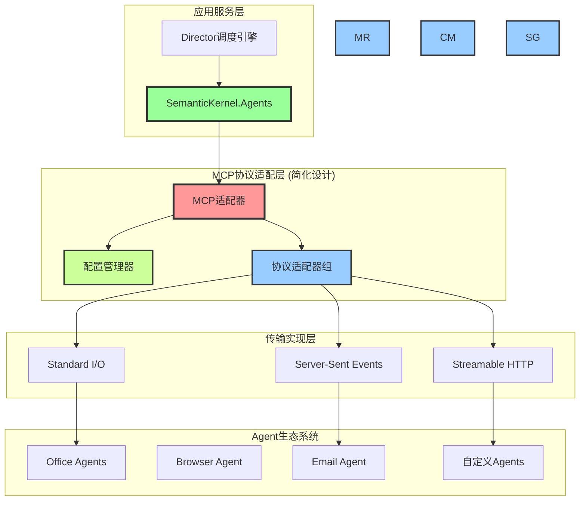
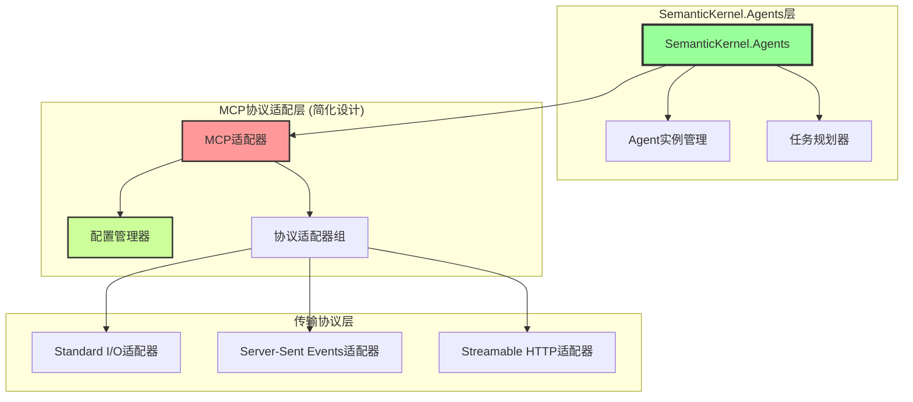
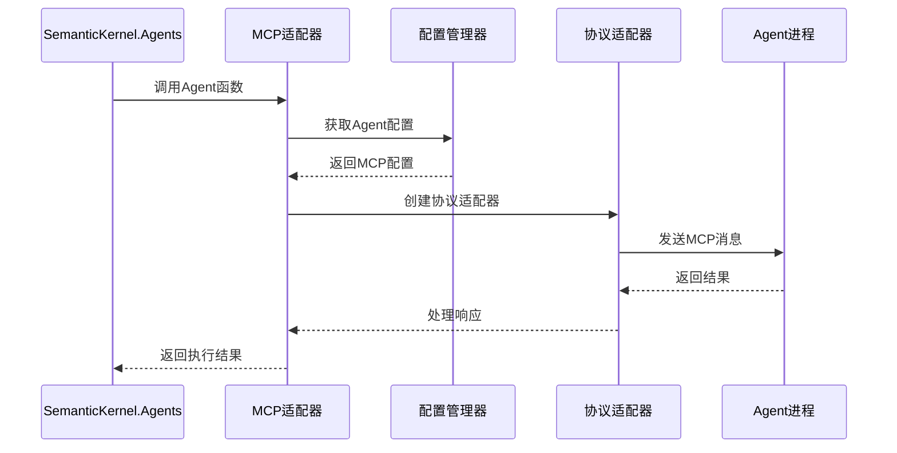
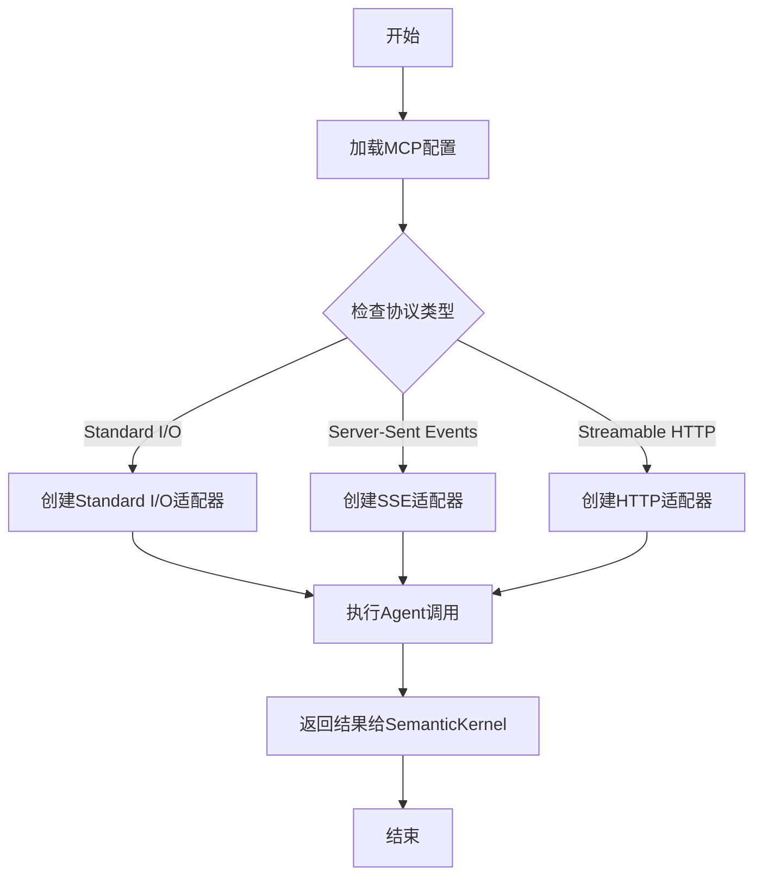
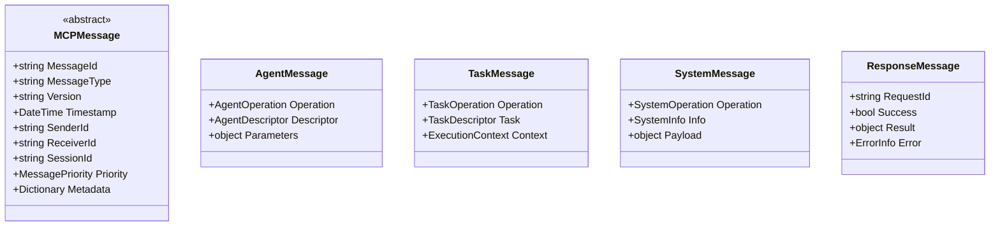
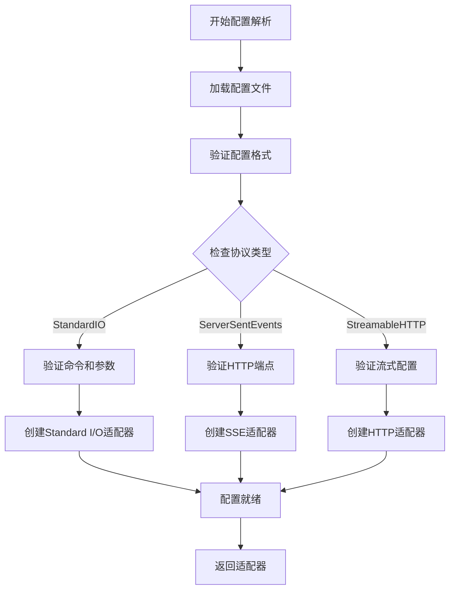

# MCP协议适配器技术设计文档

## 文档信息

- **文档版本**: v3.0 (简化版)
- **创建日期**: 2025年6月30日
- **更新日期**: 2025年7月4日
- **作者**: 技术专家
- **文档类型**: MCP协议适配器技术设计
- **设计理念**: 基于Microsoft.SemanticKernel.Agents的协议适配层设计
- **相关文档**: TechnicalArchitecture.md, DirectorEngineDesign.md, AgentFrameworkDesign.md

## 1. MCP协议适配器概述

### 1.1 设计定位重新审视

基于系统采用`Microsoft.SemanticKernel.Agents`框架，MCP协议适配器**不再是完整的Agent管理平台**，而是专注于**协议适配和传输层抽象**的轻量级组件。

**简化后的设计目标**:

- **协议适配专用**: 专注于MCP协议的三种传输方式实现，不涉及Agent管理
- **SemanticKernel集成**: 作为SemanticKernel.Agents的传输层适配器
- **配置驱动通信**: 根据MCP配置选择合适的传输协议和参数
- **标准化接口**: 为SemanticKernel提供统一的MCP协议调用接口
- **传输层抽象**: 屏蔽底层通信细节，提供高级抽象接口

**核心价值重新定位**:



**简化的核心特性**:

- **传输协议抽象**: 为SemanticKernel提供统一的MCP传输接口
- **配置驱动适配**: 根据Agent配置自动选择传输协议
- **轻量级设计**: 移除Agent生命周期管理、路由控制等重复功能
- **专注协议实现**: 专门实现MCP标准的三种传输协议
    

## 2. 简化的MCP协议适配器架构

### 2.1 简化架构设计

基于SemanticKernel.Agents的存在，MCP协议适配器专注于协议传输层，大幅简化架构：



### 2.2 简化的核心组件

#### 2.2.1 MCP适配器 (IMCPAdapter)

**简化职责**:
- 为SemanticKernel提供统一的MCP协议调用接口
- 根据配置选择合适的传输协议适配器
- 处理协议特定的消息格式转换

**核心接口设计**:

在`Lorn.OpenAgenticAI.Domain.MCP`项目中实现：

```csharp
public interface IMCPAdapter
{
    // 与SemanticKernel集成的简化接口
    Task<AgentResponse> InvokeAgentAsync(Agent agent, MCPConfiguration config, object parameters);
    Task<MCPConfiguration> LoadConfigurationAsync(string agentId);
    IProtocolAdapter CreateProtocolAdapter(MCPConfiguration config);
    Task<bool> ValidateConfigurationAsync(MCPConfiguration config);
}

public interface ISemanticKernelMCPAdapter : IMCPAdapter
{
    // SemanticKernel专用适配器接口
    Task RegisterAgent(Agent agent, MCPConfiguration config);
    Task<IEnumerable<AgentCapability>> GetAgentCapabilitiesAsync(string agentId);
    Task<ExecutionResult> ExecuteAgentFunctionAsync(Agent agent, string functionName, object parameters);
}
```

#### 2.2.2 配置管理器 (简化版)

**简化职责**:
- MCP配置解析和验证
- 协议类型选择逻辑
- 配置模板管理

**核心接口**:

```csharp
public interface IMCPConfigurationManager
{
    Task<MCPConfiguration> LoadConfigurationAsync(string agentId);
    ProtocolType GetProtocolType(MCPConfiguration config);
    Task<bool> ValidateConfigurationAsync(MCPConfiguration config);
    IProtocolAdapter CreateAdapter(MCPConfiguration config);
}
```

#### 2.2.3 协议适配器组 (保留完整实现)

**不可简化的原因**:
- SemanticKernel不包含MCP协议的具体传输实现
- 需要完整实现三种MCP协议类型
- 传输层细节需要专门处理

**保留的接口设计**:

```csharp
public interface IProtocolAdapter
{
    Task<AgentResponse> SendMessageAsync(MCPMessage message);
    Task<bool> IsAvailableAsync();
    ProtocolType GetProtocolType();
    Task InitializeAsync(MCPConfiguration config);
    Task CloseAsync();
}

// 三种协议适配器仍需完整实现
public interface IStandardIOAdapter : IProtocolAdapter
{
    Task<Process> StartProcessAsync(ProcessStartInfo startInfo);
    Task<string> ReadStdoutAsync();
    Task WriteStdinAsync(string message);
}

public interface IServerSentEventsAdapter : IProtocolAdapter  
{
    Task<HttpClient> CreateHttpClientAsync();
    Task SubscribeToEventsAsync(string endpoint);
    Task SendEventAsync(object eventData);
}

public interface IStreamableHTTPAdapter : IProtocolAdapter
{
    Task<HttpResponseMessage> SendStreamRequestAsync(HttpRequestMessage request);
    Task<Stream> GetResponseStreamAsync();
    Task WriteStreamAsync(Stream data);
}
```

#### 2.4.3 简化的实现指导要求

**Lorn.Domain.MCP项目实现要求**:

1. **MCPAdapter类**: 作为SemanticKernel的协议适配器，实现Agent调用的配置驱动转发
2. **MCPConfigurationManager类**: 实现MCP配置的加载、验证和协议选择逻辑
3. **ProtocolSelector类**: 根据配置自动选择合适的协议适配器类型
4. **ConfigurationValidator类**: 验证MCP配置的格式和安全性
5. **消息模型类**: 定义MCP协议的请求、响应和配置数据结构

**Lorn.Infrastructure.IPC项目实现要求** (保留完整实现):

1. **StandardIOAdapter类**: 完整实现进程启动、标准流通信和生命周期管理
2. **ServerSentEventsAdapter类**: 完整实现HTTP长连接、事件流解析和重连机制  
3. **StreamableHTTPAdapter类**: 完整实现HTTP/2流式传输和双向通信
4. **ProcessManager类**: Agent进程的启动、监控和终止管理
5. **SSEClient类**: Server-Sent Events协议的客户端实现
6. **HttpStreamClient类**: HTTP流式传输的客户端功能

**简化的依赖关系**:

- `Lorn.OpenAgenticAI.Domain.MCP`主要依赖`Microsoft.SemanticKernel.Agents`
- `Lorn.OpenAgenticAI.Infrastructure.IPC`保留对底层传输协议的完整依赖
- 移除复杂的路由、负载均衡等组件依赖
- 专注于配置管理和协议适配的核心功能

## 3. 简化的协议消息定义

### 3.1 基础消息模型

由于采用SemanticKernel.Agents，消息模型可以大幅简化：

- **配置安全验证**: 验证MCP配置中的安全参数和权限设置
- **协议特定安全**: 针对不同协议类型应用相应的安全措施
- **多因素认证**: 证书+签名+配置验证的多重验证
- **权限最小化**: 基于Agent类型和协议的最小权限原则
- **审计追踪**: 记录所有协议调用和配置变更的安全事件

### 2.3 简化的消息处理流程

#### 2.3.1 SemanticKernel集成的调用流程



#### 2.3.2 配置驱动的适配器选择



### 2.4 简化的Visual Studio项目结构

#### 2.4.1 Lorn.OpenAgenticAI.Domain.MCP项目 (简化版)

**项目类型**: Class Library (.NET 9)
**主要功能**: MCP协议适配和配置管理

**简化的目录结构**:

```text
Lorn.OpenAgenticAI.Domain.MCP/
├── Adapters/                       # 适配器接口
│   ├── IMCPAdapter.cs             # MCP适配器接口
│   ├── ISemanticKernelMCPAdapter.cs # SK集成适配器
│   └── MCPAdapter.cs              # 适配器实现
├── Configuration/                  # 配置管理
│   ├── IMCPConfigurationManager.cs # 配置管理接口
│   ├── MCPConfigurationManager.cs # 配置管理实现
│   ├── ConfigurationValidator.cs  # 配置验证
│   └── ProtocolSelector.cs        # 协议选择器
├── Messages/                       # 消息模型
│   ├── MCPMessage.cs              # MCP消息基类
│   ├── AgentRequest.cs            # Agent请求
│   ├── AgentResponse.cs           # Agent响应
│   └── ConfigurationModels.cs     # 配置模型
└── Exceptions/                     # 异常定义
    ├── MCPException.cs            # MCP基础异常
    ├── ConfigurationException.cs  # 配置异常
    └── ProtocolException.cs       # 协议异常
```

#### 2.4.2 Lorn.OpenAgenticAI.Infrastructure.IPC项目 (保留完整实现)

**项目类型**: Class Library (.NET 9)  
**主要功能**: MCP协议传输层实现

**完整保留的目录结构**:

```text
Lorn.OpenAgenticAI.Infrastructure.IPC/
├── Contracts/                      # 传输层接口
│   ├── IProtocolAdapter.cs        # 协议适配器基础接口
│   ├── IStandardIOAdapter.cs      # 标准I/O接口
│   ├── IServerSentEventsAdapter.cs # SSE接口
│   └── IStreamableHTTPAdapter.cs  # HTTP流接口
├── StandardIO/                     # 标准I/O实现
│   ├── StandardIOAdapter.cs       # 标准I/O适配器
│   ├── ProcessManager.cs          # 进程管理
│   ├── StreamManager.cs           # 流管理
│   └── EnvironmentManager.cs      # 环境变量管理
├── ServerSentEvents/               # SSE实现
│   ├── ServerSentEventsAdapter.cs # SSE适配器
│   ├── SSEClient.cs               # SSE客户端
│   ├── EventParser.cs             # 事件解析器
│   └── ReconnectionManager.cs     # 重连管理
├── StreamableHTTP/                 # HTTP流实现
│   ├── StreamableHTTPAdapter.cs   # HTTP流适配器
│   ├── HttpStreamClient.cs        # HTTP流客户端
│   ├── StreamProcessor.cs         # 流处理器
│   └── CompressionHandler.cs      # 压缩处理
└── Common/                         # 通用组件
    ├── MessageSerializer.cs       # 消息序列化
    ├── ProtocolHelpers.cs         # 协议助手
    └── AdapterFactory.cs          # 适配器工厂
```

## 3. 协议消息定义

### 3.1 消息架构设计

MCP协议采用分层消息架构，确保扩展性和版本兼容性：



### 3.2 核心配置模型

```csharp
public class MCPConfiguration
{
    public string ConfigurationId { get; set; }
    public string Name { get; set; }
    public MCPProtocolType ProtocolType { get; set; }
    
    // Standard I/O 配置
    public string Command { get; set; }
    public List<string> Arguments { get; set; } = new();
    public string WorkingDirectory { get; set; }
    public Dictionary<string, string> EnvironmentVariables { get; set; } = new();
    
    // HTTP 相关配置
    public string ServerEndpoint { get; set; }
    public Dictionary<string, string> Headers { get; set; } = new();
    
    // 通用配置
    public int TimeoutSeconds { get; set; } = 30;
    public string AuthToken { get; set; }
    public bool EnableSecurity { get; set; } = true;
}

public enum MCPProtocolType
{
    StandardIO,
    ServerSentEvents,
    StreamableHTTP
}
```

## 4. 简化的配置管理设计

### 4.1 配置加载和验证

**配置文件结构示例**:

```json
{
  "agents": [
    {
      "configurationId": "word-agent-001",
      "name": "Microsoft Word Agent",
      "protocolType": "StandardIO",
      "command": "WordAgent.exe",
      "arguments": ["--mode", "automation"],
      "workingDirectory": "C:\\Program Files\\WordAgent\\",
      "environmentVariables": {
        "WORD_VERSION": "365",
        "LOG_LEVEL": "INFO"
      },
      "timeoutSeconds": 60,
      "enableSecurity": true
    },
    {
      "configurationId": "browser-agent-001", 
      "name": "Browser Automation Agent",
      "protocolType": "ServerSentEvents",
      "serverEndpoint": "http://localhost:8080/sse",
      "headers": {
        "Authorization": "Bearer token123"
      },
      "timeoutSeconds": 30
    }
  ]
}
```

### 4.2 协议选择逻辑



## 5. 实现指导总结

### 5.1 简化的开发优先级

1. **配置管理器实现** - 实现MCP配置的解析和验证
2. **Standard I/O适配器** - 优先实现最常用的进程通信方式
3. **SemanticKernel集成** - 实现与SemanticKernel.Agents的适配层
4. **SSE和HTTP适配器** - 实现其他两种协议类型
5. **错误处理和监控** - 完善异常处理和状态监控

### 5.2 关键技术决策

- **移除路由和负载均衡**: 由SemanticKernel.Agents处理
- **保留完整的协议适配器**: MCP协议实现不可简化
- **简化消息模型**: 专注于协议传输，减少复杂的消息类型
- **配置驱动设计**: 所有协议选择和参数都通过配置文件驱动

### 5.3 关键接口契约

**在Visual Studio解决方案中的具体实现位置**:

1. **Lorn.OpenAgenticAI.Domain.MCP/Adapters/IMCPAdapter.cs**: SemanticKernel集成的主要接口
2. **Lorn.OpenAgenticAI.Domain.MCP/Configuration/IMCPConfigurationManager.cs**: 配置管理核心接口  
3. **Lorn.OpenAgenticAI.Infrastructure.IPC/Contracts/IProtocolAdapter.cs**: 协议适配器基础接口
4. **Lorn.OpenAgenticAI.Infrastructure.IPC/StandardIO/StandardIOAdapter.cs**: Standard I/O协议实现
5. **Lorn.OpenAgenticAI.Infrastructure.IPC/ServerSentEvents/ServerSentEventsAdapter.cs**: SSE协议实现
6. **Lorn.OpenAgenticAI.Infrastructure.IPC/StreamableHTTP/StreamableHTTPAdapter.cs**: HTTP流协议实现

---

*本文档已基于Microsoft.SemanticKernel.Agents框架进行简化设计，专注于MCP协议适配层的核心功能实现。*
