# 持久化数据结构技术设计

## 文档信息

- **文档版本**: v1.0
- **创建日期**: 2025年7月3日
- **作者**: 技术专家
- **文档类型**: 数据结构技术设计
- **依赖文档**: docs_ProductDesign/PersistentDataStructureDesign.md

## 概述

本文档描述Lorn.OpenAgenticAI系统中持久化业务对象的技术实现设计，重点关注数据结构的物理设计、.NET实体类设计、数据模型映射和技术实现策略。基于产品设计文档中定义的业务需求，提供详细的技术实现指导。

## 技术架构定位

### 在整体架构中的位置

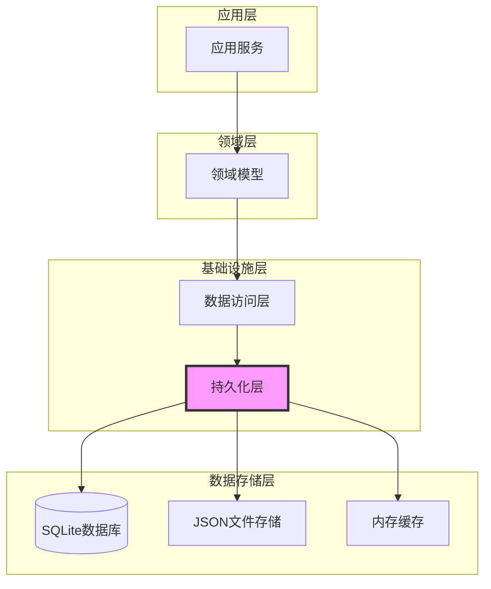
```mermaid
graph TB
    subgraph "应用层"
        APP[应用服务]
    end
    
    subgraph "领域层"
        DOMAIN[领域模型]
    end
    
    subgraph "基础设施层"
        DATA[数据访问层]
        PERSIST[持久化层]
    end
    
    subgraph "数据存储层"
        SQLITE[(SQLite数据库)]
        JSON[JSON文件存储]
        CACHE[内存缓存]
    end
    
    APP --> DOMAIN
    DOMAIN --> DATA
    DATA --> PERSIST
    PERSIST --> SQLITE
    PERSIST --> JSON
    PERSIST --> CACHE
    
    style PERSIST fill:#f9f,stroke:#333,stroke-width:3px
```

### 项目结构定位

本设计文档主要指导以下项目中的实现：

- **Lorn.OpenAgenticAI.Domain.Models**: 领域实体类定义 - 核心业务对象
- **Lorn.OpenAgenticAI.Infrastructure.Data**: 数据访问基础设施 - EF Core上下文和配置（数据库无关）
- **Lorn.OpenAgenticAI.Infrastructure.Data.Sqlite**: SQLite数据库具体实现 - SQLite特定配置和扩展
- **Lorn.OpenAgenticAI.Shared.Contracts**: 数据传输对象 - DTO和接口定义

## 项目依赖关系与Entity Framework Core引用

> **注意**: 关于数据访问层的详细设计，包括项目依赖关系、EF Core配置、仓储模式等内容，请参考：
> - [数据访问层综合技术设计 - DataAccessLayerDesign.md](./DataAccessLayerDesign.md)

本文档专注于**数据结构设计**，即业务实体、值对象、枚举等领域模型的物理设计。数据访问相关的技术实现请查阅上述专门文档。

## 数据存储技术选型

### 存储技术映射

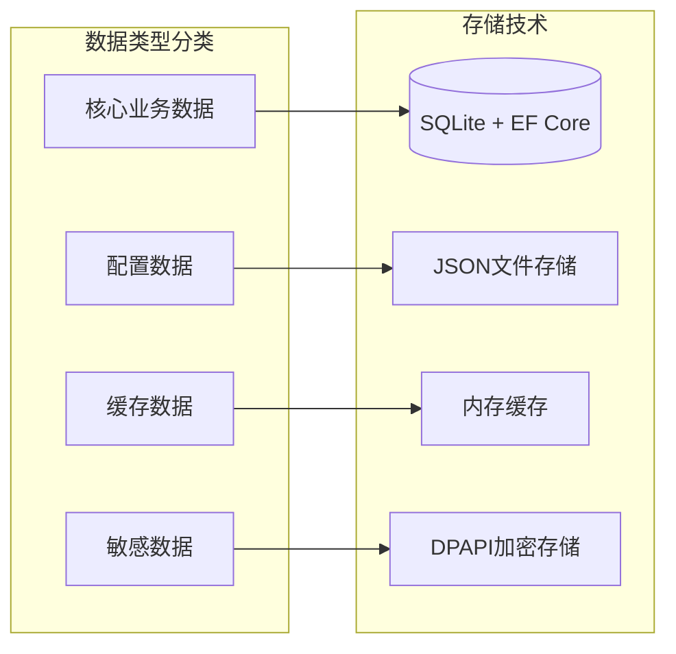
```mermaid
graph LR
    subgraph "数据类型分类"
        CORE[核心业务数据]
        CONFIG[配置数据]
        CACHE_DATA[缓存数据]
        SENSITIVE[敏感数据]
    end
    
    subgraph "存储技术"
        SQLITE[(SQLite + EF Core)]
        JSON_FILE[JSON文件存储]
        MEMORY[内存缓存]
        ENCRYPTED[DPAPI加密存储]
    end
    
    CORE --> SQLITE
    CONFIG --> JSON_FILE
    CACHE_DATA --> MEMORY
    SENSITIVE --> ENCRYPTED
```

### 技术选择说明

| 数据类型     | 存储技术         | .NET技术栈                           | 选择理由                           |
| ------------ | ---------------- | ------------------------------------ | ---------------------------------- |
| 核心业务数据 | SQLite + EF Core | Microsoft.EntityFrameworkCore.Sqlite | 支持LINQ查询、事务完整性、关系模型 |
| 配置数据     | JSON文件         | System.Text.Json                     | 人类可读、版本控制友好、热更新支持 |
| 缓存数据     | 内存缓存         | Microsoft.Extensions.Caching.Memory  | 高性能访问、LRU淘汰策略            |
| 敏感数据     | DPAPI加密        | System.Security.Cryptography         | Windows集成加密、密钥自动管理      |

## 核心实体类设计

### 1. 用户管理实体

#### 1.1 用户档案实体

**项目位置**: `Lorn.OpenAgenticAI.Domain.Models/UserManagement/UserProfile.cs`

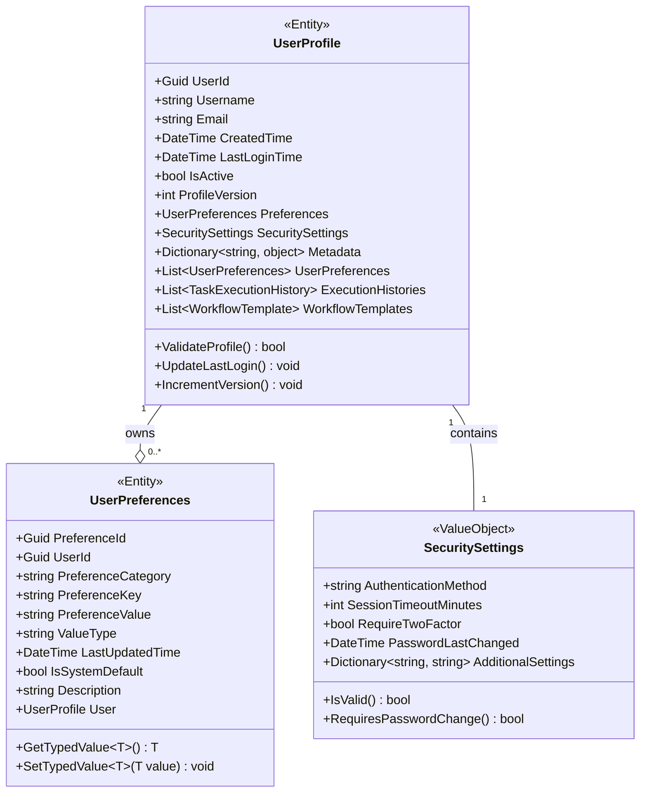
```mermaid
classDiagram
    class UserProfile {
        <<Entity>>
        +Guid UserId
        +string Username
        +string Email
        +DateTime CreatedTime
        +DateTime LastLoginTime
        +bool IsActive
        +int ProfileVersion
        +UserPreferences Preferences
        +SecuritySettings SecuritySettings
        +Dictionary~string, object~ Metadata
        +List~UserPreferences~ UserPreferences
        +List~TaskExecutionHistory~ ExecutionHistories
        +List~WorkflowTemplate~ WorkflowTemplates
        +ValidateProfile() bool
        +UpdateLastLogin() void
        +IncrementVersion() void
    }
    
    class UserPreferences {
        <<Entity>>
        +Guid PreferenceId
        +Guid UserId
        +string PreferenceCategory
        +string PreferenceKey
        +string PreferenceValue
        +string ValueType
        +DateTime LastUpdatedTime
        +bool IsSystemDefault
        +string Description
        +UserProfile User
        +GetTypedValue~T~() T
        +SetTypedValue~T~(T value) void
    }
    
    class SecuritySettings {
        <<ValueObject>>
        +string AuthenticationMethod
        +int SessionTimeoutMinutes
        +bool RequireTwoFactor
        +DateTime PasswordLastChanged
        +Dictionary~string, string~ AdditionalSettings
        +IsValid() bool
        +RequiresPasswordChange() bool
    }
    
    UserProfile "1" --o "0..*" UserPreferences : owns
    UserProfile "1" --"1" SecuritySettings : contains
```

**技术实现要点**：

1. **主键设计**: 使用`Guid`作为主键，确保分布式环境下的唯一性
2. **值对象**: `SecuritySettings`设计为值对象，无独立标识
3. **JSON序列化**: `Metadata`字段使用EF Core的JSON列支持
4. **导航属性**: 配置延迟加载和级联删除策略
5. **领域方法**: 实体包含业务逻辑方法，符合DDD原则

#### 1.2 EF Core配置类

**项目位置**: `Lorn.OpenAgenticAI.Infrastructure.Data/Configurations/UserProfileConfiguration.cs`

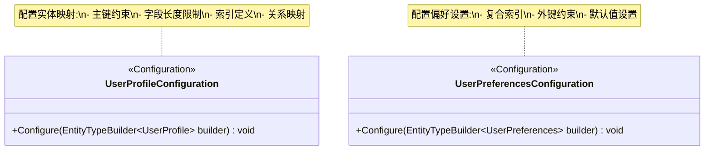
```mermaid
classDiagram
    class UserProfileConfiguration {
        <<Configuration>>
        +Configure(EntityTypeBuilder~UserProfile~ builder) void
    }
    
    class UserPreferencesConfiguration {
        <<Configuration>>
        +Configure(EntityTypeBuilder~UserPreferences~ builder) void
    }
    
    note for UserProfileConfiguration "配置实体映射:\n- 主键约束\n- 字段长度限制\n- 索引定义\n- 关系映射"
    note for UserPreferencesConfiguration "配置偏好设置:\n- 复合索引\n- 外键约束\n- 默认值设置"
```

### 2. 任务执行相关实体

#### 2.1 任务执行历史实体

**项目位置**: `Lorn.OpenAgenticAI.Domain.Models/Execution/TaskExecutionHistory.cs`

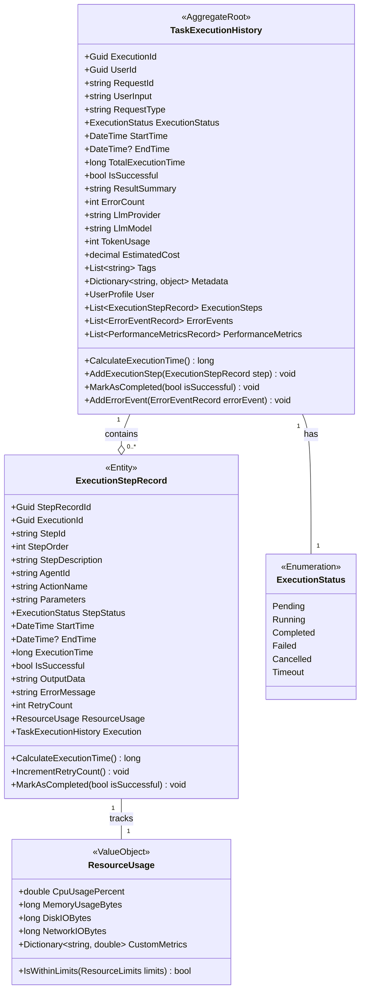
```mermaid
classDiagram
    class TaskExecutionHistory {
        <<AggregateRoot>>
        +Guid ExecutionId
        +Guid UserId
        +string RequestId
        +string UserInput
        +string RequestType
        +ExecutionStatus ExecutionStatus
        +DateTime StartTime
        +DateTime? EndTime
        +long TotalExecutionTime
        +bool IsSuccessful
        +string ResultSummary
        +int ErrorCount
        +string LlmProvider
        +string LlmModel
        +int TokenUsage
        +decimal EstimatedCost
        +List~string~ Tags
        +Dictionary~string, object~ Metadata
        +UserProfile User
        +List~ExecutionStepRecord~ ExecutionSteps
        +List~ErrorEventRecord~ ErrorEvents
        +List~PerformanceMetricsRecord~ PerformanceMetrics
        +CalculateExecutionTime() long
        +AddExecutionStep(ExecutionStepRecord step) void
        +MarkAsCompleted(bool isSuccessful) void
        +AddErrorEvent(ErrorEventRecord errorEvent) void
    }
    
    class ExecutionStepRecord {
        <<Entity>>
        +Guid StepRecordId
        +Guid ExecutionId
        +string StepId
        +int StepOrder
        +string StepDescription
        +string AgentId
        +string ActionName
        +string Parameters
        +ExecutionStatus StepStatus
        +DateTime StartTime
        +DateTime? EndTime
        +long ExecutionTime
        +bool IsSuccessful
        +string OutputData
        +string ErrorMessage
        +int RetryCount
        +ResourceUsage ResourceUsage
        +TaskExecutionHistory Execution
        +CalculateExecutionTime() long
        +IncrementRetryCount() void
        +MarkAsCompleted(bool isSuccessful) void
    }
    
    class ExecutionStatus {
        <<Enumeration>>
        Pending
        Running
        Completed
        Failed
        Cancelled
        Timeout
    }
    
    class ResourceUsage {
        <<ValueObject>>
        +double CpuUsagePercent
        +long MemoryUsageBytes
        +long DiskIOBytes
        +long NetworkIOBytes
        +Dictionary~string, double~ CustomMetrics
        +IsWithinLimits(ResourceLimits limits) bool
    }
    
    TaskExecutionHistory "1" --o "0..*" ExecutionStepRecord : contains
    TaskExecutionHistory "1"--"1" ExecutionStatus : has
    ExecutionStepRecord "1" -- "1" ResourceUsage : tracks
```

**技术实现要点**：

1. **聚合根**: `TaskExecutionHistory`作为聚合根，控制整个执行过程的一致性
2. **枚举类型**: `ExecutionStatus`使用强类型枚举，EF Core配置为字符串存储
3. **计算属性**: 执行时间等计算属性不持久化，通过方法动态计算
4. **复杂类型**: `ResourceUsage`配置为拥有实体或JSON序列化
5. **索引策略**: 针对查询模式设计复合索引

#### 2.2 工作流模板实体

**项目位置**: `Lorn.OpenAgenticAI.Domain.Models/Workflow/WorkflowTemplate.cs`

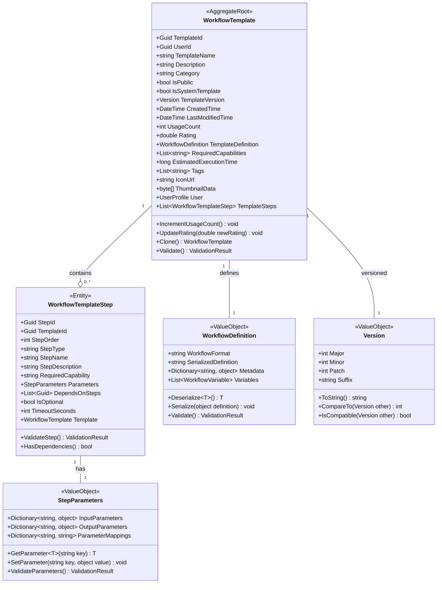
```mermaid
classDiagram
    class WorkflowTemplate {
        <<AggregateRoot>>
        +Guid TemplateId
        +Guid UserId
        +string TemplateName
        +string Description
        +string Category
        +bool IsPublic
        +bool IsSystemTemplate
        +Version TemplateVersion
        +DateTime CreatedTime
        +DateTime LastModifiedTime
        +int UsageCount
        +double Rating
        +WorkflowDefinition TemplateDefinition
        +List~string~ RequiredCapabilities
        +long EstimatedExecutionTime
        +List~string~ Tags
        +string IconUrl
        +byte[] ThumbnailData
        +UserProfile User
        +List~WorkflowTemplateStep~ TemplateSteps
        +IncrementUsageCount() void
        +UpdateRating(double newRating) void
        +Clone() WorkflowTemplate
        +Validate() ValidationResult
    }
    
    class WorkflowTemplateStep {
        <<Entity>>
        +Guid StepId
        +Guid TemplateId
        +int StepOrder
        +string StepType
        +string StepName
        +string StepDescription
        +string RequiredCapability
        +StepParameters Parameters
        +List~Guid~ DependsOnSteps
        +bool IsOptional
        +int TimeoutSeconds
        +WorkflowTemplate Template
        +ValidateStep() ValidationResult
        +HasDependencies() bool
    }
    
    class WorkflowDefinition {
        <<ValueObject>>
        +string WorkflowFormat
        +string SerializedDefinition
        +Dictionary~string, object~ Metadata
        +List~WorkflowVariable~ Variables
        +Deserialize~T~() T
        +Serialize(object definition) void
        +Validate() ValidationResult
    }
    
    class StepParameters {
        <<ValueObject>>
        +Dictionary~string, object~ InputParameters
        +Dictionary~string, object~ OutputParameters
        +Dictionary~string, string~ ParameterMappings
        +GetParameter~T~(string key) T
        +SetParameter(string key, object value) void
        +ValidateParameters() ValidationResult
    }
    
    class Version {
        <<ValueObject>>
        +int Major
        +int Minor
        +int Patch
        +string Suffix
        +ToString() string
        +CompareTo(Version other) int
        +IsCompatible(Version other) bool
    }
    
    WorkflowTemplate "1" --o "0..*" WorkflowTemplateStep : contains
    WorkflowTemplate "1" -- "1" WorkflowDefinition : defines
    WorkflowTemplateStep "1" -- "1" StepParameters : has
    WorkflowTemplate "1" -- "1" Version : versioned
```

### 3. 能力管理相关实体

#### 3.1 模型能力注册表

**项目位置**: `Lorn.OpenAgenticAI.Domain.Models/Capabilities/ModelCapabilityRegistry.cs`

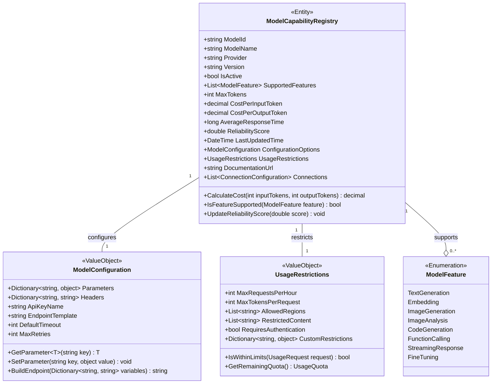
```mermaid
classDiagram
    class ModelCapabilityRegistry {
        <<Entity>>
        +string ModelId
        +string ModelName
        +string Provider
        +string Version
        +bool IsActive
        +List~ModelFeature~ SupportedFeatures
        +int MaxTokens
        +decimal CostPerInputToken
        +decimal CostPerOutputToken
        +long AverageResponseTime
        +double ReliabilityScore
        +DateTime LastUpdatedTime
        +ModelConfiguration ConfigurationOptions
        +UsageRestrictions UsageRestrictions
        +string DocumentationUrl
        +List~ConnectionConfiguration~ Connections
        +CalculateCost(int inputTokens, int outputTokens) decimal
        +IsFeatureSupported(ModelFeature feature) bool
        +UpdateReliabilityScore(double score) void
    }
    
    class ModelFeature {
        <<Enumeration>>
        TextGeneration
        Embedding
        ImageGeneration
        ImageAnalysis
        CodeGeneration
        FunctionCalling
        StreamingResponse
        FineTuning
    }
    
    class ModelConfiguration {
        <<ValueObject>>
        +Dictionary~string, object~ Parameters
        +Dictionary~string, string~ Headers
        +string ApiKeyName
        +string EndpointTemplate
        +int DefaultTimeout
        +int MaxRetries
        +GetParameter~T~(string key) T
        +SetParameter(string key, object value) void
        +BuildEndpoint(Dictionary~string, string~ variables) string
    }
    
    class UsageRestrictions {
        <<ValueObject>>
        +int MaxRequestsPerHour
        +int MaxTokensPerRequest
        +List~string~ AllowedRegions
        +List~string~ RestrictedContent
        +bool RequiresAuthentication
        +Dictionary~string, object~ CustomRestrictions
        +IsWithinLimits(UsageRequest request) bool
        +GetRemainingQuota() UsageQuota
    }
    
    ModelCapabilityRegistry "1" -- "1" ModelConfiguration : configures
    ModelCapabilityRegistry "1" -- "1" UsageRestrictions : restricts
    ModelCapabilityRegistry "1" --o "0..*" ModelFeature : supports
```

#### 3.2 Agent能力注册表

**项目位置**: `Lorn.OpenAgenticAI.Domain.Models/Capabilities/AgentCapabilityRegistry.cs`

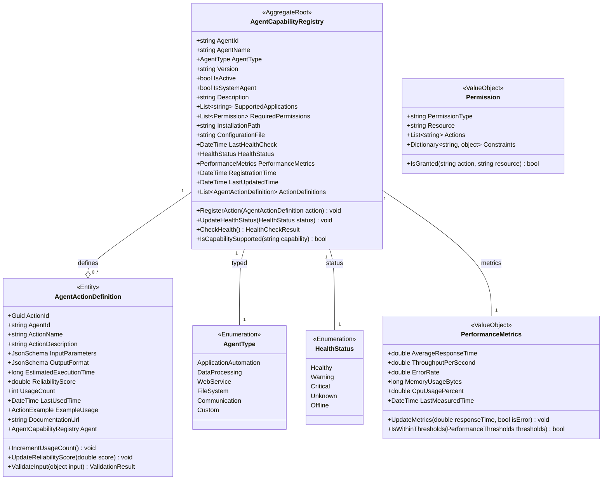
```mermaid
classDiagram
    class AgentCapabilityRegistry {
        <<AggregateRoot>>
        +string AgentId
        +string AgentName
        +AgentType AgentType
        +string Version
        +bool IsActive
        +bool IsSystemAgent
        +string Description
        +List~string~ SupportedApplications
        +List~Permission~ RequiredPermissions
        +string InstallationPath
        +string ConfigurationFile
        +DateTime LastHealthCheck
        +HealthStatus HealthStatus
        +PerformanceMetrics PerformanceMetrics
        +DateTime RegistrationTime
        +DateTime LastUpdatedTime
        +List~AgentActionDefinition~ ActionDefinitions
        +RegisterAction(AgentActionDefinition action) void
        +UpdateHealthStatus(HealthStatus status) void
        +CheckHealth() HealthCheckResult
        +IsCapabilitySupported(string capability) bool
    }
    
    class AgentActionDefinition {
        <<Entity>>
        +Guid ActionId
        +string AgentId
        +string ActionName
        +string ActionDescription
        +JsonSchema InputParameters
        +JsonSchema OutputFormat
        +long EstimatedExecutionTime
        +double ReliabilityScore
        +int UsageCount
        +DateTime LastUsedTime
        +ActionExample ExampleUsage
        +string DocumentationUrl
        +AgentCapabilityRegistry Agent
        +IncrementUsageCount() void
        +UpdateReliabilityScore(double score) void
        +ValidateInput(object input) ValidationResult
    }
    
    class AgentType {
        <<Enumeration>>
        ApplicationAutomation
        DataProcessing
        WebService
        FileSystem
        Communication
        Custom
    }
    
    class HealthStatus {
        <<Enumeration>>
        Healthy
        Warning
        Critical
        Unknown
        Offline
    }
    
    class Permission {
        <<ValueObject>>
        +string PermissionType
        +string Resource
        +List~string~ Actions
        +Dictionary~string, object~ Constraints
        +IsGranted(string action, string resource) bool
    }
    
    class PerformanceMetrics {
        <<ValueObject>>
        +double AverageResponseTime
        +double ThroughputPerSecond
        +double ErrorRate
        +long MemoryUsageBytes
        +double CpuUsagePercent
        +DateTime LastMeasuredTime
        +UpdateMetrics(double responseTime, bool isError) void
        +IsWithinThresholds(PerformanceThresholds thresholds) bool
    }
    
    AgentCapabilityRegistry "1" --o "0..*" AgentActionDefinition : defines
    AgentCapabilityRegistry "1" -- "1" AgentType : typed
    AgentCapabilityRegistry "1" -- "1" HealthStatus : status
    AgentCapabilityRegistry "1" -- "1" PerformanceMetrics : metrics
```

### 4. LLM管理相关实体

#### 4.1 模型服务提供商实体

**项目位置**: `Lorn.OpenAgenticAI.Domain.Models/LLM/ModelProvider.cs`

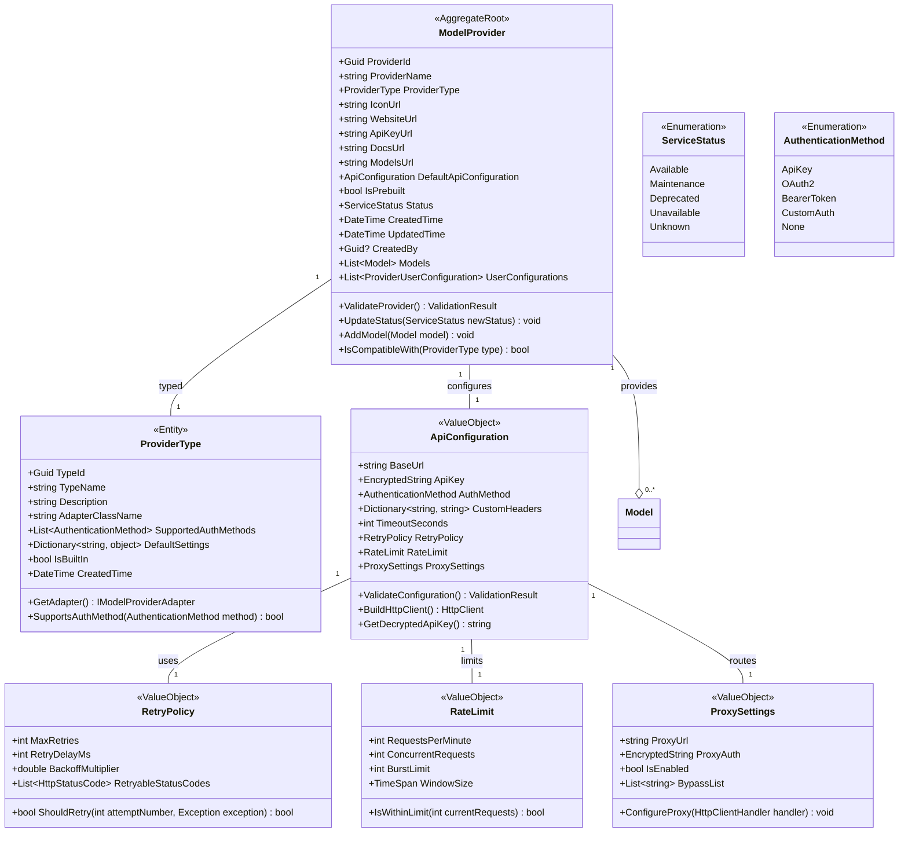
```mermaid
classDiagram
    class ModelProvider {
        <<AggregateRoot>>
        +Guid ProviderId
        +string ProviderName
        +ProviderType ProviderType
        +string IconUrl
        +string WebsiteUrl
        +string ApiKeyUrl
        +string DocsUrl
        +string ModelsUrl
        +ApiConfiguration DefaultApiConfiguration
        +bool IsPrebuilt
        +ServiceStatus Status
        +DateTime CreatedTime
        +DateTime UpdatedTime
        +Guid? CreatedBy
        +List~Model~ Models
        +List~ProviderUserConfiguration~ UserConfigurations
        +ValidateProvider() ValidationResult
        +UpdateStatus(ServiceStatus newStatus) void
        +AddModel(Model model) void
        +IsCompatibleWith(ProviderType type) bool
    }
    
    class ProviderType {
        <<Entity>>
        +Guid TypeId
        +string TypeName
        +string Description
        +string AdapterClassName
        +List~AuthenticationMethod~ SupportedAuthMethods
        +Dictionary~string, object~ DefaultSettings
        +bool IsBuiltIn
        +DateTime CreatedTime
        +GetAdapter() IModelProviderAdapter
        +SupportsAuthMethod(AuthenticationMethod method) bool
    }
    
    class ApiConfiguration {
        <<ValueObject>>
        +string BaseUrl
        +EncryptedString ApiKey
        +AuthenticationMethod AuthMethod
        +Dictionary~string, string~ CustomHeaders
        +int TimeoutSeconds
        +RetryPolicy RetryPolicy
        +RateLimit RateLimit
        +ProxySettings ProxySettings
        +ValidateConfiguration() ValidationResult
        +BuildHttpClient() HttpClient
        +GetDecryptedApiKey() string
    }
    
    class RetryPolicy {
        <<ValueObject>>
        +int MaxRetries
        +int RetryDelayMs
        +double BackoffMultiplier
        +List~HttpStatusCode~ RetryableStatusCodes
        +bool ShouldRetry(int attemptNumber, Exception exception) bool
    }
    
    class RateLimit {
        <<ValueObject>>
        +int RequestsPerMinute
        +int ConcurrentRequests
        +int BurstLimit
        +TimeSpan WindowSize
        +IsWithinLimit(int currentRequests) bool
    }
    
    class ProxySettings {
        <<ValueObject>>
        +string ProxyUrl
        +EncryptedString ProxyAuth
        +bool IsEnabled
        +List~string~ BypassList
        +ConfigureProxy(HttpClientHandler handler) void
    }
    
    class ServiceStatus {
        <<Enumeration>>
        Available
        Maintenance
        Deprecated
        Unavailable
        Unknown
    }
    
    class AuthenticationMethod {
        <<Enumeration>>
        ApiKey
        OAuth2
        BearerToken
        CustomAuth
        None
    }
    
    ModelProvider "1" -- "1" ProviderType : typed
    ModelProvider "1" -- "1" ApiConfiguration : configures
    ModelProvider "1" --o "0..*" Model : provides
    ApiConfiguration "1" -- "1" RetryPolicy : uses
    ApiConfiguration "1" -- "1" RateLimit : limits
    ApiConfiguration "1" -- "1" ProxySettings : routes
```

#### 4.2 模型实体

**项目位置**: `Lorn.OpenAgenticAI.Domain.Models/LLM/Model.cs`

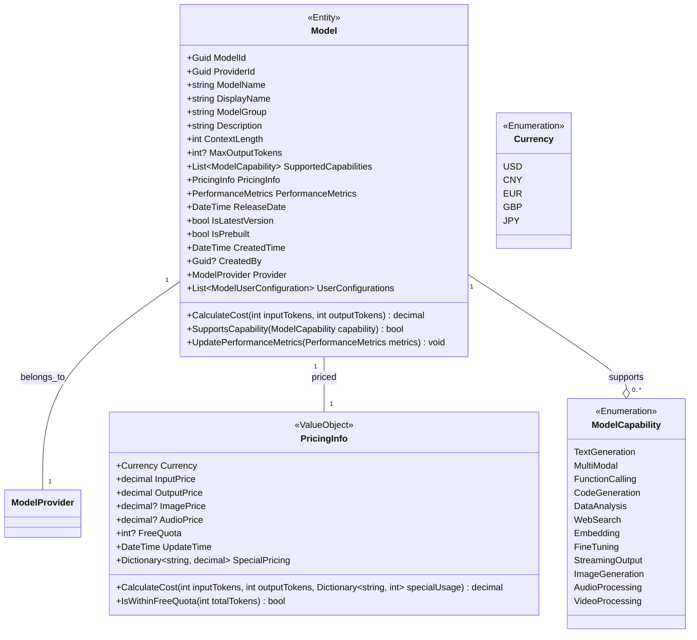
```mermaid
classDiagram
    class Model {
        <<Entity>>
        +Guid ModelId
        +Guid ProviderId
        +string ModelName
        +string DisplayName
        +string ModelGroup
        +string Description
        +int ContextLength
        +int? MaxOutputTokens
        +List~ModelCapability~ SupportedCapabilities
        +PricingInfo PricingInfo
        +PerformanceMetrics PerformanceMetrics
        +DateTime ReleaseDate
        +bool IsLatestVersion
        +bool IsPrebuilt
        +DateTime CreatedTime
        +Guid? CreatedBy
        +ModelProvider Provider
        +List~ModelUserConfiguration~ UserConfigurations
        +CalculateCost(int inputTokens, int outputTokens) decimal
        +SupportsCapability(ModelCapability capability) bool
        +UpdatePerformanceMetrics(PerformanceMetrics metrics) void
    }
    
    class ModelCapability {
        <<Enumeration>>
        TextGeneration
        MultiModal
        FunctionCalling
        CodeGeneration
        DataAnalysis
        WebSearch
        Embedding
        FineTuning
        StreamingOutput
        ImageGeneration
        AudioProcessing
        VideoProcessing
    }
    
    class PricingInfo {
        <<ValueObject>>
        +Currency Currency
        +decimal InputPrice
        +decimal OutputPrice
        +decimal? ImagePrice
        +decimal? AudioPrice
        +int? FreeQuota
        +DateTime UpdateTime
        +Dictionary~string, decimal~ SpecialPricing
        +CalculateCost(int inputTokens, int outputTokens, Dictionary~string, int~ specialUsage) decimal
        +IsWithinFreeQuota(int totalTokens) bool
    }
    
    class Currency {
        <<Enumeration>>
        USD
        CNY
        EUR
        GBP
        JPY
    }
    
    Model "1" -- "1" ModelProvider : belongs_to
    Model "1" -- "1" PricingInfo : priced
    Model "1" --o "0..*" ModelCapability : supports
```

#### 4.3 用户配置实体

**项目位置**: `Lorn.OpenAgenticAI.Domain.Models/LLM/ProviderUserConfiguration.cs`

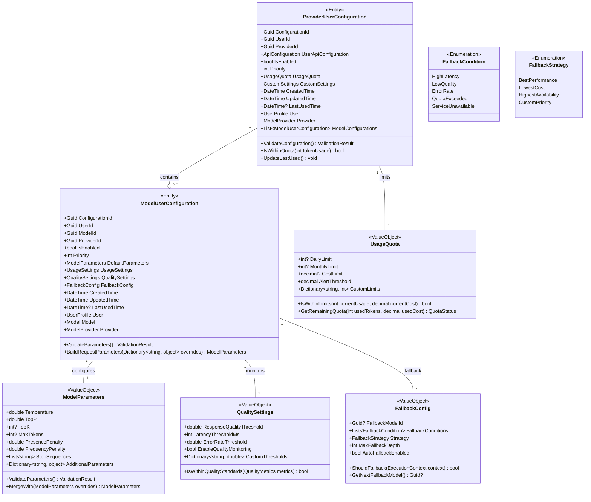
```mermaid
classDiagram
    class ProviderUserConfiguration {
        <<Entity>>
        +Guid ConfigurationId
        +Guid UserId
        +Guid ProviderId
        +ApiConfiguration UserApiConfiguration
        +bool IsEnabled
        +int Priority
        +UsageQuota UsageQuota
        +CustomSettings CustomSettings
        +DateTime CreatedTime
        +DateTime UpdatedTime
        +DateTime? LastUsedTime
        +UserProfile User
        +ModelProvider Provider
        +List~ModelUserConfiguration~ ModelConfigurations
        +ValidateConfiguration() ValidationResult
        +IsWithinQuota(int tokenUsage) bool
        +UpdateLastUsed() void
    }
    
    class ModelUserConfiguration {
        <<Entity>>
        +Guid ConfigurationId
        +Guid UserId
        +Guid ModelId
        +Guid ProviderId
        +bool IsEnabled
        +int Priority
        +ModelParameters DefaultParameters
        +UsageSettings UsageSettings
        +QualitySettings QualitySettings
        +FallbackConfig FallbackConfig
        +DateTime CreatedTime
        +DateTime UpdatedTime
        +DateTime? LastUsedTime
        +UserProfile User
        +Model Model
        +ModelProvider Provider
        +ValidateParameters() ValidationResult
        +BuildRequestParameters(Dictionary~string, object~ overrides) ModelParameters
    }
    
    class UsageQuota {
        <<ValueObject>>
        +int? DailyLimit
        +int? MonthlyLimit
        +decimal? CostLimit
        +decimal AlertThreshold
        +Dictionary~string, int~ CustomLimits
        +IsWithinLimits(int currentUsage, decimal currentCost) bool
        +GetRemainingQuota(int usedTokens, decimal usedCost) QuotaStatus
    }
    
    class ModelParameters {
        <<ValueObject>>
        +double Temperature
        +double TopP
        +int? TopK
        +int? MaxTokens
        +double PresencePenalty
        +double FrequencyPenalty
        +List~string~ StopSequences
        +Dictionary~string, object~ AdditionalParameters
        +ValidateParameters() ValidationResult
        +MergeWith(ModelParameters overrides) ModelParameters
    }
    
    class QualitySettings {
        <<ValueObject>>
        +double ResponseQualityThreshold
        +int LatencyThresholdMs
        +double ErrorRateThreshold
        +bool EnableQualityMonitoring
        +Dictionary~string, double~ CustomThresholds
        +IsWithinQualityStandards(QualityMetrics metrics) bool
    }
    
    class FallbackConfig {
        <<ValueObject>>
        +Guid? FallbackModelId
        +List~FallbackCondition~ FallbackConditions
        +FallbackStrategy Strategy
        +int MaxFallbackDepth
        +bool AutoFallbackEnabled
        +ShouldFallback(ExecutionContext context) bool
        +GetNextFallbackModel() Guid?
    }
    
    class FallbackCondition {
        <<Enumeration>>
        HighLatency
        LowQuality
        ErrorRate
        QuotaExceeded
        ServiceUnavailable
    }
    
    class FallbackStrategy {
        <<Enumeration>>
        BestPerformance
        LowestCost
        HighestAvailability
        CustomPriority
    }
    
    ProviderUserConfiguration "1" --o "0..*" ModelUserConfiguration : contains
    ProviderUserConfiguration "1" -- "1" UsageQuota : limits
    ModelUserConfiguration "1" -- "1" ModelParameters : configures
    ModelUserConfiguration "1" -- "1" QualitySettings : monitors
    ModelUserConfiguration "1" -- "1" FallbackConfig : fallback
```

### 5. MCP配置相关实体

#### 5.1 MCP配置实体

**项目位置**: `Lorn.OpenAgenticAI.Domain.Models/MCP/MCPConfiguration.cs`

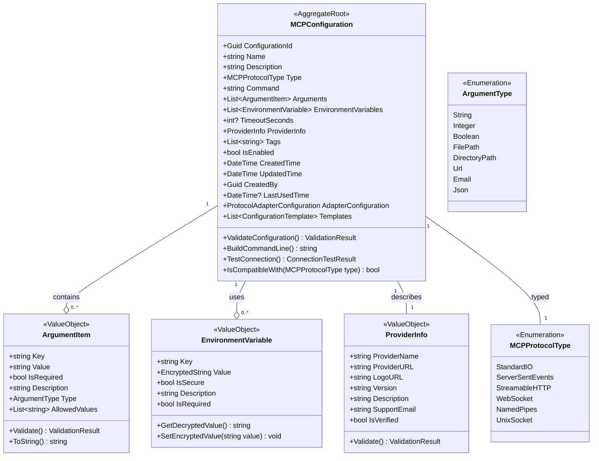
```mermaid
classDiagram
    class MCPConfiguration {
        <<AggregateRoot>>
        +Guid ConfigurationId
        +string Name
        +string Description
        +MCPProtocolType Type
        +string Command
        +List~ArgumentItem~ Arguments
        +List~EnvironmentVariable~ EnvironmentVariables
        +int? TimeoutSeconds
        +ProviderInfo ProviderInfo
        +List~string~ Tags
        +bool IsEnabled
        +DateTime CreatedTime
        +DateTime UpdatedTime
        +Guid CreatedBy
        +DateTime? LastUsedTime
        +ProtocolAdapterConfiguration AdapterConfiguration
        +List~ConfigurationTemplate~ Templates
        +ValidateConfiguration() ValidationResult
        +BuildCommandLine() string
        +TestConnection() ConnectionTestResult
        +IsCompatibleWith(MCPProtocolType type) bool
    }
    
    class MCPProtocolType {
        <<Enumeration>>
        StandardIO
        ServerSentEvents
        StreamableHTTP
        WebSocket
        NamedPipes
        UnixSocket
    }
    
    class ArgumentItem {
        <<ValueObject>>
        +string Key
        +string Value
        +bool IsRequired
        +string Description
        +ArgumentType Type
        +List~string~ AllowedValues
        +Validate() ValidationResult
        +ToString() string
    }
    
    class EnvironmentVariable {
        <<ValueObject>>
        +string Key
        +EncryptedString Value
        +bool IsSecure
        +string Description
        +bool IsRequired
        +GetDecryptedValue() string
        +SetEncryptedValue(string value) void
    }
    
    class ProviderInfo {
        <<ValueObject>>
        +string ProviderName
        +string ProviderURL
        +string LogoURL
        +string Version
        +string Description
        +string SupportEmail
        +bool IsVerified
        +Validate() ValidationResult
    }
    
    class ArgumentType {
        <<Enumeration>>
        String
        Integer
        Boolean
        FilePath
        DirectoryPath
        Url
        Email
        Json
    }
    
    MCPConfiguration "1" --o "0..*" ArgumentItem : contains
    MCPConfiguration "1" --o "0..*" EnvironmentVariable : uses
    MCPConfiguration "1" -- "1" ProviderInfo : describes
    MCPConfiguration "1" -- "1" MCPProtocolType : typed
```

#### 5.2 协议适配器配置实体

**项目位置**: `Lorn.OpenAgenticAI.Domain.Models/MCP/ProtocolAdapterConfiguration.cs`

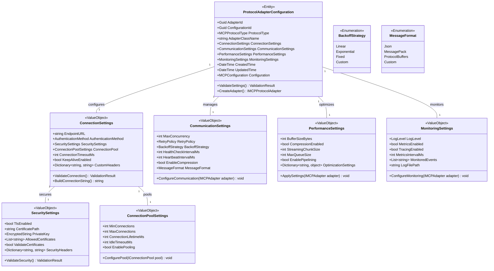
```mermaid
classDiagram
    class ProtocolAdapterConfiguration {
        <<Entity>>
        +Guid AdapterId
        +Guid ConfigurationId
        +MCPProtocolType ProtocolType
        +string AdapterClassName
        +ConnectionSettings ConnectionSettings
        +CommunicationSettings CommunicationSettings
        +PerformanceSettings PerformanceSettings
        +MonitoringSettings MonitoringSettings
        +DateTime CreatedTime
        +DateTime UpdatedTime
        +MCPConfiguration Configuration
        +ValidateSettings() ValidationResult
        +CreateAdapter() IMCPProtocolAdapter
    }
    
    class ConnectionSettings {
        <<ValueObject>>
        +string EndpointURL
        +AuthenticationMethod AuthenticationMethod
        +SecuritySettings SecuritySettings
        +ConnectionPoolSettings ConnectionPool
        +int ConnectionTimeoutMs
        +bool KeepAliveEnabled
        +Dictionary~string, string~ CustomHeaders
        +ValidateConnection() ValidationResult
        +BuildConnectionString() string
    }
    
    class CommunicationSettings {
        <<ValueObject>>
        +int MaxConcurrency
        +RetryPolicy RetryPolicy
        +BackoffStrategy BackoffStrategy
        +int HealthCheckIntervalMs
        +int HeartbeatIntervalMs
        +bool EnableCompression
        +MessageFormat MessageFormat
        +ConfigureCommunication(IMCPAdapter adapter) void
    }
    
    class PerformanceSettings {
        <<ValueObject>>
        +int BufferSizeBytes
        +bool CompressionEnabled
        +int StreamingChunkSize
        +int MaxQueueSize
        +bool EnablePipelining
        +Dictionary~string, object~ OptimizationSettings
        +ApplySettings(IMCPAdapter adapter) void
    }
    
    class MonitoringSettings {
        <<ValueObject>>
        +LogLevel LogLevel
        +bool MetricsEnabled
        +bool TracingEnabled
        +int MetricsIntervalMs
        +List~string~ MonitoredEvents
        +string LogFilePath
        +ConfigureMonitoring(IMCPAdapter adapter) void
    }
    
    class SecuritySettings {
        <<ValueObject>>
        +bool TlsEnabled
        +string CertificatePath
        +EncryptedString PrivateKey
        +List~string~ AllowedCertificates
        +bool ValidateCertificates
        +Dictionary~string, string~ SecurityHeaders
        +ValidateSecurity() ValidationResult
    }
    
    class ConnectionPoolSettings {
        <<ValueObject>>
        +int MinConnections
        +int MaxConnections
        +int ConnectionLifetimeMs
        +int IdleTimeoutMs
        +bool EnablePooling
        +ConfigurePool(IConnectionPool pool) void
    }
    
    class BackoffStrategy {
        <<Enumeration>>
        Linear
        Exponential
        Fixed
        Custom
    }
    
    class MessageFormat {
        <<Enumeration>>
        Json
        MessagePack
        ProtocolBuffers
        Custom
    }
    
    ProtocolAdapterConfiguration "1" -- "1" ConnectionSettings : configures
    ProtocolAdapterConfiguration "1" -- "1" CommunicationSettings : manages
    ProtocolAdapterConfiguration "1" -- "1" PerformanceSettings : optimizes
    ProtocolAdapterConfiguration "1" -- "1" MonitoringSettings : monitors
    ConnectionSettings "1" -- "1" SecuritySettings : secures
    ConnectionSettings "1" -- "1" ConnectionPoolSettings : pools
```

#### 5.3 配置模板实体

**项目位置**: `Lorn.OpenAgenticAI.Domain.Models/MCP/ConfigurationTemplate.cs`

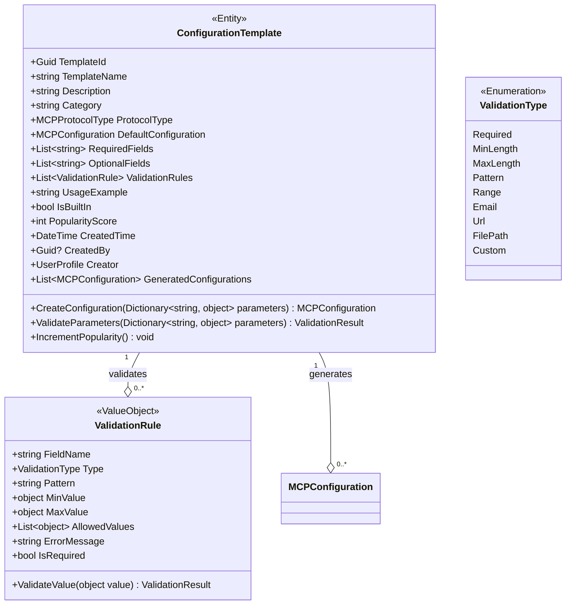
```mermaid
classDiagram
    class ConfigurationTemplate {
        <<Entity>>
        +Guid TemplateId
        +string TemplateName
        +string Description
        +string Category
        +MCPProtocolType ProtocolType
        +MCPConfiguration DefaultConfiguration
        +List~string~ RequiredFields
        +List~string~ OptionalFields
        +List~ValidationRule~ ValidationRules
        +string UsageExample
        +bool IsBuiltIn
        +int PopularityScore
        +DateTime CreatedTime
        +Guid? CreatedBy
        +UserProfile Creator
        +List~MCPConfiguration~ GeneratedConfigurations
        +CreateConfiguration(Dictionary~string, object~ parameters) MCPConfiguration
        +ValidateParameters(Dictionary~string, object~ parameters) ValidationResult
        +IncrementPopularity() void
    }
    
    class ValidationRule {
        <<ValueObject>>
        +string FieldName
        +ValidationType Type
        +string Pattern
        +object MinValue
        +object MaxValue
        +List~object~ AllowedValues
        +string ErrorMessage
        +bool IsRequired
        +ValidateValue(object value) ValidationResult
    }
    
    class ValidationType {
        <<Enumeration>>
        Required
        MinLength
        MaxLength
        Pattern
        Range
        Email
        Url
        FilePath
        Custom
    }
    
    ConfigurationTemplate "1" --o "0..*" ValidationRule : validates
    ConfigurationTemplate "1" --o "0..*" MCPConfiguration : generates
```

### 技术实现要点

#### EF Core配置类设计

**项目位置**: `Lorn.OpenAgenticAI.Infrastructure.Data/Configurations/`

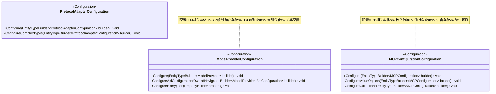
```mermaid
classDiagram
    class ModelProviderConfiguration {
        <<Configuration>>
        +Configure(EntityTypeBuilder~ModelProvider~ builder) void
        -ConfigureApiConfiguration(OwnedNavigationBuilder~ModelProvider, ApiConfiguration~ builder) void
        -ConfigureEncryption(PropertyBuilder property) void
    }
    
    class MCPConfigurationConfiguration {
        <<Configuration>>
        +Configure(EntityTypeBuilder~MCPConfiguration~ builder) void
        -ConfigureValueObjects(EntityTypeBuilder~MCPConfiguration~ builder) void
        -ConfigureCollections(EntityTypeBuilder~MCPConfiguration~ builder) void
    }
    
    class ProtocolAdapterConfiguration {
        <<Configuration>>
        +Configure(EntityTypeBuilder~ProtocolAdapterConfiguration~ builder) void
        -ConfigureComplexTypes(EntityTypeBuilder~ProtocolAdapterConfiguration~ builder) void
    }
    
    note for ModelProviderConfiguration "配置LLM相关实体:\n- API密钥加密存储\n- JSON列映射\n- 索引优化\n- 关系配置"
    note for MCPConfigurationConfiguration "配置MCP相关实体:\n- 枚举转换\n- 值对象映射\n- 集合存储\n- 验证规则"
```

## 数据库上下文设计

### EF Core DbContext设计

**项目位置**: `Lorn.OpenAgenticAI.Infrastructure.Data/OpenAgenticAIDbContext.cs`

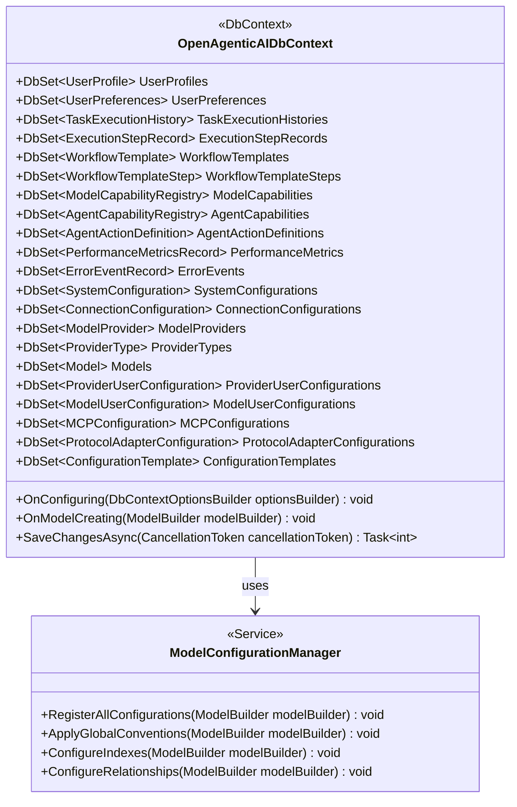
```mermaid
classDiagram
    class OpenAgenticAIDbContext {
        <<DbContext>>
        +DbSet~UserProfile~ UserProfiles
        +DbSet~UserPreferences~ UserPreferences
        +DbSet~TaskExecutionHistory~ TaskExecutionHistories
        +DbSet~ExecutionStepRecord~ ExecutionStepRecords
        +DbSet~WorkflowTemplate~ WorkflowTemplates
        +DbSet~WorkflowTemplateStep~ WorkflowTemplateSteps
        +DbSet~ModelCapabilityRegistry~ ModelCapabilities
        +DbSet~AgentCapabilityRegistry~ AgentCapabilities
        +DbSet~AgentActionDefinition~ AgentActionDefinitions
        +DbSet~PerformanceMetricsRecord~ PerformanceMetrics
        +DbSet~ErrorEventRecord~ ErrorEvents
        +DbSet~SystemConfiguration~ SystemConfigurations
        +DbSet~ConnectionConfiguration~ ConnectionConfigurations
        +DbSet~ModelProvider~ ModelProviders
        +DbSet~ProviderType~ ProviderTypes
        +DbSet~Model~ Models
        +DbSet~ProviderUserConfiguration~ ProviderUserConfigurations
        +DbSet~ModelUserConfiguration~ ModelUserConfigurations
        +DbSet~MCPConfiguration~ MCPConfigurations
        +DbSet~ProtocolAdapterConfiguration~ ProtocolAdapterConfigurations
        +DbSet~ConfigurationTemplate~ ConfigurationTemplates
        +OnConfiguring(DbContextOptionsBuilder optionsBuilder) void
        +OnModelCreating(ModelBuilder modelBuilder) void
        +SaveChangesAsync(CancellationToken cancellationToken) Task~int~
    }
    
    class ModelConfigurationManager {
        <<Service>>
        +RegisterAllConfigurations(ModelBuilder modelBuilder) void
        +ApplyGlobalConventions(ModelBuilder modelBuilder) void
        +ConfigureIndexes(ModelBuilder modelBuilder) void
        +ConfigureRelationships(ModelBuilder modelBuilder) void
    }
    
    OpenAgenticAIDbContext --> ModelConfigurationManager : uses
```

### 配置策略设计

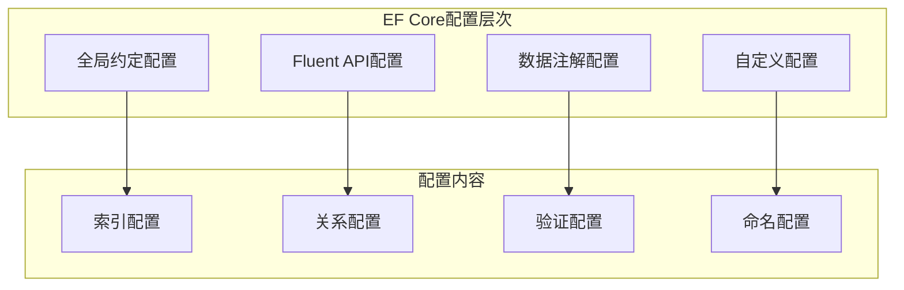
```mermaid
graph TB
    subgraph "EF Core配置层次"
        CONV[全局约定配置]
        FLUENT[Fluent API配置]
        ATTR[数据注解配置]
        CUSTOM[自定义配置]
    end
    
    subgraph "配置内容"
        IDX[索引配置]
        REL[关系配置]
        VALID[验证配置]
        NAMING[命名配置]
    end
    
    CONV --> IDX
    FLUENT --> REL
    ATTR --> VALID
    CUSTOM --> NAMING
```

**配置实现策略**：

1. **约定优于配置**: 使用EF Core约定减少显式配置
2. **类型化配置**: 为每个实体创建专门的配置类
3. **索引策略**: 基于查询模式配置性能索引
4. **关系映射**: 明确定义外键约束和级联行为
5. **数据验证**: 在实体层面添加验证逻辑

## 数据传输对象设计

### DTO设计模式

**项目位置**: `Lorn.OpenAgenticAI.Shared.Contracts/DTOs/`

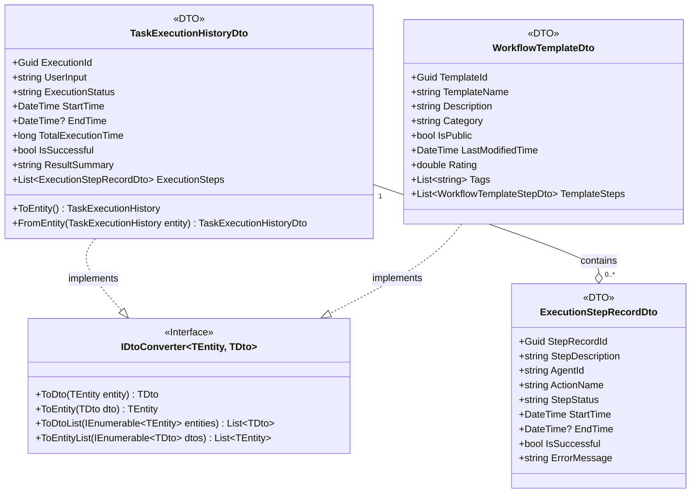
```mermaid
classDiagram
    class TaskExecutionHistoryDto {
        <<DTO>>
        +Guid ExecutionId
        +string UserInput
        +string ExecutionStatus
        +DateTime StartTime
        +DateTime? EndTime
        +long TotalExecutionTime
        +bool IsSuccessful
        +string ResultSummary
        +List~ExecutionStepRecordDto~ ExecutionSteps
        +ToEntity() TaskExecutionHistory
        +FromEntity(TaskExecutionHistory entity) TaskExecutionHistoryDto
    }
    
    class ExecutionStepRecordDto {
        <<DTO>>
        +Guid StepRecordId
        +string StepDescription
        +string AgentId
        +string ActionName
        +string StepStatus
        +DateTime StartTime
        +DateTime? EndTime
        +bool IsSuccessful
        +string ErrorMessage
    }
    
    class WorkflowTemplateDto {
        <<DTO>>
        +Guid TemplateId
        +string TemplateName
        +string Description
        +string Category
        +bool IsPublic
        +DateTime LastModifiedTime
        +double Rating
        +List~string~ Tags
        +List~WorkflowTemplateStepDto~ TemplateSteps
    }
    
    class IDtoConverter~TEntity, TDto~ {
        <<Interface>>
        +ToDto(TEntity entity) TDto
        +ToEntity(TDto dto) TEntity
        +ToDtoList(IEnumerable~TEntity~ entities) List~TDto~
        +ToEntityList(IEnumerable~TDto~ dtos) List~TEntity~
    }
    
    TaskExecutionHistoryDto ..|> IDtoConverter : implements
    WorkflowTemplateDto ..|> IDtoConverter : implements
    TaskExecutionHistoryDto "1" --o "0..*" ExecutionStepRecordDto : contains
```

### AutoMapper配置

**项目位置**: `Lorn.OpenAgenticAI.Infrastructure.Data/Mapping/MappingProfile.cs`

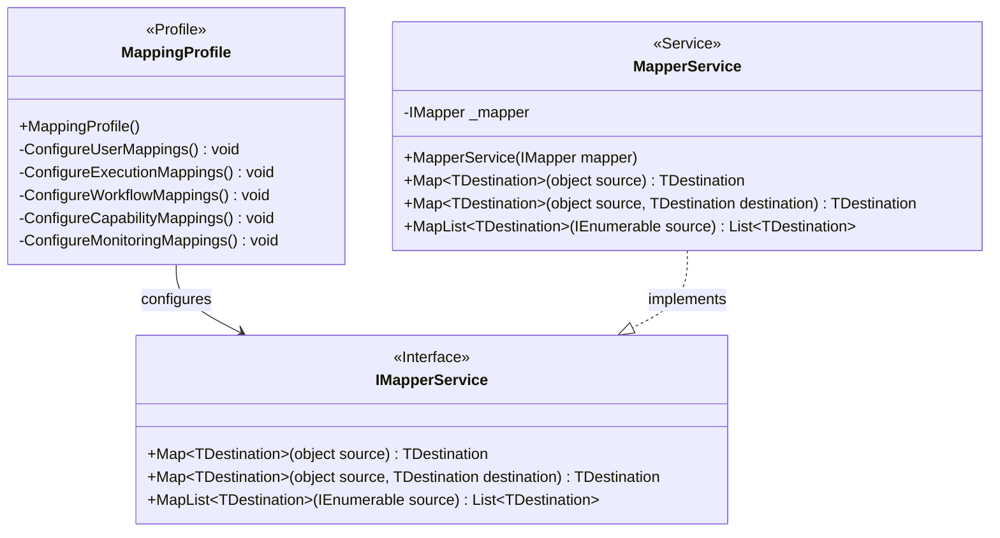
```mermaid
classDiagram
    class MappingProfile {
        <<Profile>>
        +MappingProfile()
        -ConfigureUserMappings() void
        -ConfigureExecutionMappings() void
        -ConfigureWorkflowMappings() void
        -ConfigureCapabilityMappings() void
        -ConfigureMonitoringMappings() void
    }
    
    class IMapperService {
        <<Interface>>
        +Map~TDestination~(object source) TDestination
        +Map~TDestination~(object source, TDestination destination) TDestination
        +MapList~TDestination~(IEnumerable source) List~TDestination~
    }
    
    class MapperService {
        <<Service>>
        -IMapper _mapper
        +MapperService(IMapper mapper)
        +Map~TDestination~(object source) TDestination
        +Map~TDestination~(object source, TDestination destination) TDestination
        +MapList~TDestination~(IEnumerable source) List~TDestination~
    }
    
    MappingProfile --> IMapperService : configures
    MapperService ..|> IMapperService : implements
```

## 值对象和枚举设计

### 值对象设计原则

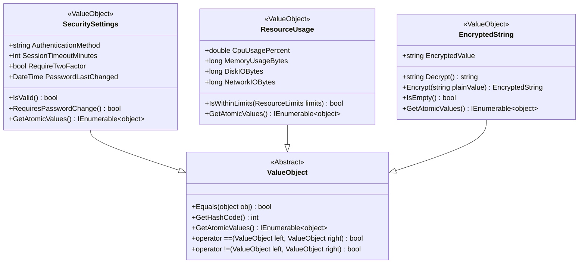
```mermaid
classDiagram
    class ValueObject {
        <<Abstract>>
        +Equals(object obj) bool
        +GetHashCode() int
        +GetAtomicValues() IEnumerable~object~
        +operator ==(ValueObject left, ValueObject right) bool
        +operator !=(ValueObject left, ValueObject right) bool
    }
    
    class SecuritySettings {
        <<ValueObject>>
        +string AuthenticationMethod
        +int SessionTimeoutMinutes
        +bool RequireTwoFactor
        +DateTime PasswordLastChanged
        +IsValid() bool
        +RequiresPasswordChange() bool
        +GetAtomicValues() IEnumerable~object~
    }
    
    class ResourceUsage {
        <<ValueObject>>
        +double CpuUsagePercent
        +long MemoryUsageBytes
        +long DiskIOBytes
        +long NetworkIOBytes
        +IsWithinLimits(ResourceLimits limits) bool
        +GetAtomicValues() IEnumerable~object~
    }
    
    class EncryptedString {
        <<ValueObject>>
        +string EncryptedValue
        +string Decrypt() string
        +Encrypt(string plainValue) EncryptedString
        +IsEmpty() bool
        +GetAtomicValues() IEnumerable~object~
    }
    
    SecuritySettings --|> ValueObject
    ResourceUsage --|> ValueObject
    EncryptedString --|> ValueObject
```

### 枚举类设计

**项目位置**: `Lorn.OpenAgenticAI.Domain.Models/Enumerations/`

```mermaid
classDiagram
    class Enumeration {
        <<Abstract>>
        +int Id
        +string Name
        +Enumeration(int id, string name)
        +ToString() string
        +Equals(object obj) bool
        +GetHashCode() int
        +CompareTo(object other) int
        +GetAll~T~() IEnumerable~T~
        +FromValue~T~(int value) T
        +FromDisplayName~T~(string displayName) T
    }
    
    class ExecutionStatus {
        <<Enumeration>>
        +static ExecutionStatus Pending
        +static ExecutionStatus Running
        +static ExecutionStatus Completed
        +static ExecutionStatus Failed
        +static ExecutionStatus Cancelled
        +static ExecutionStatus Timeout
        +ExecutionStatus(int id, string name)
        +CanTransitionTo(ExecutionStatus newStatus) bool
    }
    
    class AgentType {
        <<Enumeration>>
        +static AgentType ApplicationAutomation
        +static AgentType DataProcessing
        +static AgentType WebService
        +static AgentType FileSystem
        +static AgentType Communication
        +static AgentType Custom
        +AgentType(int id, string name, string description)
        +string Description
        +GetSupportedActions() List~string~
    }
    
    class MetricType {
        <<Enumeration>>
        +static MetricType ExecutionPerformance
        +static MetricType ResourceUsage
        +static MetricType BusinessMetric
        +static MetricType SystemHealth
        +static MetricType UserBehavior
        +MetricType(int id, string name, string unit)
        +string Unit
        +GetAggregationMethods() List~string~
    }
    
    ExecutionStatus --|> Enumeration
    AgentType --|> Enumeration
    MetricType --|> Enumeration
```

## 数据验证设计

### 验证器设计

**项目位置**: `Lorn.OpenAgenticAI.Domain.Models/Validators/`

```mermaid
classDiagram
    class IValidator~T~ {
        <<Interface>>
        +Validate(T instance) ValidationResult
        +ValidateAsync(T instance) Task~ValidationResult~
    }
    
    class ValidationResult {
        <<Class>>
        +bool IsValid
        +List~ValidationError~ Errors
        +string Summary
        +AddError(ValidationError error) void
        +AddError(string propertyName, string errorMessage) void
        +ToString() string
    }
    
    class ValidationError {
        <<Class>>
        +string PropertyName
        +string ErrorMessage
        +string ErrorCode
        +object AttemptedValue
        +ValidationSeverity Severity
    }
    
    class UserProfileValidator {
        <<Validator>>
        +Validate(UserProfile profile) ValidationResult
        -ValidateUsername(string username) bool
        -ValidateEmail(string email) bool
        -ValidateSecuritySettings(SecuritySettings settings) bool
    }
    
    class WorkflowTemplateValidator {
        <<Validator>>
        +Validate(WorkflowTemplate template) ValidationResult
        -ValidateTemplateName(string name) bool
        -ValidateStepOrder(List~WorkflowTemplateStep~ steps) bool
        -ValidateDependencies(List~WorkflowTemplateStep~ steps) bool
    }
    
    UserProfileValidator ..|> IValidator : implements
    WorkflowTemplateValidator ..|> IValidator : implements
    ValidationResult "1" --o "0..*" ValidationError : contains
```

### FluentValidation集成

**项目位置**: `Lorn.OpenAgenticAI.Infrastructure.Data/Validation/`

```mermaid
classDiagram
    class AbstractValidator~T~ {
        <<FluentValidation>>
    }
    
    class TaskExecutionHistoryValidator {
        <<Validator>>
        +TaskExecutionHistoryValidator()
        -SetupUserInputRules() void
        -SetupExecutionTimeRules() void
        -SetupTokenUsageRules() void
    }
    
    class AgentActionDefinitionValidator {
        <<Validator>>
        +AgentActionDefinitionValidator()
        -SetupActionNameRules() void
        -SetupParameterSchemaRules() void
        -SetupTimeoutRules() void
    }
    
    class ValidatorFactory {
        <<Factory>>
        +CreateValidator~T~() IValidator~T~
        +RegisterValidator~T~(IValidator~T~ validator) void
        +GetAllValidators() Dictionary~Type, object~
    }
    
    TaskExecutionHistoryValidator --|> AbstractValidator
    AgentActionDefinitionValidator --|> AbstractValidator
    ValidatorFactory --> IValidator : creates
```

## 仓储模式设计

### 仓储接口设计

**项目位置**: `Lorn.OpenAgenticAI.Domain.Contracts/Repositories/`

```mermaid
classDiagram
    class IRepository~T~ {
        <<Interface>>
        +GetByIdAsync(TId id) Task~T~
        +GetAllAsync() Task~IEnumerable~T~~
        +FindAsync(Expression~Func~T, bool~~ predicate) Task~IEnumerable~T~~
        +AddAsync(T entity) Task~T~
        +UpdateAsync(T entity) Task~T~
        +DeleteAsync(TId id) Task~bool~
        +ExistsAsync(TId id) Task~bool~
    }
    
    class ITaskExecutionHistoryRepository {
        <<Interface>>
        +GetByUserIdAsync(Guid userId, int page, int size) Task~PagedResult~TaskExecutionHistory~~
        +GetExecutionStepsAsync(Guid executionId) Task~List~ExecutionStepRecord~~
        +GetRecentExecutionsAsync(Guid userId, int count) Task~List~TaskExecutionHistory~~
        +GetExecutionStatisticsAsync(Guid userId, DateTime from, DateTime to) Task~ExecutionStatistics~
    }
    
    class IWorkflowTemplateRepository {
        <<Interface>>
        +GetByUserIdAsync(Guid userId) Task~List~WorkflowTemplate~~
        +GetPublicTemplatesAsync(string category) Task~List~WorkflowTemplate~~
        +GetByTagsAsync(List~string~ tags) Task~List~WorkflowTemplate~~
        +SearchTemplatesAsync(string searchTerm) Task~List~WorkflowTemplate~~
        +IncrementUsageCountAsync(Guid templateId) Task~void~
    }
    
    class IAgentCapabilityRepository {
        <<Interface>>
        +GetActiveAgentsAsync() Task~List~AgentCapabilityRegistry~~
        +GetByTypeAsync(AgentType agentType) Task~List~AgentCapabilityRegistry~~
        +GetActionDefinitionsAsync(string agentId) Task~List~AgentActionDefinition~~
        +UpdateHealthStatusAsync(string agentId, HealthStatus status) Task~void~
    }
    
    class IModelProviderRepository {
        <<Interface>>
        +GetByTypeAsync(ProviderType providerType) Task~List~ModelProvider~~
        +GetActiveProvidersAsync() Task~List~ModelProvider~~
        +GetPrebuiltProvidersAsync() Task~List~ModelProvider~~
        +SearchProvidersAsync(string searchTerm) Task~List~ModelProvider~~
        +GetProviderWithModelsAsync(Guid providerId) Task~ModelProvider~
        +UpdateProviderStatusAsync(Guid providerId, ServiceStatus status) Task~void~
        +GetProviderUsageStatisticsAsync(Guid providerId, DateTime from, DateTime to) Task~ProviderUsageStatistics~
    }
    
    class IModelRepository {
        <<Interface>>
        +GetByProviderAsync(Guid providerId) Task~List~Model~~
        +GetByCapabilityAsync(ModelCapability capability) Task~List~Model~~
        +GetPrebuiltModelsAsync() Task~List~Model~~
        +SearchModelsAsync(string searchTerm, List~ModelCapability~ capabilities) Task~List~Model~~
        +GetModelsByGroupAsync(string modelGroup) Task~List~Model~~
        +GetLatestVersionModelsAsync() Task~List~Model~~
        +UpdatePerformanceMetricsAsync(Guid modelId, PerformanceMetrics metrics) Task~void~
        +GetModelUsageStatisticsAsync(Guid modelId, DateTime from, DateTime to) Task~ModelUsageStatistics~
    }
    
    class IProviderUserConfigurationRepository {
        <<Interface>>
        +GetByUserIdAsync(Guid userId) Task~List~ProviderUserConfiguration~~
        +GetByUserAndProviderAsync(Guid userId, Guid providerId) Task~ProviderUserConfiguration~
        +GetActiveConfigurationsAsync(Guid userId) Task~List~ProviderUserConfiguration~~
        +GetConfigurationsByPriorityAsync(Guid userId) Task~List~ProviderUserConfiguration~~
        +UpdateUsageQuotaAsync(Guid configurationId, UsageQuota quota) Task~void~
        +RecordUsageAsync(Guid configurationId, int tokenUsage, decimal cost) Task~void~
        +GetUsageStatisticsAsync(Guid configurationId, DateTime from, DateTime to) Task~ConfigurationUsageStatistics~
    }
    
    class IModelUserConfigurationRepository {
        <<Interface>>
        +GetByUserIdAsync(Guid userId) Task~List~ModelUserConfiguration~~
        +GetByUserAndModelAsync(Guid userId, Guid modelId) Task~ModelUserConfiguration~
        +GetActiveConfigurationsAsync(Guid userId) Task~List~ModelUserConfiguration~~
        +GetConfigurationsByPriorityAsync(Guid userId) Task~List~ModelUserConfiguration~~
        +GetFallbackModelsAsync(Guid userId, Guid primaryModelId) Task~List~ModelUserConfiguration~~
        +UpdateModelParametersAsync(Guid configurationId, ModelParameters parameters) Task~void~
        +RecordModelUsageAsync(Guid configurationId, int tokenUsage, double responseTime) Task~void~
    }
    
    class IMCPConfigurationRepository {
        <<Interface>>
        +GetByUserIdAsync(Guid userId) Task~List~MCPConfiguration~~
        +GetByProtocolTypeAsync(MCPProtocolType protocolType) Task~List~MCPConfiguration~~
        +GetActiveConfigurationsAsync() Task~List~MCPConfiguration~~
        +GetByTagsAsync(List~string~ tags) Task~List~MCPConfiguration~~
        +SearchConfigurationsAsync(string searchTerm) Task~List~MCPConfiguration~~
        +TestConfigurationAsync(Guid configurationId) Task~ConnectionTestResult~
        +UpdateLastUsedTimeAsync(Guid configurationId) Task~void~
        +GetConfigurationUsageStatisticsAsync(Guid configurationId, DateTime from, DateTime to) Task~MCPUsageStatistics~
    }
    
    class IConfigurationTemplateRepository {
        <<Interface>>
        +GetByProtocolTypeAsync(MCPProtocolType protocolType) Task~List~ConfigurationTemplate~~
        +GetByCategoryAsync(string category) Task~List~ConfigurationTemplate~~
        +GetBuiltInTemplatesAsync() Task~List~ConfigurationTemplate~~
        +GetPopularTemplatesAsync(int count) Task~List~ConfigurationTemplate~~
        +SearchTemplatesAsync(string searchTerm) Task~List~ConfigurationTemplate~~
        +IncrementPopularityAsync(Guid templateId) Task~void~
        +GetTemplateUsageStatisticsAsync(Guid templateId) Task~TemplateUsageStatistics~
    }
    
    ITaskExecutionHistoryRepository --|> IRepository
    IWorkflowTemplateRepository --|> IRepository
    IAgentCapabilityRepository --|> IRepository
    IModelProviderRepository --|> IRepository
    IModelRepository --|> IRepository
    IProviderUserConfigurationRepository --|> IRepository
    IModelUserConfigurationRepository --|> IRepository
    IMCPConfigurationRepository --|> IRepository
    IConfigurationTemplateRepository --|> IRepository
```

### 仓储实现设计

**项目位置**: `Lorn.OpenAgenticAI.Infrastructure.Data/Repositories/`

```mermaid
classDiagram
    class RepositoryBase~T~ {
        <<Abstract>>
        #OpenAgenticAIDbContext _context
        #DbSet~T~ _dbSet
        +RepositoryBase(OpenAgenticAIDbContext context)
        +GetByIdAsync(Guid id) Task~T~
        +GetAllAsync() Task~IEnumerable~T~~
        +FindAsync(Expression~Func~T, bool~~ predicate) Task~IEnumerable~T~~
        +AddAsync(T entity) Task~T~
        +UpdateAsync(T entity) Task~T~
        +DeleteAsync(Guid id) Task~bool~
        #BuildIncludeQuery() IQueryable~T~
        #ApplySpecification(ISpecification~T~ spec) IQueryable~T~
    }
    
    class TaskExecutionHistoryRepository {
        <<Repository>>
        +TaskExecutionHistoryRepository(OpenAgenticAIDbContext context)
        +GetByUserIdAsync(Guid userId, int page, int size) Task~PagedResult~TaskExecutionHistory~~
        +GetExecutionStepsAsync(Guid executionId) Task~List~ExecutionStepRecord~~
        +GetRecentExecutionsAsync(Guid userId, int count) Task~List~TaskExecutionHistory~~
        +GetExecutionStatisticsAsync(Guid userId, DateTime from, DateTime to) Task~ExecutionStatistics~
        -BuildStatisticsQuery(Guid userId, DateTime from, DateTime to) IQueryable~TaskExecutionHistory~
    }
    
    class WorkflowTemplateRepository {
        <<Repository>>
        +WorkflowTemplateRepository(OpenAgenticAIDbContext context)
        +GetByUserIdAsync(Guid userId) Task~List~WorkflowTemplate~~
        +GetPublicTemplatesAsync(string category) Task~List~WorkflowTemplate~~
        +GetByTagsAsync(List~string~ tags) Task~List~WorkflowTemplate~~
        +SearchTemplatesAsync(string searchTerm) Task~List~WorkflowTemplate~~
        +IncrementUsageCountAsync(Guid templateId) Task~void~
        -BuildSearchQuery(string searchTerm) IQueryable~WorkflowTemplate~
    }
    
    class ModelProviderRepository {
        <<Repository>>
        +ModelProviderRepository(OpenAgenticAIDbContext context)
        +GetByTypeAsync(ProviderType providerType) Task~List~ModelProvider~~
        +GetActiveProvidersAsync() Task~List~ModelProvider~~
        +GetPrebuiltProvidersAsync() Task~List~ModelProvider~~
        +SearchProvidersAsync(string searchTerm) Task~List~ModelProvider~~
        +GetProviderWithModelsAsync(Guid providerId) Task~ModelProvider~
        +UpdateProviderStatusAsync(Guid providerId, ServiceStatus status) Task~void~
        +GetProviderUsageStatisticsAsync(Guid providerId, DateTime from, DateTime to) Task~ProviderUsageStatistics~
        -BuildProviderQuery(string searchTerm) IQueryable~ModelProvider~
        -CalculateProviderStatistics(Guid providerId, DateTime from, DateTime to) Task~ProviderUsageStatistics~
    }
    
    class ModelRepository {
        <<Repository>>
        +ModelRepository(OpenAgenticAIDbContext context)
        +GetByProviderAsync(Guid providerId) Task~List~Model~~
        +GetByCapabilityAsync(ModelCapability capability) Task~List~Model~~
        +GetPrebuiltModelsAsync() Task~List~Model~~
        +SearchModelsAsync(string searchTerm, List~ModelCapability~ capabilities) Task~List~Model~~
        +GetModelsByGroupAsync(string modelGroup) Task~List~Model~~
        +GetLatestVersionModelsAsync() Task~List~Model~~
        +UpdatePerformanceMetricsAsync(Guid modelId, PerformanceMetrics metrics) Task~void~
        +GetModelUsageStatisticsAsync(Guid modelId, DateTime from, DateTime to) Task~ModelUsageStatistics~
        -BuildModelQuery(string searchTerm, List~ModelCapability~ capabilities) IQueryable~Model~
        -CalculateModelStatistics(Guid modelId, DateTime from, DateTime to) Task~ModelUsageStatistics~
    }
    
    class ProviderUserConfigurationRepository {
        <<Repository>>
        +ProviderUserConfigurationRepository(OpenAgenticAIDbContext context)
        +GetByUserIdAsync(Guid userId) Task~List~ProviderUserConfiguration~~
        +GetByUserAndProviderAsync(Guid userId, Guid providerId) Task~ProviderUserConfiguration~
        +GetActiveConfigurationsAsync(Guid userId) Task~List~ProviderUserConfiguration~~
        +GetConfigurationsByPriorityAsync(Guid userId) Task~List~ProviderUserConfiguration~~
        +UpdateUsageQuotaAsync(Guid configurationId, UsageQuota quota) Task~void~
        +RecordUsageAsync(Guid configurationId, int tokenUsage, decimal cost) Task~void~
        +GetUsageStatisticsAsync(Guid configurationId, DateTime from, DateTime to) Task~ConfigurationUsageStatistics~
        -BuildUserConfigurationQuery(Guid userId) IQueryable~ProviderUserConfiguration~
        -CalculateUsageStatistics(Guid configurationId, DateTime from, DateTime to) Task~ConfigurationUsageStatistics~
    }
    
    class ModelUserConfigurationRepository {
        <<Repository>>
        +ModelUserConfigurationRepository(OpenAgenticAIDbContext context)
        +GetByUserIdAsync(Guid userId) Task~List~ModelUserConfiguration~~
        +GetByUserAndModelAsync(Guid userId, Guid modelId) Task~ModelUserConfiguration~
        +GetActiveConfigurationsAsync(Guid userId) Task~List~ModelUserConfiguration~~
        +GetConfigurationsByPriorityAsync(Guid userId) Task~List~ModelUserConfiguration~~
        +GetFallbackModelsAsync(Guid userId, Guid primaryModelId) Task~List~ModelUserConfiguration~~
        +UpdateModelParametersAsync(Guid configurationId, ModelParameters parameters) Task~void~
        +RecordModelUsageAsync(Guid configurationId, int tokenUsage, double responseTime) Task~void~
        -BuildModelConfigurationQuery(Guid userId) IQueryable~ModelUserConfiguration~
        -GetFallbackChain(Guid userId, Guid primaryModelId) Task~List~ModelUserConfiguration~~
    }
    
    class MCPConfigurationRepository {
        <<Repository>>
        +MCPConfigurationRepository(OpenAgenticAIDbContext context)
        +GetByUserIdAsync(Guid userId) Task~List~MCPConfiguration~~
        +GetByProtocolTypeAsync(MCPProtocolType protocolType) Task~List~MCPConfiguration~~
        +GetActiveConfigurationsAsync() Task~List~MCPConfiguration~~
        +GetByTagsAsync(List~string~ tags) Task~List~MCPConfiguration~~
        +SearchConfigurationsAsync(string searchTerm) Task~List~MCPConfiguration~~
        +TestConfigurationAsync(Guid configurationId) Task~ConnectionTestResult~
        +UpdateLastUsedTimeAsync(Guid configurationId) Task~void~
        +GetConfigurationUsageStatisticsAsync(Guid configurationId, DateTime from, DateTime to) Task~MCPUsageStatistics~
        -BuildConfigurationQuery(string searchTerm) IQueryable~MCPConfiguration~
        -ExecuteConnectionTest(MCPConfiguration configuration) Task~ConnectionTestResult~
    }
    
    class ConfigurationTemplateRepository {
        <<Repository>>
        +ConfigurationTemplateRepository(OpenAgenticAIDbContext context)
        +GetByProtocolTypeAsync(MCPProtocolType protocolType) Task~List~ConfigurationTemplate~~
        +GetByCategoryAsync(string category) Task~List~ConfigurationTemplate~~
        +GetBuiltInTemplatesAsync() Task~List~ConfigurationTemplate~~
        +GetPopularTemplatesAsync(int count) Task~List~ConfigurationTemplate~~
        +SearchTemplatesAsync(string searchTerm) Task~List~ConfigurationTemplate~~
        +IncrementPopularityAsync(Guid templateId) Task~void~
        +GetTemplateUsageStatisticsAsync(Guid templateId) Task~TemplateUsageStatistics~
        -BuildTemplateQuery(string searchTerm) IQueryable~ConfigurationTemplate~
        -CalculateTemplateStatistics(Guid templateId) Task~TemplateUsageStatistics~
    }
    
    TaskExecutionHistoryRepository --|> RepositoryBase
    WorkflowTemplateRepository --|> RepositoryBase
    ModelProviderRepository --|> RepositoryBase
    ModelRepository --|> RepositoryBase
    ProviderUserConfigurationRepository --|> RepositoryBase
    ModelUserConfigurationRepository --|> RepositoryBase
    MCPConfigurationRepository --|> RepositoryBase
    ConfigurationTemplateRepository --|> RepositoryBase
    
    TaskExecutionHistoryRepository ..|> ITaskExecutionHistoryRepository
    WorkflowTemplateRepository ..|> IWorkflowTemplateRepository
    ModelProviderRepository ..|> IModelProviderRepository
    ModelRepository ..|> IModelRepository
    ProviderUserConfigurationRepository ..|> IProviderUserConfigurationRepository
    ModelUserConfigurationRepository ..|> IModelUserConfigurationRepository
    MCPConfigurationRepository ..|> IMCPConfigurationRepository
    ConfigurationTemplateRepository ..|> IConfigurationTemplateRepository
```

## 数据迁移设计

### 迁移策略

```mermaid
graph TD
    subgraph "版本控制"
        V1[v1.0 初始版本]
        V2[v2.0 功能扩展]
        V3[v3.0 性能优化]
    end
    
    subgraph "迁移类型"
        SCHEMA[架构迁移]
        DATA[数据迁移]
        SEED[种子数据]
    end
    
    subgraph "迁移工具"
        EF[EF Core Migrations]
        CUSTOM[自定义迁移脚本]
        VALIDATOR[迁移验证器]
    end
    
    V1 --> SCHEMA
    V2 --> DATA
    V3 --> SEED
    
    SCHEMA --> EF
    DATA --> CUSTOM
    SEED --> VALIDATOR
```

### 迁移实现

**项目位置**: `Lorn.OpenAgenticAI.Infrastructure.Data/Migrations/`

```mermaid
classDiagram
    class MigrationBase {
        <<Abstract>>
        +string Version
        +string Description
        +DateTime CreatedAt
        +Up(MigrationBuilder builder) void
        +Down(MigrationBuilder builder) void
        #ValidatePreConditions() bool
        #ValidatePostConditions() bool
    }
    
    class CreateInitialTables {
        <<Migration>>
        +Up(MigrationBuilder builder) void
        +Down(MigrationBuilder builder) void
        -CreateUserTables(MigrationBuilder builder) void
        -CreateExecutionTables(MigrationBuilder builder) void
        -CreateWorkflowTables(MigrationBuilder builder) void
        -CreateCapabilityTables(MigrationBuilder builder) void
        -CreateMonitoringTables(MigrationBuilder builder) void
        -CreateConfigurationTables(MigrationBuilder builder) void
    }
    
    class SeedInitialData {
        <<Migration>>
        +Up(MigrationBuilder builder) void
        +Down(MigrationBuilder builder) void
        -SeedSystemConfigurations(MigrationBuilder builder) void
        -SeedDefaultModelCapabilities(MigrationBuilder builder) void
        -SeedSystemAgents(MigrationBuilder builder) void
    }
    
    class MigrationValidator {
        <<Service>>
        +ValidateMigration(Migration migration) ValidationResult
        +CheckDataIntegrity() IntegrityCheckResult
        +GenerateRollbackScript(Migration migration) string
        +BackupDatabase() BackupResult
    }
    
    CreateInitialTables --|> MigrationBase
    SeedInitialData --|> MigrationBase
    MigrationValidator --> MigrationBase : validates
```

## 性能优化设计

### 索引策略

```mermaid
graph TB
    subgraph "索引类型"
        PRIMARY[主键索引]
        FOREIGN[外键索引]
        COMPOSITE[复合索引]
        PARTIAL[部分索引]
        FULLTEXT[全文索引]
    end
    
    subgraph "查询模式"
        USER_HISTORY[用户历史查询]
        EXECUTION_STEPS[执行步骤查询]
        TEMPLATE_SEARCH[模板搜索]
        PERFORMANCE_METRICS[性能指标查询]
        ERROR_ANALYSIS[错误分析查询]
    end
    
    PRIMARY --> USER_HISTORY
    FOREIGN --> EXECUTION_STEPS
    COMPOSITE --> TEMPLATE_SEARCH
    PARTIAL --> PERFORMANCE_METRICS
    FULLTEXT --> ERROR_ANALYSIS
```

### 查询优化

**项目位置**: `Lorn.OpenAgenticAI.Infrastructure.Data/QueryOptimization/`

```mermaid
classDiagram
    class QueryOptimizer {
        <<Service>>
        +OptimizeQuery~T~(IQueryable~T~ query) IQueryable~T~
        +AnalyzeQueryPerformance(IQueryable query) QueryAnalysisResult
        +SuggestIndexes(QueryAnalysisResult analysis) List~IndexSuggestion~
        -ApplyPagination~T~(IQueryable~T~ query, int page, int size) IQueryable~T~
        -ApplyIncludes~T~(IQueryable~T~ query, params Expression[] includes) IQueryable~T~
    }
    
    class CacheManager {
        <<Service>>
        +GetOrSetAsync~T~(string key, Func~Task~T~~ factory, TimeSpan expiration) Task~T~
        +RemoveAsync(string key) Task~void~
        +RemoveByPatternAsync(string pattern) Task~void~
        +GetCacheStatistics() CacheStatistics
        -BuildCacheKey(params object[] keyParts) string
    }
    
    class BatchProcessor {
        <<Service>>
        +ProcessInBatches~T~(IEnumerable~T~ items, int batchSize, Func~List~T~, Task~ processor) Task~void~
        +BulkInsertAsync~T~(List~T~ entities) Task~void~
        +BulkUpdateAsync~T~(List~T~ entities) Task~void~
        +BulkDeleteAsync~T~(Expression~Func~T, bool~~ predicate) Task~int~
    }
    
    QueryOptimizer --> CacheManager : uses
    QueryOptimizer --> BatchProcessor : uses
```

## 错误处理和日志记录

### 异常处理设计

```mermaid
classDiagram
    class DomainException {
        <<Abstract>>
        +string ErrorCode
        +Dictionary~string, object~ Data
        +DomainException(string message, string errorCode)
        +DomainException(string message, Exception innerException, string errorCode)
    }
    
    class ValidationException {
        <<Exception>>
        +ValidationResult ValidationResult
        +ValidationException(ValidationResult validationResult)
        +ValidationException(string message, ValidationResult validationResult)
    }
    
    class DataAccessException {
        <<Exception>>
        +string Operation
        +string EntityType
        +DataAccessException(string operation, string entityType, Exception innerException)
    }
    
    class AgentCommunicationException {
        <<Exception>>
        +string AgentId
        +string Action
        +AgentCommunicationException(string agentId, string action, Exception innerException)
    }
    
    class ExceptionLogger {
        <<Service>>
        +LogExceptionAsync(Exception exception, Dictionary~string, object~ context) Task~void~
        +CreateErrorEventRecord(Exception exception) ErrorEventRecord
        -ExtractStackTrace(Exception exception) string
        -CaptureSystemEnvironment() SystemEnvironment
    }
    
    ValidationException --|> DomainException
    DataAccessException --|> DomainException
    AgentCommunicationException --|> DomainException
    ExceptionLogger --> ErrorEventRecord : creates
```

## 实现指导

### 开发实现步骤

1. **创建基础项目结构**
   - 在Visual Studio中创建对应的项目
   - 配置项目间的依赖关系
   - 安装必要的NuGet包

2. **实现领域模型层**
   - 在`Lorn.OpenAgenticAI.Domain.Models`项目中实现实体类
   - 实现值对象和枚举类
   - 添加领域验证逻辑

3. **配置数据访问层**
   - 在`Lorn.OpenAgenticAI.Infrastructure.Data`项目中配置EF Core
   - 创建数据库上下文和配置类
   - 实现仓储模式

4. **创建数据传输对象**
   - 在`Lorn.OpenAgenticAI.Shared.Contracts`项目中定义DTO
   - 配置AutoMapper映射规则
   - 实现转换器服务

5. **设置数据库迁移**
   - 创建初始数据库架构
   - 设置种子数据
   - 配置迁移验证

### 关键技术要点

1. **EF Core配置**：
   - 使用Code First方式
   - 配置连接字符串管理
   - 启用查询日志记录

2. **性能考虑**：
   - 合理使用延迟加载
   - 配置查询缓存
   - 实现批量操作

3. **安全实现**：
   - 敏感数据加密存储
   - 实现参数化查询
   - 配置访问权限控制

4. **监控集成**：
   - 配置性能计数器
   - 实现健康检查
   - 设置告警机制

## 总结

本技术设计文档提供了Lorn.OpenAgenticAI系统中持久化数据结构的完整技术实现方案，涵盖了从实体设计到数据访问的各个层面。设计重点关注：

1. **清晰的分层架构**：明确了实体、仓储、DTO各层的职责和依赖关系
2. **完整的领域模型**：基于DDD原则设计的富领域模型，新增了LLM管理和MCP配置相关的核心业务对象
3. **高性能数据访问**：通过索引优化、查询缓存等提升性能
4. **强类型安全**：使用枚举类、值对象确保类型安全
5. **扩展性设计**：预留了未来功能扩展的空间

## LLM和MCP配置数据结构新增内容

本次修改新增了以下核心数据结构：

### LLM管理相关实体

- **ModelProvider**: 模型服务提供商管理，支持多种提供商类型
- **Model**: 模型信息管理，包含能力、定价、性能指标
- **ProviderUserConfiguration**: 用户级别的提供商配置
- **ModelUserConfiguration**: 用户级别的模型配置，支持参数自定义和降级策略

### MCP配置相关实体

- **MCPConfiguration**: MCP协议配置管理，支持多种协议类型
- **ProtocolAdapterConfiguration**: 协议适配器配置，包含连接、通信、性能设置
- **ConfigurationTemplate**: 配置模板管理，简化配置创建流程

### 技术特性

- **加密存储支持**: API密钥等敏感信息使用EncryptedString值对象
- **多协议支持**: 支持StandardIO、ServerSentEvents、StreamableHTTP等多种MCP协议
- **智能推荐**: 基于使用历史和性能指标的模型推荐算法
- **配额管理**: 完整的使用配额和成本控制机制
- **监控统计**: 详细的使用统计和性能监控数据

### 数据库扩展

在OpenAgenticAIDbContext中新增以下DbSet：

- `DbSet<ModelProvider>` ModelProviders
- `DbSet<Model>` Models  
- `DbSet<ProviderUserConfiguration>` ProviderUserConfigurations
- `DbSet<ModelUserConfiguration>` ModelUserConfigurations
- `DbSet<MCPConfiguration>` MCPConfigurations
- `DbSet<ProtocolAdapterConfiguration>` ProtocolAdapterConfigurations
- `DbSet<ConfigurationTemplate>` ConfigurationTemplates

该设计为程序员提供了详细的实现指导，确保数据层的高质量实现，为整个系统的稳定运行提供坚实的数据基础。新增的LLM和MCP配置数据结构将为智能体平台的核心功能提供完整的数据支撑。
