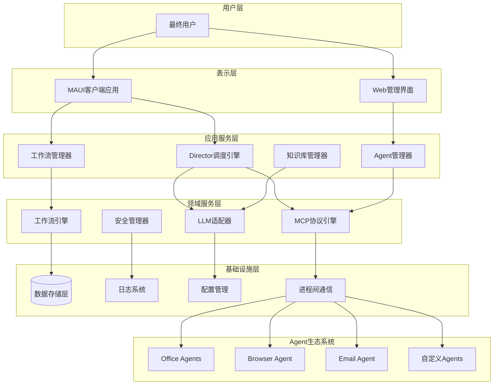
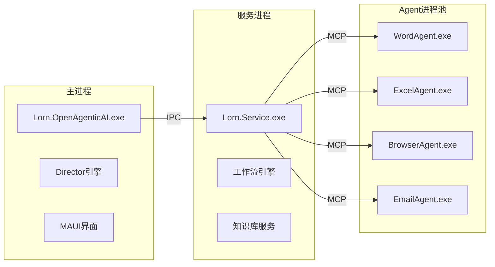
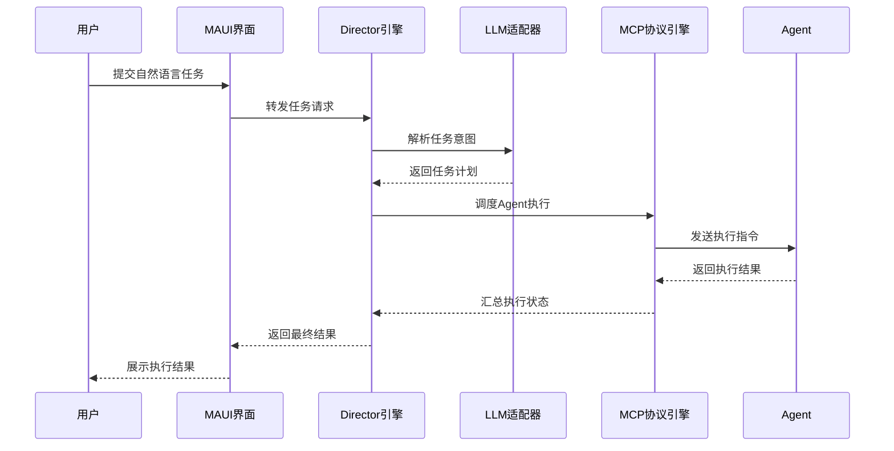
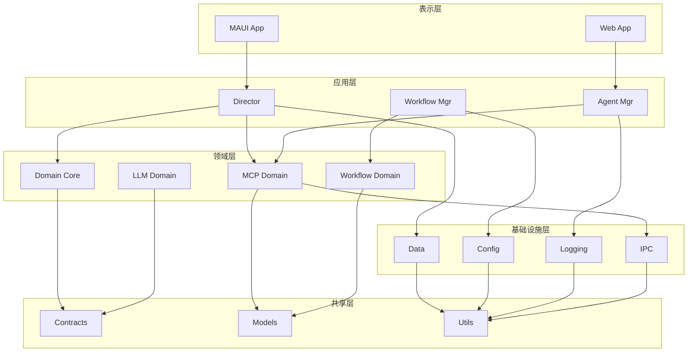

# Lorn.OpenAgenticAI 技术架构设计

## 文档信息

- **文档版本**: v3.0
- **创建日期**: 2025年6月30日
- **更新日期**: 2025年6月30日
- **作者**: 技术专家
- **文档类型**: 宏观技术架构设计

## 1. 架构概述

### 1.1 架构设计原则

基于项目需求和技术约束，本系统采用以下架构设计原则：

- **模块化设计**: 采用高内聚、低耦合的模块化架构，确保系统的可维护性和可扩展性
- **插件化架构**: Agent采用插件化设计，支持动态加载和热插拔
- **协议标准化**: 通过MCP协议实现组件间的标准化通信
- **异步处理**: 采用异步编程模型，提升系统响应性能
- **安全隔离**: 严格控制Agent权限，确保系统安全性
- **跨平台兼容**: 基于.NET 9和.NET MAUI，支持跨平台部署

### 1.2 技术栈选型

| 技术领域   | 选择技术                                 | 版本 | 选择理由                           |
| ---------- | ---------------------------------------- | ---- | ---------------------------------- |
| 基础框架   | .NET                                     | 9.0  | 最新LTS版本，性能优异，生态完善    |
| UI框架     | .NET MAUI                                | 9.0  | 原生跨平台支持，统一开发体验       |
| AI框架     | Microsoft.SemanticKernel                 | 1.x  | 微软官方AI框架，与.NET生态深度集成 |
| Agent框架  | Microsoft.SemanticKernel.Agents          | 1.x  | 专业的Agent开发框架                |
| 工作流引擎 | Elsa Workflows                           | 3.x  | 现代化工作流引擎，支持可视化设计   |
| 进程通信   | Named Pipes + gRPC                       | -    | 高性能本地通信，支持跨语言         |
| 数据存储   | SQLite + LiteDB                          | -    | 轻量级嵌入式数据库，无需额外部署   |
| 配置管理   | Microsoft.Extensions.Configuration       | 9.0  | 标准配置管理框架                   |
| 日志框架   | Microsoft.Extensions.Logging + Serilog   | 9.0  | 结构化日志，支持多种输出           |
| 依赖注入   | Microsoft.Extensions.DependencyInjection | 9.0  | .NET标准DI容器                     |
| 单元测试   | xUnit + Moq                              | -    | 主流测试框架组合                   |

### 1.3 工作流引擎选择

选择 **Elsa Workflows 3.x** 作为工作流引擎，主要原因：

1. **现代化架构**: 基于.NET最新版本，与我们的技术栈完美匹配
2. **可视化设计**: 内置工作流设计器，符合我们"降低门槛"的产品目标
3. **轻量级集成**: 可以轻松嵌入到桌面应用中，无需复杂的基础设施
4. **灵活扩展**: 支持自定义活动，可以轻松集成我们的Agent系统
5. **持久化支持**: 支持多种存储后端，与我们的SQLite方案兼容

## 2. 系统架构设计

### 2.1 整体架构视图



### 2.2 分层架构

```text
┌─────────────────────────────────────────────────────────┐
│                    用户交互层                            │
│  ┌─────────────────┐  ┌─────────────────────────────┐   │
│  │   MAUI 客户端   │  │      Web 管理界面          │   │
│  │  • 智能对话     │  │  • 系统配置                 │   │
│  │  • 工作流设计   │  │  • Agent 管理               │   │
│  │  • 任务监控     │  │  • 性能监控                 │   │
│  └─────────────────┘  └─────────────────────────────┘   │
├─────────────────────────────────────────────────────────┤
│                    应用服务层                            │
│  ┌─────────────┐ ┌─────────────┐ ┌─────────────────┐    │
│  │  Director   │ │  Workflow   │ │  Agent Manager  │    │
│  │  调度引擎   │ │  Manager    │ │                 │    │
│  └─────────────┘ └─────────────┘ └─────────────────┘    │
├─────────────────────────────────────────────────────────┤
│                    领域服务层                            │
│  ┌─────────────┐ ┌─────────────┐ ┌─────────────────┐    │
│  │ MCP协议引擎 │ │ LLM适配器   │ │  工作流引擎     │    │
│  └─────────────┘ └─────────────┘ └─────────────────┘    │
├─────────────────────────────────────────────────────────┤
│                    基础设施层                            │
│  ┌─────────────┐ ┌─────────────┐ ┌─────────────────┐    │
│  │  数据存储   │ │  配置管理   │ │   进程通信      │    │
│  └─────────────┘ └─────────────┘ └─────────────────┘    │
└─────────────────────────────────────────────────────────┘
```

### 2.3 进程架构

系统采用多进程架构，确保稳定性和安全性：



### 2.4 数据流架构



## 3. 核心组件架构

### 3.1 Director调度引擎

**职责范围**:

- 自然语言任务解析与规划
- Agent生命周期管理与调度
- 执行状态监控与异常处理
- 任务上下文管理

**核心接口**:

- `ITaskPlanner`: 任务规划接口
- `IAgentOrchestrator`: Agent编排接口
- `IExecutionMonitor`: 执行监控接口
- `IContextManager`: 上下文管理接口

**关键特性**:

- 支持自然语言到结构化任务的转换
- 提供智能Agent选择和调度机制
- 实现任务执行状态的实时监控
- 支持任务执行上下文的持久化管理

### 3.2 MCP协议引擎

**设计目标**:
- 标准化Agent通信协议
- 支持跨进程、跨语言通信
- 提供消息路由与负载均衡
- 实现故障检测与自动恢复

**核心组件**:
- **消息路由器**: 负责消息分发和路由
- **连接管理器**: 管理Agent连接生命周期
- **协议适配器**: 支持多种传输协议
- **安全网关**: 实现身份验证和权限控制

**通信模式**:
- 请求-响应模式：同步调用Agent功能
- 发布-订阅模式：异步事件通知
- 流式传输模式：大数据量传输
- 心跳检测模式：Agent健康状态监控

### 3.3 工作流引擎集成

**集成策略**:
- 基于Elsa Workflows构建
- 自定义Agent执行活动
- 与MCP协议深度集成
- 支持可视化流程设计

**扩展点**:
- 自定义活动类型
- 工作流事件处理
- 状态持久化策略
- 错误处理机制

**核心能力**:
- 可视化工作流设计器
- 支持条件分支和循环控制
- 提供工作流模板和复用机制
- 支持工作流版本管理和回滚

### 3.4 Agent架构框架

**设计模式**:
- 插件化架构
- 标准化接口定义
- 生命周期管理
- 能力发现机制

**核心抽象**:
- `IAgent`: Agent基础接口
- `IAgentCapability`: 能力描述接口
- `IAgentLifecycle`: 生命周期接口
- `IAgentSecurity`: 安全控制接口

**Agent类型**:
- **应用程序Agent**: 自动化Office套件、浏览器等应用
- **数据处理Agent**: 处理文件、数据转换等任务
- **网络服务Agent**: 调用外部API、Web服务
- **自定义Agent**: 用户开发的专用Agent

### 3.5 LLM适配器

**设计目标**:
- 支持多种LLM提供商
- 提供统一的调用接口
- 实现负载均衡和容错
- 支持本地和云端模型

**支持的LLM提供商**:
- OpenAI GPT系列
- Azure OpenAI Service
- 本地LLM（LLaMA、ChatGLM等）
- 其他兼容OpenAI API的服务

**核心功能**:
- 模型选择和切换
- Prompt模板管理
- 上下文管理和压缩
- 响应流式处理

## 4. 数据架构设计

### 4.1 数据存储策略

**分层存储方案**:
- **应用数据**: SQLite数据库
- **知识库**: LiteDB向量数据库
- **配置数据**: JSON配置文件
- **日志数据**: 结构化日志文件
- **缓存数据**: 内存缓存

### 4.2 数据模型设计

**核心实体**:
- `Workflow`: 工作流定义
- `WorkflowExecution`: 工作流执行记录
- `Agent`: Agent注册信息
- `Task`: 任务定义
- `KnowledgeEntry`: 知识库条目

**关系模型**:

```text
Workflow 1:N WorkflowExecution
WorkflowExecution 1:N TaskExecution
Agent 1:N AgentCapability
KnowledgeEntry 1:N KnowledgeIndex
```

### 4.3 数据一致性策略

- **ACID事务**: 关键业务操作
- **最终一致性**: 日志和统计数据
- **分布式锁**: 跨进程资源访问
- **数据备份**: 定期自动备份

## 5. Visual Studio解决方案结构规划

### 5.1 解决方案组织架构

```text
Lorn.OpenAgenticAI.sln
├── src/
│   ├── 1.Presentation/                  # 表示层
│   │   ├── Lorn.OpenAgenticAI.MAUI/     # MAUI客户端应用
│   │   └── Lorn.OpenAgenticAI.Web/      # Web管理界面
│   │
│   ├── 2.Application/                   # 应用服务层
│   │   ├── Lorn.Application.Director/   # Director调度引擎
│   │   ├── Lorn.Application.Workflow/   # 工作流管理服务
│   │   └── Lorn.Application.Agent/      # Agent管理服务
│   │
│   ├── 3.Domain/                        # 领域服务层
│   │   ├── Lorn.Domain.Core/            # 核心领域模型
│   │   ├── Lorn.Domain.MCP/             # MCP协议实现
│   │   ├── Lorn.Domain.LLM/             # LLM适配器
│   │   └── Lorn.Domain.Workflow/        # 工作流引擎扩展
│   │
│   ├── 4.Infrastructure/                # 基础设施层
│   │   ├── Lorn.Infrastructure.Data/    # 数据访问层
│   │   ├── Lorn.Infrastructure.IPC/     # 进程间通信
│   │   ├── Lorn.Infrastructure.Config/  # 配置管理
│   │   └── Lorn.Infrastructure.Log/     # 日志系统
│   │
│   ├── 5.Agents/                        # Agent生态系统
│   │   ├── Lorn.Agents.Core/            # Agent基础框架
│   │   ├── Lorn.Agents.Office/          # Office Agent套件
│   │   ├── Lorn.Agents.Browser/         # 浏览器Agent
│   │   ├── Lorn.Agents.Email/           # 邮件Agent
│   │   └── Lorn.Agents.SDK/             # Agent开发SDK
│   │
│   └── 6.Shared/                        # 共享组件
│       ├── Lorn.Shared.Contracts/       # 接口定义
│       ├── Lorn.Shared.Models/          # 共享模型
│       ├── Lorn.Shared.Utils/           # 工具类库
│       └── Lorn.Shared.Constants/       # 常量定义
│
├── tests/                               # 测试项目
│   ├── unit/                           # 单元测试
│   │   ├── Lorn.Tests.Director/
│   │   ├── Lorn.Tests.MCP/
│   │   └── Lorn.Tests.Agents/
│   │
│   ├── integration/                     # 集成测试
│   │   ├── Lorn.Tests.Integration.API/
│   │   └── Lorn.Tests.Integration.E2E/
│   │
│   └── performance/                     # 性能测试
│       └── Lorn.Tests.Performance/
│
├── tools/                               # 开发工具
│   ├── Lorn.Tools.CodeGen/             # 代码生成工具
│   ├── Lorn.Tools.Migration/           # 数据迁移工具
│   └── Lorn.Tools.AgentTemplate/       # Agent模板工具
│
├── docs/                               # 项目文档
│   ├── api/                           # API文档
│   ├── architecture/                  # 架构文档
│   └── deployment/                    # 部署文档
│
└── scripts/                           # 构建脚本
    ├── build.ps1                     # 构建脚本
    ├── test.ps1                      # 测试脚本
    └── deploy.ps1                    # 部署脚本
```

### 5.2 项目依赖关系



### 5.3 核心项目详细说明

#### 5.3.1 表示层项目

**Lorn.OpenAgenticAI.MAUI**
- 项目类型: .NET MAUI App
- 目标平台: Windows, macOS
- 主要功能: 用户界面、智能对话、工作流设计器
- 关键依赖: Lorn.Application.Director, CommunityToolkit.Maui

**Lorn.OpenAgenticAI.Web**
- 项目类型: ASP.NET Core Web App
- 目标框架: .NET 9
- 主要功能: Agent管理、系统监控、配置管理
- 关键依赖: Lorn.Application.Agent, Microsoft.AspNetCore

#### 5.3.2 应用层项目

**Lorn.Application.Director**
- 项目类型: Class Library
- 主要功能: 任务调度、Agent编排、执行监控
- 关键依赖: Microsoft.SemanticKernel, Lorn.Domain.MCP

**Lorn.Application.Workflow**
- 项目类型: Class Library
- 主要功能: 工作流管理、模板管理、执行引擎
- 关键依赖: Elsa.Workflows, Lorn.Domain.Workflow

**Lorn.Application.Agent**
- 项目类型: Class Library
- 主要功能: Agent注册、生命周期管理、能力发现
- 关键依赖: Lorn.Agents.Core, Lorn.Domain.MCP

#### 5.3.3 领域层项目

**Lorn.Domain.Core**
- 项目类型: Class Library
- 主要功能: 核心领域模型、业务规则、领域服务
- 关键依赖: Lorn.Shared.Contracts

**Lorn.Domain.MCP**
- 项目类型: Class Library
- 主要功能: MCP协议实现、消息路由、连接管理
- 关键依赖: Lorn.Infrastructure.IPC

**Lorn.Domain.LLM**
- 项目类型: Class Library
- 主要功能: LLM适配器、多模型支持、Prompt管理
- 关键依赖: Microsoft.SemanticKernel

#### 5.3.4 基础设施层项目

**Lorn.Infrastructure.Data**
- 项目类型: Class Library
- 主要功能: 数据访问、Repository实现、数据迁移
- 关键依赖: Microsoft.EntityFrameworkCore.Sqlite, LiteDB

**Lorn.Infrastructure.IPC**
- 项目类型: Class Library
- 主要功能: 进程间通信、Named Pipes、gRPC实现
- 关键依赖: Grpc.Net.Client, System.IO.Pipes

#### 5.3.5 Agent生态系统项目

**Lorn.Agents.Core**
- 项目类型: Class Library
- 主要功能: Agent基础框架、生命周期管理、安全模型
- 关键依赖: Lorn.Domain.MCP

**Lorn.Agents.Office**
- 项目类型: Class Library
- 主要功能: Word/Excel/PowerPoint Agent实现
- 关键依赖: Microsoft.Office.Interop.Word/Excel/PowerPoint

**Lorn.Agents.SDK**
- 项目类型: NuGet Package
- 主要功能: 第三方Agent开发SDK、模板、文档
- 关键依赖: Lorn.Agents.Core

### 5.4 构建和部署配置

#### 5.4.1 Directory.Build.props

全局项目属性配置，统一管理版本信息、编译选项和包信息。

#### 5.4.2 解决方案配置

- **Debug**: 开发调试配置
- **Release**: 发布配置
- **Testing**: 测试专用配置

**平台配置**:
- **x64**: 64位Windows平台
- **arm64**: ARM64架构(macOS Apple Silicon)

## 6. 部署架构

### 6.1 单机部署模式

```text
用户桌面环境
┌─────────────────────────────────────────────────────┐
│                                                     │
│  ┌─────────────────┐    ┌─────────────────────────┐ │
│  │   主应用进程    │    │    后台服务进程         │ │
│  │                 │    │                         │ │
│  │ • MAUI界面      │    │ • Director引擎          │ │
│  │ • 用户交互      │    │ • 工作流引擎            │ │
│  │ • 本地配置      │    │ • MCP协议服务           │ │
│  └─────────────────┘    │ • 知识库服务            │ │
│           │              └─────────────────────────┘ │
│           │                           │               │
│           └───────────────────────────┘               │
│                    IPC通信                            │
│                                                       │
│  ┌─────────────────────────────────────────────────┐ │
│  │                Agent进程池                      │ │
│  │                                                 │ │
│  │ ┌─────────────┐ ┌─────────────┐ ┌─────────────┐ │ │
│  │ │Office Agents│ │Browser Agent│ │Email Agent  │ │ │
│  │ └─────────────┘ └─────────────┘ └─────────────┘ │ │
│  └─────────────────────────────────────────────────┘ │
│                           │                           │
│                           │ MCP协议                   │
│                                                       │
│  ┌─────────────────────────────────────────────────┐ │
│  │               本地存储                          │ │
│  │                                                 │ │
│  │ • SQLite数据库                                  │ │
│  │ • LiteDB知识库                                  │ │
│  │ • 配置文件                                      │ │
│  │ • 日志文件                                      │ │
│  └─────────────────────────────────────────────────┘ │
└─────────────────────────────────────────────────────┘
```

### 6.2 企业部署模式

```text
企业网络环境
┌─────────────────────────────────────────────────────┐
│                                                     │
│  ┌─────────────────┐    ┌─────────────────────────┐ │
│  │   客户端应用    │    │     服务端集群          │ │
│  │                 │    │                         │ │
│  │ • 轻量级界面    │    │ • Director服务          │ │
│  │ • 任务提交      │    │ • 工作流服务            │ │
│  │ • 结果展示      │    │ • Agent管理服务         │ │
│  └─────────────────┘    │ • 知识库服务            │ │
│           │              └─────────────────────────┘ │
│           │                           │               │
│           └───────────────────────────┘               │
│                   HTTPS/WSS                          │
│                                                       │
│  ┌─────────────────────────────────────────────────┐ │
│  │              共享Agent池                        │ │
│  │                                                 │ │
│  │ ┌─────────────┐ ┌─────────────┐ ┌─────────────┐ │ │
│  │ │Docker容器1  │ │Docker容器2  │ │Docker容器N  │ │ │
│  │ └─────────────┘ └─────────────┘ └─────────────┘ │ │
│  └─────────────────────────────────────────────────┘ │
│                                                       │
│  ┌─────────────────────────────────────────────────┐ │
│  │               企业级存储                        │ │
│  │                                                 │ │
│  │ • SQL Server/PostgreSQL                        │ │
│  │ • Redis缓存                                     │ │
│  │ • 分布式文件系统                               │ │
│  └─────────────────────────────────────────────────┘ │
└─────────────────────────────────────────────────────┘
```

## 7. 安全架构

### 7.1 安全边界

- **进程隔离**: Agent运行在独立进程中
- **权限控制**: 基于角色的访问控制(RBAC)
- **数据加密**: 敏感数据加密存储
- **通信安全**: TLS/SSL加密通信
- **审计日志**: 完整的操作审计追踪

### 7.2 安全组件

- **身份认证**: 支持Windows集成认证
- **授权管理**: 细粒度权限控制
- **数据保护**: 基于DPAPI的数据加密
- **安全监控**: 实时安全事件监控

### 7.3 Agent安全模型

**沙箱机制**:
- 文件系统访问限制
- 网络访问控制
- 系统资源使用限制
- 进程间通信权限控制

**权限管理**:
- 最小权限原则
- 动态权限授予
- 权限审核和撤销
- 权限使用审计

## 8. 性能架构

### 8.1 性能目标

- **响应时间**: 界面操作响应 < 200ms
- **并发处理**: 支持10个并发Agent执行
- **内存占用**: 空闲状态 < 500MB
- **启动时间**: 应用启动 < 5秒

### 8.2 性能策略

- **异步编程**: 全面采用async/await模式
- **连接池**: Agent连接复用
- **缓存策略**: 多级缓存设计
- **资源管理**: 及时释放和回收

### 8.3 性能监控

**监控指标**:
- 系统资源使用率（CPU、内存、磁盘、网络）
- 应用程序性能计数器
- Agent执行性能指标
- 用户界面响应时间

**监控工具**:
- 内置性能监控器
- 结构化日志分析
- 实时性能仪表板
- 性能报告生成

## 9. 扩展性设计

### 9.1 插件架构

**插件类型**:
- Agent插件：扩展Agent功能
- UI插件：扩展用户界面
- 工作流活动插件：自定义工作流活动
- 数据源插件：支持新的数据源类型

**插件管理**:
- 动态加载和卸载
- 版本兼容性检查
- 依赖关系管理
- 插件安全验证

### 9.2 API扩展

**REST API**:
- 统一的RESTful接口
- OpenAPI规范支持
- 版本控制机制
- 认证和授权

**SDK支持**:
- .NET SDK
- Python SDK
- JavaScript SDK
- 其他语言SDK

### 9.3 第三方集成

**集成方式**:
- WebHook集成
- API集成
- 消息队列集成
- 数据库集成

**支持的第三方服务**:
- 云存储服务（OneDrive、Google Drive、Dropbox）
- 办公协作平台（Microsoft 365、Google Workspace）
- 通信工具（Teams、Slack、钉钉）
- 开发工具（GitHub、Azure DevOps）

## 10. 总结

本技术架构设计遵循现代软件架构最佳实践，采用分层、模块化的设计理念，确保系统的：

- **可维护性**: 清晰的分层架构和职责分离
- **可扩展性**: 插件化设计支持功能扩展
- **可测试性**: 依赖注入和接口抽象便于测试
- **可部署性**: 灵活的部署模式适应不同场景
- **可监控性**: 完善的日志和监控体系

该架构设计为项目实施提供了清晰的技术路线图，支持按照Visual Studio解决方案结构进行有序开发。

## 11. 后续工作

1. **详细设计文档**：基于本架构设计，制定各个模块的详细设计文档
2. **原型开发**：优先实现核心模块的原型，验证设计的可行性
3. **性能测试**：制定性能测试计划，确保系统满足性能要求
4. **安全审查**：进行安全设计审查，确保安全机制的有效性

---

*本文档将根据项目进展和技术演进持续更新维护。*
