# 工作流引擎技术设计文档

## 文档信息

- **文档版本**: v1.0
- **创建日期**: 2025年7月3日
- **作者**: 技术专家
- **文档类型**: 工作流引擎技术设计
- **相关文档**: TechnicalArchitecture.md, BusinessProcessFlow.md

## 1. 工作流引擎概述

### 1.1 设计目标

工作流引擎是Lorn.OpenAgenticAI平台的核心组件之一，旨在提供：

- **可视化流程设计**: 提供拖拽式工作流设计界面，降低用户使用门槛
- **Agent编排能力**: 支持多Agent协同工作，实现复杂业务流程自动化
- **灵活执行控制**: 支持条件分支、循环控制、并行执行等流程控制机制
- **状态管理**: 提供完整的工作流执行状态跟踪和恢复机制
- **扩展性**: 支持自定义活动类型，满足特殊业务需求

### 1.2 技术选型决策

基于以下因素选择**Elsa Workflows 3.x**作为底层工作流引擎：

| 评估维度     | Elsa Workflows   | Windows Workflow Foundation | 自研方案     |
| ------------ | ---------------- | --------------------------- | ------------ |
| .NET生态集成 | ✅ 原生支持.NET 9 | ❌ 已停止更新                | ✅ 完全定制   |
| 可视化设计器 | ✅ 内置设计器     | ✅ VS集成设计器              | ❌ 需要开发   |
| 轻量级部署   | ✅ 嵌入式部署     | ❌ 需要IIS/WAS               | ✅ 完全控制   |
| 扩展性       | ✅ 自定义活动     | ✅ 自定义活动                | ✅ 完全扩展   |
| 学习成本     | ✅ 现代化API      | ❌ 复杂配置                  | ❌ 高开发成本 |
| 社区支持     | ✅ 活跃社区       | ❌ 社区衰落                  | ❌ 无社区支持 |

### 1.3 架构定位

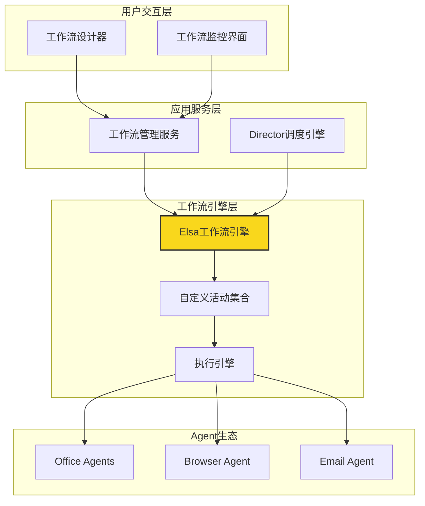

## 2. 系统架构设计

### 2.1 整体架构

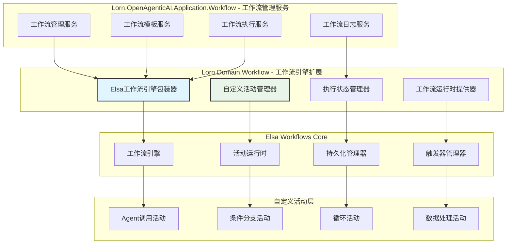

### 2.2 核心组件设计

#### 2.2.1 工作流管理服务 (Lorn.OpenAgenticAI.Application.Workflow)

**组件职责**:

- 工作流模板的CRUD操作
- 工作流执行调度和监控
- 工作流版本管理
- 执行历史记录管理

**核心接口设计**:

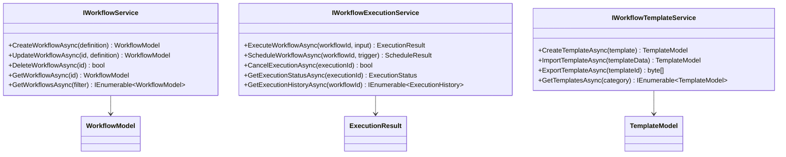

**实现位置**: `src/2.Application/Lorn.OpenAgenticAI.Application.Workflow/`

#### 2.2.2 工作流引擎扩展 (Lorn.OpenAgenticAI.Domain.Workflow)

**组件职责**:

- 封装Elsa Workflows核心功能
- 提供Agent集成的自定义活动
- 管理工作流执行上下文
- 实现工作流状态持久化

**核心类设计**:

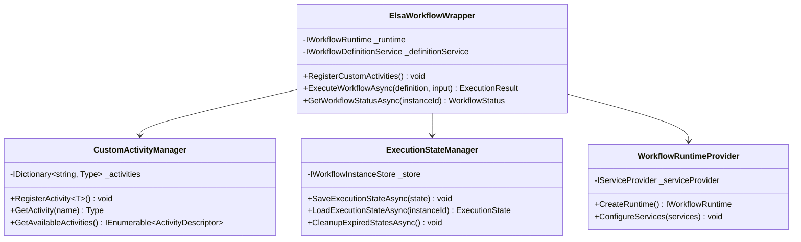

**实现位置**: `src/3.Domain/Lorn.OpenAgenticAI.Domain.Workflow/`

### 2.3 自定义活动体系

#### 2.3.1 Agent调用活动

**设计目标**: 为工作流提供调用各类Agent的标准化活动

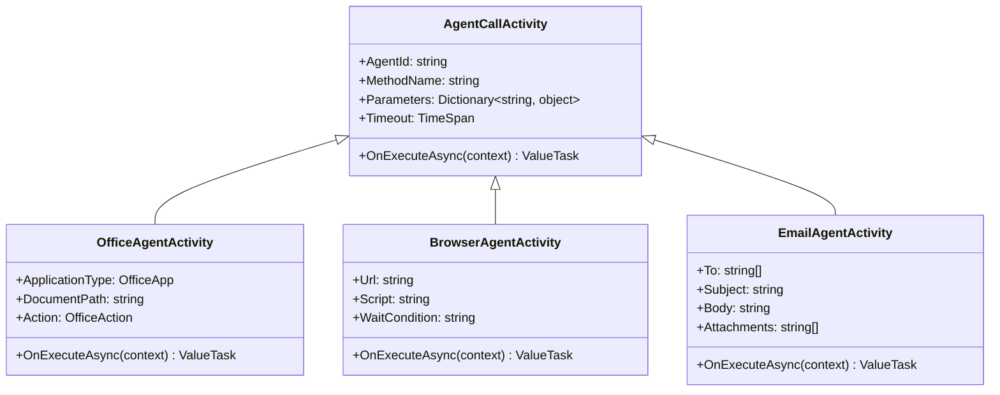

**实现要求**:

- 每个活动必须继承自`Elsa.IActivity`接口
- 通过MCP协议与对应Agent通信
- 支持异步执行和超时控制
- 提供详细的执行日志和错误处理

#### 2.3.2 流程控制活动

**设计目标**: 提供丰富的流程控制能力

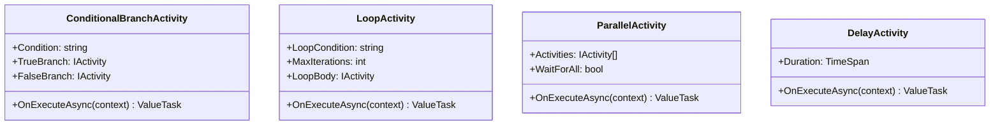

#### 2.3.3 数据处理活动

**设计目标**: 提供工作流中的数据转换和处理能力

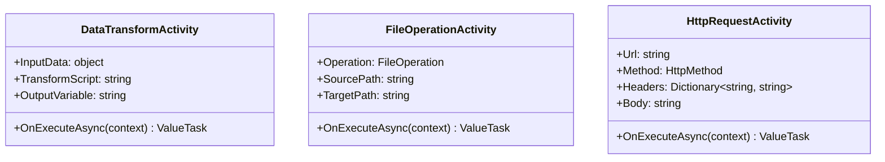

## 3. 数据模型设计

### 3.1 核心实体模型

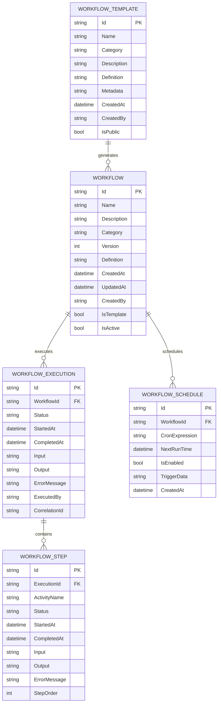

### 3.2 配置模型

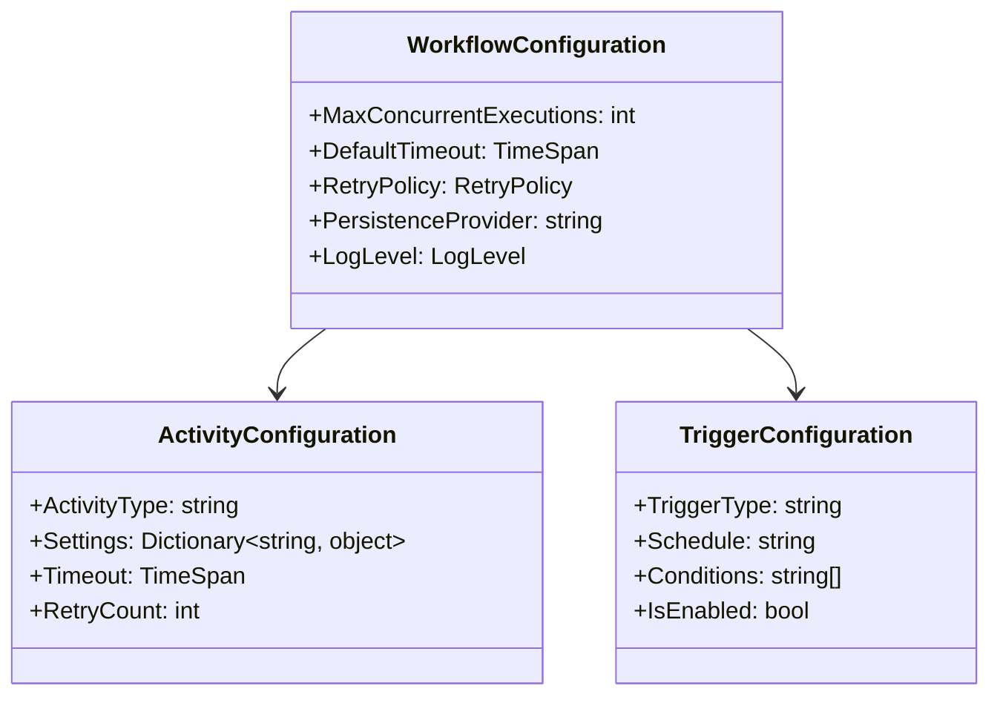

## 4. 接口设计

### 4.1 工作流管理接口

#### 4.1.1 工作流服务接口

```csharp
namespace Lorn.OpenAgenticAI.Application.Workflow.Interfaces
{
    /// <summary>
    /// 工作流管理服务接口
    /// </summary>
    public interface IWorkflowService
    {
        /// <summary>
        /// 创建工作流
        /// </summary>
        Task<WorkflowModel> CreateWorkflowAsync(CreateWorkflowRequest request);
        
        /// <summary>
        /// 更新工作流定义
        /// </summary>
        Task<WorkflowModel> UpdateWorkflowAsync(string workflowId, UpdateWorkflowRequest request);
        
        /// <summary>
        /// 删除工作流
        /// </summary>
        Task<bool> DeleteWorkflowAsync(string workflowId);
        
        /// <summary>
        /// 获取工作流详情
        /// </summary>
        Task<WorkflowModel> GetWorkflowAsync(string workflowId);
        
        /// <summary>
        /// 查询工作流列表
        /// </summary>
        Task<PagedResult<WorkflowModel>> GetWorkflowsAsync(WorkflowQueryRequest request);
        
        /// <summary>
        /// 发布工作流
        /// </summary>
        Task<bool> PublishWorkflowAsync(string workflowId);
        
        /// <summary>
        /// 验证工作流定义
        /// </summary>
        Task<ValidationResult> ValidateWorkflowAsync(string definition);
    }
}
```

#### 4.1.2 工作流执行接口

```csharp
namespace Lorn.OpenAgenticAI.Application.Workflow.Interfaces
{
    /// <summary>
    /// 工作流执行服务接口
    /// </summary>
    public interface IWorkflowExecutionService
    {
        /// <summary>
        /// 执行工作流
        /// </summary>
        Task<ExecutionResult> ExecuteWorkflowAsync(ExecuteWorkflowRequest request);
        
        /// <summary>
        /// 暂停工作流执行
        /// </summary>
        Task<bool> SuspendExecutionAsync(string executionId);
        
        /// <summary>
        /// 恢复工作流执行
        /// </summary>
        Task<bool> ResumeExecutionAsync(string executionId);
        
        /// <summary>
        /// 取消工作流执行
        /// </summary>
        Task<bool> CancelExecutionAsync(string executionId);
        
        /// <summary>
        /// 获取执行状态
        /// </summary>
        Task<ExecutionStatus> GetExecutionStatusAsync(string executionId);
        
        /// <summary>
        /// 获取执行历史
        /// </summary>
        Task<PagedResult<ExecutionHistory>> GetExecutionHistoryAsync(string workflowId, int page, int size);
        
        /// <summary>
        /// 重试失败的执行
        /// </summary>
        Task<ExecutionResult> RetryExecutionAsync(string executionId);
    }
}
```

### 4.2 自定义活动接口

#### 4.2.1 Agent调用活动接口

```csharp
namespace Lorn.OpenAgenticAI.Domain.Workflow.Activities
{
    /// <summary>
    /// Agent调用活动基类
    /// </summary>
    public abstract class AgentCallActivityBase : Activity
    {
        /// <summary>
        /// Agent标识
        /// </summary>
        [ActivityInput(Label = "Agent ID")]
        public Input<string> AgentId { get; set; } = default!;
        
        /// <summary>
        /// 超时时间
        /// </summary>
        [ActivityInput(Label = "Timeout (seconds)", DefaultValue = 30)]
        public Input<int> TimeoutSeconds { get; set; } = new(30);
        
        /// <summary>
        /// 输出结果
        /// </summary>
        [ActivityOutput]
        public Output<object> Result { get; set; } = default!;
        
        /// <summary>
        /// 执行Agent调用
        /// </summary>
        protected override async ValueTask ExecuteAsync(ActivityExecutionContext context)
        {
            var agentId = AgentId.Get(context);
            var timeout = TimeoutSeconds.Get(context);
            
            try
            {
                var result = await CallAgentAsync(agentId, context, TimeSpan.FromSeconds(timeout));
                Result.Set(context, result);
            }
            catch (Exception ex)
            {
                context.Logger.LogError(ex, "Agent调用失败: {AgentId}", agentId);
                throw;
            }
        }
        
        /// <summary>
        /// 具体的Agent调用实现
        /// </summary>
        protected abstract Task<object> CallAgentAsync(string agentId, ActivityExecutionContext context, TimeSpan timeout);
    }
}
```

## 5. 执行引擎设计

### 5.1 执行流程

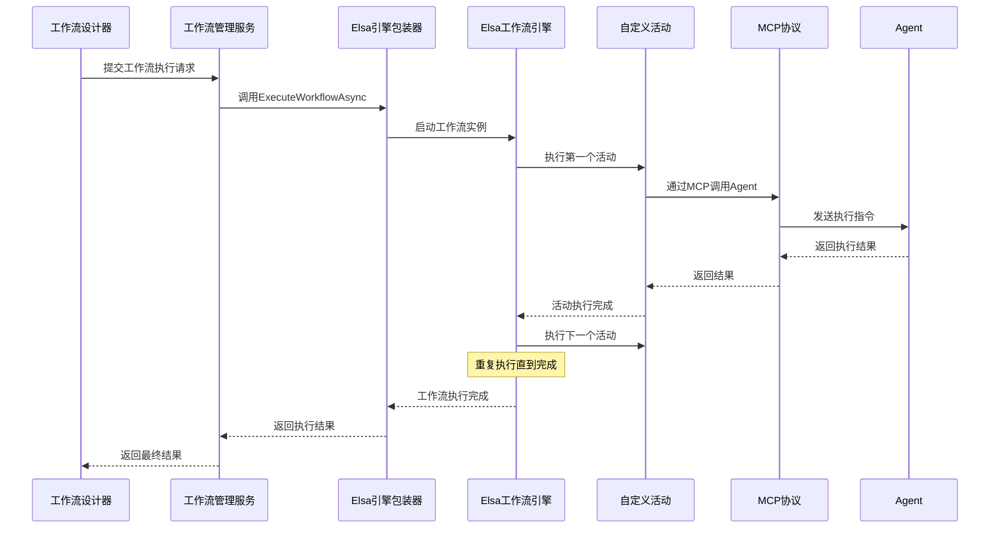

### 5.2 状态管理

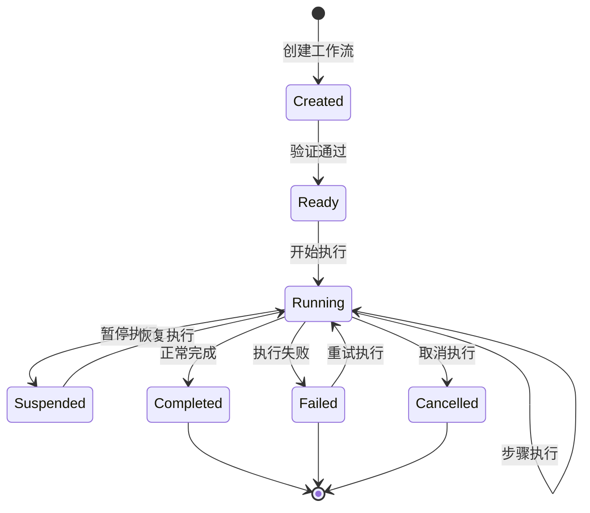

### 5.3 错误处理策略

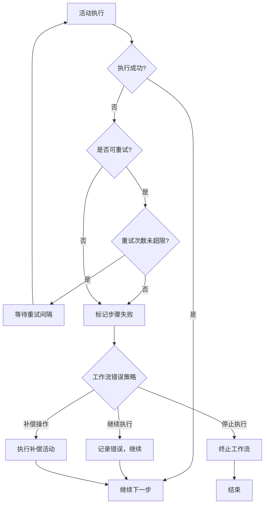

## 6. 持久化设计

### 6.1 存储架构

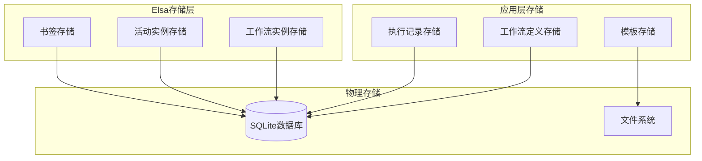

### 6.2 数据持久化策略

**工作流定义持久化**:

- 存储位置: `src/4.Infrastructure/Lorn.OpenAgenticAI.Infrastructure.Data/Repositories/WorkflowRepository`
- 数据库表: `Workflows`, `WorkflowVersions`
- 序列化格式: JSON (Elsa定义格式)

**执行状态持久化**:

- 存储位置: `src/4.Infrastructure/Lorn.OpenAgenticAI.Infrastructure.Data/Repositories/ExecutionRepository`
- 数据库表: `WorkflowExecutions`, `WorkflowSteps`
- 持久化时机: 每个活动执行前后

**模板持久化**:

- 存储位置: 文件系统 + 数据库索引
- 文件格式: JSON模板文件
- 索引字段: 名称、分类、标签、创建时间

## 7. 性能优化设计

### 7.1 执行性能优化

**并发控制**:

- 工作流级别: 最大并发执行数限制
- 活动级别: 支持并行活动执行
- 资源级别: Agent调用排队机制

**内存管理**:

- 大对象延迟加载
- 执行上下文数据压缩
- 定期清理过期执行状态

**缓存策略**:

- 工作流定义缓存 (内存)
- 活动类型缓存 (内存)
- 执行结果缓存 (可配置)

### 7.2 存储性能优化

**数据分区**:

- 按时间范围分区执行记录
- 定期归档历史数据
- 索引优化策略

**批处理**:

- 批量保存执行状态
- 异步写入日志数据
- 延迟删除策略

## 8. 监控和诊断

### 8.1 监控指标

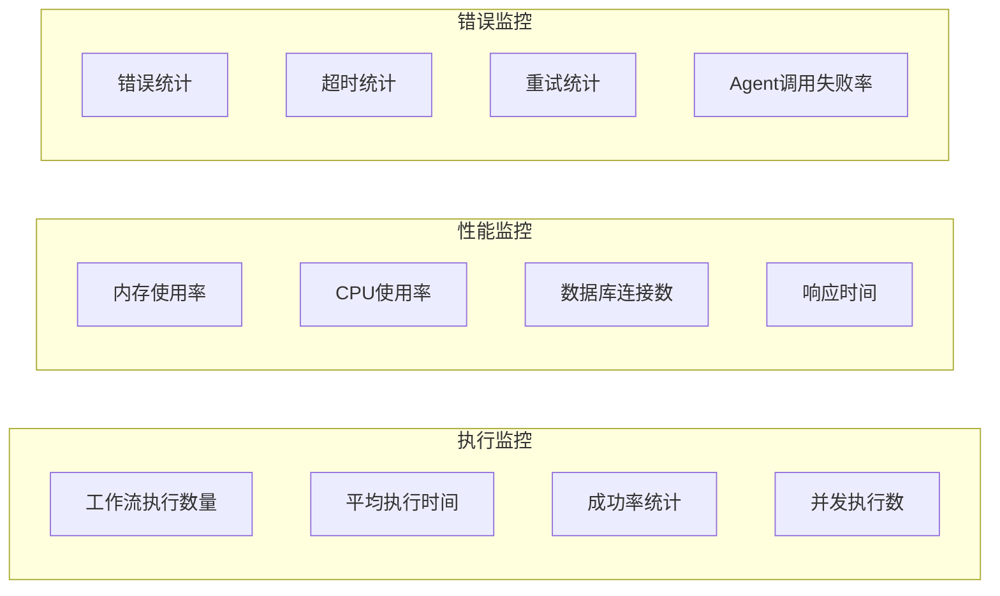

### 8.2 诊断工具

**执行追踪**:

- 详细的执行步骤日志
- 活动执行时间统计
- 变量值变化追踪

**性能分析**:

- 慢执行工作流识别
- 资源消耗热点分析
- 瓶颈定位工具

## 9. 安全设计

### 9.1 权限控制

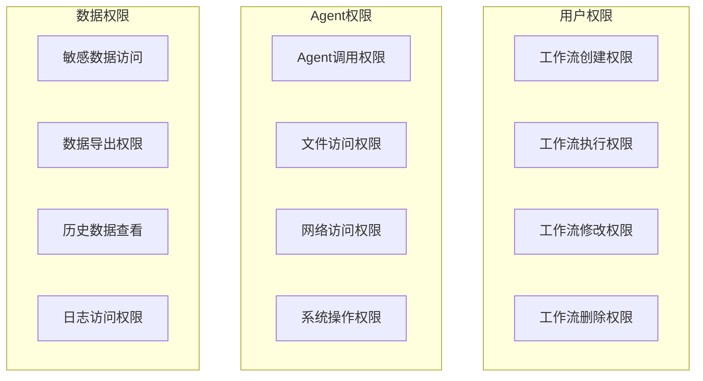

### 9.2 安全措施

**执行沙箱**:

- Agent进程隔离
- 资源使用限制
- 网络访问控制

**数据保护**:

- 敏感参数加密存储
- 执行日志脱敏
- 访问审计日志

## 10. 部署指导

### 10.1 项目结构

**应用层项目 (Lorn.OpenAgenticAI.Application.Workflow)**:

- 位置: `src/2.Application/Lorn.OpenAgenticAI.Application.Workflow/`
- 类型: Class Library (.NET 9)
- 依赖: Lorn.Domain.Workflow, Lorn.Shared.Contracts
- 职责: 工作流管理业务逻辑实现

**领域层项目 (Lorn.OpenAgenticAI.Domain.Workflow)**:

- 位置: `src/3.Domain/Lorn.OpenAgenticAI.Domain.Workflow/`
- 类型: Class Library (.NET 9)
- 依赖: Elsa.Workflows, Lorn.Domain.MCP
- 职责: Elsa引擎集成和自定义活动实现

### 10.2 配置要求

**NuGet包依赖**:

```xml
<!-- Elsa Workflows核心包 -->
<PackageReference Include="Elsa.Workflows" Version="3.x" />
<PackageReference Include="Elsa.Workflows.Core" Version="3.x" />
<PackageReference Include="Elsa.EntityFrameworkCore" Version="3.x" />

<!-- 数据存储 -->
<PackageReference Include="Microsoft.EntityFrameworkCore.Sqlite" Version="9.0" />

<!-- 日志记录 -->
<PackageReference Include="Microsoft.Extensions.Logging" Version="9.0" />
<PackageReference Include="Serilog.Extensions.Hosting" Version="8.0" />
```

**配置文件示例**:

```json
{
  "WorkflowEngine": {
    "MaxConcurrentExecutions": 10,
    "DefaultTimeout": "00:30:00",
    "PersistenceConnectionString": "Data Source=workflows.db",
    "EnableAutoCleanup": true,
    "CleanupInterval": "24:00:00"
  },
  "Activities": {
    "AgentCall": {
      "DefaultTimeout": "00:05:00",
      "MaxRetries": 3,
      "RetryDelay": "00:00:05"
    }
  }
}
```

### 10.3 启动配置

**依赖注入配置**:

- 位置: `src/2.Application/Lorn.OpenAgenticAI.Application.Workflow/ServiceCollectionExtensions.cs`
- 注册Elsa服务和自定义活动
- 配置持久化提供器
- 设置执行选项

**初始化流程**:

1. 注册Elsa工作流服务
2. 扫描并注册自定义活动
3. 配置持久化存储
4. 启动执行引擎
5. 注册事件处理器

这个技术设计文档为开发团队提供了完整的工作流引擎实现指导，包括架构设计、接口定义、数据模型、安全考虑等各个方面的详细说明。开发人员可以按照这个设计在指定的项目位置实现相应的功能模块。
