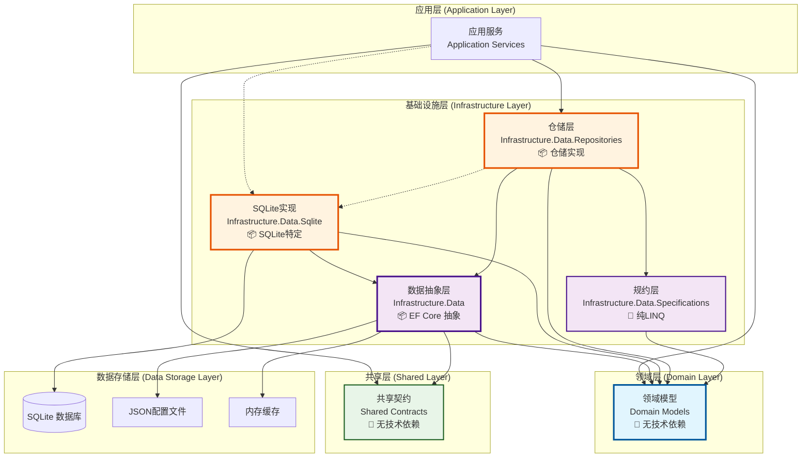
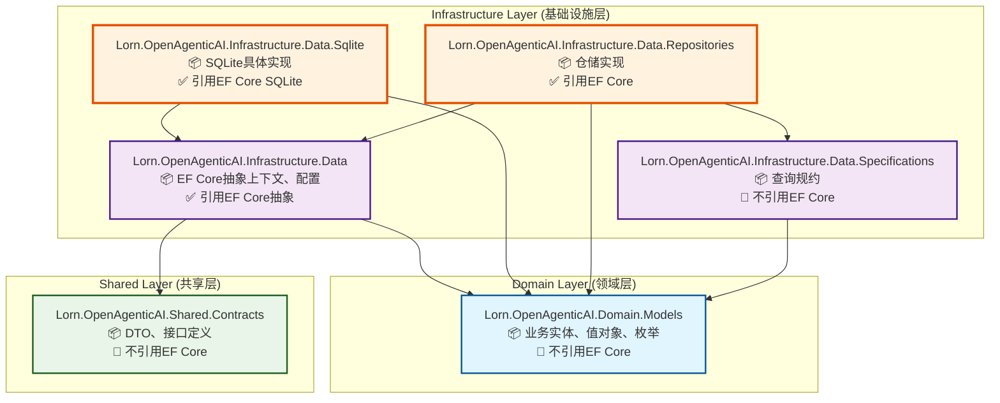
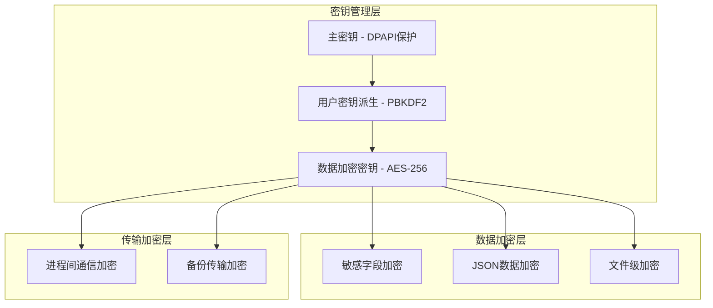

# 本地数据管理技术设计文档

## 文档信息

- **文档版本**: v2.0
- **创建日期**: 2025年7月24日
- **作者**: 技术专家
- **文档类型**: 本地数据管理技术设计
- **依赖文档**: 
  - [数据访问层综合技术设计](../../docs_TecDesign/DataAccessLayerDesign.md)
  - [持久化数据结构技术设计](../../docs_TecDesign/PersistentDataStructureDesign.md)
  - [技术架构设计](../../docs_TecDesign/TechnicalArchitecture.md)

## 概述

本文档基于已有的技术架构设计，详细描述本地数据管理功能的具体技术实现方案。作为🔴核心基础设施的重要组成部分，本地数据管理为系统所有功能提供可靠的数据存储基础，采用数据库无关架构设计，支持高性能、高可靠性和高安全性的数据管理需求。

## 技术架构定位

### 在整体架构中的位置



### Visual Studio项目结构 

本设计涉及以下项目的实现：

```text
Lorn.OpenAgenticAI.sln
├── src/
│   ├── 3.Domain/
│   │   └── Lorn.OpenAgenticAI.Domain.Models/          # 领域实体类定义
│   │
│   ├── 4.Infrastructure/
│   │   ├── Lorn.OpenAgenticAI.Infrastructure.Data/    # 数据访问基础设施
│   │   └── Lorn.OpenAgenticAI.Infrastructure.Data.Sqlite/  # SQLite具体实现
│   │
│   └── 6.Shared/
│       ├── Lorn.OpenAgenticAI.Shared.Contracts/       # 接口定义
│       └── Lorn.OpenAgenticAI.Shared.Models/          # 共享模型
```

## 数据库无关架构设计

### 核心设计原则

#### 1. 数据库无关性 (Database Agnostic)

**目标**: 业务逻辑不依赖特定数据库技术

**实现方式**:
- `Infrastructure.Data` 项目只引用 EF Core 抽象包
- 具体数据库实现独立在专门项目中
- 通过依赖注入切换数据库提供程序

**关键设计要点**:
- ✅ **应用层**仅依赖抽象接口和仓储层
- ✅ **仓储层**依赖抽象DbContext，不依赖具体数据库实现
- ✅ **具体数据库实现**通过依赖注入在运行时配置
- ❌ **应用层绝不直接引用**具体数据库实现项目

#### 2. 项目依赖关系



#### 3. Entity Framework Core 引用详情

| 项目                                                      | 是否需要EF Core | 引用的EF Core包                                                                                                             | 说明                           |
| --------------------------------------------------------- | --------------- | --------------------------------------------------------------------------------------------------------------------------- | ------------------------------ |
| **Lorn.OpenAgenticAI.Domain.Models**                      | ❌ **不需要**    | 无                                                                                                                          | 纯领域模型，不依赖任何ORM框架  |
| **Lorn.OpenAgenticAI.Shared.Contracts**                   | ❌ **不需要**    | 无                                                                                                                          | 纯DTO和接口定义                |
| **Lorn.OpenAgenticAI.Infrastructure.Data**                | ✅ **需要**      | `Microsoft.EntityFrameworkCore`<br/>`Microsoft.EntityFrameworkCore.Abstractions`                                            | EF Core抽象接口和通用功能      |
| **Lorn.OpenAgenticAI.Infrastructure.Data.Sqlite**         | ✅ **需要**      | `Microsoft.EntityFrameworkCore.Sqlite`<br/>`Microsoft.EntityFrameworkCore.Tools`<br/>`Microsoft.EntityFrameworkCore.Design` | SQLite具体实现和工具           |
| **Lorn.OpenAgenticAI.Infrastructure.Data.Repositories**   | ✅ **需要**      | `Microsoft.EntityFrameworkCore`                                                                                             | 仓储实现需要使用DbContext      |
| **Lorn.OpenAgenticAI.Infrastructure.Data.Specifications** | ❌ **不需要**    | 无                                                                                                                          | 纯查询规约模式，使用LINQ表达式 |

### 核心组件设计

#### 1. 抽象数据上下文

**项目位置**: `Lorn.OpenAgenticAI.Infrastructure.Data/OpenAgenticAIDbContext.cs`

```csharp
/// <summary>
/// 抽象数据库上下文，定义通用DbSets和配置
/// </summary>
public abstract class OpenAgenticAIDbContext : DbContext
{
    // 用户管理相关
    public DbSet<UserProfile> UserProfiles { get; set; }
    public DbSet<UserPreferences> UserPreferences { get; set; }
    
    // 任务执行相关
    public DbSet<TaskExecutionHistory> TaskExecutionHistories { get; set; }
    public DbSet<ExecutionStepRecord> ExecutionStepRecords { get; set; }
    
    // LLM管理相关
    public DbSet<ModelProvider> ModelProviders { get; set; }
    public DbSet<Model> Models { get; set; }
    public DbSet<ProviderUserConfiguration> ProviderUserConfigurations { get; set; }
    public DbSet<ModelUserConfiguration> ModelUserConfigurations { get; set; }
    
    // MCP配置相关
    public DbSet<MCPConfiguration> MCPConfigurations { get; set; }
    public DbSet<ProtocolAdapterConfiguration> ProtocolAdapterConfigurations { get; set; }
    
    // 工作流相关
    public DbSet<WorkflowTemplate> WorkflowTemplates { get; set; }
    public DbSet<WorkflowExecution> WorkflowExecutions { get; set; }
    
    // Agent管理相关
    public DbSet<AgentCapabilityRegistry> AgentCapabilityRegistries { get; set; }
    public DbSet<AgentActionDefinition> AgentActionDefinitions { get; set; }
    
    protected OpenAgenticAIDbContext(DbContextOptions options) : base(options) { }
    
    protected override void OnModelCreating(ModelBuilder modelBuilder)
    {
        // 应用通用配置
        ApplyCommonConfigurations(modelBuilder);
        base.OnModelCreating(modelBuilder);
    }
    
    /// <summary>
    /// 应用通用实体配置
    /// </summary>
    private void ApplyCommonConfigurations(ModelBuilder modelBuilder)
    {
        // 应用所有实体配置
        modelBuilder.ApplyConfigurationsFromAssembly(typeof(OpenAgenticAIDbContext).Assembly);
        
        // 全局查询过滤器
        modelBuilder.Entity<UserProfile>().HasQueryFilter(u => u.IsActive);
        
        // 全局值转换器
        foreach (var entityType in modelBuilder.Model.GetEntityTypes())
        {
            // DateTime 统一使用 UTC
            foreach (var property in entityType.GetProperties())
            {
                if (property.ClrType == typeof(DateTime) || property.ClrType == typeof(DateTime?))
                {
                    property.SetValueConverter(new ValueConverter<DateTime, DateTime>(
                        v => v.ToUniversalTime(),
                        v => DateTime.SpecifyKind(v, DateTimeKind.Utc)));
                }
            }
        }
    }
}
```

#### 2. SQLite具体实现

**项目位置**: `Lorn.OpenAgenticAI.Infrastructure.Data.Sqlite/SqliteOpenAgenticAIDbContext.cs`

```csharp
/// <summary>
/// SQLite数据库上下文具体实现
/// </summary>
public class SqliteOpenAgenticAIDbContext : OpenAgenticAIDbContext
{
    public SqliteOpenAgenticAIDbContext(DbContextOptions<SqliteOpenAgenticAIDbContext> options)
        : base(options) { }

    protected override void OnConfiguring(DbContextOptionsBuilder optionsBuilder)
    {
        if (!optionsBuilder.IsConfigured)
        {
            // 默认配置（通常通过DI配置，这里作为后备）
            optionsBuilder.UseSqlite("Data Source=openagenticai.db");
        }
        
        // SQLite特定优化
        optionsBuilder.EnableSensitiveDataLogging(false);
        optionsBuilder.EnableServiceProviderCaching();
        base.OnConfiguring(optionsBuilder);
    }

    protected override void OnModelCreating(ModelBuilder modelBuilder)
    {
        base.OnModelCreating(modelBuilder);
        
        // 应用SQLite特定配置
        ApplySqliteConfigurations(modelBuilder);
    }
    
    /// <summary>
    /// 应用SQLite特定配置
    /// </summary>
    private void ApplySqliteConfigurations(ModelBuilder modelBuilder)
    {
        // JSON列配置（SQLite 3.38+支持JSON）
        modelBuilder.Entity<UserProfile>()
            .Property(e => e.Metadata)
            .HasConversion(
                v => JsonSerializer.Serialize(v, JsonSerializerOptions.Default),
                v => JsonSerializer.Deserialize<Dictionary<string, object>>(v, JsonSerializerOptions.Default));
                
        modelBuilder.Entity<TaskExecutionHistory>()
            .Property(e => e.MetadataJson)
            .HasConversion(
                v => JsonSerializer.Serialize(v, JsonSerializerOptions.Default),
                v => JsonSerializer.Deserialize<Dictionary<string, object>>(v, JsonSerializerOptions.Default));
        
        // SQLite不支持多列外键，需要特殊处理
        modelBuilder.Entity<UserPreferences>()
            .HasIndex(e => new { e.UserId, e.PreferenceCategory, e.PreferenceKey })
            .IsUnique();
            
        // SQLite日期时间配置
        modelBuilder.Entity<TaskExecutionHistory>()
            .Property(e => e.StartTime)
            .HasConversion(new DateTimeToStringConverter());
    }
}
```

#### 3. 服务注册扩展

**项目位置**: `Lorn.OpenAgenticAI.Infrastructure.Data.Sqlite/ServiceCollectionExtensions.cs`

```csharp
/// <summary>
/// SQLite数据库服务注册扩展
/// </summary>
public static class SqliteServiceCollectionExtensions
{
    /// <summary>
    /// 注册SQLite数据库服务
    /// </summary>
    public static IServiceCollection AddSqliteDatabase(
        this IServiceCollection services, 
        string connectionString,
        Action<DbContextOptionsBuilder> optionsAction = null)
    {
        services.AddDbContext<OpenAgenticAIDbContext, SqliteOpenAgenticAIDbContext>(options =>
        {
            options.UseSqlite(connectionString, sqliteOptions =>
            {
                sqliteOptions.MigrationsAssembly("Lorn.OpenAgenticAI.Infrastructure.Data.Sqlite");
                sqliteOptions.CommandTimeout(30);
            });
            
            // 应用额外配置
            optionsAction?.Invoke(options);
        });
        
        // 注册数据库初始化服务
        services.AddScoped<IDatabaseInitializer, SqliteDatabaseInitializer>();
        
        return services;
    }
    
    /// <summary>
    /// 从配置注册SQLite数据库服务
    /// </summary>
    public static IServiceCollection AddSqliteDatabase(
        this IServiceCollection services, 
        IConfiguration configuration,
        string connectionStringName = "DefaultConnection")
    {
        var connectionString = configuration.GetConnectionString(connectionStringName);
        if (string.IsNullOrEmpty(connectionString))
        {
            throw new InvalidOperationException($"Connection string '{connectionStringName}' not found.");
        }
        
        return services.AddSqliteDatabase(connectionString);
    }
}
```

## 领域实体设计

### 1. 用户管理实体

#### 1.1 用户档案实体

**项目位置**: `Lorn.OpenAgenticAI.Domain.Models/UserManagement/UserProfile.cs`

```csharp
/// <summary>
/// 用户档案聚合根
/// </summary>
public class UserProfile : IAggregateRoot
{
    public Guid UserId { get; private set; }
    public string Username { get; private set; }
    public string Email { get; private set; }
    public DateTime CreatedTime { get; private set; }
    public DateTime LastLoginTime { get; private set; }
    public bool IsActive { get; private set; }
    public int ProfileVersion { get; private set; }
    
    // 值对象
    public SecuritySettings SecuritySettings { get; private set; }
    
    // JSON存储的复杂属性
    public Dictionary<string, object> Metadata { get; private set; } = new();
    
    // 导航属性
    public virtual ICollection<UserPreferences> UserPreferences { get; private set; } = new List<UserPreferences>();
    public virtual ICollection<TaskExecutionHistory> ExecutionHistories { get; private set; } = new List<TaskExecutionHistory>();
    public virtual ICollection<WorkflowTemplate> WorkflowTemplates { get; private set; } = new List<WorkflowTemplate>();
    
    // 私有构造函数（EF Core需要）
    private UserProfile() { }
    
    // 工厂方法
    public static UserProfile Create(string username, string email)
    {
        return new UserProfile
        {
            UserId = Guid.NewGuid(),
            Username = username,
            Email = email,
            CreatedTime = DateTime.UtcNow,
            IsActive = true,
            ProfileVersion = 1,
            SecuritySettings = SecuritySettings.CreateDefault()
        };
    }
    
    // 领域方法
    public void UpdateLastLogin()
    {
        LastLoginTime = DateTime.UtcNow;
        IncrementVersion();
    }
    
    public void IncrementVersion()
    {
        ProfileVersion++;
    }
    
    public bool ValidateProfile()
    {
        return !string.IsNullOrEmpty(Username) && 
               !string.IsNullOrEmpty(Email) && 
               SecuritySettings?.IsValid() == true;
    }
}
```

#### 1.2 用户偏好实体

**项目位置**: `Lorn.OpenAgenticAI.Domain.Models/UserManagement/UserPreferences.cs`

```csharp
/// <summary>
/// 用户偏好设置实体
/// </summary>
public class UserPreferences : IEntity
{
    public Guid PreferenceId { get; private set; }
    public Guid UserId { get; private set; }
    public string PreferenceCategory { get; private set; }
    public string PreferenceKey { get; private set; }
    public string PreferenceValue { get; private set; }
    public string ValueType { get; private set; }
    public DateTime LastUpdatedTime { get; private set; }
    public bool IsSystemDefault { get; private set; }
    public string Description { get; private set; }
    
    // 导航属性
    public virtual UserProfile User { get; private set; }
    
    private UserPreferences() { }
    
    public static UserPreferences Create(Guid userId, string category, string key, string value, string valueType = "String")
    {
        return new UserPreferences
        {
            PreferenceId = Guid.NewGuid(),
            UserId = userId,
            PreferenceCategory = category,
            PreferenceKey = key,
            PreferenceValue = value,
            ValueType = valueType,
            LastUpdatedTime = DateTime.UtcNow,
            IsSystemDefault = false
        };
    }
    
    public T GetTypedValue<T>()
    {
        return ValueType switch
        {
            "Boolean" => (T)(object)bool.Parse(PreferenceValue),
            "Integer" => (T)(object)int.Parse(PreferenceValue),
            "Double" => (T)(object)double.Parse(PreferenceValue),
            "DateTime" => (T)(object)DateTime.Parse(PreferenceValue),
            _ => (T)(object)PreferenceValue
        };
    }
    
    public void SetTypedValue<T>(T value)
    {
        PreferenceValue = value?.ToString();
        ValueType = typeof(T).Name;
        LastUpdatedTime = DateTime.UtcNow;
    }
}
```

#### 1.3 安全设置值对象

**项目位置**: `Lorn.OpenAgenticAI.Domain.Models/UserManagement/SecuritySettings.cs`

```csharp
/// <summary>
/// 安全设置值对象
/// </summary>
public class SecuritySettings : ValueObject
{
    public string AuthenticationMethod { get; private set; }
    public int SessionTimeoutMinutes { get; private set; }
    public bool RequireTwoFactor { get; private set; }
    public DateTime PasswordLastChanged { get; private set; }
    public Dictionary<string, string> AdditionalSettings { get; private set; }
    
    private SecuritySettings() { }
    
    public static SecuritySettings CreateDefault()
    {
        return new SecuritySettings
        {
            AuthenticationMethod = "Windows",
            SessionTimeoutMinutes = 480, // 8小时
            RequireTwoFactor = false,
            PasswordLastChanged = DateTime.UtcNow,
            AdditionalSettings = new Dictionary<string, string>()
        };
    }
    
    public static SecuritySettings Create(string authMethod, int timeoutMinutes, bool requireTwoFactor)
    {
        return new SecuritySettings
        {
            AuthenticationMethod = authMethod,
            SessionTimeoutMinutes = timeoutMinutes,
            RequireTwoFactor = requireTwoFactor,
            PasswordLastChanged = DateTime.UtcNow,
            AdditionalSettings = new Dictionary<string, string>()
        };
    }
    
    public bool IsValid()
    {
        return !string.IsNullOrEmpty(AuthenticationMethod) &&
               SessionTimeoutMinutes > 0 &&
               SessionTimeoutMinutes <= 1440; // 最大24小时
    }
    
    public bool RequiresPasswordChange()
    {
        return DateTime.UtcNow.Subtract(PasswordLastChanged).TotalDays > 90;
    }
    
    protected override IEnumerable<object> GetEqualityComponents()
    {
        yield return AuthenticationMethod;
        yield return SessionTimeoutMinutes;
        yield return RequireTwoFactor;
        yield return PasswordLastChanged;
    }
}
```

### 2. 任务执行相关实体

#### 2.1 任务执行历史聚合根

**项目位置**: `Lorn.OpenAgenticAI.Domain.Models/Execution/TaskExecutionHistory.cs`

```csharp
/// <summary>
/// 任务执行历史聚合根
/// </summary>
public class TaskExecutionHistory : IAggregateRoot
{
    public Guid ExecutionId { get; private set; }
    public Guid UserId { get; private set; }
    public string RequestId { get; private set; }
    public string UserInput { get; private set; }
    public string RequestType { get; private set; }
    public ExecutionStatus ExecutionStatus { get; private set; }
    public DateTime StartTime { get; private set; }
    public DateTime? EndTime { get; private set; }
    public long TotalExecutionTime { get; private set; }
    public bool IsSuccessful { get; private set; }
    public string ResultSummary { get; private set; }
    public int ErrorCount { get; private set; }
    public string LlmProvider { get; private set; }
    public string LlmModel { get; private set; }
    public int TokenUsage { get; private set; }
    public decimal EstimatedCost { get; private set; }
    public List<string> Tags { get; private set; } = new();
    public Dictionary<string, object> Metadata { get; private set; } = new();
    
    // 导航属性
    public virtual UserProfile User { get; private set; }
    public virtual ICollection<ExecutionStepRecord> ExecutionSteps { get; private set; } = new List<ExecutionStepRecord>();
    public virtual ICollection<ErrorEventRecord> ErrorEvents { get; private set; } = new List<ErrorEventRecord>();
    public virtual ICollection<PerformanceMetricsRecord> PerformanceMetrics { get; private set; } = new List<PerformanceMetricsRecord>();
    
    private TaskExecutionHistory() { }
    
    public static TaskExecutionHistory Create(Guid userId, string userInput, string requestType)
    {
        return new TaskExecutionHistory
        {
            ExecutionId = Guid.NewGuid(),
            UserId = userId,
            RequestId = Guid.NewGuid().ToString("N")[..8],
            UserInput = userInput,
            RequestType = requestType,
            ExecutionStatus = ExecutionStatus.Pending,
            StartTime = DateTime.UtcNow
        };
    }
    
    public long CalculateExecutionTime()
    {
        if (EndTime.HasValue)
        {
            TotalExecutionTime = (long)(EndTime.Value - StartTime).TotalMilliseconds;
        }
        return TotalExecutionTime;
    }
    
    public void AddExecutionStep(ExecutionStepRecord step)
    {
        ExecutionSteps.Add(step);
    }
    
    public void MarkAsCompleted(bool isSuccessful)
    {
        EndTime = DateTime.UtcNow;
        IsSuccessful = isSuccessful;
        ExecutionStatus = isSuccessful ? ExecutionStatus.Completed : ExecutionStatus.Failed;
        CalculateExecutionTime();
    }
    
    public void AddErrorEvent(ErrorEventRecord errorEvent)
    {
        ErrorEvents.Add(errorEvent);
        ErrorCount++;
    }
}
```

#### 2.2 执行步骤记录实体

**项目位置**: `Lorn.OpenAgenticAI.Domain.Models/Execution/ExecutionStepRecord.cs`

```csharp
/// <summary>
/// 执行步骤记录实体
/// </summary>
public class ExecutionStepRecord : IEntity
{
    public Guid StepRecordId { get; private set; }
    public Guid ExecutionId { get; private set; }
    public string StepId { get; private set; }
    public int StepOrder { get; private set; }
    public string StepDescription { get; private set; }
    public string AgentId { get; private set; }
    public string ActionName { get; private set; }
    public string Parameters { get; private set; }
    public ExecutionStatus StepStatus { get; private set; }
    public DateTime StartTime { get; private set; }
    public DateTime? EndTime { get; private set; }
    public long ExecutionTime { get; private set; }
    public bool IsSuccessful { get; private set; }
    public string OutputData { get; private set; }
    public string ErrorMessage { get; private set; }
    public int RetryCount { get; private set; }
    
    // 值对象
    public ResourceUsage ResourceUsage { get; private set; }
    
    // 导航属性
    public virtual TaskExecutionHistory Execution { get; private set; }
    
    private ExecutionStepRecord() { }
    
    public static ExecutionStepRecord Create(Guid executionId, string stepId, int stepOrder, string agentId, string actionName)
    {
        return new ExecutionStepRecord
        {
            StepRecordId = Guid.NewGuid(),
            ExecutionId = executionId,
            StepId = stepId,
            StepOrder = stepOrder,
            AgentId = agentId,
            ActionName = actionName,
            StepStatus = ExecutionStatus.Pending,
            StartTime = DateTime.UtcNow,
            RetryCount = 0
        };
    }
    
    public long CalculateExecutionTime()
    {
        if (EndTime.HasValue)
        {
            ExecutionTime = (long)(EndTime.Value - StartTime).TotalMilliseconds;
        }
        return ExecutionTime;
    }
    
    public void IncrementRetryCount()
    {
        RetryCount++;
    }
    
    public void MarkAsCompleted(bool isSuccessful)
    {
        EndTime = DateTime.UtcNow;
        IsSuccessful = isSuccessful;
        StepStatus = isSuccessful ? ExecutionStatus.Completed : ExecutionStatus.Failed;
        CalculateExecutionTime();
    }
}
```

#### 2.3 执行状态枚举

**项目位置**: `Lorn.OpenAgenticAI.Domain.Models/Execution/ExecutionStatus.cs`

```csharp
/// <summary>
/// 执行状态枚举
/// </summary>
public enum ExecutionStatus
{
    Pending = 0,
    Running = 1,
    Completed = 2,
    Failed = 3,
    Cancelled = 4,
    Timeout = 5
}
```

#### 2.4 资源使用值对象

**项目位置**: `Lorn.OpenAgenticAI.Domain.Models/Execution/ResourceUsage.cs`

```csharp
/// <summary>
/// 资源使用值对象
/// </summary>
public class ResourceUsage : ValueObject
{
    public double CpuUsagePercent { get; private set; }
    public long MemoryUsageBytes { get; private set; }
    public long DiskIOBytes { get; private set; }
    public long NetworkIOBytes { get; private set; }
    public Dictionary<string, double> CustomMetrics { get; private set; }
    
    private ResourceUsage() { }
    
    public static ResourceUsage Create(double cpuUsage, long memoryUsage, long diskIO = 0, long networkIO = 0)
    {
        return new ResourceUsage
        {
            CpuUsagePercent = cpuUsage,
            MemoryUsageBytes = memoryUsage,
            DiskIOBytes = diskIO,
            NetworkIOBytes = networkIO,
            CustomMetrics = new Dictionary<string, double>()
        };
    }
    
    public bool IsWithinLimits(ResourceLimits limits)
    {
        return CpuUsagePercent <= limits.MaxCpuPercent &&
               MemoryUsageBytes <= limits.MaxMemoryBytes &&
               DiskIOBytes <= limits.MaxDiskIOBytes &&
               NetworkIOBytes <= limits.MaxNetworkIOBytes;
    }
    
    protected override IEnumerable<object> GetEqualityComponents()
    {
        yield return CpuUsagePercent;
        yield return MemoryUsageBytes;
        yield return DiskIOBytes;
        yield return NetworkIOBytes;
    }
}
```

## EF Core配置设计

### 1. 实体配置类

#### 1.1 用户档案配置

**项目位置**: `Lorn.OpenAgenticAI.Infrastructure.Data/Configurations/UserProfileConfiguration.cs`

```csharp
/// <summary>
/// 用户档案实体配置
/// </summary>
public class UserProfileConfiguration : IEntityTypeConfiguration<UserProfile>
{
    public void Configure(EntityTypeBuilder<UserProfile> builder)
    {
        // 表名和主键
        builder.ToTable("UserProfiles");
        builder.HasKey(e => e.UserId);
        
        // 属性配置
        builder.Property(e => e.UserId)
            .IsRequired()
            .HasDefaultValueSql("NEWID()");
            
        builder.Property(e => e.Username)
            .IsRequired()
            .HasMaxLength(100);
            
        builder.Property(e => e.Email)
            .IsRequired()
            .HasMaxLength(255);
            
        builder.Property(e => e.CreatedTime)
            .IsRequired()
            .HasDefaultValueSql("GETUTCDATE()");
            
        builder.Property(e => e.LastLoginTime)
            .IsRequired(false);
            
        builder.Property(e => e.IsActive)
            .IsRequired()
            .HasDefaultValue(true);
            
        builder.Property(e => e.ProfileVersion)
            .IsRequired()
            .HasDefaultValue(1);
        
        // 复杂类型配置
        builder.OwnsOne(e => e.SecuritySettings, securityBuilder =>
        {
            securityBuilder.Property(s => s.AuthenticationMethod)
                .HasMaxLength(50)
                .HasDefaultValue("Windows");
                
            securityBuilder.Property(s => s.SessionTimeoutMinutes)
                .HasDefaultValue(480);
                
            securityBuilder.Property(s => s.RequireTwoFactor)
                .HasDefaultValue(false);
                
            securityBuilder.Property(s => s.PasswordLastChanged)
                .IsRequired();
                
            securityBuilder.Property(s => s.AdditionalSettings)
                .HasConversion(
                    v => JsonSerializer.Serialize(v, JsonSerializerOptions.Default),
                    v => JsonSerializer.Deserialize<Dictionary<string, string>>(v, JsonSerializerOptions.Default))
                .HasColumnType("TEXT");
        });
        
        // JSON列配置
        builder.Property(e => e.Metadata)
            .HasConversion(
                v => JsonSerializer.Serialize(v, JsonSerializerOptions.Default),
                v => JsonSerializer.Deserialize<Dictionary<string, object>>(v, JsonSerializerOptions.Default))
            .HasColumnType("TEXT");
        
        // 关系配置
        builder.HasMany(e => e.UserPreferences)
            .WithOne(p => p.User)
            .HasForeignKey(p => p.UserId)
            .OnDelete(DeleteBehavior.Cascade);
            
        builder.HasMany(e => e.ExecutionHistories)
            .WithOne(h => h.User)
            .HasForeignKey(h => h.UserId)
            .OnDelete(DeleteBehavior.Cascade);
            
        builder.HasMany(e => e.WorkflowTemplates)
            .WithOne(w => w.User)
            .HasForeignKey(w => w.UserId)
            .OnDelete(DeleteBehavior.Cascade);
        
        // 索引配置
        builder.HasIndex(e => e.Username)
            .IsUnique()
            .HasDatabaseName("IX_UserProfiles_Username");
            
        builder.HasIndex(e => e.Email)
            .IsUnique()
            .HasDatabaseName("IX_UserProfiles_Email");
            
        builder.HasIndex(e => new { e.IsActive, e.CreatedTime })
            .HasDatabaseName("IX_UserProfiles_Active_Created");
    }
}
```

#### 1.2 任务执行历史配置

**项目位置**: `Lorn.OpenAgenticAI.Infrastructure.Data/Configurations/TaskExecutionHistoryConfiguration.cs`

```csharp
/// <summary>
/// 任务执行历史实体配置
/// </summary>
public class TaskExecutionHistoryConfiguration : IEntityTypeConfiguration<TaskExecutionHistory>
{
    public void Configure(EntityTypeBuilder<TaskExecutionHistory> builder)
    {
        // 表名和主键
        builder.ToTable("TaskExecutionHistory");
        builder.HasKey(e => e.ExecutionId);
        
        // 属性配置
        builder.Property(e => e.ExecutionId)
            .IsRequired()
            .HasDefaultValueSql("NEWID()");
            
        builder.Property(e => e.UserId)
            .IsRequired();
            
        builder.Property(e => e.RequestId)
            .IsRequired()
            .HasMaxLength(50);
            
        builder.Property(e => e.UserInput)
            .HasMaxLength(4000);
            
        builder.Property(e => e.RequestType)
            .IsRequired()
            .HasMaxLength(100);
            
        builder.Property(e => e.ExecutionStatus)
            .IsRequired()
            .HasConversion<string>()
            .HasMaxLength(50);
            
        builder.Property(e => e.StartTime)
            .IsRequired();
            
        builder.Property(e => e.EndTime)
            .IsRequired(false);
            
        builder.Property(e => e.TotalExecutionTime)
            .HasDefaultValue(0);
            
        builder.Property(e => e.IsSuccessful)
            .HasDefaultValue(false);
            
        builder.Property(e => e.ResultSummary)
            .HasMaxLength(2000);
            
        builder.Property(e => e.ErrorCount)
            .HasDefaultValue(0);
            
        builder.Property(e => e.LlmProvider)
            .HasMaxLength(100);
            
        builder.Property(e => e.LlmModel)
            .HasMaxLength(100);
            
        builder.Property(e => e.TokenUsage)
            .HasDefaultValue(0);
            
        builder.Property(e => e.EstimatedCost)
            .HasColumnType("decimal(18,6)")
            .HasDefaultValue(0);
        
        // 集合属性配置
        builder.Property(e => e.Tags)
            .HasConversion(
                v => JsonSerializer.Serialize(v, JsonSerializerOptions.Default),
                v => JsonSerializer.Deserialize<List<string>>(v, JsonSerializerOptions.Default))
            .HasColumnType("TEXT");
            
        builder.Property(e => e.Metadata)
            .HasConversion(
                v => JsonSerializer.Serialize(v, JsonSerializerOptions.Default),
                v => JsonSerializer.Deserialize<Dictionary<string, object>>(v, JsonSerializerOptions.Default))
            .HasColumnType("TEXT");
        
        // 关系配置
        builder.HasOne(e => e.User)
            .WithMany(u => u.ExecutionHistories)
            .HasForeignKey(e => e.UserId)
            .OnDelete(DeleteBehavior.Cascade);
            
        builder.HasMany(e => e.ExecutionSteps)
            .WithOne(s => s.Execution)
            .HasForeignKey(s => s.ExecutionId)
            .OnDelete(DeleteBehavior.Cascade);
        
        // 索引配置
        builder.HasIndex(e => new { e.UserId, e.StartTime })
            .HasDatabaseName("IX_TaskExecutionHistory_User_StartTime")
            .IsDescending(false, true); // UserId升序，StartTime降序
            
        builder.HasIndex(e => new { e.UserId, e.ExecutionStatus })
            .HasDatabaseName("IX_TaskExecutionHistory_User_Status");
            
        builder.HasIndex(e => e.RequestId)
            .HasDatabaseName("IX_TaskExecutionHistory_RequestId");
            
        builder.HasIndex(e => new { e.LlmProvider, e.LlmModel, e.StartTime })
            .HasDatabaseName("IX_TaskExecutionHistory_LLM_Time");
    }
}
```

#### 1.3 执行步骤记录配置

**项目位置**: `Lorn.OpenAgenticAI.Infrastructure.Data/Configurations/ExecutionStepRecordConfiguration.cs`

```csharp
/// <summary>
/// 执行步骤记录实体配置
/// </summary>
public class ExecutionStepRecordConfiguration : IEntityTypeConfiguration<ExecutionStepRecord>
{
    public void Configure(EntityTypeBuilder<ExecutionStepRecord> builder)
    {
        // 表名和主键
        builder.ToTable("ExecutionStepRecords");
        builder.HasKey(e => e.StepRecordId);
        
        // 属性配置
        builder.Property(e => e.StepRecordId)
            .IsRequired()
            .HasDefaultValueSql("NEWID()");
            
        builder.Property(e => e.ExecutionId)
            .IsRequired();
            
        builder.Property(e => e.StepId)
            .IsRequired()
            .HasMaxLength(100);
            
        builder.Property(e => e.StepOrder)
            .IsRequired();
            
        builder.Property(e => e.StepDescription)
            .HasMaxLength(500);
            
        builder.Property(e => e.AgentId)
            .IsRequired()
            .HasMaxLength(100);
            
        builder.Property(e => e.ActionName)
            .IsRequired()
            .HasMaxLength(100);
            
        builder.Property(e => e.Parameters)
            .HasColumnType("TEXT");
            
        builder.Property(e => e.StepStatus)
            .IsRequired()
            .HasConversion<string>()
            .HasMaxLength(50);
            
        builder.Property(e => e.StartTime)
            .IsRequired();
            
        builder.Property(e => e.EndTime)
            .IsRequired(false);
            
        builder.Property(e => e.ExecutionTime)
            .HasDefaultValue(0);
            
        builder.Property(e => e.IsSuccessful)
            .HasDefaultValue(false);
            
        builder.Property(e => e.OutputData)
            .HasColumnType("TEXT");
            
        builder.Property(e => e.ErrorMessage)
            .HasMaxLength(2000);
            
        builder.Property(e => e.RetryCount)
            .HasDefaultValue(0);
        
        // 复杂类型配置
        builder.OwnsOne(e => e.ResourceUsage, resourceBuilder =>
        {
            resourceBuilder.Property(r => r.CpuUsagePercent)
                .HasColumnType("decimal(5,2)")
                .HasDefaultValue(0);
                
            resourceBuilder.Property(r => r.MemoryUsageBytes)
                .HasDefaultValue(0);
                
            resourceBuilder.Property(r => r.DiskIOBytes)
                .HasDefaultValue(0);
                
            resourceBuilder.Property(r => r.NetworkIOBytes)
                .HasDefaultValue(0);
                
            resourceBuilder.Property(r => r.CustomMetrics)
                .HasConversion(
                    v => JsonSerializer.Serialize(v, JsonSerializerOptions.Default),
                    v => JsonSerializer.Deserialize<Dictionary<string, double>>(v, JsonSerializerOptions.Default))
                .HasColumnType("TEXT");
        });
        
        // 关系配置
        builder.HasOne(e => e.Execution)
            .WithMany(h => h.ExecutionSteps)
            .HasForeignKey(e => e.ExecutionId)
            .OnDelete(DeleteBehavior.Cascade);
        
        // 索引配置
        builder.HasIndex(e => new { e.ExecutionId, e.StepOrder })
            .HasDatabaseName("IX_ExecutionStepRecords_Execution_Order")
            .IsUnique();
            
        builder.HasIndex(e => new { e.AgentId, e.ActionName, e.StartTime })
            .HasDatabaseName("IX_ExecutionStepRecords_Agent_Action_Time");
            
        builder.HasIndex(e => new { e.StepStatus, e.StartTime })
            .HasDatabaseName("IX_ExecutionStepRecords_Status_Time");
    }
}
```

### 2. 数据库迁移策略

#### 2.1 迁移管理器

**项目位置**: `Lorn.OpenAgenticAI.Infrastructure.Data.Sqlite/Migrations/DatabaseMigrator.cs`

```csharp
/// <summary>
/// 数据库迁移管理器
/// </summary>
public class DatabaseMigrator : IDatabaseMigrator
{
    private readonly OpenAgenticAIDbContext _context;
    private readonly ILogger<DatabaseMigrator> _logger;
    
    public DatabaseMigrator(OpenAgenticAIDbContext context, ILogger<DatabaseMigrator> logger)
    {
        _context = context;
        _logger = logger;
    }
    
    public async Task<bool> NeedsMigrationAsync()
    {
        try
        {
            var pendingMigrations = await _context.Database.GetPendingMigrationsAsync();
            return pendingMigrations.Any();
        }
        catch (Exception ex)
        {
            _logger.LogError(ex, "检查数据库迁移状态时发生错误");
            return true; // 安全起见，假设需要迁移
        }
    }
    
    public async Task<string> GetCurrentVersionAsync()
    {
        try
        {
            var appliedMigrations = await _context.Database.GetAppliedMigrationsAsync();
            return appliedMigrations.LastOrDefault() ?? "Initial";
        }
        catch (Exception ex)
        {
            _logger.LogError(ex, "获取当前数据库版本时发生错误");
            return "Unknown";
        }
    }
    
    public async Task MigrateToLatestAsync()
    {
        try
        {
            _logger.LogInformation("开始数据库迁移到最新版本");
            
            // 确保数据库存在
            await _context.Database.EnsureCreatedAsync();
            
            // 执行待处理的迁移
            await _context.Database.MigrateAsync();
            
            // 验证迁移结果
            var currentVersion = await GetCurrentVersionAsync();
            _logger.LogInformation("数据库迁移完成，当前版本: {Version}", currentVersion);
        }
        catch (Exception ex)
        {
            _logger.LogError(ex, "数据库迁移失败");
            throw new DatabaseMigrationException("数据库迁移失败", ex);
        }
    }
    
    public async Task MigrateToVersionAsync(string targetVersion)
    {
        try
        {
            _logger.LogInformation("开始数据库迁移到指定版本: {TargetVersion}", targetVersion);
            
            // 获取所有可用迁移
            var allMigrations = _context.Database.GetMigrations().ToList();
            var targetMigration = allMigrations.FirstOrDefault(m => m.Contains(targetVersion));
            
            if (targetMigration == null)
            {
                throw new ArgumentException($"未找到目标版本的迁移: {targetVersion}");
            }
            
            // 迁移到指定版本
            await _context.Database.MigrateAsync(targetMigration);
            
            _logger.LogInformation("数据库迁移到版本 {TargetVersion} 完成", targetVersion);
        }
        catch (Exception ex)
        {
            _logger.LogError(ex, "数据库迁移到版本 {TargetVersion} 失败", targetVersion);
            throw new DatabaseMigrationException($"数据库迁移到版本 {targetVersion} 失败", ex);
        }
    }
    
    public async Task<IEnumerable<string>> GetAvailableVersionsAsync()
    {
        try
        {
            var migrations = _context.Database.GetMigrations();
            return migrations.Select(m => ExtractVersionFromMigrationName(m)).ToList();
        }
        catch (Exception ex)
        {
            _logger.LogError(ex, "获取可用数据库版本时发生错误");
            return Enumerable.Empty<string>();
        }
    }
    
    private string ExtractVersionFromMigrationName(string migrationName)
    {
        // 从迁移名称中提取版本信息
        // 例如: "20250724120000_InitialCreate" -> "v1.0.0"
        var timestamp = migrationName.Split('_')[0];
        return $"v1.0.{timestamp[..8]}"; // 简化版本号
    }
}
```

### 3. 索引优化策略

#### 3.1 智能索引管理器

**项目位置**: `Lorn.OpenAgenticAI.Infrastructure.Data/Optimization/IndexOptimizer.cs`

```csharp
/// <summary>
/// 智能索引优化器
/// </summary>
public class IndexOptimizer : IIndexOptimizer
{
    private readonly OpenAgenticAIDbContext _context;
    private readonly ILogger<IndexOptimizer> _logger;
    
    public IndexOptimizer(OpenAgenticAIDbContext context, ILogger<IndexOptimizer> logger)
    {
        _context = context;
        _logger = logger;
    }
    
    public async Task OptimizeIndexesAsync()
    {
        try
        {
            _logger.LogInformation("开始索引优化");
            
            // 1. 分析查询模式
            var queryPatterns = await AnalyzeQueryPatternsAsync();
            
            // 2. 识别缺失索引
            var missingIndexes = await IdentifyMissingIndexesAsync(queryPatterns);
            
            // 3. 创建推荐索引
            foreach (var index in missingIndexes)
            {
                await CreateIndexAsync(index);
            }
            
            // 4. 清理无用索引
            var unusedIndexes = await IdentifyUnusedIndexesAsync();
            foreach (var index in unusedIndexes)
            {
                await DropIndexAsync(index);
            }
            
            // 5. 更新统计信息
            await UpdateStatisticsAsync();
            
            _logger.LogInformation("索引优化完成");
        }
        catch (Exception ex)
        {
            _logger.LogError(ex, "索引优化失败");
            throw;
        }
    }
    
    private async Task<List<QueryPattern>> AnalyzeQueryPatternsAsync()
    {
        // 分析最近的查询模式
        var patterns = new List<QueryPattern>();
        
        // 从查询日志中分析常见查询模式
        // 这里简化实现，实际应该分析SQL查询日志
        patterns.Add(new QueryPattern
        {
            TableName = "TaskExecutionHistory",
            Columns = new[] { "UserId", "StartTime" },
            QueryType = QueryType.Select,
            Frequency = 1000
        });
        
        patterns.Add(new QueryPattern
        {
            TableName = "ExecutionStepRecords",
            Columns = new[] { "ExecutionId", "StepOrder" },
            QueryType = QueryType.Select,
            Frequency = 800
        });
        
        return patterns;
    }
    
    private async Task<List<IndexRecommendation>> IdentifyMissingIndexesAsync(List<QueryPattern> queryPatterns)
    {
        var recommendations = new List<IndexRecommendation>();
        
        foreach (var pattern in queryPatterns.Where(p => p.Frequency > 100))
        {
            var indexName = $"IX_{pattern.TableName}_{string.Join("_", pattern.Columns)}";
            var exists = await IndexExistsAsync(pattern.TableName, indexName);
            
            if (!exists)
            {
                recommendations.Add(new IndexRecommendation
                {
                    TableName = pattern.TableName,
                    IndexName = indexName,
                    Columns = pattern.Columns,
                    Priority = CalculateIndexPriority(pattern)
                });
            }
        }
        
        return recommendations.OrderByDescending(r => r.Priority).ToList();
    }
    
    private async Task CreateIndexAsync(IndexRecommendation recommendation)
    {
        try
        {
            var sql = $"CREATE INDEX {recommendation.IndexName} ON {recommendation.TableName} ({string.Join(", ", recommendation.Columns)})";
            await _context.Database.ExecuteSqlRawAsync(sql);
            
            _logger.LogInformation("创建索引: {IndexName}", recommendation.IndexName);
        }
        catch (Exception ex)
        {
            _logger.LogWarning(ex, "创建索引失败: {IndexName}", recommendation.IndexName);
        }
    }
    
    private int CalculateIndexPriority(QueryPattern pattern)
    {
        // 根据查询频率、表大小等因素计算索引优先级
        return pattern.Frequency * pattern.Columns.Length;
    }
}
```

## 仓储模式实现

### 1. 基础仓储接口

**项目位置**: `Lorn.OpenAgenticAI.Shared.Contracts/Repositories/IRepository.cs`

```csharp
/// <summary>
/// 基础仓储接口
/// </summary>
public interface IRepository<T> where T : class, IAggregateRoot
{
    Task<T> GetByIdAsync(object id, CancellationToken cancellationToken = default);
    Task<IReadOnlyList<T>> GetAllAsync(CancellationToken cancellationToken = default);
    Task<IReadOnlyList<T>> FindAsync(ISpecification<T> specification, CancellationToken cancellationToken = default);
    Task<T> FirstOrDefaultAsync(ISpecification<T> specification, CancellationToken cancellationToken = default);
    Task<int> CountAsync(ISpecification<T> specification, CancellationToken cancellationToken = default);
    Task<T> AddAsync(T entity, CancellationToken cancellationToken = default);
    Task UpdateAsync(T entity, CancellationToken cancellationToken = default);
    Task DeleteAsync(T entity, CancellationToken cancellationToken = default);
    Task<PagedResult<T>> GetPagedAsync(ISpecification<T> specification, int pageNumber, int pageSize, CancellationToken cancellationToken = default);
}
```

### 2. 专门仓储接口

#### 2.1 用户管理仓储接口

**项目位置**: `Lorn.OpenAgenticAI.Shared.Contracts/Repositories/IUserProfileRepository.cs`

```csharp
/// <summary>
/// 用户档案仓储接口
/// </summary>
public interface IUserProfileRepository : IRepository<UserProfile>
{
    Task<UserProfile> GetByUsernameAsync(string username, CancellationToken cancellationToken = default);
    Task<UserProfile> GetByEmailAsync(string email, CancellationToken cancellationToken = default);
    Task<IReadOnlyList<UserPreferences>> GetUserPreferencesAsync(Guid userId, CancellationToken cancellationToken = default);
    Task UpdateUserPreferencesAsync(Guid userId, Dictionary<string, object> preferences, CancellationToken cancellationToken = default);
    Task<IReadOnlyList<UserProfile>> GetUsersByRoleAsync(string role, CancellationToken cancellationToken = default);
    Task UpdateLastLoginAsync(Guid userId, DateTime loginTime, CancellationToken cancellationToken = default);
    Task IncrementLoginCountAsync(Guid userId, CancellationToken cancellationToken = default);
    Task<PagedResult<UserProfile>> SearchUsersAsync(string searchTerm, int pageNumber, int pageSize, CancellationToken cancellationToken = default);
    Task<IReadOnlyList<UserProfile>> GetActiveUsersAsync(DateTime since, CancellationToken cancellationToken = default);
    Task BulkUpdateSecuritySettingsAsync(List<Guid> userIds, SecuritySettings settings, CancellationToken cancellationToken = default);
}
```

#### 2.2 任务执行历史仓储接口

**项目位置**: `Lorn.OpenAgenticAI.Shared.Contracts/Repositories/ITaskExecutionHistoryRepository.cs`

```csharp
/// <summary>
/// 任务执行历史仓储接口
/// </summary>
public interface ITaskExecutionHistoryRepository : IRepository<TaskExecutionHistory>
{
    Task<IReadOnlyList<TaskExecutionHistory>> GetByUserIdAsync(Guid userId, int limit = 100, CancellationToken cancellationToken = default);
    Task<IReadOnlyList<TaskExecutionHistory>> GetByStatusAsync(ExecutionStatus status, CancellationToken cancellationToken = default);
    Task<IReadOnlyList<TaskExecutionHistory>> GetByDateRangeAsync(DateTime startDate, DateTime endDate, CancellationToken cancellationToken = default);
    Task<TaskExecutionStatistics> GetExecutionStatisticsAsync(Guid userId, DateTime from, DateTime to, CancellationToken cancellationToken = default);
    Task<IReadOnlyList<TaskExecutionHistory>> SearchByInputAsync(string searchTerm, Guid? userId = null, CancellationToken cancellationToken = default);
    Task<IReadOnlyList<ExecutionStepRecord>> GetExecutionStepsAsync(Guid executionId, CancellationToken cancellationToken = default);
    Task ArchiveOldExecutionsAsync(DateTime cutoffDate, CancellationToken cancellationToken = default);
    Task<decimal> CalculateTotalCostAsync(Guid userId, DateTime from, DateTime to, CancellationToken cancellationToken = default);
    Task<IReadOnlyList<TaskExecutionHistory>> GetFailedExecutionsAsync(Guid userId, int limit = 50, CancellationToken cancellationToken = default);
    Task BulkDeleteAsync(IEnumerable<Guid> executionIds, CancellationToken cancellationToken = default);
}
```

### 3. 基础仓储实现

**项目位置**: `Lorn.OpenAgenticAI.Infrastructure.Data.Repositories/RepositoryBase.cs`

```csharp
/// <summary>
/// 基础仓储实现
/// </summary>
public abstract class RepositoryBase<T> : IRepository<T> where T : class, IAggregateRoot
{
    protected readonly OpenAgenticAIDbContext _context;
    protected readonly ILogger<RepositoryBase<T>> _logger;
    protected readonly DbSet<T> _dbSet;

    protected RepositoryBase(OpenAgenticAIDbContext context, ILogger<RepositoryBase<T>> logger)
    {
        _context = context ?? throw new ArgumentNullException(nameof(context));
        _logger = logger ?? throw new ArgumentNullException(nameof(logger));
        _dbSet = context.Set<T>();
    }

    public virtual async Task<T> GetByIdAsync(object id, CancellationToken cancellationToken = default)
    {
        return await _dbSet.FindAsync(new object[] { id }, cancellationToken);
    }

    public virtual async Task<IReadOnlyList<T>> GetAllAsync(CancellationToken cancellationToken = default)
    {
        return await _dbSet.ToListAsync(cancellationToken);
    }

    public virtual async Task<IReadOnlyList<T>> FindAsync(ISpecification<T> specification, CancellationToken cancellationToken = default)
    {
        return await ApplySpecification(specification).ToListAsync(cancellationToken);
    }

    public virtual async Task<T> FirstOrDefaultAsync(ISpecification<T> specification, CancellationToken cancellationToken = default)
    {
        return await ApplySpecification(specification).FirstOrDefaultAsync(cancellationToken);
    }

    public virtual async Task<int> CountAsync(ISpecification<T> specification, CancellationToken cancellationToken = default)
    {
        return await ApplySpecification(specification).CountAsync(cancellationToken);
    }

    public virtual async Task<T> AddAsync(T entity, CancellationToken cancellationToken = default)
    {
        var entry = await _dbSet.AddAsync(entity, cancellationToken);
        return entry.Entity;
    }

    public virtual Task UpdateAsync(T entity, CancellationToken cancellationToken = default)
    {
        _dbSet.Update(entity);
        return Task.CompletedTask;
    }

    public virtual Task DeleteAsync(T entity, CancellationToken cancellationToken = default)
    {
        _dbSet.Remove(entity);
        return Task.CompletedTask;
    }

    public virtual async Task<PagedResult<T>> GetPagedAsync(
        ISpecification<T> specification,
        int pageNumber,
        int pageSize,
        CancellationToken cancellationToken = default)
    {
        var query = ApplySpecification(specification);
        var totalCount = await query.CountAsync(cancellationToken);
        
        var items = await query
            .Skip((pageNumber - 1) * pageSize)
            .Take(pageSize)
            .ToListAsync(cancellationToken);
            
        return new PagedResult<T>(items, totalCount, pageNumber, pageSize);
    }

    protected virtual IQueryable<T> ApplySpecification(ISpecification<T> specification)
    {
        return SpecificationEvaluator.GetQuery(_dbSet.AsQueryable(), specification);
    }
}
```

### 4. 具体仓储实现

#### 4.1 用户档案仓储实现

**项目位置**: `Lorn.OpenAgenticAI.Infrastructure.Data.Repositories/UserProfileRepository.cs`

```csharp
/// <summary>
/// 用户档案仓储实现
/// </summary>
public class UserProfileRepository : RepositoryBase<UserProfile>, IUserProfileRepository
{
    public UserProfileRepository(OpenAgenticAIDbContext context, ILogger<UserProfileRepository> logger)
        : base(context, logger) { }

    public async Task<UserProfile> GetByUsernameAsync(string username, CancellationToken cancellationToken = default)
    {
        return await _dbSet
            .Include(u => u.UserPreferences)
            .FirstOrDefaultAsync(u => u.Username == username, cancellationToken);
    }

    public async Task<UserProfile> GetByEmailAsync(string email, CancellationToken cancellationToken = default)
    {
        return await _dbSet
            .Include(u => u.UserPreferences)
            .FirstOrDefaultAsync(u => u.Email == email, cancellationToken);
    }

    public async Task<IReadOnlyList<UserPreferences>> GetUserPreferencesAsync(Guid userId, CancellationToken cancellationToken = default)
    {
        return await _context.Set<UserPreferences>()
            .Where(p => p.UserId == userId)
            .OrderBy(p => p.PreferenceCategory)
            .ThenBy(p => p.PreferenceKey)
            .ToListAsync(cancellationToken);
    }

    public async Task UpdateUserPreferencesAsync(Guid userId, Dictionary<string, object> preferences, CancellationToken cancellationToken = default)
    {
        var existingPreferences = await _context.Set<UserPreferences>()
            .Where(p => p.UserId == userId)
            .ToListAsync(cancellationToken);

        foreach (var kvp in preferences)
        {
            var parts = kvp.Key.Split('.');
            if (parts.Length != 2) continue;

            var category = parts[0];
            var key = parts[1];

            var existing = existingPreferences.FirstOrDefault(p => 
                p.PreferenceCategory == category && p.PreferenceKey == key);

            if (existing != null)
            {
                existing.SetTypedValue(kvp.Value);
            }
            else
            {
                var newPreference = UserPreferences.Create(userId, category, key, kvp.Value?.ToString());
                await _context.Set<UserPreferences>().AddAsync(newPreference, cancellationToken);
            }
        }
    }

    public async Task<IReadOnlyList<UserProfile>> GetUsersByRoleAsync(string role, CancellationToken cancellationToken = default)
    {
        // 这里假设角色信息存储在Metadata中
        return await _dbSet
            .Where(u => u.Metadata.ContainsKey("Role") && u.Metadata["Role"].ToString() == role)
            .ToListAsync(cancellationToken);
    }

    public async Task UpdateLastLoginAsync(Guid userId, DateTime loginTime, CancellationToken cancellationToken = default)
    {
        var user = await GetByIdAsync(userId, cancellationToken);
        if (user != null)
        {
            user.UpdateLastLogin();
            await UpdateAsync(user, cancellationToken);
        }
    }

    public async Task IncrementLoginCountAsync(Guid userId, CancellationToken cancellationToken = default)
    {
        // 使用原始SQL提高性能
        await _context.Database.ExecuteSqlRawAsync(
            "UPDATE UserProfiles SET LoginCount = LoginCount + 1 WHERE UserId = {0}",
            userId);
    }

    public async Task<PagedResult<UserProfile>> SearchUsersAsync(string searchTerm, int pageNumber, int pageSize, CancellationToken cancellationToken = default)
    {
        var query = _dbSet.AsQueryable();

        if (!string.IsNullOrEmpty(searchTerm))
        {
            query = query.Where(u => 
                u.Username.Contains(searchTerm) || 
                u.Email.Contains(searchTerm));
        }

        var totalCount = await query.CountAsync(cancellationToken);
        var items = await query
            .OrderBy(u => u.Username)
            .Skip((pageNumber - 1) * pageSize)
            .Take(pageSize)
            .ToListAsync(cancellationToken);

        return new PagedResult<UserProfile>(items, totalCount, pageNumber, pageSize);
    }

    public async Task<IReadOnlyList<UserProfile>> GetActiveUsersAsync(DateTime since, CancellationToken cancellationToken = default)
    {
        return await _dbSet
            .Where(u => u.IsActive && u.LastLoginTime >= since)
            .OrderByDescending(u => u.LastLoginTime)
            .ToListAsync(cancellationToken);
    }

    public async Task BulkUpdateSecuritySettingsAsync(List<Guid> userIds, SecuritySettings settings, CancellationToken cancellationToken = default)
    {
        var users = await _dbSet
            .Where(u => userIds.Contains(u.UserId))
            .ToListAsync(cancellationToken);

        foreach (var user in users)
        {
            // 这里需要实现SecuritySettings的更新逻辑
            // 由于SecuritySettings是值对象，需要创建新实例
            user.IncrementVersion();
        }

        _context.UpdateRange(users);
    }
}
```

### 5. 工作单元模式

#### 5.1 工作单元接口

**项目位置**: `Lorn.OpenAgenticAI.Shared.Contracts/IUnitOfWork.cs`

```csharp
/// <summary>
/// 工作单元接口
/// </summary>
public interface IUnitOfWork : IDisposable
{
    // 仓储属性
    IUserProfileRepository Users { get; }
    ITaskExecutionHistoryRepository TaskExecutions { get; }
    IWorkflowTemplateRepository WorkflowTemplates { get; }
    IModelProviderRepository ModelProviders { get; }
    IModelRepository Models { get; }
    IMCPConfigurationRepository MCPConfigurations { get; }
    IAgentCapabilityRepository AgentCapabilities { get; }
    
    // 事务管理
    Task<int> SaveChangesAsync(CancellationToken cancellationToken = default);
    Task BeginTransactionAsync(CancellationToken cancellationToken = default);
    Task CommitTransactionAsync(CancellationToken cancellationToken = default);
    Task RollbackTransactionAsync(CancellationToken cancellationToken = default);
    
    // 批量操作
    Task<int> ExecuteSqlRawAsync(string sql, params object[] parameters);
    Task<int> ExecuteSqlRawAsync(string sql, CancellationToken cancellationToken, params object[] parameters);
}
```

#### 5.2 工作单元实现

**项目位置**: `Lorn.OpenAgenticAI.Infrastructure.Data.Repositories/UnitOfWork.cs`

```csharp
/// <summary>
/// 工作单元实现
/// </summary>
public class UnitOfWork : IUnitOfWork
{
    private readonly OpenAgenticAIDbContext _context;
    private readonly ILogger<UnitOfWork> _logger;
    private IDbContextTransaction _transaction;
    
    // 仓储实例
    private IUserProfileRepository _users;
    private ITaskExecutionHistoryRepository _taskExecutions;
    private IWorkflowTemplateRepository _workflowTemplates;
    private IModelProviderRepository _modelProviders;
    private IModelRepository _models;
    private IMCPConfigurationRepository _mcpConfigurations;
    private IAgentCapabilityRepository _agentCapabilities;

    public UnitOfWork(
        OpenAgenticAIDbContext context,
        ILogger<UnitOfWork> logger,
        IServiceProvider serviceProvider)
    {
        _context = context ?? throw new ArgumentNullException(nameof(context));
        _logger = logger ?? throw new ArgumentNullException(nameof(logger));
        _serviceProvider = serviceProvider;
    }

    // 仓储属性 - 延迟初始化
    public IUserProfileRepository Users => 
        _users ??= _serviceProvider.GetRequiredService<IUserProfileRepository>();
        
    public ITaskExecutionHistoryRepository TaskExecutions => 
        _taskExecutions ??= _serviceProvider.GetRequiredService<ITaskExecutionHistoryRepository>();
        
    public IWorkflowTemplateRepository WorkflowTemplates => 
        _workflowTemplates ??= _serviceProvider.GetRequiredService<IWorkflowTemplateRepository>();
        
    public IModelProviderRepository ModelProviders => 
        _modelProviders ??= _serviceProvider.GetRequiredService<IModelProviderRepository>();
        
    public IModelRepository Models => 
        _models ??= _serviceProvider.GetRequiredService<IModelRepository>();
        
    public IMCPConfigurationRepository MCPConfigurations => 
        _mcpConfigurations ??= _serviceProvider.GetRequiredService<IMCPConfigurationRepository>();
        
    public IAgentCapabilityRepository AgentCapabilities => 
        _agentCapabilities ??= _serviceProvider.GetRequiredService<IAgentCapabilityRepository>();

    public async Task<int> SaveChangesAsync(CancellationToken cancellationToken = default)
    {
        try
        {
            var result = await _context.SaveChangesAsync(cancellationToken);
            _logger.LogDebug("保存了 {ChangeCount} 个数据库更改", result);
            return result;
        }
        catch (Exception ex)
        {
            _logger.LogError(ex, "保存数据库更改时发生错误");
            throw;
        }
    }

    public async Task BeginTransactionAsync(CancellationToken cancellationToken = default)
    {
        if (_transaction != null)
        {
            throw new InvalidOperationException("事务已经开始");
        }

        _transaction = await _context.Database.BeginTransactionAsync(cancellationToken);
        _logger.LogDebug("开始数据库事务");
    }

    public async Task CommitTransactionAsync(CancellationToken cancellationToken = default)
    {
        if (_transaction == null)
        {
            throw new InvalidOperationException("没有活动的事务");
        }

        try
        {
            await _transaction.CommitAsync(cancellationToken);
            _logger.LogDebug("提交数据库事务");
        }
        catch (Exception ex)
        {
            _logger.LogError(ex, "提交事务时发生错误");
            await RollbackTransactionAsync(cancellationToken);
            throw;
        }
        finally
        {
            await _transaction.DisposeAsync();
            _transaction = null;
        }
    }

    public async Task RollbackTransactionAsync(CancellationToken cancellationToken = default)
    {
        if (_transaction == null)
        {
            return;
        }

        try
        {
            await _transaction.RollbackAsync(cancellationToken);
            _logger.LogDebug("回滚数据库事务");
        }
        catch (Exception ex)
        {
            _logger.LogError(ex, "回滚事务时发生错误");
        }
        finally
        {
            await _transaction.DisposeAsync();
            _transaction = null;
        }
    }

    public async Task<int> ExecuteSqlRawAsync(string sql, params object[] parameters)
    {
        return await _context.Database.ExecuteSqlRawAsync(sql, parameters);
    }

    public async Task<int> ExecuteSqlRawAsync(string sql, CancellationToken cancellationToken, params object[] parameters)
    {
        return await _context.Database.ExecuteSqlRawAsync(sql, cancellationToken, parameters);
    }

    public void Dispose()
    {
        _transaction?.Dispose();
        _context?.Dispose();
    }
}
```

## 查询规约模式

### 1. 规约基类

**项目位置**: `Lorn.OpenAgenticAI.Infrastructure.Data.Specifications/BaseSpecification.cs`

```csharp
/// <summary>
/// 基础规约实现
/// </summary>
public abstract class BaseSpecification<T> : ISpecification<T>
{
    public Expression<Func<T, bool>> Criteria { get; private set; }
    public List<Expression<Func<T, object>>> Includes { get; } = new();
    public List<string> IncludeStrings { get; } = new();
    public Expression<Func<T, object>> OrderBy { get; private set; }
    public Expression<Func<T, object>> OrderByDescending { get; private set; }
    public List<Expression<Func<T, object>>> ThenBy { get; } = new();
    public List<Expression<Func<T, object>>> ThenByDescending { get; } = new();
    public int Take { get; private set; }
    public int Skip { get; private set; }
    public bool IsPagingEnabled { get; private set; }

    protected BaseSpecification(Expression<Func<T, bool>> criteria = null)
    {
        Criteria = criteria;
    }

    protected virtual void AddInclude(Expression<Func<T, object>> includeExpression)
    {
        Includes.Add(includeExpression);
    }

    protected virtual void AddInclude(string includeString)
    {
        IncludeStrings.Add(includeString);
    }

    protected virtual void ApplyPaging(int skip, int take)
    {
        Skip = skip;
        Take = take;
        IsPagingEnabled = true;
    }

    protected virtual void ApplyOrderBy(Expression<Func<T, object>> orderByExpression)
    {
        OrderBy = orderByExpression;
    }

    protected virtual void ApplyOrderByDescending(Expression<Func<T, object>> orderByDescendingExpression)
    {
        OrderByDescending = orderByDescendingExpression;
    }

    protected virtual void ApplyThenBy(Expression<Func<T, object>> thenByExpression)
    {
        ThenBy.Add(thenByExpression);
    }

    protected virtual void ApplyThenByDescending(Expression<Func<T, object>> thenByDescendingExpression)
    {
        ThenByDescending.Add(thenByDescendingExpression);
    }
}
```

### 2. 用户相关规约

**项目位置**: `Lorn.OpenAgenticAI.Infrastructure.Data.Specifications/Users/UserSpecifications.cs`

```csharp
/// <summary>
/// 根据用户名查询用户规约
/// </summary>
public class UserByUsernameSpecification : BaseSpecification<UserProfile>
{
    public UserByUsernameSpecification(string username) 
        : base(u => u.Username == username)
    {
        AddInclude(u => u.UserPreferences);
        AddInclude(u => u.ExecutionHistories.OrderByDescending(h => h.StartTime).Take(10));
    }
}

/// <summary>
/// 活跃用户规约
/// </summary>
public class ActiveUsersSpecification : BaseSpecification<UserProfile>
{
    public ActiveUsersSpecification(DateTime since) 
        : base(u => u.IsActive && u.LastLoginTime >= since)
    {
        ApplyOrderByDescending(u => u.LastLoginTime);
    }
}

/// <summary>
/// 用户搜索规约
/// </summary>
public class UserSearchSpecification : BaseSpecification<UserProfile>
{
    public UserSearchSpecification(string searchTerm, bool includeInactive = false) 
        : base(BuildCriteria(searchTerm, includeInactive))
    {
        ApplyOrderBy(u => u.Username);
    }

    private static Expression<Func<UserProfile, bool>> BuildCriteria(string searchTerm, bool includeInactive)
    {
        var predicate = PredicateBuilder.New<UserProfile>(true);

        if (!includeInactive)
        {
            predicate = predicate.And(u => u.IsActive);
        }

        if (!string.IsNullOrEmpty(searchTerm))
        {
            predicate = predicate.And(u => 
                u.Username.Contains(searchTerm) || 
                u.Email.Contains(searchTerm));
        }

        return predicate;
    }
}
```

### 3. 任务执行相关规约

**项目位置**: `Lorn.OpenAgenticAI.Infrastructure.Data.Specifications/Execution/TaskExecutionSpecifications.cs`

```csharp
/// <summary>
/// 用户任务执行历史规约
/// </summary>
public class UserTaskExecutionHistorySpecification : BaseSpecification<TaskExecutionHistory>
{
    public UserTaskExecutionHistorySpecification(Guid userId, int limit = 100) 
        : base(t => t.UserId == userId)
    {
        AddInclude(t => t.ExecutionSteps);
        ApplyOrderByDescending(t => t.StartTime);
        ApplyPaging(0, limit);
    }
}

/// <summary>
/// 失败任务执行规约
/// </summary>
public class FailedTaskExecutionsSpecification : BaseSpecification<TaskExecutionHistory>
{
    public FailedTaskExecutionsSpecification(Guid? userId = null, DateTime? since = null) 
        : base(BuildCriteria(userId, since))
    {
        AddInclude(t => t.ExecutionSteps);
        AddInclude(t => t.ErrorEvents);
        ApplyOrderByDescending(t => t.StartTime);
    }

    private static Expression<Func<TaskExecutionHistory, bool>> BuildCriteria(Guid? userId, DateTime? since)
    {
        var predicate = PredicateBuilder.New<TaskExecutionHistory>(t => 
            t.ExecutionStatus == ExecutionStatus.Failed || !t.IsSuccessful);

        if (userId.HasValue)
        {
            predicate = predicate.And(t => t.UserId == userId.Value);
        }

        if (since.HasValue)
        {
            predicate = predicate.And(t => t.StartTime >= since.Value);
        }

        return predicate;
    }
}

/// <summary>
/// 任务执行统计规约
/// </summary>
public class TaskExecutionStatisticsSpecification : BaseSpecification<TaskExecutionHistory>
{
    public TaskExecutionStatisticsSpecification(Guid userId, DateTime from, DateTime to) 
        : base(t => t.UserId == userId && t.StartTime >= from && t.StartTime <= to)
    {
        // 不需要包含导航属性，只需要统计数据
    }
}

/// <summary>
/// 任务搜索规约
/// </summary>
public class TaskSearchSpecification : BaseSpecification<TaskExecutionHistory>
{
    public TaskSearchSpecification(string searchTerm, Guid? userId = null) 
        : base(BuildSearchCriteria(searchTerm, userId))
    {
        ApplyOrderByDescending(t => t.StartTime);
    }

    private static Expression<Func<TaskExecutionHistory, bool>> BuildSearchCriteria(string searchTerm, Guid? userId)
    {
        var predicate = PredicateBuilder.New<TaskExecutionHistory>(true);

        if (userId.HasValue)
        {
            predicate = predicate.And(t => t.UserId == userId.Value);
        }

        if (!string.IsNullOrEmpty(searchTerm))
        {
            predicate = predicate.And(t => 
                t.UserInput.Contains(searchTerm) || 
                t.ResultSummary.Contains(searchTerm) ||
                t.RequestType.Contains(searchTerm));
        }

        return predicate;
    }
}
```

### 4. 规约评估器

**项目位置**: `Lorn.OpenAgenticAI.Infrastructure.Data.Specifications/SpecificationEvaluator.cs`

```csharp
/// <summary>
/// 规约评估器，将规约转换为EF Core查询
/// </summary>
public static class SpecificationEvaluator
{
    public static IQueryable<T> GetQuery<T>(IQueryable<T> inputQuery, ISpecification<T> specification) where T : class
    {
        var query = inputQuery;

        // 应用过滤条件
        if (specification.Criteria != null)
        {
            query = query.Where(specification.Criteria);
        }

        // 应用包含
        query = specification.Includes.Aggregate(query, (current, include) => current.Include(include));
        query = specification.IncludeStrings.Aggregate(query, (current, include) => current.Include(include));

        // 应用排序
        if (specification.OrderBy != null)
        {
            query = query.OrderBy(specification.OrderBy);
        }
        else if (specification.OrderByDescending != null)
        {
            query = query.OrderByDescending(specification.OrderByDescending);
        }

        // 应用ThenBy排序
        if (specification.OrderBy != null || specification.OrderByDescending != null)
        {
            var orderedQuery = (IOrderedQueryable<T>)query;
            
            foreach (var thenBy in specification.ThenBy)
            {
                orderedQuery = orderedQuery.ThenBy(thenBy);
            }
            
            foreach (var thenByDescending in specification.ThenByDescending)
            {
                orderedQuery = orderedQuery.ThenByDescending(thenByDescending);
            }
            
            query = orderedQuery;
        }

        // 应用分页
        if (specification.IsPagingEnabled)
        {
            query = query.Skip(specification.Skip).Take(specification.Take);
        }

        return query;
    }
}
```

## 数据安全设计

### 1. 分层加密架构



### 2. 加密服务实现

**项目位置**: `Lorn.OpenAgenticAI.Infrastructure.Data/Security/EncryptionService.cs`

```csharp
/// <summary>
/// 数据加密服务
/// </summary>
public class EncryptionService : IEncryptionService
{
    private readonly IKeyManager _keyManager;
    private readonly ILogger<EncryptionService> _logger;

    public EncryptionService(IKeyManager keyManager, ILogger<EncryptionService> logger)
    {
        _keyManager = keyManager;
        _logger = logger;
    }

    public string Encrypt(string plainText, string keyId = null)
    {
        if (string.IsNullOrEmpty(plainText))
            return plainText;

        try
        {
            var key = _keyManager.GetKey(keyId ?? "default");
            using var aes = Aes.Create();
            aes.Key = key;
            aes.GenerateIV();

            using var encryptor = aes.CreateEncryptor();
            var plainBytes = Encoding.UTF8.GetBytes(plainText);
            var cipherBytes = encryptor.TransformFinalBlock(plainBytes, 0, plainBytes.Length);

            // 组合IV和密文
            var result = new byte[aes.IV.Length + cipherBytes.Length];
            Array.Copy(aes.IV, 0, result, 0, aes.IV.Length);
            Array.Copy(cipherBytes, 0, result, aes.IV.Length, cipherBytes.Length);

            return Convert.ToBase64String(result);
        }
        catch (Exception ex)
        {
            _logger.LogError(ex, "数据加密失败");
            throw new EncryptionException("数据加密失败", ex);
        }
    }

    public string Decrypt(string cipherText, string keyId = null)
    {
        if (string.IsNullOrEmpty(cipherText))
            return cipherText;

        try
        {
            var key = _keyManager.GetKey(keyId ?? "default");
            var cipherBytes = Convert.FromBase64String(cipherText);

            using var aes = Aes.Create();
            aes.Key = key;

            // 提取IV
            var iv = new byte[aes.IV.Length];
            Array.Copy(cipherBytes, 0, iv, 0, iv.Length);
            aes.IV = iv;

            // 提取密文
            var actualCipherBytes = new byte[cipherBytes.Length - iv.Length];
            Array.Copy(cipherBytes, iv.Length, actualCipherBytes, 0, actualCipherBytes.Length);

            using var decryptor = aes.CreateDecryptor();
            var plainBytes = decryptor.TransformFinalBlock(actualCipherBytes, 0, actualCipherBytes.Length);

            return Encoding.UTF8.GetString(plainBytes);
        }
        catch (Exception ex)
        {
            _logger.LogError(ex, "数据解密失败");
            throw new DecryptionException("数据解密失败", ex);
        }
    }

    public byte[] EncryptBytes(byte[] plainBytes, string keyId = null)
    {
        if (plainBytes == null || plainBytes.Length == 0)
            return plainBytes;

        try
        {
            var key = _keyManager.GetKey(keyId ?? "default");
            using var aes = Aes.Create();
            aes.Key = key;
            aes.GenerateIV();

            using var encryptor = aes.CreateEncryptor();
            var cipherBytes = encryptor.TransformFinalBlock(plainBytes, 0, plainBytes.Length);

            // 组合IV和密文
            var result = new byte[aes.IV.Length + cipherBytes.Length];
            Array.Copy(aes.IV, 0, result, 0, aes.IV.Length);
            Array.Copy(cipherBytes, 0, result, aes.IV.Length, cipherBytes.Length);

            return result;
        }
        catch (Exception ex)
        {
            _logger.LogError(ex, "字节数据加密失败");
            throw new EncryptionException("字节数据加密失败", ex);
        }
    }

    public byte[] DecryptBytes(byte[] cipherBytes, string keyId = null)
    {
        if (cipherBytes == null || cipherBytes.Length == 0)
            return cipherBytes;

        try
        {
            var key = _keyManager.GetKey(keyId ?? "default");
            using var aes = Aes.Create();
            aes.Key = key;

            // 提取IV
            var iv = new byte[aes.IV.Length];
            Array.Copy(cipherBytes, 0, iv, 0, iv.Length);
            aes.IV = iv;

            // 提取密文
            var actualCipherBytes = new byte[cipherBytes.Length - iv.Length];
            Array.Copy(cipherBytes, iv.Length, actualCipherBytes, 0, actualCipherBytes.Length);

            using var decryptor = aes.CreateDecryptor();
            return decryptor.TransformFinalBlock(actualCipherBytes, 0, actualCipherBytes.Length);
        }
        catch (Exception ex)
        {
            _logger.LogError(ex, "字节数据解密失败");
            throw new DecryptionException("字节数据解密失败", ex);
        }
    }
}
```

### 3. 密钥管理器

**项目位置**: `Lorn.OpenAgenticAI.Infrastructure.Data/Security/KeyManager.cs`

```csharp
/// <summary>
/// 密钥管理器
/// </summary>
public class KeyManager : IKeyManager
{
    private readonly IConfiguration _configuration;
    private readonly ILogger<KeyManager> _logger;
    private readonly ConcurrentDictionary<string, byte[]> _keyCache = new();

    public KeyManager(IConfiguration configuration, ILogger<KeyManager> logger)
    {
        _configuration = configuration;
        _logger = logger;
    }

    public byte[] GetKey(string keyId)
    {
        return _keyCache.GetOrAdd(keyId, GenerateOrRetrieveKey);
    }

    public void RotateKey(string keyId)
    {
        _keyCache.TryRemove(keyId, out _);
        var newKey = GenerateNewKey();
        _keyCache.TryAdd(keyId, newKey);
        
        // 保存新密钥到安全存储
        SaveKeySecurely(keyId, newKey);
        
        _logger.LogInformation("密钥 {KeyId} 已轮换", keyId);
    }

    public bool KeyExists(string keyId)
    {
        return _keyCache.ContainsKey(keyId) || LoadKeyFromSecureStorage(keyId) != null;
    }

    private byte[] GenerateOrRetrieveKey(string keyId)
    {
        // 首先尝试从安全存储加载
        var existingKey = LoadKeyFromSecureStorage(keyId);
        if (existingKey != null)
        {
            return existingKey;
        }

        // 生成新密钥
        var newKey = GenerateNewKey();
        SaveKeySecurely(keyId, newKey);
        
        _logger.LogInformation("为 {KeyId} 生成新密钥", keyId);
        return newKey;
    }

    private byte[] GenerateNewKey()
    {
        using var rng = RandomNumberGenerator.Create();
        var key = new byte[32]; // 256位密钥
        rng.GetBytes(key);
        return key;
    }

    private void SaveKeySecurely(string keyId, byte[] key)
    {
        try
        {
            // 使用DPAPI保护密钥
            var protectedKey = ProtectedData.Protect(key, null, DataProtectionScope.CurrentUser);
            var keyPath = GetKeyFilePath(keyId);
            
            Directory.CreateDirectory(Path.GetDirectoryName(keyPath));
            File.WriteAllBytes(keyPath, protectedKey);
        }
        catch (Exception ex)
        {
            _logger.LogError(ex, "保存密钥 {KeyId} 失败", keyId);
            throw;
        }
    }

    private byte[] LoadKeyFromSecureStorage(string keyId)
    {
        try
        {
            var keyPath = GetKeyFilePath(keyId);
            if (!File.Exists(keyPath))
                return null;

            var protectedKey = File.ReadAllBytes(keyPath);
            return ProtectedData.Unprotect(protectedKey, null, DataProtectionScope.CurrentUser);
        }
        catch (Exception ex)
        {
            _logger.LogWarning(ex, "加载密钥 {KeyId} 失败", keyId);
            return null;
        }
    }

    private string GetKeyFilePath(string keyId)
    {
        var keyDirectory = _configuration["Security:KeyDirectory"] ?? 
                          Path.Combine(Environment.GetFolderPath(Environment.SpecialFolder.LocalApplicationData), 
                                      "Lorn.OpenAgenticAI", "Keys");
        return Path.Combine(keyDirectory, $"{keyId}.key");
    }
}
```

## 备份恢复设计

### 1. 备份管理器

**项目位置**: `Lorn.OpenAgenticAI.Infrastructure.Data/Backup/BackupManager.cs`

```csharp
/// <summary>
/// 数据库备份管理器
/// </summary>
public class BackupManager : IBackupManager
{
    private readonly OpenAgenticAIDbContext _context;
    private readonly IConfiguration _configuration;
    private readonly ILogger<BackupManager> _logger;
    private readonly string _backupDirectory;

    public BackupManager(
        OpenAgenticAIDbContext context,
        IConfiguration configuration,
        ILogger<BackupManager> logger)
    {
        _context = context;
        _configuration = configuration;
        _logger = logger;
        _backupDirectory = _configuration["Backup:Directory"] ?? 
                          Path.Combine(Environment.GetFolderPath(Environment.SpecialFolder.LocalApplicationData), 
                                      "Lorn.OpenAgenticAI", "Backups");
        
        Directory.CreateDirectory(_backupDirectory);
    }

    public async Task<BackupResult> CreateBackupAsync(BackupType type, CancellationToken cancellationToken = default)
    {
        var backupId = Guid.NewGuid().ToString("N")[..8];
        var timestamp = DateTime.UtcNow;
        
        try
        {
            _logger.LogInformation("开始创建 {BackupType} 备份: {BackupId}", type, backupId);
            
            return type switch
            {
                BackupType.Full => await CreateFullBackupAsync(backupId, timestamp, cancellationToken),
                BackupType.Incremental => await CreateIncrementalBackupAsync(backupId, timestamp, cancellationToken),
                BackupType.Differential => await CreateDifferentialBackupAsync(backupId, timestamp, cancellationToken),
                _ => throw new ArgumentException($"不支持的备份类型: {type}")
            };
        }
        catch (Exception ex)
        {
            _logger.LogError(ex, "创建备份失败: {BackupId}", backupId);
            await LogBackupErrorAsync(backupId, ex);
            throw new BackupException($"创建备份失败: {ex.Message}", ex);
        }
    }

    private async Task<BackupResult> CreateFullBackupAsync(string backupId, DateTime timestamp, CancellationToken cancellationToken)
    {
        var backupFileName = $"full_{timestamp:yyyyMMdd_HHmmss}_{backupId}.db";
        var backupPath = Path.Combine(_backupDirectory, backupFileName);
        
        try
        {
            // 获取数据库文件路径
            var connectionString = _context.Database.GetConnectionString();
            var dbPath = ExtractDatabasePath(connectionString);
            
            // 执行SQLite备份
            await ExecuteSqliteBackupAsync(dbPath, backupPath, cancellationToken);
            
            // 压缩备份文件
            var compressedPath = await CompressBackupAsync(backupPath, cancellationToken);
            
            // 验证备份完整性
            var isValid = await ValidateBackupAsync(compressedPath, cancellationToken);
            
            var result = new BackupResult
            {
                BackupId = backupId,
                BackupType = BackupType.Full,
                BackupPath = compressedPath,
                IsSuccessful = isValid,
                DataSize = new FileInfo(compressedPath).Length,
                CreatedTime = timestamp,
                ValidationResult = isValid ? "备份验证成功" : "备份验证失败"
            };
            
            // 记录备份信息
            await RecordBackupInfoAsync(result, cancellationToken);
            
            _logger.LogInformation("完整备份创建成功: {BackupPath}, 大小: {Size} bytes", 
                compressedPath, result.DataSize);
                
            return result;
        }
        catch (Exception ex)
        {
            // 清理失败的备份文件
            if (File.Exists(backupPath))
                File.Delete(backupPath);
                
            _logger.LogError(ex, "创建完整备份失败: {BackupId}", backupId);
            throw;
        }
    }

    private async Task<BackupResult> CreateIncrementalBackupAsync(string backupId, DateTime timestamp, CancellationToken cancellationToken)
    {
        var backupFileName = $"incremental_{timestamp:yyyyMMdd_HHmmss}_{backupId}.json";
        var backupPath = Path.Combine(_backupDirectory, backupFileName);
        
        try
        {
            // 获取上次备份时间
            var lastBackupTime = await GetLastBackupTimestampAsync(cancellationToken);
            
            // 查询增量数据
            var incrementalData = await GetIncrementalDataAsync(lastBackupTime, cancellationToken);
            
            // 序列化增量数据
            var jsonData = JsonSerializer.Serialize(incrementalData, new JsonSerializerOptions
            {
                WriteIndented = true,
                PropertyNamingPolicy = JsonNamingPolicy.CamelCase
            });
            
            // 写入备份文件
            await File.WriteAllTextAsync(backupPath, jsonData, cancellationToken);
            
            // 压缩备份文件
            var compressedPath = await CompressBackupAsync(backupPath, cancellationToken);
            
            var result = new BackupResult
            {
                BackupId = backupId,
                BackupType = BackupType.Incremental,
                BackupPath = compressedPath,
                IsSuccessful = true,
                DataSize = new FileInfo(compressedPath).Length,
                CreatedTime = timestamp,
                ValidationResult = "增量备份创建成功"
            };
            
            await RecordBackupInfoAsync(result, cancellationToken);
            
            _logger.LogInformation("增量备份创建成功: {BackupPath}, 记录数: {RecordCount}", 
                compressedPath, incrementalData.TotalRecords);
                
            return result;
        }
        catch (Exception ex)
        {
            if (File.Exists(backupPath))
                File.Delete(backupPath);
                
            _logger.LogError(ex, "创建增量备份失败: {BackupId}", backupId);
            throw;
        }
    }

    private async Task ExecuteSqliteBackupAsync(string sourcePath, string backupPath, CancellationToken cancellationToken)
    {
        using var sourceConnection = new SqliteConnection($"Data Source={sourcePath}");
        using var backupConnection = new SqliteConnection($"Data Source={backupPath}");
        
        await sourceConnection.OpenAsync(cancellationToken);
        await backupConnection.OpenAsync(cancellationToken);
        
        // 使用SQLite的备份API
        sourceConnection.BackupDatabase(backupConnection);
    }

    private async Task<IncrementalBackupData> GetIncrementalDataAsync(DateTime since, CancellationToken cancellationToken)
    {
        var data = new IncrementalBackupData
        {
            BackupTimestamp = DateTime.UtcNow,
            SinceTimestamp = since
        };

        // 获取新增或修改的用户
        data.Users = await _context.UserProfiles
            .Where(u => u.CreatedTime > since || u.LastLoginTime > since)
            .ToListAsync(cancellationToken);

        // 获取新的任务执行记录
        data.TaskExecutions = await _context.TaskExecutionHistories
            .Where(t => t.StartTime > since)
            .Include(t => t.ExecutionSteps)
            .ToListAsync(cancellationToken);

        // 获取新的工作流模板
        data.WorkflowTemplates = await _context.WorkflowTemplates
            .Where(w => w.CreatedTime > since || w.LastModifiedTime > since)
            .ToListAsync(cancellationToken);

        data.TotalRecords = data.Users.Count + data.TaskExecutions.Count + data.WorkflowTemplates.Count;
        
        return data;
    }

    private async Task<string> CompressBackupAsync(string backupPath, CancellationToken cancellationToken)
    {
        var compressedPath = backupPath + ".gz";
        
        using var originalFileStream = File.OpenRead(backupPath);
        using var compressedFileStream = File.Create(compressedPath);
        using var compressionStream = new GZipStream(compressedFileStream, CompressionMode.Compress);
        
        await originalFileStream.CopyToAsync(compressionStream, cancellationToken);
        
        // 删除原始文件
        File.Delete(backupPath);
        
        return compressedPath;
    }

    private async Task<bool> ValidateBackupAsync(string backupPath, CancellationToken cancellationToken)
    {
        try
        {
            // 检查文件是否存在且大小合理
            var fileInfo = new FileInfo(backupPath);
            if (!fileInfo.Exists || fileInfo.Length == 0)
                return false;

            // 如果是压缩文件，尝试解压验证
            if (backupPath.EndsWith(".gz"))
            {
                using var compressedStream = File.OpenRead(backupPath);
                using var decompressionStream = new GZipStream(compressedStream, CompressionMode.Decompress);
                using var memoryStream = new MemoryStream();
                
                await decompressionStream.CopyToAsync(memoryStream, cancellationToken);
                return memoryStream.Length > 0;
            }

            return true;
        }
        catch (Exception ex)
        {
            _logger.LogWarning(ex, "备份验证失败: {BackupPath}", backupPath);
            return false;
        }
    }

    private async Task RecordBackupInfoAsync(BackupResult result, CancellationToken cancellationToken)
    {
        var backupRecord = new BackupRecord
        {
            BackupId = result.BackupId,
            BackupType = result.BackupType,
            BackupPath = result.BackupPath,
            DataSize = result.DataSize,
            CreatedTime = result.CreatedTime,
            IsSuccessful = result.IsSuccessful,
            ValidationResult = result.ValidationResult
        };

        // 这里可以将备份记录保存到数据库或日志文件
        var recordPath = Path.Combine(_backupDirectory, "backup_records.json");
        var records = new List<BackupRecord>();
        
        if (File.Exists(recordPath))
        {
            var existingJson = await File.ReadAllTextAsync(recordPath, cancellationToken);
            records = JsonSerializer.Deserialize<List<BackupRecord>>(existingJson) ?? new List<BackupRecord>();
        }
        
        records.Add(backupRecord);
        
        // 只保留最近100条记录
        if (records.Count > 100)
        {
            records = records.OrderByDescending(r => r.CreatedTime).Take(100).ToList();
        }
        
        var json = JsonSerializer.Serialize(records, new JsonSerializerOptions { WriteIndented = true });
        await File.WriteAllTextAsync(recordPath, json, cancellationToken);
    }

    private async Task<DateTime> GetLastBackupTimestampAsync(CancellationToken cancellationToken)
    {
        var recordPath = Path.Combine(_backupDirectory, "backup_records.json");
        
        if (!File.Exists(recordPath))
            return DateTime.MinValue;

        try
        {
            var json = await File.ReadAllTextAsync(recordPath, cancellationToken);
            var records = JsonSerializer.Deserialize<List<BackupRecord>>(json);
            
            return records?.Where(r => r.IsSuccessful)
                          .OrderByDescending(r => r.CreatedTime)
                          .FirstOrDefault()?.CreatedTime ?? DateTime.MinValue;
        }
        catch (Exception ex)
        {
            _logger.LogWarning(ex, "获取上次备份时间失败");
            return DateTime.MinValue;
        }
    }

    private async Task LogBackupErrorAsync(string backupId, Exception exception)
    {
        var errorLog = new BackupErrorLog
        {
            BackupId = backupId,
            ErrorMessage = exception.Message,
            StackTrace = exception.StackTrace,
            Timestamp = DateTime.UtcNow
        };

        var errorPath = Path.Combine(_backupDirectory, "backup_errors.json");
        var errors = new List<BackupErrorLog>();
        
        if (File.Exists(errorPath))
        {
            try
            {
                var existingJson = await File.ReadAllTextAsync(errorPath);
                errors = JsonSerializer.Deserialize<List<BackupErrorLog>>(existingJson) ?? new List<BackupErrorLog>();
            }
            catch
            {
                // 忽略反序列化错误
            }
        }
        
        errors.Add(errorLog);
        
        // 只保留最近50条错误记录
        if (errors.Count > 50)
        {
            errors = errors.OrderByDescending(e => e.Timestamp).Take(50).ToList();
        }
        
        try
        {
            var json = JsonSerializer.Serialize(errors, new JsonSerializerOptions { WriteIndented = true });
            await File.WriteAllTextAsync(errorPath, json);
        }
        catch (Exception ex)
        {
            _logger.LogError(ex, "记录备份错误失败");
        }
    }

    private string ExtractDatabasePath(string connectionString)
    {
        var builder = new SqliteConnectionStringBuilder(connectionString);
        return builder.DataSource;
    }
}
```

### 2. 数据恢复管理器

**项目位置**: `Lorn.OpenAgenticAI.Infrastructure.Data/Backup/RestoreManager.cs`

```csharp
/// <summary>
/// 数据恢复管理器
/// </summary>
public class RestoreManager : IRestoreManager
{
    private readonly OpenAgenticAIDbContext _context;
    private readonly IConfiguration _configuration;
    private readonly ILogger<RestoreManager> _logger;
    private readonly string _backupDirectory;

    public RestoreManager(
        OpenAgenticAIDbContext context,
        IConfiguration configuration,
        ILogger<RestoreManager> logger)
    {
        _context = context;
        _configuration = configuration;
        _logger = logger;
        _backupDirectory = _configuration["Backup:Directory"] ?? 
                          Path.Combine(Environment.GetFolderPath(Environment.SpecialFolder.LocalApplicationData), 
                                      "Lorn.OpenAgenticAI", "Backups");
    }

    public async Task<RestoreResult> RestoreFromBackupAsync(string backupPath, RestoreOptions options = null, CancellationToken cancellationToken = default)
    {
        var restoreId = Guid.NewGuid().ToString("N")[..8];
        options ??= new RestoreOptions();
        
        try
        {
            _logger.LogInformation("开始数据恢复: {RestoreId}, 备份文件: {BackupPath}", restoreId, backupPath);
            
            // 1. 验证备份文件
            var validationResult = await ValidateBackupFileAsync(backupPath, cancellationToken);
            if (!validationResult.IsValid)
            {
                return new RestoreResult
                {
                    RestoreId = restoreId,
                    IsSuccessful = false,
                    ErrorMessage = $"备份文件验证失败: {validationResult.ErrorMessage}",
                    StartTime = DateTime.UtcNow,
                    EndTime = DateTime.UtcNow
                };
            }

            var startTime = DateTime.UtcNow;
            
            // 2. 创建恢复点（如果需要）
            string recoveryPointPath = null;
            if (options.CreateRecoveryPoint)
            {
                recoveryPointPath = await CreateRecoveryPointAsync(restoreId, cancellationToken);
            }

            // 3. 停止数据写入（设置只读模式）
            await SetDatabaseReadOnlyAsync(true, cancellationToken);

            try
            {
                // 4. 执行数据恢复
                var restoreResult = await ExecuteRestoreAsync(backupPath, options, cancellationToken);
                
                // 5. 数据一致性检查
                var consistencyResult = await CheckDataConsistencyAsync(cancellationToken);
                
                if (!consistencyResult.IsConsistent)
                {
                    _logger.LogWarning("数据一致性检查失败，回滚到恢复点");
                    
                    if (!string.IsNullOrEmpty(recoveryPointPath))
                    {
                        await RollbackToRecoveryPointAsync(recoveryPointPath, cancellationToken);
                    }
                    
                    return new RestoreResult
                    {
                        RestoreId = restoreId,
                        IsSuccessful = false,
                        ErrorMessage = $"数据一致性检查失败: {consistencyResult.ErrorMessage}",
                        StartTime = startTime,
                        EndTime = DateTime.UtcNow,
                        RecoveryPointPath = recoveryPointPath
                    };
                }

                return new RestoreResult
                {
                    RestoreId = restoreId,
                    IsSuccessful = true,
                    StartTime = startTime,
                    EndTime = DateTime.UtcNow,
                    RestoredRecords = restoreResult.RestoredRecords,
                    RecoveryPointPath = recoveryPointPath
                };
            }
            finally
            {
                // 6. 恢复数据写入
                await SetDatabaseReadOnlyAsync(false, cancellationToken);
            }
        }
        catch (Exception ex)
        {
            _logger.LogError(ex, "数据恢复失败: {RestoreId}", restoreId);
            
            return new RestoreResult
            {
                RestoreId = restoreId,
                IsSuccessful = false,
                ErrorMessage = ex.Message,
                StartTime = DateTime.UtcNow,
                EndTime = DateTime.UtcNow
            };
        }
    }

    private async Task<ValidationResult> ValidateBackupFileAsync(string backupPath, CancellationToken cancellationToken)
    {
        try
        {
            if (!File.Exists(backupPath))
            {
                return new ValidationResult { IsValid = false, ErrorMessage = "备份文件不存在" };
            }

            var fileInfo = new FileInfo(backupPath);
            if (fileInfo.Length == 0)
            {
                return new ValidationResult { IsValid = false, ErrorMessage = "备份文件为空" };
            }

            // 检查文件格式
            if (backupPath.EndsWith(".gz"))
            {
                // 验证压缩文件
                using var compressedStream = File.OpenRead(backupPath);
                using var decompressionStream = new GZipStream(compressedStream, CompressionMode.Decompress);
                using var memoryStream = new MemoryStream();
                
                await decompressionStream.CopyToAsync(memoryStream, cancellationToken);
                
                if (memoryStream.Length == 0)
                {
                    return new ValidationResult { IsValid = false, ErrorMessage = "压缩文件解压后为空" };
                }
            }
            else if (backupPath.EndsWith(".db"))
            {
                // 验证SQLite数据库文件
                using var connection = new SqliteConnection($"Data Source={backupPath}");
                await connection.OpenAsync(cancellationToken);
                
                var command = connection.CreateCommand();
                command.CommandText = "PRAGMA integrity_check";
                var result = await command.ExecuteScalarAsync(cancellationToken);
                
                if (result?.ToString() != "ok")
                {
                    return new ValidationResult { IsValid = false, ErrorMessage = "数据库完整性检查失败" };
                }
            }

            return new ValidationResult { IsValid = true };
        }
        catch (Exception ex)
        {
            return new ValidationResult { IsValid = false, ErrorMessage = ex.Message };
        }
    }

    private async Task<string> CreateRecoveryPointAsync(string restoreId, CancellationToken cancellationToken)
    {
        var recoveryPointPath = Path.Combine(_backupDirectory, $"recovery_point_{restoreId}_{DateTime.UtcNow:yyyyMMdd_HHmmss}.db");
        
        var connectionString = _context.Database.GetConnectionString();
        var currentDbPath = ExtractDatabasePath(connectionString);
        
        // 创建当前数据库的副本作为恢复点
        File.Copy(currentDbPath, recoveryPointPath);
        
        _logger.LogInformation("创建恢复点: {RecoveryPointPath}", recoveryPointPath);
        
        return recoveryPointPath;
    }

    private async Task SetDatabaseReadOnlyAsync(bool readOnly, CancellationToken cancellationToken)
    {
        // 这里可以实现数据库只读模式的设置
        // 对于SQLite，可以通过连接字符串或PRAGMA设置
        if (readOnly)
        {
            await _context.Database.ExecuteSqlRawAsync("PRAGMA query_only = ON", cancellationToken);
        }
        else
        {
            await _context.Database.ExecuteSqlRawAsync("PRAGMA query_only = OFF", cancellationToken);
        }
    }

    private async Task<RestoreExecutionResult> ExecuteRestoreAsync(string backupPath, RestoreOptions options, CancellationToken cancellationToken)
    {
        if (backupPath.EndsWith(".db") || backupPath.EndsWith(".db.gz"))
        {
            return await RestoreFromDatabaseBackupAsync(backupPath, options, cancellationToken);
        }
        else if (backupPath.EndsWith(".json") || backupPath.EndsWith(".json.gz"))
        {
            return await RestoreFromIncrementalBackupAsync(backupPath, options, cancellationToken);
        }
        else
        {
            throw new NotSupportedException($"不支持的备份文件格式: {backupPath}");
        }
    }

    private async Task<RestoreExecutionResult> RestoreFromDatabaseBackupAsync(string backupPath, RestoreOptions options, CancellationToken cancellationToken)
    {
        var connectionString = _context.Database.GetConnectionString();
        var currentDbPath = ExtractDatabasePath(connectionString);
        
        // 解压备份文件（如果需要）
        var actualBackupPath = backupPath;
        if (backupPath.EndsWith(".gz"))
        {
            actualBackupPath = await DecompressBackupAsync(backupPath, cancellationToken);
        }
        
        try
        {
            // 关闭当前连接
            await _context.Database.CloseConnectionAsync();
            
            // 替换数据库文件
            File.Copy(actualBackupPath, currentDbPath, true);
            
            // 重新打开连接
            await _context.Database.OpenConnectionAsync(cancellationToken);
            
            // 获取恢复的记录数
            var recordCount = await GetTotalRecordCountAsync(cancellationToken);
            
            return new RestoreExecutionResult
            {
                IsSuccessful = true,
                RestoredRecords = recordCount
            };
        }
        finally
        {
            // 清理临时解压文件
            if (actualBackupPath != backupPath && File.Exists(actualBackupPath))
            {
                File.Delete(actualBackupPath);
            }
        }
    }

    private async Task<string> DecompressBackupAsync(string compressedPath, CancellationToken cancellationToken)
    {
        var decompressedPath = compressedPath.Replace(".gz", "");
        
        using var compressedStream = File.OpenRead(compressedPath);
        using var decompressionStream = new GZipStream(compressedStream, CompressionMode.Decompress);
        using var decompressedStream = File.Create(decompressedPath);
        
        await decompressionStream.CopyToAsync(decompressedStream, cancellationToken);
        
        return decompressedPath;
    }

    private async Task<DataConsistencyResult> CheckDataConsistencyAsync(CancellationToken cancellationToken)
    {
        try
        {
            // 检查数据库完整性
            var integrityResult = await _context.Database.ExecuteSqlRawAsync("PRAGMA integrity_check", cancellationToken);
            
            // 检查外键约束
            var foreignKeyResult = await _context.Database.ExecuteSqlRawAsync("PRAGMA foreign_key_check", cancellationToken);
            
            // 检查关键表是否存在数据
            var userCount = await _context.UserProfiles.CountAsync(cancellationToken);
            
            return new DataConsistencyResult
            {
                IsConsistent = true,
                CheckedTables = new[] { "UserProfiles", "TaskExecutionHistory", "WorkflowTemplates" },
                TotalRecords = userCount
            };
        }
        catch (Exception ex)
        {
            return new DataConsistencyResult
            {
                IsConsistent = false,
                ErrorMessage = ex.Message
            };
        }
    }

    private async Task<int> GetTotalRecordCountAsync(CancellationToken cancellationToken)
    {
        var userCount = await _context.UserProfiles.CountAsync(cancellationToken);
        var taskCount = await _context.TaskExecutionHistories.CountAsync(cancellationToken);
        var workflowCount = await _context.WorkflowTemplates.CountAsync(cancellationToken);
        
        return userCount + taskCount + workflowCount;
    }

    private string ExtractDatabasePath(string connectionString)
    {
        var builder = new SqliteConnectionStringBuilder(connectionString);
        return builder.DataSource;
    }
}
```

## 性能优化设计

### 1. 缓存策略实现

**项目位置**: `Lorn.OpenAgenticAI.Infrastructure.Data/Caching/MultiLevelCacheManager.cs`

```csharp
/// <summary>
/// 多级缓存管理器
/// </summary>
public class MultiLevelCacheManager : ICacheManager
{
    private readonly IMemoryCache _l1Cache;           // L1: 进程内存缓存
    private readonly IDistributedCache _l2Cache;      // L2: 进程间共享缓存（可选）
    private readonly ILogger<MultiLevelCacheManager> _logger;
    
    // 缓存策略配置
    private readonly CacheStrategyConfig _config;

    public MultiLevelCacheManager(
        IMemoryCache memoryCache,
        IDistributedCache distributedCache,
        IOptions<CacheStrategyConfig> config,
        ILogger<MultiLevelCacheManager> logger)
    {
        _l1Cache = memoryCache;
        _l2Cache = distributedCache;
        _config = config.Value;
        _logger = logger;
    }

    public async Task<T> GetAsync<T>(string key, CancellationToken cancellationToken = default)
    {
        // 1. 尝试从L1缓存获取
        if (_l1Cache.TryGetValue(key, out T value))
        {
            _logger.LogDebug("L1缓存命中: {Key}", key);
            return value;
        }

        // 2. 尝试从L2缓存获取
        if (_l2Cache != null)
        {
            var l2Value = await _l2Cache.GetAsync(key, cancellationToken);
            if (l2Value != null)
            {
                var deserializedValue = JsonSerializer.Deserialize<T>(l2Value);
                
                // 回写到L1缓存
                var l1Options = GetL1CacheOptions<T>();
                _l1Cache.Set(key, deserializedValue, l1Options);
                
                _logger.LogDebug("L2缓存命中: {Key}", key);
                return deserializedValue;
            }
        }

        _logger.LogDebug("缓存未命中: {Key}", key);
        return default(T);
    }

    public async Task SetAsync<T>(string key, T value, TimeSpan? expiry = null, CancellationToken cancellationToken = default)
    {
        if (value == null) return;

        var effectiveExpiry = expiry ?? GetDefaultExpiry<T>();

        // 1. 设置L1缓存
        var l1Options = new MemoryCacheEntryOptions
        {
            AbsoluteExpirationRelativeToNow = effectiveExpiry,
            Priority = GetCachePriority<T>(),
            Size = EstimateSize(value)
        };
        
        _l1Cache.Set(key, value, l1Options);

        // 2. 设置L2缓存（如果启用）
        if (_l2Cache != null && ShouldUseL2Cache<T>())
        {
            var serializedValue = JsonSerializer.SerializeToUtf8Bytes(value);
            var l2Options = new DistributedCacheEntryOptions
            {
                AbsoluteExpirationRelativeToNow = effectiveExpiry
            };
            
            await _l2Cache.SetAsync(key, serializedValue, l2Options, cancellationToken);
        }

        _logger.LogDebug("缓存已设置: {Key}, 过期时间: {Expiry}", key, effectiveExpiry);
    }

    public async Task RemoveAsync(string key, CancellationToken cancellationToken = default)
    {
        // 从所有缓存层移除
        _l1Cache.Remove(key);
        
        if (_l2Cache != null)
        {
            await _l2Cache.RemoveAsync(key, cancellationToken);
        }

        _logger.LogDebug("缓存已移除: {Key}", key);
    }

    public async Task<bool> ExistsAsync(string key, CancellationToken cancellationToken = default)
    {
        // 检查L1缓存
        if (_l1Cache.TryGetValue(key, out _))
            return true;

        // 检查L2缓存
        if (_l2Cache != null)
        {
            var value = await _l2Cache.GetAsync(key, cancellationToken);
            return value != null;
        }

        return false;
    }

    public async Task ClearAsync(string pattern = null, CancellationToken cancellationToken = default)
    {
        // L1缓存清理（需要自定义实现）
        if (_l1Cache is MemoryCache memoryCache)
        {
            var field = typeof(MemoryCache).GetField("_coherentState", BindingFlags.NonPublic | BindingFlags.Instance);
            var coherentState = field?.GetValue(memoryCache);
            var entriesCollection = coherentState?.GetType().GetProperty("EntriesCollection", BindingFlags.NonPublic | BindingFlags.Instance);
            var entries = (IDictionary)entriesCollection?.GetValue(coherentState);

            if (entries != null)
            {
                var keysToRemove = new List<object>();
                foreach (DictionaryEntry entry in entries)
                {
                    if (pattern == null || entry.Key.ToString().Contains(pattern))
                    {
                        keysToRemove.Add(entry.Key);
                    }
                }

                foreach (var key in keysToRemove)
                {
                    _l1Cache.Remove(key);
                }
            }
        }

        _logger.LogInformation("缓存已清理, 模式: {Pattern}", pattern ?? "全部");
    }

    private TimeSpan GetDefaultExpiry<T>()
    {
        var typeName = typeof(T).Name;
        return typeName switch
        {
            nameof(UserProfile) => TimeSpan.FromHours(1),
            nameof(UserPreferences) => TimeSpan.FromHours(2),
            nameof(TaskExecutionHistory) => TimeSpan.FromMinutes(30),
            nameof(WorkflowTemplate) => TimeSpan.FromHours(4),
            _ => TimeSpan.FromMinutes(15)
        };
    }

    private CacheItemPriority GetCachePriority<T>()
    {
        var typeName = typeof(T).Name;
        return typeName switch
        {
            nameof(UserProfile) => CacheItemPriority.High,
            nameof(UserPreferences) => CacheItemPriority.High,
            nameof(WorkflowTemplate) => CacheItemPriority.Normal,
            _ => CacheItemPriority.Low
        };
    }

    private bool ShouldUseL2Cache<T>()
    {
        var typeName = typeof(T).Name;
        return typeName switch
        {
            nameof(UserProfile) => true,
            nameof(UserPreferences) => true,
            nameof(WorkflowTemplate) => true,
            _ => false
        };
    }

    private MemoryCacheEntryOptions GetL1CacheOptions<T>()
    {
        return new MemoryCacheEntryOptions
        {
            AbsoluteExpirationRelativeToNow = GetDefaultExpiry<T>(),
            Priority = GetCachePriority<T>(),
            SlidingExpiration = TimeSpan.FromMinutes(5)
        };
    }

    private long EstimateSize<T>(T value)
    {
        // 简单的大小估算
        if (value is string str)
            return str.Length * 2; // Unicode字符

        if (value is ICollection collection)
            return collection.Count * 100; // 估算每个项目100字节

        return 1000; // 默认估算
    }
}
```

### 2. 分页查询优化

**项目位置**: `Lorn.OpenAgenticAI.Infrastructure.Data/Optimization/PaginatedQueryService.cs`

```csharp
/// <summary>
/// 分页查询优化服务
/// </summary>
public class PaginatedQueryService : IPaginatedQueryService
{
    private readonly OpenAgenticAIDbContext _context;
    private readonly ILogger<PaginatedQueryService> _logger;

    public PaginatedQueryService(OpenAgenticAIDbContext context, ILogger<PaginatedQueryService> logger)
    {
        _context = context;
        _logger = logger;
    }

    public async Task<PagedResult<T>> GetPagedAsync<T>(
        ISpecification<T> specification,
        int pageNumber,
        int pageSize,
        CancellationToken cancellationToken = default) where T : class
    {
        // 参数验证
        if (pageNumber < 1) pageNumber = 1;
        if (pageSize < 1) pageSize = 10;
        if (pageSize > 1000) pageSize = 1000; // 限制最大页面大小

        var query = SpecificationEvaluator.GetQuery(_context.Set<T>().AsQueryable(), specification);

        // 使用异步方式获取总数和数据
        var totalCountTask = query.CountAsync(cancellationToken);
        var itemsTask = query
            .Skip((pageNumber - 1) * pageSize)
            .Take(pageSize)
            .ToListAsync(cancellationToken);

        await Task.WhenAll(totalCountTask, itemsTask);

        var totalCount = await totalCountTask;
        var items = await itemsTask;

        return new PagedResult<T>
        {
            Items = items,
            TotalCount = totalCount,
            PageNumber = pageNumber,
            PageSize = pageSize,
            TotalPages = (int)Math.Ceiling((double)totalCount / pageSize),
            HasNextPage = pageNumber * pageSize < totalCount,
            HasPreviousPage = pageNumber > 1
        };
    }

    public async Task<CursorPagedResult<T>> GetCursorPagedAsync<T, TKey>(
        ISpecification<T> specification,
        Expression<Func<T, TKey>> keySelector,
        TKey cursor,
        int pageSize,
        bool ascending = true,
        CancellationToken cancellationToken = default) where T : class
    {
        if (pageSize < 1) pageSize = 10;
        if (pageSize > 1000) pageSize = 1000;

        var query = SpecificationEvaluator.GetQuery(_context.Set<T>().AsQueryable(), specification);

        // 应用游标过滤
        if (cursor != null && !cursor.Equals(default(TKey)))
        {
            if (ascending)
            {
                query = query.Where(BuildGreaterThanExpression(keySelector, cursor));
            }
            else
            {
                query = query.Where(BuildLessThanExpression(keySelector, cursor));
            }
        }

        // 应用排序
        query = ascending ? query.OrderBy(keySelector) : query.OrderByDescending(keySelector);

        // 获取数据（多取一条用于判断是否有下一页）
        var items = await query.Take(pageSize + 1).ToListAsync(cancellationToken);

        var hasNextPage = items.Count > pageSize;
        if (hasNextPage)
        {
            items.RemoveAt(items.Count - 1);
        }

        TKey nextCursor = default(TKey);
        if (hasNextPage && items.Count > 0)
        {
            nextCursor = keySelector.Compile()(items.Last());
        }

        return new CursorPagedResult<T>
        {
            Items = items,
            NextCursor = nextCursor,
            HasNextPage = hasNextPage,
            PageSize = pageSize
        };
    }

    private Expression<Func<T, bool>> BuildGreaterThanExpression<T, TKey>(Expression<Func<T, TKey>> keySelector, TKey value)
    {
        var parameter = keySelector.Parameters[0];
        var property = keySelector.Body;
        var constant = Expression.Constant(value);
        var greaterThan = Expression.GreaterThan(property, constant);
        
        return Expression.Lambda<Func<T, bool>>(greaterThan, parameter);
    }

    private Expression<Func<T, bool>> BuildLessThanExpression<T, TKey>(Expression<Func<T, TKey>> keySelector, TKey value)
    {
        var parameter = keySelector.Parameters[0];
        var property = keySelector.Body;
        var constant = Expression.Constant(value);
        var lessThan = Expression.LessThan(property, constant);
        
        return Expression.Lambda<Func<T, bool>>(lessThan, parameter);
    }
}
```

### 3. 数据压缩和归档

**项目位置**: `Lorn.OpenAgenticAI.Infrastructure.Data/Optimization/DataCompressionService.cs`

```csharp
/// <summary>
/// 数据压缩和归档服务
/// </summary>
public class DataCompressionService : IDataCompressionService
{
    private readonly OpenAgenticAIDbContext _context;
    private readonly IConfiguration _configuration;
    private readonly ILogger<DataCompressionService> _logger;

    public DataCompressionService(
        OpenAgenticAIDbContext context,
        IConfiguration configuration,
        ILogger<DataCompressionService> logger)
    {
        _context = context;
        _configuration = configuration;
        _logger = logger;
    }

    public async Task<CompressionResult> CompressHistoricalDataAsync(CancellationToken cancellationToken = default)
    {
        var result = new CompressionResult
        {
            StartTime = DateTime.UtcNow
        };

        try
        {
            _logger.LogInformation("开始历史数据压缩");

            // 1. 压缩大文本字段
            var textCompressionResult = await CompressLargeTextFieldsAsync(cancellationToken);
            result.CompressedTextFields = textCompressionResult.CompressedCount;
            result.TextCompressionSavings = textCompressionResult.SpaceSaved;

            // 2. 归档冷数据
            var archiveResult = await ArchiveColdDataAsync(cancellationToken);
            result.ArchivedRecords = archiveResult.ArchivedCount;
            result.ArchiveSavings = archiveResult.SpaceSaved;

            // 3. 清理重复数据
            var deduplicationResult = await DeduplicateDataAsync(cancellationToken);
            result.DeduplicatedRecords = deduplicationResult.RemovedCount;
            result.DeduplicationSavings = deduplicationResult.SpaceSaved;

            // 4. 压缩数据库
            var vacuumResult = await VacuumDatabaseAsync(cancellationToken);
            result.DatabaseCompressionSavings = vacuumResult.SpaceSaved;

            result.TotalSavings = result.TextCompressionSavings + 
                                 result.ArchiveSavings + 
                                 result.DeduplicationSavings + 
                                 result.DatabaseCompressionSavings;

            result.IsSuccessful = true;
            result.EndTime = DateTime.UtcNow;

            _logger.LogInformation("历史数据压缩完成，节省空间: {Savings} bytes", result.TotalSavings);

            return result;
        }
        catch (Exception ex)
        {
            _logger.LogError(ex, "历史数据压缩失败");
            result.IsSuccessful = false;
            result.ErrorMessage = ex.Message;
            result.EndTime = DateTime.UtcNow;
            return result;
        }
    }

    private async Task<TextCompressionResult> CompressLargeTextFieldsAsync(CancellationToken cancellationToken)
    {
        var result = new TextCompressionResult();
        var compressionThreshold = _configuration.GetValue<int>("DataCompression:TextCompressionThreshold", 1000);

        // 压缩任务执行历史中的大文本字段
        var largeTextExecutions = await _context.TaskExecutionHistories
            .Where(t => t.UserInput.Length > compressionThreshold || 
                       t.ResultSummary.Length > compressionThreshold)
            .ToListAsync(cancellationToken);

        foreach (var execution in largeTextExecutions)
        {
            var originalSize = 0L;
            var compressedSize = 0L;

            if (execution.UserInput?.Length > compressionThreshold)
            {
                originalSize += execution.UserInput.Length;
                var compressed = await CompressStringAsync(execution.UserInput);
                execution.UserInput = compressed;
                compressedSize += compressed.Length;
            }

            if (execution.ResultSummary?.Length > compressionThreshold)
            {
                originalSize += execution.ResultSummary.Length;
                var compressed = await CompressStringAsync(execution.ResultSummary);
                execution.ResultSummary = compressed;
                compressedSize += compressed.Length;
            }

            result.CompressedCount++;
            result.SpaceSaved += originalSize - compressedSize;
        }

        if (result.CompressedCount > 0)
        {
            await _context.SaveChangesAsync(cancellationToken);
        }

        return result;
    }

    private async Task<ArchiveResult> ArchiveColdDataAsync(CancellationToken cancellationToken)
    {
        var result = new ArchiveResult();
        var archiveThreshold = DateTime.UtcNow.AddDays(-_configuration.GetValue<int>("DataCompression:ColdDataThresholdDays", 180));

        // 归档旧的任务执行记录
        var coldExecutions = await _context.TaskExecutionHistories
            .Where(t => t.StartTime < archiveThreshold)
            .Include(t => t.ExecutionSteps)
            .ToListAsync(cancellationToken);

        if (coldExecutions.Any())
        {
            // 创建归档文件
            var archiveData = new
            {
                ArchiveDate = DateTime.UtcNow,
                DataType = "TaskExecutionHistory",
                Records = coldExecutions.Select(t => new
                {
                    t.ExecutionId,
                    t.UserId,
                    t.UserInput,
                    t.StartTime,
                    t.EndTime,
                    t.IsSuccessful,
                    t.ResultSummary,
                    ExecutionSteps = t.ExecutionSteps.Select(s => new
                    {
                        s.StepRecordId,
                        s.StepId,
                        s.AgentId,
                        s.ActionName,
                        s.StartTime,
                        s.EndTime,
                        s.IsSuccessful
                    })
                })
            };

            var archiveFileName = $"archive_task_executions_{DateTime.UtcNow:yyyyMMdd_HHmmss}.json.gz";
            var archivePath = Path.Combine(GetArchiveDirectory(), archiveFileName);
            
            await SaveCompressedArchiveAsync(archiveData, archivePath, cancellationToken);

            // 从主数据库删除已归档的数据
            _context.TaskExecutionHistories.RemoveRange(coldExecutions);
            await _context.SaveChangesAsync(cancellationToken);

            result.ArchivedCount = coldExecutions.Count;
            result.SpaceSaved = EstimateDataSize(coldExecutions);

            _logger.LogInformation("归档了 {Count} 条冷数据到 {ArchivePath}", result.ArchivedCount, archivePath);
        }

        return result;
    }

    private async Task<DeduplicationResult> DeduplicateDataAsync(CancellationToken cancellationToken)
    {
        var result = new DeduplicationResult();

        // 查找重复的任务执行记录（基于用户输入和时间窗口）
        var duplicateGroups = await _context.TaskExecutionHistories
            .GroupBy(t => new { t.UserId, t.UserInput, Date = t.StartTime.Date })
            .Where(g => g.Count() > 1)
            .Select(g => new { Key = g.Key, Count = g.Count(), Items = g.OrderBy(t => t.StartTime) })
            .ToListAsync(cancellationToken);

        foreach (var group in duplicateGroups)
        {
            // 保留最新的记录，删除其他重复记录
            var itemsToDelete = group.Items.Skip(1).ToList();
            
            foreach (var item in itemsToDelete)
            {
                _context.TaskExecutionHistories.Remove(item);
                result.RemovedCount++;
                result.SpaceSaved += EstimateDataSize(item);
            }
        }

        if (result.RemovedCount > 0)
        {
            await _context.SaveChangesAsync(cancellationToken);
            _logger.LogInformation("去重删除了 {Count} 条重复记录", result.RemovedCount);
        }

        return result;
    }

    private async Task<VacuumResult> VacuumDatabaseAsync(CancellationToken cancellationToken)
    {
        var result = new VacuumResult();

        try
        {
            // 获取压缩前的数据库大小
            var beforeSize = await GetDatabaseSizeAsync(cancellationToken);

            // 执行VACUUM操作
            await _context.Database.ExecuteSqlRawAsync("VACUUM", cancellationToken);

            // 获取压缩后的数据库大小
            var afterSize = await GetDatabaseSizeAsync(cancellationToken);

            result.SpaceSaved = beforeSize - afterSize;
            result.IsSuccessful = true;

            _logger.LogInformation("数据库VACUUM完成，节省空间: {Savings} bytes", result.SpaceSaved);
        }
        catch (Exception ex)
        {
            _logger.LogError(ex, "数据库VACUUM失败");
            result.IsSuccessful = false;
            result.ErrorMessage = ex.Message;
        }

        return result;
    }

    private async Task<string> CompressStringAsync(string input)
    {
        if (string.IsNullOrEmpty(input))
            return input;

        var bytes = Encoding.UTF8.GetBytes(input);
        using var memoryStream = new MemoryStream();
        using (var gzipStream = new GZipStream(memoryStream, CompressionMode.Compress))
        {
            await gzipStream.WriteAsync(bytes, 0, bytes.Length);
        }

        return Convert.ToBase64String(memoryStream.ToArray());
    }

    private async Task SaveCompressedArchiveAsync(object data, string filePath, CancellationToken cancellationToken)
    {
        var json = JsonSerializer.Serialize(data, new JsonSerializerOptions { WriteIndented = false });
        var bytes = Encoding.UTF8.GetBytes(json);

        Directory.CreateDirectory(Path.GetDirectoryName(filePath));

        using var fileStream = File.Create(filePath);
        using var gzipStream = new GZipStream(fileStream, CompressionMode.Compress);
        await gzipStream.WriteAsync(bytes, 0, bytes.Length, cancellationToken);
    }

    private async Task<long> GetDatabaseSizeAsync(CancellationToken cancellationToken)
    {
        var connectionString = _context.Database.GetConnectionString();
        var builder = new SqliteConnectionStringBuilder(connectionString);
        var dbPath = builder.DataSource;

        if (File.Exists(dbPath))
        {
            return new FileInfo(dbPath).Length;
        }

        return 0;
    }

    private string GetArchiveDirectory()
    {
        var archiveDir = _configuration["DataCompression:ArchiveDirectory"] ?? 
                        Path.Combine(Environment.GetFolderPath(Environment.SpecialFolder.LocalApplicationData), 
                                    "Lorn.OpenAgenticAI", "Archives");
        Directory.CreateDirectory(archiveDir);
        return archiveDir;
    }

    private long EstimateDataSize(object data)
    {
        // 简单的数据大小估算
        var json = JsonSerializer.Serialize(data);
        return Encoding.UTF8.GetByteCount(json);
    }
}
```

## 服务注册和配置

### 1. 依赖注入配置

**项目位置**: `Lorn.OpenAgenticAI.Infrastructure.Data/ServiceCollectionExtensions.cs`

```csharp
/// <summary>
/// 数据访问层服务注册扩展
/// </summary>
public static class DataAccessServiceCollectionExtensions
{
    /// <summary>
    /// 注册数据访问层服务
    /// </summary>
    public static IServiceCollection AddDataAccessServices(
        this IServiceCollection services,
        IConfiguration configuration)
    {
        // 1. 注册数据库上下文
        services.AddSqliteDatabase(configuration);
        
        // 2. 注册仓储服务
        services.AddRepositories();
        
        // 3. 注册工作单元
        services.AddScoped<IUnitOfWork, UnitOfWork>();
        
        // 4. 注册缓存服务
        services.AddCachingServices(configuration);
        
        // 5. 注册安全服务
        services.AddSecurityServices(configuration);
        
        // 6. 注册备份服务
        services.AddBackupServices(configuration);
        
        // 7. 注册性能优化服务
        services.AddOptimizationServices(configuration);
        
        // 8. 注册监控服务
        services.AddMonitoringServices(configuration);
        
        return services;
    }
    
    private static IServiceCollection AddRepositories(this IServiceCollection services)
    {
        // 注册基础仓储
        services.AddScoped(typeof(IRepository<>), typeof(RepositoryBase<>));
        
        // 注册专门仓储
        services.AddScoped<IUserProfileRepository, UserProfileRepository>();
        services.AddScoped<ITaskExecutionHistoryRepository, TaskExecutionHistoryRepository>();
        services.AddScoped<IWorkflowTemplateRepository, WorkflowTemplateRepository>();
        services.AddScoped<IModelProviderRepository, ModelProviderRepository>();
        services.AddScoped<IModelRepository, ModelRepository>();
        services.AddScoped<IMCPConfigurationRepository, MCPConfigurationRepository>();
        services.AddScoped<IAgentCapabilityRepository, AgentCapabilityRepository>();
        
        return services;
    }
    
    private static IServiceCollection AddCachingServices(this IServiceCollection services, IConfiguration configuration)
    {
        // 配置内存缓存
        services.AddMemoryCache(options =>
        {
            options.SizeLimit = configuration.GetValue<long>("Caching:MemoryCache:SizeLimit", 100_000_000); // 100MB
            options.CompactionPercentage = configuration.GetValue<double>("Caching:MemoryCache:CompactionPercentage", 0.25);
        });
        
        // 配置分布式缓存（可选）
        var distributedCacheType = configuration.GetValue<string>("Caching:DistributedCache:Type");
        if (!string.IsNullOrEmpty(distributedCacheType))
        {
            switch (distributedCacheType.ToLower())
            {
                case "redis":
                    services.AddStackExchangeRedisCache(options =>
                    {
                        options.Configuration = configuration.GetConnectionString("Redis");
                    });
                    break;
                case "sqlserver":
                    services.AddDistributedSqlServerCache(options =>
                    {
                        options.ConnectionString = configuration.GetConnectionString("DistributedCache");
                        options.SchemaName = "dbo";
                        options.TableName = "DataCache";
                    });
                    break;
            }
        }
        
        // 注册缓存管理器
        services.AddScoped<ICacheManager, MultiLevelCacheManager>();
        
        // 配置缓存策略
        services.Configure<CacheStrategyConfig>(configuration.GetSection("Caching:Strategy"));
        
        return services;
    }
    
    private static IServiceCollection AddSecurityServices(this IServiceCollection services, IConfiguration configuration)
    {
        // 注册加密服务
        services.AddScoped<IEncryptionService, EncryptionService>();
        services.AddScoped<IKeyManager, KeyManager>();
        
        // 注册访问控制服务
        services.AddScoped<IAccessControlService, AccessControlService>();
        
        // 配置安全选项
        services.Configure<SecurityOptions>(configuration.GetSection("Security"));
        
        return services;
    }
    
    private static IServiceCollection AddBackupServices(this IServiceCollection services, IConfiguration configuration)
    {
        // 注册备份服务
        services.AddScoped<IBackupManager, BackupManager>();
        services.AddScoped<IRestoreManager, RestoreManager>();
        
        // 配置备份选项
        services.Configure<BackupOptions>(configuration.GetSection("Backup"));
        
        return services;
    }
    
    private static IServiceCollection AddOptimizationServices(this IServiceCollection services, IConfiguration configuration)
    {
        // 注册性能优化服务
        services.AddScoped<IIndexOptimizer, IndexOptimizer>();
        services.AddScoped<IPaginatedQueryService, PaginatedQueryService>();
        services.AddScoped<IDataCompressionService, DataCompressionService>();
        
        // 配置优化选项
        services.Configure<OptimizationOptions>(configuration.GetSection("DataOptimization"));
        
        return services;
    }
    
    private static IServiceCollection AddMonitoringServices(this IServiceCollection services, IConfiguration configuration)
    {
        // 注册监控服务
        services.AddScoped<IStorageMonitor, StorageMonitor>();
        services.AddScoped<IDataIntegrityChecker, DataIntegrityChecker>();
        
        // 配置监控选项
        services.Configure<MonitoringOptions>(configuration.GetSection("Monitoring"));
        
        return services;
    }
}
```

### 2. 配置文件示例

**文件位置**: `appsettings.json`

```json
{
  "ConnectionStrings": {
    "DefaultConnection": "Data Source=openagenticai.db;Cache=Shared;Foreign Keys=True;",
    "Redis": "localhost:6379",
    "DistributedCache": "Server=(localdb)\\mssqllocaldb;Database=OpenAgenticAI_Cache;Trusted_Connection=true;"
  },
  
  "Caching": {
    "MemoryCache": {
      "SizeLimit": 100000000,
      "CompactionPercentage": 0.25
    },
    "DistributedCache": {
      "Type": "redis"
    },
    "Strategy": {
      "DefaultExpiry": "00:15:00",
      "UserProfileExpiry": "01:00:00",
      "UserPreferencesExpiry": "02:00:00",
      "TaskExecutionHistoryExpiry": "00:30:00",
      "WorkflowTemplateExpiry": "04:00:00"
    }
  },
  
  "Security": {
    "KeyDirectory": "%LOCALAPPDATA%\\Lorn.OpenAgenticAI\\Keys",
    "EncryptionAlgorithm": "AES-256-GCM",
    "KeyRotationInterval": "90.00:00:00",
    "RequireEncryption": true
  },
  
  "Backup": {
    "Directory": "%LOCALAPPDATA%\\Lorn.OpenAgenticAI\\Backups",
    "AutoBackup": {
      "Enabled": true,
      "FullBackupInterval": "1.00:00:00",
      "IncrementalBackupInterval": "01:00:00",
      "RetentionDays": 30
    },
    "Compression": {
      "Enabled": true,
      "CompressionLevel": "Optimal"
    }
  },
  
  "DataOptimization": {
    "TextCompressionThreshold": 1000,
    "ColdDataThresholdDays": 180,
    "ArchiveDirectory": "%LOCALAPPDATA%\\Lorn.OpenAgenticAI\\Archives",
    "AutoOptimization": {
      "Enabled": true,
      "IndexOptimizationInterval": "7.00:00:00",
      "DataCompressionInterval": "1.00:00:00",
      "VacuumInterval": "7.00:00:00"
    }
  },
  
  "Monitoring": {
    "HealthCheck": {
      "Enabled": true,
      "CheckInterval": "00:05:00"
    },
    "Metrics": {
      "Enabled": true,
      "CollectionInterval": "00:01:00",
      "RetentionDays": 7
    },
    "Alerts": {
      "DatabaseSizeThreshold": 1073741824,
      "QueryTimeThreshold": "00:00:05",
      "ErrorRateThreshold": 0.05
    }
  }
}
```

### 3. 应用程序启动配置

**项目位置**: `Lorn.OpenAgenticAI.MAUI/MauiProgram.cs`

```csharp
public static class MauiProgram
{
    public static MauiApp CreateMauiApp()
    {
        var builder = MauiApp.CreateBuilder();
        builder
            .UseMauiApp<App>()
            .ConfigureFonts(fonts =>
            {
                fonts.AddFont("OpenSans-Regular.ttf", "OpenSansRegular");
            });

        // 配置服务
        ConfigureServices(builder.Services, builder.Configuration);

        return builder.Build();
    }

    private static void ConfigureServices(IServiceCollection services, IConfiguration configuration)
    {
        // 1. 添加数据访问层服务
        services.AddDataAccessServices(configuration);
        
        // 2. 添加应用服务
        services.AddApplicationServices(configuration);
        
        // 3. 添加领域服务
        services.AddDomainServices(configuration);
        
        // 4. 添加基础设施服务
        services.AddInfrastructureServices(configuration);
        
        // 5. 配置日志
        services.AddLogging(builder =>
        {
            builder.AddConsole();
            builder.AddDebug();
            builder.AddFile(configuration.GetSection("Logging:File"));
        });
        
        // 6. 添加健康检查
        services.AddHealthChecks()
            .AddDbContextCheck<OpenAgenticAIDbContext>()
            .AddCheck<DatabaseHealthCheck>("database")
            .AddCheck<BackupHealthCheck>("backup")
            .AddCheck<CacheHealthCheck>("cache");
    }
}
```

## 监控和诊断

### 1. 存储监控服务

**项目位置**: `Lorn.OpenAgenticAI.Infrastructure.Data/Monitoring/StorageMonitor.cs`

```csharp
/// <summary>
/// 存储监控服务
/// </summary>
public class StorageMonitor : IStorageMonitor
{
    private readonly OpenAgenticAIDbContext _context;
    private readonly IConfiguration _configuration;
    private readonly ILogger<StorageMonitor> _logger;

    public StorageMonitor(
        OpenAgenticAIDbContext context,
        IConfiguration configuration,
        ILogger<StorageMonitor> logger)
    {
        _context = context;
        _configuration = configuration;
        _logger = logger;
    }

    public async Task<DataStorageMetrics> GetMetricsAsync(CancellationToken cancellationToken = default)
    {
        try
        {
            var metrics = new DataStorageMetrics
            {
                CollectionTime = DateTime.UtcNow
            };

            // 1. 数据库大小信息
            var dbSize = await GetDatabaseSizeAsync(cancellationToken);
            metrics.TotalStorageSize = dbSize.TotalSize;
            metrics.DataSize = dbSize.DataSize;
            metrics.IndexSize = dbSize.IndexSize;
            metrics.FreeSpace = dbSize.FreeSpace;

            // 2. 查询性能指标
            var queryMetrics = await GetQueryPerformanceMetricsAsync(cancellationToken);
            metrics.AverageQueryTime = queryMetrics.AverageQueryTime;
            metrics.SlowQueryCount = queryMetrics.SlowQueryCount;
            metrics.QueryCount = queryMetrics.TotalQueryCount;

            // 3. 连接信息
            metrics.ActiveConnections = await GetActiveConnectionCountAsync(cancellationToken);

            // 4. 缓存指标
            var cacheMetrics = await GetCacheMetricsAsync(cancellationToken);
            metrics.CacheHitRatio = cacheMetrics.HitRatio;
            metrics.CacheSize = cacheMetrics.Size;

            // 5. 备份信息
            var backupMetrics = await GetBackupMetricsAsync(cancellationToken);
            metrics.LastBackupTime = backupMetrics.LastBackupTime;
            metrics.BackupSuccessRate = backupMetrics.SuccessRate;

            // 6. 数据增长率
            metrics.DatabaseGrowthRate = await CalculateDatabaseGrowthRateAsync(cancellationToken);

            return metrics;
        }
        catch (Exception ex)
        {
            _logger.LogError(ex, "获取存储指标失败");
            throw;
        }
    }

    public async Task<bool> CheckHealthAsync(CancellationToken cancellationToken = default)
    {
        try
        {
            // 1. 检查数据库连接
            var canConnect = await _context.Database.CanConnectAsync(cancellationToken);
            if (!canConnect) return false;

            // 2. 检查数据库完整性
            var integrityResult = await _context.Database.ExecuteSqlRawAsync("PRAGMA integrity_check", cancellationToken);
            
            // 3. 检查磁盘空间
            var dbPath = GetDatabasePath();
            var drive = new DriveInfo(Path.GetPathRoot(dbPath));
            var freeSpaceGB = drive.AvailableFreeSpace / (1024.0 * 1024.0 * 1024.0);
            
            if (freeSpaceGB < 1.0) // 少于1GB可用空间
            {
                _logger.LogWarning("磁盘空间不足: {FreeSpace:F2} GB", freeSpaceGB);
                return false;
            }

            // 4. 检查备份状态
            var lastBackupTime = await GetLastBackupTimeAsync(cancellationToken);
            var backupAge = DateTime.UtcNow - lastBackupTime;
            
            if (backupAge.TotalHours > 25) // 超过25小时没有备份
            {
                _logger.LogWarning("备份过期: 上次备份时间 {LastBackup}", lastBackupTime);
                return false;
            }

            return true;
        }
        catch (Exception ex)
        {
            _logger.LogError(ex, "健康检查失败");
            return false;
        }
    }

    public async Task<IEnumerable<PerformanceAlert>> GetAlertsAsync(CancellationToken cancellationToken = default)
    {
        var alerts = new List<PerformanceAlert>();

        try
        {
            var metrics = await GetMetricsAsync(cancellationToken);
            var thresholds = _configuration.GetSection("Monitoring:Alerts").Get<AlertThresholds>();

            // 数据库大小告警
            if (metrics.TotalStorageSize > thresholds.DatabaseSizeThreshold)
            {
                alerts.Add(new PerformanceAlert
                {
                    Type = AlertType.DatabaseSize,
                    Severity = AlertSeverity.Warning,
                    Message = $"数据库大小超过阈值: {metrics.TotalStorageSize / (1024 * 1024):F2} MB",
                    Timestamp = DateTime.UtcNow,
                    Value = metrics.TotalStorageSize,
                    Threshold = thresholds.DatabaseSizeThreshold
                });
            }

            // 查询时间告警
            if (metrics.AverageQueryTime > thresholds.QueryTimeThreshold)
            {
                alerts.Add(new PerformanceAlert
                {
                    Type = AlertType.QueryPerformance,
                    Severity = AlertSeverity.Warning,
                    Message = $"平均查询时间过长: {metrics.AverageQueryTime.TotalMilliseconds:F2} ms",
                    Timestamp = DateTime.UtcNow,
                    Value = metrics.AverageQueryTime.TotalMilliseconds,
                    Threshold = thresholds.QueryTimeThreshold.TotalMilliseconds
                });
            }

            // 缓存命中率告警
            if (metrics.CacheHitRatio < thresholds.CacheHitRatioThreshold)
            {
                alerts.Add(new PerformanceAlert
                {
                    Type = AlertType.CachePerformance,
                    Severity = AlertSeverity.Info,
                    Message = $"缓存命中率较低: {metrics.CacheHitRatio:P2}",
                    Timestamp = DateTime.UtcNow,
                    Value = metrics.CacheHitRatio,
                    Threshold = thresholds.CacheHitRatioThreshold
                });
            }

            // 备份告警
            var backupAge = DateTime.UtcNow - metrics.LastBackupTime;
            if (backupAge.TotalHours > thresholds.BackupAgeThresholdHours)
            {
                alerts.Add(new PerformanceAlert
                {
                    Type = AlertType.BackupAge,
                    Severity = AlertSeverity.Critical,
                    Message = $"备份过期: {backupAge.TotalHours:F1} 小时前",
                    Timestamp = DateTime.UtcNow,
                    Value = backupAge.TotalHours,
                    Threshold = thresholds.BackupAgeThresholdHours
                });
            }

            return alerts;
        }
        catch (Exception ex)
        {
            _logger.LogError(ex, "获取告警信息失败");
            return alerts;
        }
    }

    private async Task<DatabaseSizeInfo> GetDatabaseSizeAsync(CancellationToken cancellationToken)
    {
        var dbPath = GetDatabasePath();
        var fileInfo = new FileInfo(dbPath);
        
        var sizeInfo = new DatabaseSizeInfo
        {
            TotalSize = fileInfo.Length
        };

        // 获取详细的数据库大小信息
        using var command = _context.Database.GetDbConnection().CreateCommand();
        command.CommandText = @"
            SELECT 
                SUM(pgsize) as total_pages,
                SUM(CASE WHEN name LIKE 'sqlite_%' THEN pgsize ELSE 0 END) as index_pages
            FROM dbstat";

        await _context.Database.OpenConnectionAsync(cancellationToken);
        using var reader = await command.ExecuteReaderAsync(cancellationToken);
        
        if (await reader.ReadAsync(cancellationToken))
        {
            var totalPages = reader.GetInt64("total_pages");
            var indexPages = reader.GetInt64("index_pages");
            var pageSize = 4096; // SQLite默认页面大小
            
            sizeInfo.DataSize = (totalPages - indexPages) * pageSize;
            sizeInfo.IndexSize = indexPages * pageSize;
        }

        return sizeInfo;
    }

    private string GetDatabasePath()
    {
        var connectionString = _context.Database.GetConnectionString();
        var builder = new SqliteConnectionStringBuilder(connectionString);
        return builder.DataSource;
    }
}
```

## 总结

本技术设计文档基于已有的技术架构，详细描述了本地数据管理功能的完整实现方案，主要特点包括：

### 架构优势

1. **数据库无关性**：通过抽象层设计，支持多种数据库切换
2. **清晰的分层**：接口、实现、专门化仓储的层次化组织
3. **高性能**：多级缓存策略、智能索引、查询优化
4. **高可靠性**：自动备份、数据完整性检查、故障恢复
5. **高安全性**：分层加密、访问控制、审计日志
6. **可扩展性**：规约模式、泛型设计、插件化架构

### 关键技术特性

- **异步优先**：所有数据库操作支持异步和取消令牌
- **强类型安全**：泛型约束、表达式树、编译时检查
- **灵活查询**：规约模式支持复杂查询逻辑组合
- **事务管理**：工作单元模式确保数据一致性
- **性能监控**：健康检查、指标收集、告警机制

### 实现指导

1. **项目创建**：按照依赖关系图创建对应的项目和引用
2. **接口优先**：先定义接口契约，再实现具体功能
3. **渐进式开发**：从基础仓储开始，逐步添加专门化功能
4. **测试驱动**：为每个仓储和规约编写单元测试
5. **性能调优**：根据实际使用情况调整缓存和查询策略

这种设计为Lorn.OpenAgenticAI项目提供了坚实的数据访问基础，支持高并发、高性能的智能体平台需求，同时保持了良好的可维护性和可扩展性。

## 总结

本设计文档提供了本地数据管理功能的完整技术方案，涵盖了数据存储、安全、备份、性能优化等各个方面。设计重点关注：

1. **高性能**：多级缓存、智能索引、查询优化
2. **高可靠性**：自动备份、数据完整性检查、故障恢复
3. **高安全性**：分层加密、访问控制、审计日志
4. **可维护性**：自动化运维、监控告警、性能分析
5. **可扩展性**：模块化设计、接口抽象、插件架构

该设计为系统的数据基础设施提供了坚实的技术保障，确保数据的安全、可靠和高效管理。