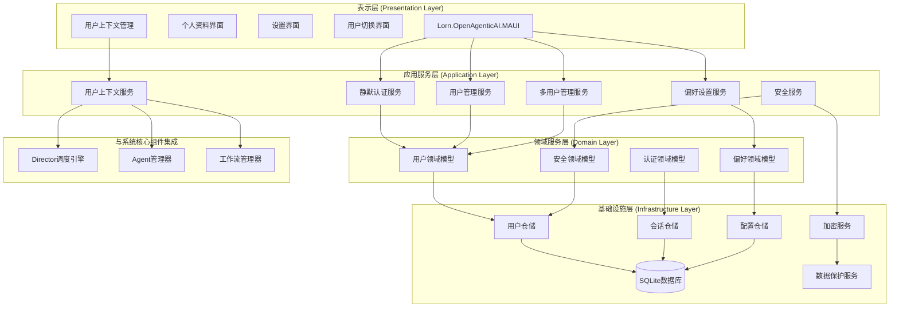
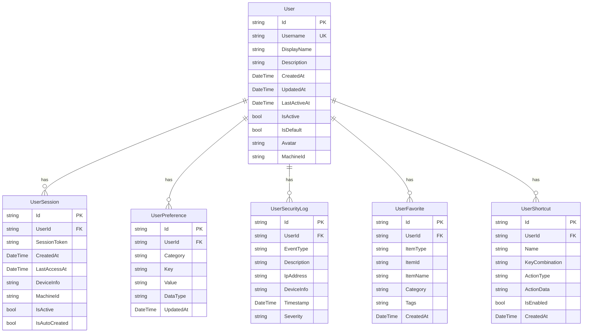
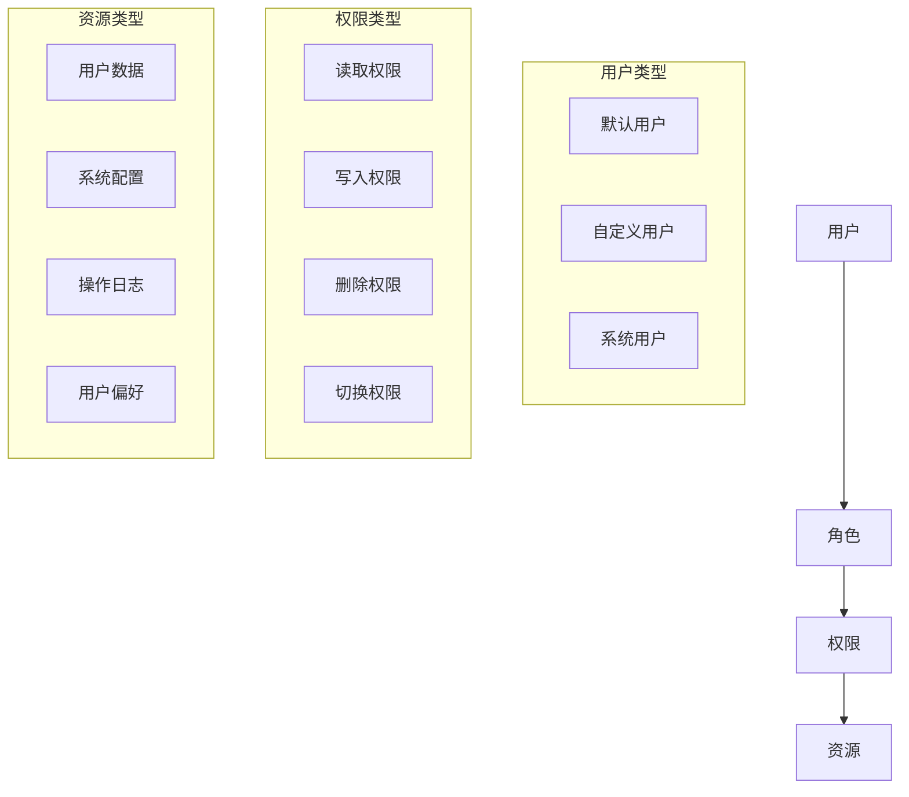

# 用户账户与个性化功能设计文档

## 概述

用户账户与个性化功能是Lorn.OpenAgenticAI平台的基础模块，作为整个智能体工作流引擎的用户身份和偏好管理核心。该模块提供静默式用户管理、个人信息维护和个性化设置能力，采用客户端本地存储架构，确保用户数据安全和隐私保护，同时支持多用户环境下的数据隔离。

作为AI智能代理客户端，系统采用静默式用户管理模式，在后台自动创建和管理用户账户，无需用户手动注册登录。早期版本使用默认密码和自动登录机制，为将来可能的服务器端扩展预留接口。本模块为Director调度引擎、Agent管理器、工作流管理器等核心组件提供用户上下文和个性化配置支持，确保每个用户拥有独立的智能体使用环境和个性化体验。

## 架构设计

### 系统架构图



### 组件职责划分

**表示层组件**:

- **个人资料界面**: 用户信息查看和编辑
- **设置界面**: 个性化偏好配置和安全设置
- **用户切换界面**: 多用户环境下的用户选择和切换

**应用服务层组件**:

- **静默认证服务**: 自动用户创建、静默登录、会话管理
- **用户管理服务**: 用户信息CRUD操作
- **偏好设置服务**: 个性化配置管理
- **安全服务**: 数据保护、审计日志
- **多用户管理服务**: 多用户环境管理和切换

**领域层组件**:

- **用户领域模型**: 用户实体和业务规则
- **静默认证领域模型**: 自动认证相关业务逻辑
- **偏好领域模型**: 个性化设置业务规则

**基础设施层组件**:

- **用户仓储**: 用户数据持久化
- **会话仓储**: 自动会话管理
- **配置仓储**: 系统配置存储
- **加密服务**: 数据加密解密

## 数据模型设计

### 核心实体关系图



### 数据模型详细设计

**User实体**:

- 用户基本信息，无需密码认证
- 支持显示名称和描述自定义
- 绑定机器ID实现设备关联
- 记录用户活动状态和最后活跃时间
- 支持默认用户标识

**UserSession实体**:

- 管理自动创建的用户会话
- 记录设备信息用于审计
- 基于机器ID的会话绑定
- 自动会话延续机制

**UserPreference实体**:

- 键值对存储用户偏好设置
- 支持分类管理（界面、语言、操作）
- 数据类型标识支持不同类型配置
- 版本化更新追踪

**UserSecurityLog实体**:

- 记录系统操作和安全事件
- 支持不同严重级别分类
- 包含设备和系统信息
- 用于操作审计和问题诊断

## 组件和接口设计

### 核心接口定义

```csharp
// 静默认证服务接口
public interface ISilentAuthenticationService
{
    Task<AuthResult> GetOrCreateDefaultUserAsync();
    Task<AuthResult> SwitchUserAsync(string userId);
    Task<bool> ValidateSessionAsync(string sessionToken);
    Task<AuthResult> RefreshSessionAsync(string sessionToken);
    Task<IEnumerable<UserProfile>> GetAvailableUsersAsync();
}

// 用户管理服务接口
public interface IUserManagementService
{
    Task<UserProfile> GetUserProfileAsync(string userId);
    Task<bool> UpdateUserProfileAsync(string userId, UpdateProfileRequest request);
    Task<UserProfile> CreateNewUserAsync(CreateUserRequest request);
    Task<bool> DeleteUserAsync(string userId);
    Task<IEnumerable<UserSession>> GetActiveSessionsAsync(string userId);
    Task<bool> SetDefaultUserAsync(string userId);
}

// 偏好设置服务接口
public interface IPreferenceService
{
    Task<T> GetPreferenceAsync<T>(string userId, string category, string key, T defaultValue = default);
    Task<bool> SetPreferenceAsync<T>(string userId, string category, string key, T value);
    Task<Dictionary<string, object>> GetCategoryPreferencesAsync(string userId, string category);
    Task<bool> ResetCategoryPreferencesAsync(string userId, string category);
}

// 安全服务接口
public interface ISecurityService
{
    string GenerateSessionToken();
    bool ValidateSessionToken(string token);
    Task LogOperationEventAsync(string userId, OperationEventType eventType, string description);
    Task<IEnumerable<OperationEvent>> GetOperationLogAsync(string userId, DateTime? from = null);
    Task<bool> ValidateMachineIdAsync(string machineId);
}
```

### 服务实现架构

**静默认证服务实现**:

- 自动用户创建和初始化
- 会话令牌生成和验证
- 机器ID绑定和验证
- 用户切换和会话管理

**用户管理服务实现**:

- 用户信息CRUD操作
- 数据验证和业务规则检查
- 并发更新控制
- 数据变更审计
- 多用户环境管理

**偏好设置服务实现**:

- 类型安全的配置读写
- 配置分类和层次化管理
- 默认值处理和回退机制
- 配置变更通知

## 安全设计

### 数据保护策略

**敏感数据加密**:

- 使用AES-256加密存储敏感配置
- 基于机器ID派生的加密密钥
- 数据完整性校验
- 安全的密钥管理

**会话安全**:

- 加密的会话令牌
- 基于机器ID的会话绑定
- 自动会话延续机制
- 异常操作检测

**数据隔离**:

- 用户数据完全隔离
- 基于用户ID的数据访问控制
- 临时数据自动清理
- 数据导出和备份保护

### 权限控制模型



## 错误处理策略

### 异常分类和处理

**认证异常**:

- `UserCreationException`: 用户创建失败
- `SessionExpiredException`: 会话过期
- `DuplicateUserException`: 用户名重复
- `MachineIdMismatchException`: 机器ID不匹配

**业务异常**:

- `UserNotFoundException`: 用户不存在
- `InvalidOperationException`: 无效操作
- `ValidationException`: 数据验证失败
- `UserSwitchException`: 用户切换失败

**系统异常**:

- `DatabaseException`: 数据库操作异常
- `EncryptionException`: 加密解密异常
- `ConfigurationException`: 配置异常

### 错误恢复机制

**自动恢复**:

- 数据库连接重试
- 会话自动刷新
- 配置回退到默认值
- 临时文件清理
- 默认用户自动创建

**用户引导**:

- 友好的错误提示信息
- 操作建议和帮助链接
- 错误报告和反馈机制
- 恢复操作指导

## 性能优化设计

### 缓存策略

**内存缓存**:

- 用户会话信息缓存
- 常用偏好设置缓存
- 用户权限信息缓存
- LRU淘汰策略

**数据库优化**:

- 用户表主键和索引优化
- 查询语句性能优化
- 连接池管理
- 批量操作支持

### 异步处理

**异步操作**:

- 所有数据库操作异步化
- 用户创建异步处理
- 操作日志异步写入
- 配置变更异步通知

## 测试策略

### 单元测试覆盖

**服务层测试**:

- 静默认证服务各种场景测试
- 用户管理服务CRUD测试
- 偏好设置服务类型转换测试
- 安全服务令牌生成验证测试
- 多用户管理服务测试

**领域模型测试**:

- 用户实体业务规则测试
- 数据验证逻辑测试
- 状态转换测试
- 边界条件测试

### 集成测试

**数据库集成测试**:

- 仓储层数据持久化测试
- 事务处理测试
- 并发访问测试
- 数据迁移测试

**安全集成测试**:

- 端到端静默认证流程测试
- 用户切换功能测试
- 数据加密解密测试
- 操作日志记录测试

## 部署和配置

### 数据库初始化

**表结构创建**:

- 自动数据库迁移
- 默认用户自动创建
- 索引创建优化
- 约束和触发器设置

**配置管理**:

- 环境相关配置分离
- 敏感配置加密存储
- 配置热更新支持
- 配置验证和校验

### 监控和诊断

**性能监控**:

- 用户切换响应时间监控
- 数据库查询性能监控
- 内存使用情况监控
- 并发操作数监控

**操作监控**:

- 异常操作检测
- 用户行为分析
- 权限违规检测
- 系统事件告警

## 设计决策说明

### 本地存储vs云端存储

**决策**: 选择本地SQLite存储

**理由**:

- 保障用户数据隐私和安全
- 减少网络依赖，提高响应速度
- 符合客户端应用的定位
- 降低运营成本和复杂度

### 静默认证vs传统认证

**决策**: 采用静默认证模式

**理由**:

- 简化用户使用流程，提升用户体验
- 适合AI智能代理客户端的使用场景
- 减少用户学习成本和操作复杂度
- 为将来服务器端扩展预留接口

### 会话管理策略

**决策**: 基于机器ID的自动会话管理

**理由**:

- 支持多用户环境
- 便于会话状态管理
- 基于设备的安全绑定
- 自动会话延续机制

### 偏好设置存储方式

**决策**: 键值对扁平化存储

**理由**:

- 灵活支持各种类型的配置
- 便于查询和更新
- 支持配置的分类管理
- 易于扩展新的配置项

这个设计文档全面覆盖了用户账户与个性化功能的各个方面，从架构设计到具体实现都有详细说明，确保开发团队能够按照统一的标准进行实现。